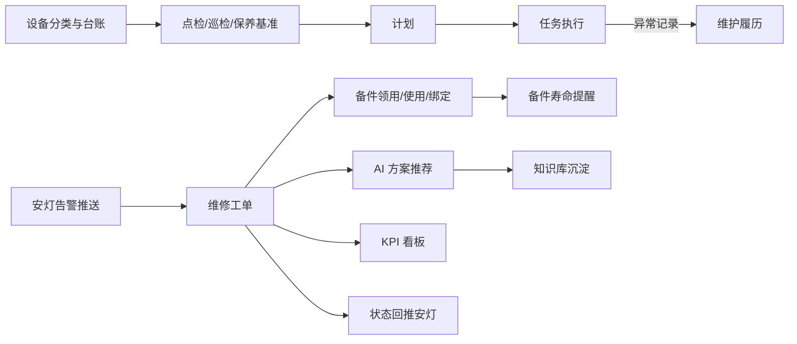

# 00. 最小闭环总览

## 模块目标与边界

P9 设备管理系统聚焦最小可落地闭环：先把设备资产管起来，把点检/巡检/保养任务跑起来，把异常维修闭环起来，把备件领用和绑定串起来，再用 KPI 和知识库形成持续改进。

P9 不做完整 EAM、OEE、采购、仓储、审批和复杂通知平台。外部系统只作为数据来源或接口对象，不能阻塞系统内最小流程。

## 主链路

关键规则：

1. 设备台账是所有业务的设备主数据来源。
2. 点检、巡检、保养共用“基准 -> 计划 -> 任务 -> 执行 -> 验收”链路。
3. 维修工单来源只有安灯告警推送和手动叫修；手动叫修只来自异常工单页面新增。
4. 维修工单完工后，回写设备履历、KPI 指标和知识库候选案例。
5. 维修或保养过程中需要备件时，发起备件领用；出库后绑定设备 BOM 位置，开始寿命计算。
6. AI 推荐只辅助维修人员填写原因和措施，最终内容以人工提交为准。
7. 安灯告警工单状态变化后，按映射关系回推安灯；回推失败只记录日志并支持重试，不阻断系统内工单流转。

## 核心角色

| 角色 | P9 关键职责 |
|------|-------------|
| 设备管理员 | 维护设备分类、设备台账、BOM、基础字典 |
| 维护人员 | 接单并执行点检、巡检、保养任务 |
| 维护主管 | 配置基准和计划，验收任务，查看执行情况 |
| 维修技术员 | 接单、签到、维修处理、使用 AI 推荐、发起备件领用 |
| 维修主管 | 派单、转单、验收或关闭工单，查看 KPI |
| 备件管理员 | 查看库存、处理领用、确认出库、维护寿命策略 |
| 知识库管理员 | 维护知识条目，触发 AI 同步，审核候选案例 |
| 管理者 | 查看设备 KPI、维修趋势和备件提醒 |

## 统一状态

| 对象 | 状态 | P9 说明 |
|------|------|---------|
| 设备 | 在用、停用、闲置、报废 | 字典可配置，默认只影响新业务选择和统计 |
| 基准 | 启用、停用 | 停用后不再生成新计划 |
| 维护计划 | 启用、暂停 | 暂停后不再生成新任务 |
| 点检/巡检/保养任务 | 待接单、待执行、执行中、待验收、已完成、已逾期 | 已逾期作为状态标签也可，但页面必须可筛选 |
| 维修工单 | 待派单、待接单、待签到、处理中、已完成、已取消 | P9 不单独设置待评价、待结案 |
| 备件领用单 | 未出库、已出库、作废 | 已出库后不可修改明细 |
| 备件绑定 | 待绑定、在用、已解绑 | 在用备件参与寿命计算 |
| 知识条目 | 未同步、已同步、同步失败、待更新 | 内容变更后变为待更新或未同步 |

## 跨模块回写

| 来源 | 回写目标 | 回写内容 |
|------|----------|----------|
| 点检/巡检/保养任务 | 设备详情 | 任务编号、结果、异常项、执行人、完成时间 |
| 点检/巡检/保养异常 | 设备详情 | 异常项目、异常说明、附件、执行人、处理结果 |
| 安灯告警推送 | 维修工单 | 设备、报警编码、报警消息、设备状态、原异常标识、原异常时间戳 |
| 维修工单状态变化 | 安灯系统 | 待派单、待接单、待签到、待完工、已完成等处理状态；失败记录日志并支持人工重试 |
| 维修工单完工 | 设备详情 | 故障描述、原因、措施、维修人、完工时间、使用备件 |
| 维修工单完工 | KPI 看板 | 故障次数、维修耗时、故障间隔 |
| 维修工单完工 | 知识库 | 候选案例，需人工审核后正式入库 |
| 备件出库绑定 | 设备详情 | 备件编号、序列号/批号、绑定位置、绑定时间 |
| 备件寿命到期 | 页面预警/系统待办 | 备件、设备、剩余寿命、建议更换时间 |

## 页面总览

| 模块 | P9 页面 |
|------|---------|
| 设备基础与资产台账 | 基础数据配置、设备资产台账、设备详情 |
| 预防性维护 | 基准管理、计划管理、任务列表、任务执行页 |
| 维修工单与 AI 推荐 | 维修工单列表、工单详情/执行页、AI 推荐面板 |
| 设备 KPI 看板 | KPI 概览、设备下钻、工单明细 |
| 备件库存与工单 | 备件库存台账、备件详情、领用单、备件绑定、寿命提醒 |
| 知识库与 AI 问答 | 知识库列表、知识条目编辑、AI 同步日志、问答数据接口说明 |

## 验收总口径

1. 从设备建档到维修闭环，必须能通过设备编号串联所有记录。
2. 维护任务和维修工单的每次状态流转必须记录操作人、操作时间、前后状态和备注。
3. 维修工单完工后，设备履历、KPI 和知识库候选案例能查询到对应记录。
4. 备件出库并绑定后，设备详情能看到备件履历，备件详情能看到使用设备。
5. AI 推荐失败不能阻断维修工单流转，页面需给出失败提示并允许人工填写。
6. 系统待办和页面预警能覆盖待接单任务、待处理维修工单、备件寿命临期。
7. 安灯告警推送能按设备标识匹配设备并生成待派单工单；匹配失败、信息缺失或重复告警时只记录接口日志。
