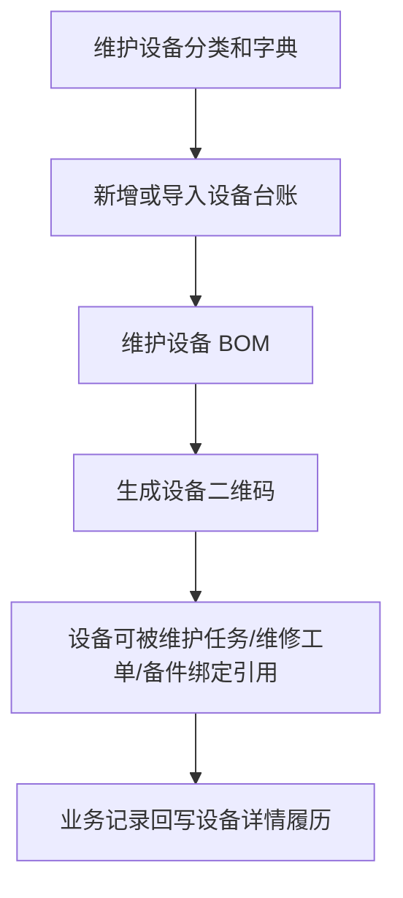

# 01. 设备基础与资产台账

## 模块目标与边界

本模块负责设备分类、基础数据配置、设备资产台账、设备详情、设备 BOM 和设备履历，是 P9 其他模块的数据基础。

P9 不纳入财务折旧、资产采购验收、完整计量设备管理和特种设备监管。需要行业字段时，统一放到扩展属性。

## 页面清单

| 页面 | 主要能力 |
|------|----------|
| 基础数据配置 | 设备分类、设备状态、重要级别、位置/产线、故障分类、保养机制等字典维护 |
| 设备资产台账 | 新增、编辑、导入、查询、停用、下载二维码 |
| 设备详情 | 基本信息、BOM、点巡检履历、保养履历、维修履历、备件履历、操作日志 |
| 设备 BOM | 维护部件和备件安装位置，为备件绑定和寿命计算提供位置 |

## 主业务流程

规则：

1. 设备编号全局唯一，是任务、工单、备件绑定、KPI 统计的核心关联键。
2. 新建设备必须选择设备分类、设备状态、使用组织或位置。
3. 设备二维码用于扫码查看设备、维护任务签到、维修签到。
4. 删除设备前需检查是否存在任务、工单、备件绑定等业务记录；存在则禁止删除，可改为停用。
5. 已停用设备不允许新建计划、任务、维修工单和备件绑定，历史记录正常展示。

## 基础数据配置

| 配置项 | 用途 | P9 规则 |
|--------|------|---------|
| 设备分类 | 台账分类、基准适用范围、KPI 过滤 | 支持树形或一层分类，P9 推荐一层分类起步 |
| 设备状态 | 台账状态和统计 | 默认在用、停用、闲置、报废 |
| 重要级别 | 查询和风险识别 | 默认关键、重要、一般 |
| 位置/产线 | 设备归属和数据权限 | 支持文本或基础组织树 |
| 故障分类 | 维修工单归因 | 默认机械、电气、软件、其他，可扩展二级 |
| 保养机制 | 保养基准和计划 | 默认日、周、月、季、年 |
| 备件分类 | 备件台账筛选 | 可由库存系统同步，也可本系统维护 |

## 设备台账字段

| 分组 | 字段 | 类型 | 必填 | 规则 |
|------|------|------|------|------|
| 基本信息 | 设备编号 | 文本 | 是 | 全局唯一，不建议保存后修改 |
| 基本信息 | 设备名称 | 文本 | 是 | 页面主展示字段 |
| 基本信息 | 设备分类 | 选择 | 是 | 来自基础数据 |
| 基本信息 | 设备状态 | 下拉 | 是 | 默认在用 |
| 基本信息 | 重要级别 | 下拉 | 否 | 用于筛选和提醒优先级 |
| 基本信息 | 设备型号 | 文本 | 否 | 用于维修和知识库检索 |
| 基本信息 | 数采编号/安灯设备标识 | 文本 | 否 | 用于匹配安灯告警推送设备，启用安灯对接时建议唯一 |
| 基本信息 | 使用组织/位置 | 选择/文本 | 是 | 用于数据权限和现场定位 |
| 基本信息 | 负责人 | 用户选择 | 否 | 默认通知对象，可人工调整 |
| 技术信息 | 制造商 | 文本 | 否 | 可用于知识库检索 |
| 技术信息 | 出厂编号 | 文本 | 否 | 可选 |
| 技术信息 | 投产日期 | 日期 | 否 | 可用于设备年龄统计 |
| 技术信息 | 技术参数 | 多行文本 | 否 | 可放功率、尺寸、能力等信息 |
| 附件 | 设备图片 | 图片 | 否 | 列表或详情展示 |
| 附件 | 技术文档 | 文件 | 否 | 可同步给知识库 |
| 扩展 | 扩展属性 | 子表 | 否 | 属性名称、属性值 |

## 设备 BOM 字段

| 字段 | 类型 | 必填 | 规则 |
|------|------|------|------|
| 父级部件 | 树节点 | 否 | 支持简单层级 |
| 部件类型 | 下拉 | 是 | 部件/备件 |
| 部件编码 | 文本/选择 | 是 | 部件手填；备件从备件台账选择 |
| 部件名称 | 文本/反显 | 是 | 备件由台账带出 |
| 规格型号 | 文本/反显 | 否 | 备件由台账带出 |
| 数量 | 数值 | 是 | 默认 1 |
| 单位 | 文本/反显 | 否 | 备件由台账带出 |
| 理论寿命-时间 | 数值+单位 | 否 | 用于备件寿命提醒 |
| 理论寿命-次数/产量 | 数值+单位 | 否 | P9 仅记录，计算可后续扩展 |
| 是否关键部件 | 开关 | 否 | 用于筛选和提醒优先级 |

## 设备详情

| Tab | 数据来源 | 展示字段 |
|-----|----------|----------|
| 基本信息 | 设备台账 | 设备编号、名称、分类、状态、位置、负责人、图片、附件 |
| 设备 BOM | 设备 BOM | 部件层级、部件类型、备件编号、寿命规则 |
| 点巡检履历 | 点检/巡检任务 | 任务编号、计划时间、执行人、状态、异常项数、完成时间 |
| 保养履历 | 保养任务 | 任务编号、保养机制、执行人、状态、使用备件、完成时间 |
| 维修履历 | 维修工单 | 工单编号、故障描述、原因、措施、维修人、完工时间 |
| 备件履历 | 备件绑定 | 备件编号、序列号/批号、绑定位置、绑定时间、解绑时间 |
| 操作日志 | 系统日志 | 操作人、操作时间、操作类型、变更内容 |

## 跨模块联动

1. 预防性维护基准按设备分类匹配设备。
2. 维修工单、维护任务、备件绑定均引用设备台账。
3. 设备 BOM 为备件绑定提供可选安装位置和理论寿命。
4. 设备详情聚合维护任务、维修工单、备件绑定记录。
5. 知识库可按设备分类、设备型号、技术文档建立检索范围。
6. 安灯告警推送按设备编号或数采编号/安灯设备标识匹配设备；匹配失败时只记录接口日志，不生成工单。

## 验收口径

1. 设备编号重复时不可保存或导入。
2. 台账导入失败时需返回失败行、字段和原因。
3. 已有关联业务记录的设备不可删除，只能停用。
4. 从维护任务、维修工单、备件记录进入设备详情时，能查看同一设备的历史履历。
5. 设备 BOM 中选择备件后，绑定页面能读取对应安装位置。
6. 启用安灯对接时，安灯推送设备标识能匹配到设备台账；匹配失败只记录接口日志，不生成维修工单。

## 待澄清与迭代事项

1. 设备分类是否需要多级树，P9 推荐先支持一层分类，后续可扩展。
2. 位置/产线是否接组织主数据，P9 可先文本或简单树。
3. 理论寿命按时间还是产量优先生效，P9 默认先按时间提醒。
