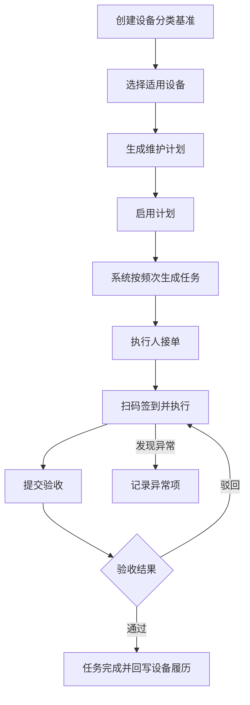
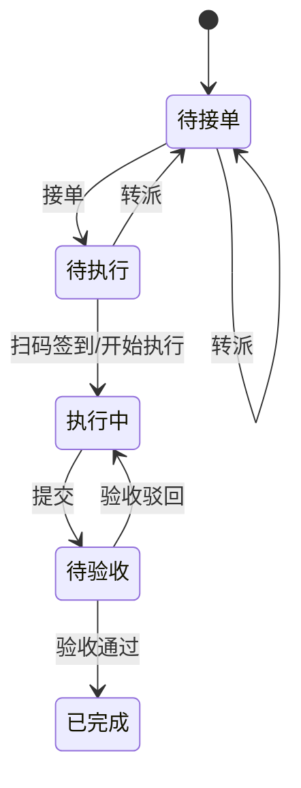

# 02. 预防性维护

## 模块目标与边界

预防性维护覆盖点检、巡检、保养的基准信息维护、计划信息维护和任务流转。P9 统一采用“基准 -> 计划 -> 任务 -> 执行 -> 验收 -> 履历”的最小链路。

P9 不做巡检路线地图、多设备连续路线、复杂审批、保养评价和离线执行。

## 页面清单

| 页面 | 主要能力 |
|------|----------|
| 基准管理 | 按设备分类维护点检、巡检、保养项目 |
| 计划管理 | 按设备或设备分类生成计划，启用/暂停计划 |
| 任务列表 | 查看待接单、待执行、执行中、待验收、已完成、已逾期任务 |
| 任务执行页 | 接单、扫码签到、逐项填写、上传图片、提交验收 |
| 验收页 | 验收通过、驳回、查看执行记录 |

## 主业务流程

## 基准规则

| 项 | 规则 |
|----|------|
| 业务类型 | 点检、巡检、保养 |
| 适用范围 | 设备分类必填，可选择适用设备 |
| 项目要求 | 每个基准至少一条项目 |
| 启停 | 停用后不再用于新计划，历史计划和任务保留 |
| 调整 | 基准修改只影响后续新计划或用户选择同步的计划 |

点检/巡检项目字段：

| 字段 | 必填 | 说明 |
|------|------|------|
| 检查部位 | 是 | 现场展示 |
| 检查方法 | 否 | 如目视、听音、测量 |
| 检查标准 | 是 | 判断正常/异常依据 |
| 结果类型 | 是 | 正常/异常、数值、文本 |
| 上限/下限 | 否 | 数值型项目使用 |
| 是否必检 | 是 | 必检未填不可提交 |
| 是否拍照 | 否 | 控制执行页附件要求 |

保养项目字段：

| 字段 | 必填 | 说明 |
|------|------|------|
| 保养部位 | 是 | 现场展示 |
| 保养内容 | 是 | 具体作业内容 |
| 保养标准 | 否 | 完成后要求 |
| 保养机制 | 是 | 日、周、月、季、年 |
| 标准工时 | 否 | 用于统计 |
| 建议备件 | 否 | 可关联备件台账 |
| 指导书/附件 | 否 | SOP、图片、视频 |
| 是否必做 | 是 | 必做未填不可提交 |

## 计划规则

| 字段 | 必填 | 规则 |
|------|------|------|
| 计划编号 | 是 | 系统生成 |
| 业务类型 | 是 | 点检、巡检、保养 |
| 关联基准 | 是 | 来源基准 |
| 关联设备 | 是 | 可按分类批量生成 |
| 频次 | 是 | 日、周、月或自定义间隔 |
| 计划开始时间 | 是 | 用于计算首次任务 |
| 执行期限 | 是 | 用于逾期判断 |
| 执行班组/执行人 | 是 | 决定任务可见和接单范围 |
| 计划状态 | 是 | 启用、暂停 |

规则：

1. 启用计划到达下次任务时间时，系统生成任务。
2. 暂停计划后不再生成新任务，已生成任务继续流转。
3. 同一设备、同一业务类型、同一计划时间不得重复生成任务。
4. 计划生成任务后，系统更新上次任务时间和下次任务时间。

## 任务状态流转

逾期规则：

1. 当前时间超过计划时间加执行期限，且任务未完成时，标记已逾期。
2. 逾期任务仍允许继续接单、执行、提交和验收。
3. 逾期标识进入任务列表、设备详情履历和任务统计。

## 任务执行字段

| 字段 | 类型 | 必填 | 规则 |
|------|------|------|------|
| 任务编号 | 文本 | 是 | 系统生成 |
| 设备编号/名称 | 反显 | 是 | 来源计划 |
| 业务类型 | 反显 | 是 | 点检、巡检、保养 |
| 计划时间 | 日期时间 | 是 | 来源计划 |
| 接单人 | 反显 | 条件必填 | 接单后记录 |
| 签到时间 | 日期时间 | 条件必填 | 开始执行后记录 |
| 项目结果 | 子表 | 是 | 逐项填写 |
| 异常说明 | 多行文本 | 条件必填 | 有异常项时必填 |
| 现场图片 | 上传 | 否 | 按项目配置控制 |
| 使用备件 | 备件选择 | 否 | 保养或异常处理可选 |
| 验收意见 | 多行文本 | 条件必填 | 驳回时必填 |

## 异常处理

1. 任务存在异常项时，在维护任务内记录异常项目、异常说明、现场图片和处理建议。
2. P9 预防性维护不直接创建或跳转维修工单。
3. 如现场需要维修，用户需在异常工单页面手动新增维修工单，工单来源为“手动叫修”。
4. 维护任务异常记录进入设备详情点巡检/保养履历，用于后续追溯和统计。

## 跨模块联动

1. 设备台账提供设备、分类、位置、二维码。
2. 备件台账提供保养建议备件和实际使用备件。
3. 维修模块不接收预防性维护自动转单；需维修时由用户在异常工单页面手动新增。
4. 已完成任务回写设备详情点巡检/保养履历。
5. 逾期任务进入系统待办和页面预警。

## 验收口径

1. 用户能按设备分类创建点检、巡检、保养基准。
2. 用户能基于基准生成设备计划，并启用或暂停计划。
3. 启用计划到达时间后能生成任务，且不重复生成。
4. 任务能完成接单、签到、执行、提交、验收通过闭环。
5. 验收驳回后任务回到执行中，保留驳回意见。
6. 异常任务能记录异常项目、异常说明和附件，并在设备详情履历中查看。
7. 已完成任务能在设备详情对应履历中查看。

## 待澄清与迭代事项

1. 已逾期采用独立状态还是状态标签，P9 页面必须支持筛选。
2. 是否需要移动端离线执行，P9 暂不纳入。
3. 巡检路线地图和连续路线作为后续增强。
