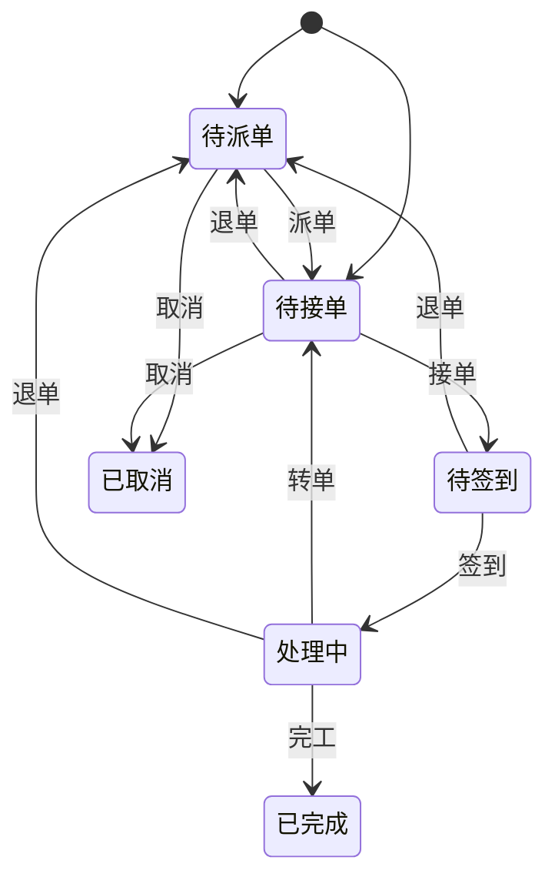
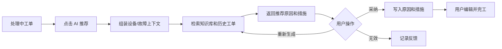

# 03. 维修工单与 AI 推荐

## 模块目标与边界

本模块覆盖维修工单查看、任务流转、维修执行、备件领用入口、AI 方案推荐和知识库对接。P9 重点保证“异常发现 -> 派单/接单 -> 签到 -> 维修 -> 完工 -> 履历/KPI/知识沉淀”闭环。

P9 不做复杂安灯状态回推、评价结案、多级审批和 AI 自动制单。安灯告警可作为后续接入来源，P9 先保证手动叫修和预防性维护异常转工单。

## 页面清单

| 页面 | 主要能力 |
|------|----------|
| 维修工单列表 | 状态筛选、设备筛选、责任人筛选、工单查看 |
| 工单详情 | 基本信息、故障描述、流转记录、维修记录、备件记录 |
| 工单执行页 | 派单、接单、签到、转单、退单、AI 推荐、完工 |
| AI 推荐面板 | 根据设备和故障描述推荐原因与措施 |

## 工单来源

| 来源 | 触发方式 | 初始状态 |
|------|----------|----------|
| 手动叫修 | 用户选择设备并填写故障描述 | 待接单 |
| 预防性维护异常 | 点检/巡检/保养异常项转工单 | 待派单或待接单，按是否已指定责任人决定 |
| 外部告警 | 外部系统推送设备异常 | 待派单，P9 只定义预留入口 |

## 状态机

操作规则：

1. 派单：维修主管或有权限人员指定责任部门、责任人，状态进入待接单。
2. 接单：责任人确认处理，状态进入待签到。
3. 签到：责任人到现场扫码设备二维码或手动确认设备，状态进入处理中。
4. 转单：处理中可转给其他维修人，状态回到待接单，新责任人需重新接单。
5. 退单：责任人无法处理时退回待派单，必须填写原因。
6. 完工：必须填写故障类型、故障原因、处理措施、维修结果和完工时间。
7. 取消：未处理完成前可取消，取消原因必填，取消工单不进入 KPI。

## 工单字段

### 基本信息

| 字段 | 类型 | 必填 | 规则 |
|------|------|------|------|
| 工单编号 | 文本 | 是 | 系统生成 |
| 工单来源 | 枚举 | 是 | 手动叫修、维护异常、外部告警 |
| 设备编号/名称 | 选择/反显 | 是 | 来源设备台账 |
| 设备分类 | 反显 | 否 | 用于 AI 检索和统计 |
| 故障描述 | 多行文本 | 是 | 叫修或异常转入时填写 |
| 故障图片 | 上传 | 否 | 支持现场图片 |
| 创建人 | 反显 | 是 | 系统记录 |
| 创建时间 | 日期时间 | 是 | 系统记录 |
| 责任部门 | 选择 | 条件必填 | 派单时必填 |
| 责任人 | 选择 | 条件必填 | 派单或接单后必填 |
| 工单状态 | 状态 | 是 | 系统维护 |

### 维修执行

| 字段 | 类型 | 必填 | 规则 |
|------|------|------|------|
| 接单时间 | 日期时间 | 条件必填 | 接单后记录 |
| 签到时间 | 日期时间 | 条件必填 | 签到后记录 |
| 故障类型 | 下拉 | 是 | 来自故障分类 |
| 故障原因 | 多行文本 | 是 | 可采纳 AI 推荐后编辑 |
| 处理措施 | 多行文本 | 是 | 可采纳 AI 推荐后编辑 |
| 维修结果 | 下拉 | 是 | 已修复、临时处理、待备件、其他 |
| 使用备件 | 关联表 | 否 | 关联备件领用单和绑定记录 |
| 完工时间 | 日期时间 | 是 | 完工时记录，可人工调整 |
| 维修图片 | 上传 | 否 | 维修证据 |

### 流转记录

| 记录 | 字段 |
|------|------|
| 状态记录 | 操作节点、前状态、后状态、操作人、操作时间、备注 |
| 转单记录 | 原责任人、新责任人、转单原因、转单时间 |
| 退单记录 | 退单人、退单原因、退单时间 |
| AI 推荐记录 | 输入摘要、推荐结果、采纳状态、反馈、触发时间 |

## AI 推荐规则

规则：

1. AI 推荐只在处理中状态可用。
2. 输入上下文包括设备编号、设备名称、设备分类、设备型号、故障描述、历史维修记录、知识库条目。
3. 输出至少包含方案标题、可能原因、处理措施、参考来源。
4. 用户采纳后写入故障原因和处理措施，但仍可编辑。
5. AI 推荐失败时提示失败原因，允许人工继续填写工单。
6. 用户反馈有效、无效、重新生成都需要记录，用于后续优化。

## 完工回写

| 回写目标 | 内容 |
|----------|------|
| 设备详情 | 维修履历、故障原因、措施、维修人、完工时间 |
| KPI 看板 | 故障次数、维修耗时、故障间隔 |
| 备件模块 | 关联领用单、使用记录、绑定结果 |
| 知识库 | 生成候选案例，需人工审核后正式入库 |

## 跨模块联动

1. 设备台账提供设备信息、设备二维码、设备分类。
2. 预防性维护异常可创建维修工单。
3. 备件模块提供领用、出库和绑定记录。
4. 知识库提供 AI 推荐检索数据，并接收闭环案例。
5. KPI 看板读取已完成且未取消的维修工单。

## 验收口径

1. 手动叫修和维护异常均能生成维修工单。
2. 工单能完成派单、接单、签到、处理中、完工闭环。
3. 转单和退单必须记录原因和操作人。
4. AI 推荐采纳后能写入原因和措施，且用户可编辑。
5. AI 推荐失败不影响工单完工。
6. 完工工单能在设备详情维修履历中查看。
7. 已取消工单不进入 KPI 统计。

## 待澄清与迭代事项

1. 外部告警接入规则后续需补充接口、去重和状态回推。
2. MTTR 起点 P9 默认按签到时间，企业可配置为接单时间。
3. 是否需要工单评价和结案，P9 暂不纳入。
