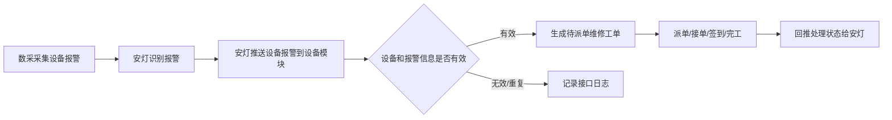
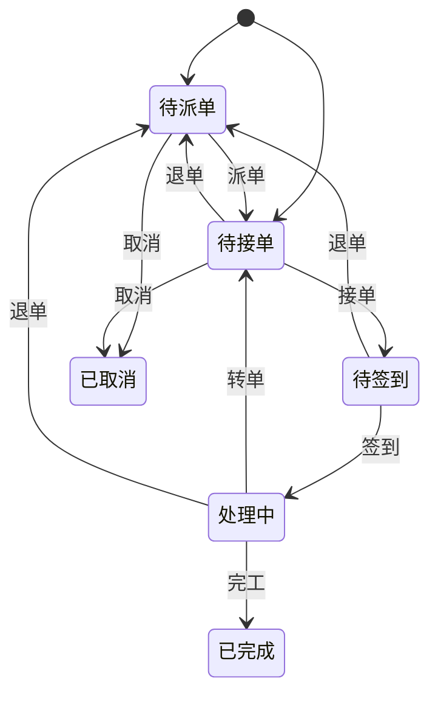
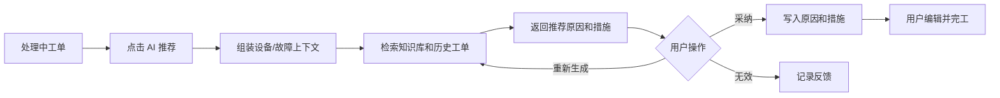

# 03. 维修工单与 AI 推荐

## 模块目标与边界

本模块覆盖维修工单查看、任务流转、维修执行、备件领用入口、AI 方案推荐和知识库对接。P9 重点保证“异常发现 -> 派单/接单 -> 签到 -> 维修 -> 完工 -> 履历/KPI/知识沉淀”闭环。

维修工单来源统一为安灯告警推送和手动叫修。手动叫修只来自异常工单页面新增，不包含点检、巡检、保养异常转入。P9 不引入待评价、待结案、主管验收、多级审批和 AI 自动制单；安灯状态回推按 P9 内部状态映射，失败不阻断工单流转。

## 页面清单

| 页面 | 主要能力 |
|------|----------|
| 维修工单列表 | 状态筛选、设备筛选、责任人筛选、工单查看 |
| 异常工单新增页 | 手动叫修新增，选择设备、填写故障、指定责任对象 |
| 工单详情 | 基本信息、故障描述、流转记录、维修记录、备件记录、安灯日志 |
| 工单详情-工单执行页 | 派单、接单、签到、转单、退单、AI 推荐、备件领用、完工 |
| 工单详情-AI 推荐面板 | 最多展示 3 个推荐方案，支持采纳、点赞、点踩 |

## 工单来源

| 来源 | 触发方式 | 初始状态 |
|------|----------|----------|
| 安灯告警推送 | 安灯向设备模块推送报警代码、报警消息和设备状态 | 待派单 |
| 手动叫修 | 用户在异常工单页面新增，选择设备、填写故障描述、指定责任对象 | 待接单 |

手动叫修规则：

1. 手动叫修只能从异常工单页面新增。
2. 提交时必须选择设备、责任部门和责任人。
3. 提交成功后工单进入待接单，由指定责任人处理。

安灯建单规则:

1. 按线体和设备类型维度，约定具体推送字段，设备状态status、报警编码alarm_code和报警信息alarm_msg
2. 目前锁螺丝机设备状态： run/idle/alarm/stop，其他设备待定。
2. 设备状态首次为alarm/stop时且报警编码存在，生成`待派单`维修工单，source为`IOT`
3. 需由维修主管或派单人补充责任部门、责任人和说明。

安灯告警推送链路：

## 状态机

操作规则：

1. 派单：维修主管或有权限人员指定责任部门、责任人，状态进入待接单。
2. 接单：责任人确认处理，状态进入待签到。
3. 签到：责任人到现场扫码设备二维码或手动确认设备，状态进入处理中。
4. 转单：处理中可转给其他维修人，状态回到待接单，新责任人需重新接单。
5. 退单：责任人无法处理时退回待派单，必须填写原因。
6. 完工：必须填写故障类型、故障原因、处理措施、维修结果和完工时间；提交后直接进入已完成。

P9 内部状态到安灯状态映射：

| P9 内部状态 | 安灯状态标识 | 安灯状态编码 | 安灯状态名称 |
|-------------|--------------|--------------|--------------|
| 待派单 | WAITING_LIST | 1 | 待派单 |
| 待接单 | PENDING_ORDERS | 2 | 待接单 |
| 待签到 | TO_BE_SIGNED_IN | 3 | 待签到 |
| 处理中 | TO_BE_COMPLETED | 4 | 待完工 |
| 已完成 | FINISHED | 7 | 已完成 |
| 已取消 | 不回推完成状态 | 不回推完成状态 | 仅记录日志；是否回推需后续接口确认 |

## 工单字段

### 工单列表

| 字段/控件 | 类型 | 必填 | 规则 |
|-----------|------|------|------|
| 状态 Tab | 查询条件 | 否 | 待派单、待接单、待签到、处理中、已完成、已取消 |
| 工单来源 | 查询条件 | 否 | 安灯告警推送、手动叫修 |
| 时间范围 | 查询条件 | 否 | 默认近 7 天或按系统配置 |
| 设备编号/名称 | 查询条件 | 否 | 支持模糊查询 |
| 责任部门/责任人 | 查询条件 | 否 | 按权限范围过滤 |
| 工单编号 | 列表字段 | 是 | 系统生成 |
| 设备编号/名称 | 列表字段 | 是 | 来源设备台账 |
| 故障描述/报警消息 | 列表字段 | 是 | 手动叫修填写或安灯带入 |
| 工单状态 | 列表字段 | 是 | 当前状态 |
| 创建时间 | 列表字段 | 是 | 工单创建时间 |
| 当前责任人 | 列表字段 | 否 | 待派单可为空 |
| 操作 | 按钮组 | 否 | 新增、详情、派单、接单、导出 |

### 工单详情-基本信息

| 字段 | 类型 | 必填 | 规则 |
|------|------|------|------|
| 工单编号 | 文本 | 是 | 系统生成 |
| 工单来源 | 枚举 | 是 | 安灯告警推送、手动叫修 |
| 设备编号/名称 | 选择/反显 | 是 | 手动叫修时选择；安灯告警按设备标识匹配 |
| 设备分类 | 反显 | 否 | 用于 AI 检索和统计 |
| 故障描述 | 多行文本 | 是 | 手动叫修填写；安灯告警由报警消息带入 |
| 故障图片 | 上传 | 否 | 支持现场图片 |
| 创建人 | 反显 | 是 | 手动叫修为当前用户；安灯告警为安灯系统/系统自动 |
| 创建时间 | 日期时间 | 是 | 系统记录 |
| 责任部门 | 选择 | 条件必填 | 手动叫修提交时必填；安灯派单时必填 |
| 责任人/班组 | 选择 | 条件必填 | 手动叫修提交时必填；安灯派单时必填 |
| 工单状态 | 状态 | 是 | 系统维护 |
| 安灯原异常标识 | 文本 | 条件必填 | 安灯告警推送时保存，用于状态回推 |
| 安灯原异常时间戳 | 数值/日期时间 | 条件必填 | 安灯告警推送时保存，用于状态回推 |
| 报警编码 | 文本 | 条件必填 | 安灯告警推送时由报警编码带入 |
| 报警消息 | 多行文本 | 条件必填 | 安灯告警推送时由报警信息带入 |
| 设备状态 | 枚举 | 条件必填 | 安灯推送状态，如 run、idle、alarm、stop |
| 接口接收时间 | 日期时间 | 条件必填 | 安灯告警推送时记录 |
| 停机开始时间 | 日期时间 | 否 | 默认取首次触发建单的 alarm/stop 推送时间 |
| 停机结束时间 | 日期时间 | 否 | 后续收到 run 状态时可回填，完工时也可人工补充 |

### 工单详情-维修执行

| 字段 | 类型 | 必填 | 规则 |
|------|------|------|------|
| 接单时间 | 日期时间 | 条件必填 | 接单后记录 |
| 签到时间 | 日期时间 | 条件必填 | 签到后记录 |
| 故障类型 | 下拉 | 是 | 来自故障分类 |
| 故障原因 | 多行文本 | 是 | 可采纳 AI 推荐后编辑 |
| 处理措施 | 多行文本 | 是 | 可采纳 AI 推荐后编辑 |
| 维修结果 | 下拉 | 是 | 已修复、临时处理、待备件、其他 |
| 使用备件 | 关联表 | 否 | 填写使用备件时，必须关联已出库领用单 |
| 完工时间 | 日期时间 | 是 | 完工时记录，可人工调整 |
| 维修图片 | 上传 | 否 | 维修证据 |

### 流转记录

| 记录 | 字段 |
|------|------|
| 状态记录 | 操作节点、前状态、后状态、操作人、操作时间、备注 |
| 转单记录 | 原责任人、新责任人、转单原因、转单时间 |
| 退单记录 | 退单人、退单原因、退单时间 |
| 安灯接口日志 | 接口方向、原异常标识、请求时间、请求报文摘要、响应结果、失败原因、重试状态 |
| AI 推荐记录 | 输入摘要、推荐结果、采纳方式、点赞/点踩、反馈时间 |

## 安灯接口字段要求

P9 需求只定义字段要求，接口地址、鉴权、超时、重试次数在接口设计阶段配置化，不在需求中写死。

安灯推送设备报警到设备模块：

| 字段 | 必填 | 说明 |
|------|------|------|
| driver | 是 | 设备或驱动标识，可辅助匹配设备 |
| timestamp | 是 | 本次推送时间戳 |
| values[].id | 是 | 报警代码、报警消息或设备状态的数据点标识 |
| values[].t | 是 | 原异常时间戳 |
| values[].dt | 是 | 值类型 |
| values[].v | 是 | 数据点值，如报警编码、报警消息、设备状态 |

设备模块回推处理状态到安灯：

| 字段 | 必填 | 说明 |
|------|------|------|
| id | 是 | 安灯原异常标识 |
| t | 是 | 安灯原异常时间戳 |
| time | 是 | 处理时间，格式由接口设计统一 |
| statusCode | 是 | 安灯状态编码 |
| statusName | 是 | 安灯状态名称 |

## AI 推荐规则

规则：

1. AI 推荐只在处理中状态可用。
2. 输入上下文包括设备编号、设备名称、设备分类、设备型号、故障描述、历史维修记录、知识库条目。
3. 每次最多返回 3 个推荐方案，每个方案包含方案标题、可能原因、处理措施和参考来源。
4. 用户采纳方案时，可选择覆盖或追加到故障原因和处理措施字段，写入后仍可编辑。
5. AI 推荐失败时提示失败原因，允许人工继续填写工单。
6. 用户可对推荐方案点赞或点踩，反馈记录同步给 AI 知识库模块，用于后续优化。
7. 未使用 AI 推荐不影响工单完工。

AI 推荐面板字段：

| 字段/控件 | 类型 | 必填 | 规则 |
|-----------|------|------|------|
| AI 推荐按钮 | 按钮 | 否 | 处理中状态可用 |
| 推荐输入摘要 | 文本 | 否 | 展示设备、故障描述、历史工单等摘要 |
| 推荐方案 | 卡片 | 否 | 最多 3 个方案 |
| 采纳方式 | 单选 | 条件必填 | 采纳时选择覆盖或追加 |
| 点赞/点踩 | 操作 | 否 | 反馈到 AI 知识库模块 |
| 重新生成 | 操作 | 否 | 故障描述变化或用户手动触发 |

## 完工回写

| 回写目标 | 内容 |
|----------|------|
| 设备详情 | 维修履历、故障原因、措施、维修人、完工时间 |
| KPI 看板 | 故障次数、维修耗时、故障间隔 |
| 备件模块 | 关联领用单、使用记录、绑定结果 |
| 知识库 | 生成候选案例，需人工审核后正式入库 |
| 安灯系统 | 安灯告警工单处理状态；回推失败记录日志并支持重试 |

## 跨模块联动

1. 设备台账提供设备信息、设备二维码、设备分类。
2. 安灯向设备模块推送设备报警，设备模块按建单规则生成维修工单，并在状态变化后回推处理状态。
3. 预防性维护异常不直接创建或跳转维修工单；需维修时由用户在异常工单页面手动新增。
4. 备件模块提供领用、出库和绑定记录；维修工单填写使用备件时必须关联已出库领用单，备件绑定可在完工后继续处理。
5. 知识库提供 AI 推荐检索数据，并接收闭环案例、点赞/点踩反馈。
6. KPI 看板读取已完成且未取消的维修工单。

## 验收口径

1. 安灯告警推送和手动叫修均能生成维修工单，工单来源枚举只展示这两类。
2. 手动叫修只来自异常工单页面新增，提交时必须指定责任部门和责任人/班组，提交后进入待接单。
3. `run`、`idle`、`alarm`、`stop` 推送能按建单规则处理；信息缺失、设备匹配失败和重复告警只记录接口日志。
4. 安灯告警工单能保存安灯原异常标识、原异常时间戳、报警编码、报警消息、设备状态和接口接收时间。
5. 工单能完成派单、接单、签到、处理中、完工闭环。
6. 安灯告警工单状态变化后，能按映射关系回推安灯；失败记录可查询并支持重试。
7. 转单和退单必须记录原因和操作人。
8. AI 推荐最多返回 3 个方案；采纳时可覆盖或追加到故障原因和处理措施，写入后可编辑。
9. AI 推荐点赞/点踩能反馈到 AI 知识库模块；AI 推荐失败或未使用 AI 不影响工单完工。
10. 工单填写使用备件时，必须关联已出库领用单；备件绑定不阻塞维修完工。
11. 完工工单能在设备详情维修履历中查看。
12. 已取消工单不进入 KPI 统计，且不回推安灯完成状态。

## 待澄清与迭代事项

1. 安灯接口地址、鉴权、超时、重试次数和失败补偿策略需在接口设计阶段细化。
2. MTTR 起点 P9 默认按签到时间，企业可配置为接单时间。
3. 是否需要工单评价和结案，P9 暂不纳入。
