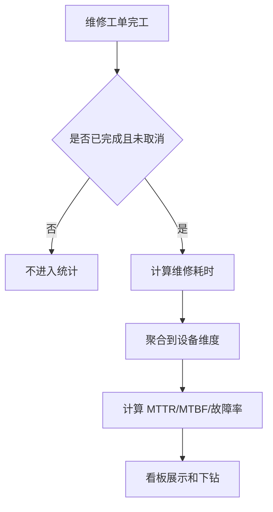

# 04. 设备 KPI 看板

## 模块目标与边界

P9 KPI 看板只覆盖 MTTR、MTBF、故障率三个指标，用于评价维修效率和设备可靠性。数据来源以维修工单和设备台账为主。

P9 不纳入完整 OEE、DT 率、PPM、稼动率、FTY、损失填报和生产节拍分析。

## 页面清单

| 页面 | 主要能力 |
|------|----------|
| KPI 概览 | 展示 MTTR、MTBF、故障率、故障次数趋势 |
| 设备下钻 | 按设备查看指标、故障次数、最近工单 |
| 工单明细 | 查看参与统计的维修工单明细 |

## 指标口径

| 指标 | 口径 | 数据来源 |
|------|------|----------|
| MTTR | 平均修复时间 = 维修耗时合计 / 已完成故障工单数 | 维修工单 |
| MTBF | 平均故障间隔 = 统计周期内设备运行时间 / 故障次数 | 维修工单、设备运行时间 |
| 故障率 | 故障次数 / 设备数量，或故障次数 / 运行时长 | 维修工单、设备台账 |

P9 默认口径：

1. MTTR 起点默认取签到时间，终点取完工时间。
2. 如果未接入设备运行时间，MTBF 采用“同设备两次故障完工时间间隔”的简化口径展示，并标记为简化口径。
3. 故障率默认展示“统计周期故障次数 / 在用设备数量”。
4. 只统计已完成且未取消的维修工单。
5. 安灯告警推送和手动叫修来源工单都可纳入统计；点检/巡检/保养异常不直接进入维修工单统计。

## 看板筛选

| 筛选项 | 必填 | 规则 |
|--------|------|------|
| 时间范围 | 是 | 默认近 30 天 |
| 设备分类 | 否 | 来源设备基础数据 |
| 设备 | 否 | 支持编号/名称模糊查询 |
| 位置/产线 | 否 | 来源设备台账 |
| 工单来源 | 否 | 安灯告警推送、手动叫修 |
| 故障类型 | 否 | 来源故障分类 |

## 展示内容

| 区域 | 内容 | 规则 |
|------|------|------|
| 指标卡片 | MTTR、MTBF、故障率、故障次数 | 展示当前筛选范围汇总值 |
| 趋势图 | 按日/周/月展示指标趋势 | 时间粒度根据范围自动切换 |
| TOP 列表 | 故障次数 TOP 设备、MTTR TOP 设备 | 默认展示前 10 |
| 设备明细 | 设备编号、名称、分类、故障次数、MTTR、MTBF、故障率 | 支持点击下钻 |
| 工单明细 | 工单编号、设备、故障描述、签到时间、完工时间、维修耗时 | 与筛选条件一致 |

## 数据计算规则

规则：

1. 维修耗时小于 0 或缺少签到/完工时间时，工单进入异常数据列表，不参与 MTTR。
2. 统计周期内没有故障时，故障次数为 0，MTTR 展示为 0 或空值，需保持页面口径一致。
3. MTBF 若缺少运行时长数据，必须在页面标识“简化口径”。
4. 指标导出结果应与当前筛选条件一致。

## 跨模块联动

1. 维修工单提供故障次数、签到时间、完工时间、故障类型。
2. 设备台账提供设备分类、状态、位置、在用设备数量。
3. 设备详情可跳转到单设备 KPI 下钻。
4. 知识库可使用高频故障和高 MTTR 工单作为优化知识沉淀参考。

## 验收口径

1. 已完成维修工单能进入 KPI 统计。
2. 已取消工单不进入 KPI 统计。
3. MTTR 能按筛选条件正确计算并下钻到工单明细。
4. MTBF 在无运行时长数据时，页面能展示简化口径说明。
5. 故障率能按设备分类、设备、时间范围过滤。
6. 从 KPI 设备明细能跳转到对应设备详情或工单明细。

## 待澄清与迭代事项

1. 是否接入真实运行时长决定 MTBF 最终口径。
2. 故障率按设备数量还是运行时长做分母，需要评审确认；P9 默认按在用设备数量。
3. 是否设置目标值和红黄绿预警，P9 可先做页面标识，不做主动通知。
