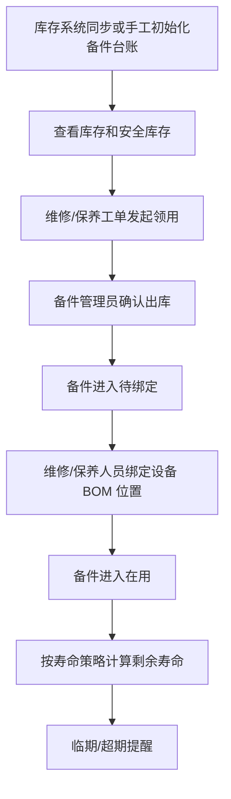
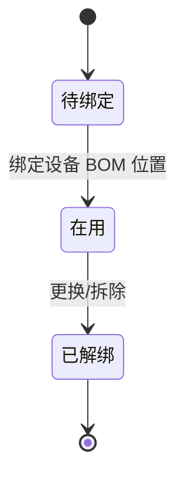

# 05. 备件库存与工单

## 模块目标与边界

本模块覆盖备件库存台账同步与可视化管理、备件领用、使用、绑定、寿命预测和更换提醒。P9 重点保证备件从“库存可见 -> 工单领用 -> 出库 -> 绑定设备 -> 寿命提醒”的闭环。

P9 不做采购 PR/PO、PMC 调拨、完整仓储、入库、盘库、呆滞库存和复杂风控看板。

## 页面清单

| 页面 | 主要能力 |
|------|----------|
| 备件库存台账 | 查看备件主数据、库存数量、安全库存、预警状态 |
| 备件详情 | 基础信息、库存、领用记录、使用绑定记录、寿命策略 |
| 备件领用单 | 从维修/保养工单或独立创建领用，确认出库 |
| 备件绑定 | 将已出库备件绑定到设备 BOM 位置 |
| 寿命提醒 | 查看临期、超期备件和建议更换信息 |

## 主业务流程



## 备件台账

| 字段 | 类型 | 必填 | 来源/规则 |
|------|------|------|-----------|
| 备件编号 | 文本 | 是 | 外部同步或本系统维护，唯一 |
| 备件名称 | 文本 | 是 | 支持模糊查询 |
| 规格型号 | 文本 | 否 | 主数据 |
| 备件分类 | 下拉 | 否 | 基础数据或外部同步 |
| 单位 | 文本 | 否 | 主数据 |
| 品牌/供应商 | 文本 | 否 | 可选 |
| 当前库存 | 数值 | 是 | 外部同步或手工初始化 |
| 安全库存 | 数值 | 否 | 低于或等于时标红 |
| 可用库存 | 数值 | 否 | P9 默认等于当前库存 |
| 是否关键备件 | 开关 | 否 | 用于提醒优先级 |
| 寿命策略 | 枚举 | 否 | 按时间、按次数；P9 默认按时间 |
| 默认寿命 | 数值+单位 | 否 | 设备 BOM 无寿命时使用 |
| 预警提前量 | 数值+单位 | 否 | 如提前 7 天提醒 |

主数据来源规则：

1. 有外部库存系统时，备件编号、名称、规格、单位、库存数量由外部同步。
2. 有外部库存系统时，EAM 只维护安全库存、是否关键备件、寿命策略等业务字段。
3. 无外部库存系统时，P9 支持手工新增和导入初始化。
4. 同步失败需记录失败时间和失败原因，不影响用户查看旧库存。

## 备件领用

| 字段 | 类型 | 必填 | 规则 |
|------|------|------|------|
| 领用单号 | 文本 | 是 | 系统生成 |
| 领用来源 | 枚举 | 是 | 维修工单、保养任务、独立领用 |
| 关联工单/任务 | 选择/反显 | 条件必填 | 从工单或任务发起时自动带入 |
| 使用设备 | 选择/反显 | 条件必填 | 从工单或任务带入，可独立选择 |
| 领用人 | 用户 | 是 | 默认当前用户 |
| 领用原因 | 文本/下拉 | 是 | 维修、保养、其他 |
| 出库状态 | 状态 | 是 | 未出库、已出库、作废 |
| 备件明细 | 子表 | 是 | 至少一条 |

明细字段：

| 字段 | 必填 | 规则 |
|------|------|------|
| 备件编号 | 是 | 从备件台账选择 |
| 备件名称 | 是 | 自动反显 |
| 规格型号 | 否 | 自动反显 |
| 库存数量 | 否 | 自动反显 |
| 领用数量 | 是 | 必须大于 0，不得超过可用库存 |
| 序列号/批号 | 条件必填 | 启用序列号管理时必填 |

规则：

1. 从维修或保养发起领用时，自动带出工单/任务和设备。
2. 未出库领用单允许编辑和作废。
3. 已出库领用单不可修改明细，生成待绑定备件记录。
4. 出库后库存数量同步扣减；如外部库存为权威来源，则以接口回写结果为准。

## 使用绑定



绑定字段：

| 字段 | 类型 | 必填 | 规则 |
|------|------|------|------|
| 使用单号 | 文本 | 是 | 系统生成 |
| 备件编号 | 反显 | 是 | 来源领用单 |
| 序列号/批号 | 反显/填写 | 条件必填 | 启用时必填 |
| 设备编号/名称 | 选择/反显 | 是 | 来源领用单或用户选择 |
| BOM 位置 | 选择 | 是 | 来源设备 BOM |
| 绑定时间 | 日期时间 | 是 | 默认当前时间 |
| 绑定人 | 用户 | 是 | 当前用户 |
| 旧件处理方式 | 下拉 | 否 | 报废、返修、备用、无需旧件 |
| 绑定原因 | 文本 | 否 | 可选 |

规则：

1. 已出库未绑定备件进入待绑定列表。
2. 绑定时必须选择设备和 BOM 位置。
3. 绑定后备件状态为在用，写入设备备件履历。
4. 更换时旧件自动解绑，新件绑定，保留历史记录。
5. 绑定到设备的序列号/批号不得重复在用。

## 寿命预测与更换提醒

P9 默认按时间计算寿命：

```text
预计到期时间 = 绑定时间 + 理论寿命
剩余寿命 = 预计到期时间 - 当前时间
```

规则：

1. 理论寿命优先取设备 BOM，设备 BOM 未配置时取备件台账默认寿命。
2. 剩余寿命小于等于预警提前量时，进入临期提醒。
3. 当前时间超过预计到期时间时，进入超期提醒。
4. 寿命提醒在备件详情、设备详情备件履历、寿命提醒列表中展示。
5. P9 只做提醒，不自动生成维修或领用单。

## 跨模块联动

1. 设备 BOM 提供绑定位置和理论寿命。
2. 维修工单和保养任务可发起备件领用。
3. 备件绑定后回写设备详情备件履历。
4. 备件寿命临期/超期进入系统待办和页面预警。
5. 知识库和 AI 问答可读取备件库存作为问答数据，但不能自动出库。

## 验收口径

1. 备件台账能展示当前库存、安全库存和预警状态。
2. 有外部库存系统时，同步失败有日志，页面保留最近一次成功数据。
3. 从维修工单或保养任务发起领用时，能自动带出设备和关联单号。
4. 领用数量不能超过可用库存。
5. 已出库领用单不可修改明细，并生成待绑定记录。
6. 备件绑定后，设备详情能查看备件履历。
7. 在用备件能按寿命策略产生临期和超期提醒。

## 待澄清与迭代事项

1. 是否启用序列号管理；P9 支持字段，实施时可配置。
2. 寿命是否按产量、次数或运行时长计算，P9 默认先按时间。
3. 外部库存扣减是 EAM 直接扣减还是等待接口回写，需要集成设计确认。
