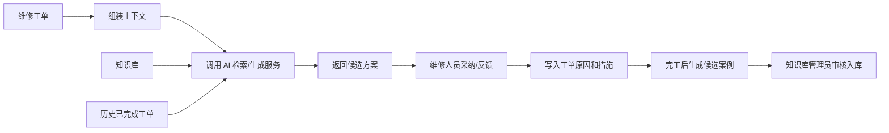

# 06. 知识库与 AI 问答数据支撑

## 模块目标与边界

本模块覆盖设备知识库管理、AI 维修知识问答数据对接支撑、维修方案智能推荐的数据来源和闭环案例沉淀。P9 中 AI 是辅助能力，不替代人工判断。

P9 不做 AI 自动制单、自动审批、自动完工和无人确认的数据写入。

## 页面与入口

| 页面/入口 | 主要能力 |
|-----------|----------|
| 知识库列表 | 查询、查看、编辑、删除、AI 同步、同步日志 |
| 知识条目编辑 | 维护 SOP、技术文档、故障排除结构化内容 |
| AI 同步日志 | 查看同步状态、失败原因、重试 |
| 维修工单 AI 推荐 | 在处理中工单中调用知识库推荐原因和措施 |
| AI 问答数据接口 | 为外部 AI 问答提供设备、知识、工单、备件数据 |

## 知识条目维护

| 分组 | 字段 | 类型 | 必填 | 规则 |
|------|------|------|------|------|
| 基本信息 | 知识编号 | 文本 | 是 | 系统生成 |
| 基本信息 | 标题 | 文本 | 是 | 知识条目名称 |
| 基本信息 | 适用设备分类 | 多选 | 否 | 可为空表示通用 |
| 基本信息 | 适用设备 | 多选 | 否 | 可精确到设备 |
| 基本信息 | 版本号 | 文本 | 是 | 更新后需重新同步 |
| 基本信息 | 标签/关键词 | 标签 | 否 | 用于检索 |
| 内容 | SOP 内容 | 富文本/附件 | 否 | 操作指导 |
| 内容 | 技术文档 | 文件 | 否 | PDF、Word、图片等 |
| 故障排除 | 故障现象 | 多行文本 | 是 | 维修推荐核心字段 |
| 故障排除 | 故障原因 | 多行文本 | 是 | 维修推荐核心字段 |
| 故障排除 | 处理措施 | 多行文本 | 是 | 维修推荐核心字段 |
| 故障排除 | 故障类型 | 下拉 | 否 | 机械、电气、软件、其他 |
| 故障排除 | 关联部件 | 文本/选择 | 否 | 可关联设备 BOM |
| 故障排除 | 经验 MTTR | 数值 | 否 | 经验值 |
| 故障排除 | 预防建议 | 多行文本 | 否 | 可用于基准优化 |
| 同步 | AI 同步状态 | 状态 | 是 | 未同步、已同步、同步失败、待更新 |

规则：

1. 新增知识条目后，状态为未同步。
2. 编辑内容、附件、标签、适用范围后，状态变为待更新或未同步。
3. 手动触发 AI 同步，成功后状态为已同步。
4. 同步失败需记录失败原因、请求时间、重试入口。
5. 删除知识条目前需二次确认；已同步知识删除后需通知 AI 服务删除或失效。

## 维修推荐数据流

维修推荐输入：

| 数据 | 来源 | 说明 |
|------|------|------|
| 设备编号、名称、分类、型号 | 设备台账 | 自动组装 |
| 故障描述、图片说明 | 维修工单 | 用户已填写内容 |
| 历史维修记录 | 已完成维修工单 | 同设备或同分类优先 |
| 知识条目 | 已同步知识库 | SOP、故障排除、技术文档 |
| 备件信息 | 备件台账 | 可用于提示可能备件，不自动领用 |

维修推荐输出：

| 字段 | 规则 |
|------|------|
| 方案标题 | 简短描述推荐方向 |
| 可能原因 | 可采纳写入工单故障原因 |
| 处理措施 | 可采纳写入工单处理措施 |
| 参考来源 | 展示知识条目或历史工单摘要 |
| 置信提示 | 仅作参考，不作为自动判断依据 |

## AI 问答数据对接

P9 只定义 EAM 提供给 AI 问答的数据范围，不在 EAM 内实现完整大模型平台。

| 数据对象 | 提供字段 | 用途 |
|----------|----------|------|
| 设备台账 | 设备编号、名称、分类、型号、位置、技术参数 | 设备上下文 |
| 设备 BOM | 部件、备件、安装位置、理论寿命 | 部件和备件问答 |
| 知识条目 | 标题、适用范围、SOP、故障现象、原因、措施、附件摘要 | 维修问答 |
| 维修工单 | 故障描述、原因、措施、维修结果、完工时间、使用备件 | 历史案例 |
| 备件台账 | 备件编号、名称、规格、库存、安全库存 | 库存问答 |
| KPI 指标 | MTTR、MTBF、故障率、故障次数 | 管理问答 |

规则：

1. 对接数据需受用户权限控制，不能越权返回设备、工单或库存数据。
2. AI 问答返回内容只作为建议，不直接修改业务数据。
3. 查询备件库存时，返回结果必须来自备件台账当前可见库存。
4. 接口失败时，前端提示不可用，不影响业务页面操作。

## 闭环案例沉淀

1. 维修工单完工后，系统生成候选知识案例。
2. 候选案例包含设备分类、设备、故障描述、故障原因、处理措施、使用备件、维修耗时。
3. 知识库管理员可选择入库、忽略或编辑后入库。
4. 入库后形成正式知识条目，需手动触发 AI 同步。
5. 已忽略候选案例不再重复提醒，但可在历史列表中查询。

## 跨模块联动

1. 维修工单调用知识库和 AI 服务获取推荐方案。
2. 已完成维修工单为知识库提供候选案例。
3. 设备台账和 BOM 为知识条目提供适用范围。
4. 备件台账为 AI 问答提供库存和备件信息。
5. KPI 看板可把高故障率、高 MTTR 设备作为知识库优化线索。

## 验收口径

1. 知识条目新增后状态为未同步。
2. 知识条目变更后状态变为待更新或未同步。
3. AI 同步成功、失败均有日志可查。
4. 维修工单处理中能调用 AI 推荐，并返回可采纳方案。
5. 采纳推荐后，工单故障原因和处理措施可编辑。
6. 维修工单完工后能生成候选知识案例。
7. AI 问答库存结果与备件台账当前可见库存一致。

## 待澄清与迭代事项

1. AI 服务接口协议、鉴权、超时、重试策略需在接口设计阶段细化。
2. 候选案例是否自动提醒知识库管理员，P9 可先在候选列表展示。
3. 技术文档附件是否需要自动解析，P9 默认只上传和同步元数据，解析由 AI 服务处理。
