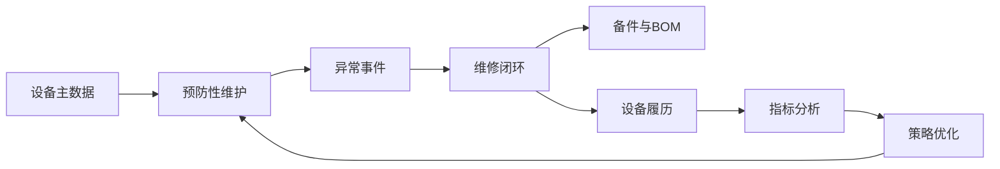
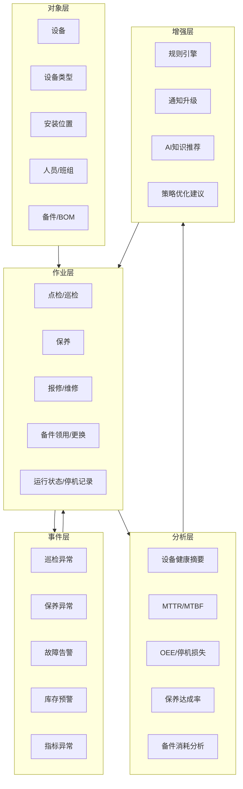
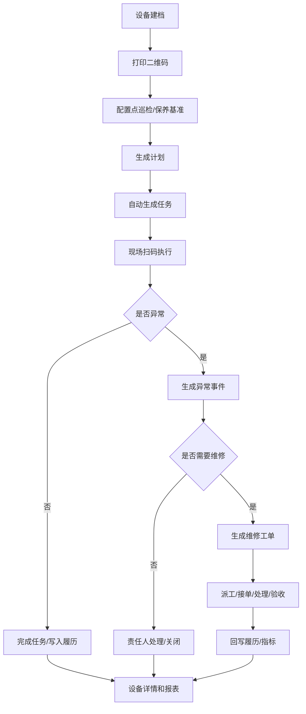

# 00. 整体业务架构与澄清路线

## 1. 产品定位

新版设备管理系统面向工业制造企业，目标是把设备从“有台账、有工单”升级为“能预防、能闭环、能分析、能扩展”的设备运营管理平台。

核心不是做很多菜单，而是围绕设备形成一条闭环：

## 2. 总体业务架构

## 3. 分层职责

| 层级 | 解决的问题 | 关键设计 |
|------|------------|----------|
| 对象层 | 设备是谁、在哪里、谁负责 | 设备台账、类型、位置、班组、BOM |
| 作业层 | 日常工作怎么执行 | 点巡检、保养、维修、备件、停机记录 |
| 事件层 | 风险如何被发现和处理 | 异常事件、预警、转单、关闭 |
| 分析层 | 管理者如何判断问题 | 健康摘要、MTTR、MTBF、OEE、达成率 |
| 增强层 | 如何持续优化 | 规则引擎、通知升级、AI 推荐、策略优化 |

## 4. 渐进式建设路线

### 阶段一：先把设备管起来

目标：设备有身份、有位置、有责任人、有二维码。

范围：

1. 设备台账批量导入。
2. 设备类型、安装位置、责任班组。
3. 设备二维码和标识牌。
4. 设备详情聚合基础信息和履历。

验收口径：

1. 设备编号全局唯一。
2. 任一设备可扫码打开详情。
3. 台账可按位置、类型、状态、负责人筛选。
4. 导入失败能看到失败原因。

### 阶段二：把预防维护跑起来

目标：点巡检、保养不靠人记，系统自动生成任务。

范围：

1. 点巡检/保养基准。
2. 设备级计划。
3. 自动任务生成。
4. 扫码执行。
5. 异常项记录。

验收口径：

1. 任务能追溯来源计划。
2. 逾期任务可识别。
3. 异常项能进入异常事件池。
4. 完成后进入设备履历。

### 阶段三：把异常闭环起来

目标：异常有人接、有人修、有结果、有复盘。

范围：

1. 异常事件池。
2. 报修与维修工单。
3. 派工、接单、到场、处理、验收。
4. 故障原因、措施、备件使用。
5. 返工和关闭原因。

验收口径：

1. 任一异常事件有状态和责任人。
2. 异常可转维修工单。
3. 工单节点时间可用于计算 MTTR。
4. 工单完工回写设备履历。

### 阶段四：把备件和指标接起来

目标：维修不再只看工单，还能看到备件、停机和效率影响。

范围：

1. 备件台账和库存。
2. 维修/保养领用。
3. 设备 BOM 位置绑定。
4. MTTR、MTBF、停机时长。
5. 设备健康摘要。

验收口径：

1. 备件领用能关联设备和工单。
2. 更换备件能形成设备备件履历。
3. 指标可下钻到工单或停机记录。
4. 健康摘要能说明风险来源。

### 阶段五：再做 AI 和策略优化

目标：用历史数据辅助诊断、推荐和策略调整。

范围：

1. 维修知识库。
2. AI 故障原因推荐。
3. 工单总结。
4. 巡检/保养策略优化建议。
5. 高风险设备识别。

验收口径：

1. AI 推荐必须能展示依据。
2. AI 不直接改业务数据，只给建议。
3. 关键建议可人工采纳或忽略并留痕。

## 5. MVP 主流程

## 6. 首轮澄清问题

这些问题不阻塞文档继续细化，但会影响后续范围和优先级。

### 6.1 首版目标客户

| 方案 | 说明 | 优点 | 风险 |
|------|------|------|------|
| A. 优先离散制造 | 面向机械、电子、汽车零部件等设备场景 | 点巡检、维修、备件、工单通用性高 | 对连续工艺、批次过程支持不足 |
| B. 优先流程制造 | 面向化工、食品、材料等连续生产 | 更重视状态、停机、安环和连续运行 | 台账、维修闭环仍要做，首版复杂度高 |
| C. 通用底座 + 行业扩展 | 首版做设备对象、维护、维修、备件、指标底座，行业差异放扩展 | 标准产品可复用，后续可扩展 | 首版行业特色不够强 |

推荐：C. 通用底座 + 行业扩展。

推荐原因：当前目标是标准产品，不是单一客户项目。设备对象、预防维护、维修闭环、备件、指标是多数工业企业共性，行业差异适合通过字段模板、规则和插件扩展。

### 6.2 外部系统集成范围

| 方案 | 说明 | 优点 | 风险 |
|------|------|------|------|
| A. 首版强制接 MES/ERP/库存/安灯 | 上线即打通外部系统 | 自动化程度高 | 项目依赖重，交付周期不可控 |
| B. 首版不做接口，只支持人工维护 | 最快落地 | 系统孤岛明显，后续返工 |
| C. 人工导入/手工维护 + 标准接口预留 | MVP 可独立运行，同时定义主数据、库存、告警、消息接口 | 上线稳，扩展路径清晰 | 首版自动化有限 |

推荐：C. 人工导入/手工维护 + 标准接口预留。

推荐原因：标准产品要能在无外部系统时跑通，也要给成熟客户留集成空间。先定义接口边界，不把首版绑死在集成项目上。

### 6.3 点检和巡检模型

| 方案 | 说明 | 优点 | 风险 |
|------|------|------|------|
| A. 独立模型 | 点检、巡检各自配置计划和任务 | 概念直观 | 规则重复，维护成本高 |
| B. 统一检查任务模型 | 底层统一计划、任务、项目、异常，业务类型区分点检/巡检 | 简单、可扩展、便于统计 | 需要通过菜单和文案降低理解成本 |
| C. 完全合并为点巡检 | 用户只看到点巡检 | 页面少 | 对有路线巡检的企业表达不足 |

推荐：B. 统一检查任务模型。

推荐原因：点检和巡检本质都是“按基准检查并记录结果”，差异主要在频率、路线、项目和对象范围。统一底层更合理。

### 6.4 设备等级字典

| 方案 | 说明 | 优点 | 风险 |
|------|------|------|------|
| A. A/B/C | 国际化、简洁，适合策略配置 | 易用于规则和排序 | 一线理解需要解释 |
| B. 关键/重要/一般 | 中文直观 | 现场易懂 | 后续和算法、规则映射略弱 |
| C. 内置 A/B/C，显示名可配置 | 底层用 A/B/C，前台可显示关键/重要/一般 | 兼顾规则和易懂 | 需要字典映射 |

推荐：C. 内置 A/B/C，显示名可配置。

推荐原因：底层规则用稳定编码，前台文案按企业习惯展示，既通用又好用。

### 6.5 OEE 首版范围

| 方案 | 说明 | 优点 | 风险 |
|------|------|------|------|
| A. 首版完整 OEE | 包含计划、运行、性能、良率、损失下钻 | 管理价值高 | 数据来源复杂，容易拖慢首版 |
| B. 首版不做 OEE | 只做设备维护和维修 | 快速闭环 | 后续指标能力不足 |
| C. 首版做停机和维修指标，OEE 作为增强 | 先做停机记录、MTTR、故障次数、保养达成率 | 数据门槛低，能支撑管理动作 | OEE 完整看板需后续迭代 |

推荐：C. 首版做停机和维修指标，OEE 作为增强。

推荐原因：OEE 依赖生产计划、产出、良率和状态采集。先把设备侧数据打稳，再接 OEE 更稳。

### 6.6 移动端入口

| 方案 | 说明 | 优点 | 风险 |
|------|------|------|------|
| A. PC 优先 | 所有功能先按 PC 设计 | 管理配置方便 | 一线执行体验差 |
| B. 移动端优先 | 点检、保养、报修、维修执行优先移动端 | 符合现场作业，扫码闭环顺 | 后台配置仍需 PC |
| C. PC + 移动端同等完整 | 两端都完整覆盖 | 能力最全 | 首版成本高 |

推荐：B. 移动端优先。

推荐原因：一线人员主要在设备现场，扫码、拍照、签到、填报都需要移动端。PC 更适合配置、分析和管理。

### 6.7 AI 首版边界

| 方案 | 说明 | 优点 | 风险 |
|------|------|------|------|
| A. 知识推荐 + 工单总结 | AI 只辅助，不决策 | 风险低，易上线 | 智能闭环较弱 |
| B. 故障诊断建议 | AI 推荐原因和措施 | 对维修有帮助 | 依赖历史数据质量 |
| C. 自动诊断和派单 | AI 自动判断并推动流程 | 自动化强 | 责任和误判风险高 |

推荐：A. 知识推荐 + 工单总结。

推荐原因：AI 首版应建立信任，不应直接替代人做关键决策。先做可解释的辅助能力。

## 7. 与旧标品的主要差异

| 旧标品倾向 | 新版调整 |
|------------|----------|
| 模块较全，工程化信息多 | 先按业务闭环重新组织 |
| OEE、备件、AI 都较重 | MVP 先打通设备、维护、维修、履历 |
| 状态和接口细节较多 | 先统一对象、事件、任务、工单、指标口径 |
| 偏项目复用 | 改为通用产品能力 + 可配置扩展 |
