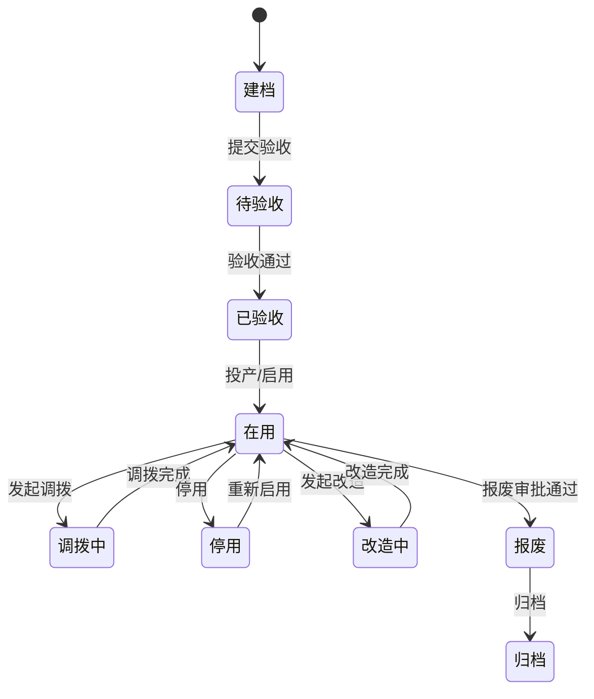

# 01. 设备主数据与生命周期

## 1. 模块目标

设备主数据负责回答四个问题：

1. 设备是谁。
2. 设备在哪里。
3. 设备归谁负责。
4. 设备当前处于什么生命周期和运行状态。

设备台账不应成为所有字段的堆放处。它只维护稳定主数据和高频查询字段，业务记录通过详情页聚合展示。

## 2. 核心对象

| 对象 | 说明 |
|------|------|
| 设备实例 | 一台真实设备，一机一档 |
| 设备类型 | 同类设备的模板、基准、故障分类、默认责任 |
| 设备型号 | 厂商和规格层面的信息，可选独立维护 |
| 安装位置 | 关联工厂建模节点，支持位置路径 |
| 责任关系 | 设备负责人、维修班组、保养班组 |
| 设备二维码 | 设备现场入口 |
| 生命周期履历 | 建档、验收、投产、调拨、停用、报废等变化记录 |

## 3. 台账字段建议

| 分组 | 字段 | 说明 |
|------|------|------|
| 身份识别 | 设备编号、设备名称、设备类型、规格型号、资产编号 | 设备编号全局唯一 |
| 位置责任 | 设备安装位置、所属部门、设备负责人、维修班组、保养班组 | 安装位置用层级路径 |
| 管理属性 | 设备等级、是否生产设备、是否关键设备、启用状态 | 支撑策略和统计 |
| 状态 | 生命周期状态、当前运行状态 | 生命周期和运行状态分开 |
| 附件 | 设备图片、说明书、验收资料 | 大资料放附件或知识库 |
| 近期摘要 | 最近点检、最近保养、最近维修、下次保养 | 来自业务回写或计算 |

## 4. 生命周期状态

## 5. 设备详情页

设备详情页建议作为设备全景入口，包含：

| 区域 | 内容 |
|------|------|
| 基本信息 | 设备身份、位置、责任、状态 |
| 健康摘要 | 近 30 天异常、维修、停机、保养逾期 |
| 维护履历 | 点检、巡检、保养记录 |
| 维修履历 | 工单、原因、措施、备件、耗时 |
| 备件履历 | 当前绑定备件、更换记录 |
| 运行履历 | E10 状态、停机记录 |
| 生命周期履历 | 验收、调拨、停用、报废 |
| 附件知识 | 说明书、图纸、知识库条目 |
| 操作日志 | 字段变更、状态流转 |

## 6. 二维码入口

二维码默认进入移动端设备详情，再根据权限和状态展示动作。

| 动作 | 适用条件 |
|------|----------|
| 查看设备 | 所有人可见，按权限脱敏 |
| 发起报修 | 设备未报废、未归档 |
| 执行点检 | 当前用户有待执行点检任务 |
| 执行保养 | 当前用户有待执行保养任务 |
| 备件更换 | 有维修/保养工单或授权角色 |
| 查看知识 | 有知识库权限 |

## 7. 待确认事项

### 7.1 安装位置模型

| 方案 | 说明 | 优点 | 风险 |
|------|------|------|------|
| A. 依赖统一工厂建模模块 | 设备安装位置直接引用工厂/车间/产线/工序节点 | 位置口径统一，支持跨模块分析 | 如果工厂建模未建设，会影响设备上线 |
| B. 设备模块自带简化位置 | 设备内维护工厂、车间、区域、位置 | 上线快 | 后续和 MES/OEE/组织建模容易重复 |
| C. 先内置简化位置，兼容未来工厂建模 | 当前用树形位置，后续可映射统一工厂建模节点 | 兼顾落地和扩展 | 需要预留位置编码和映射关系 |

推荐：C. 先内置简化位置，兼容未来工厂建模。

推荐原因：首版不能被工厂建模阻塞，但位置必须可演进。设备安装位置统一用一个层级字段，后续映射到工厂建模。

### 7.2 生命周期是否细分投产状态

| 方案 | 说明 | 优点 | 风险 |
|------|------|------|------|
| A. 不细分 | 验收后直接在用 | 简单 | 无法区分已验收但未投产设备 |
| B. 细分待投产/已投产 | 验收通过后进入待投产，投产确认后进入在用 | 生命周期清晰 | 状态多一步 |
| C. 用“是否投产”标签 | 生命周期保持简单，另设投产标识 | 灵活 | 状态和标签容易混用 |

推荐：B. 细分待投产/已投产。

推荐原因：投产前不应生成 OEE、点检、保养等正式任务。用状态控制业务更清楚。

### 7.3 设备等级字典

| 方案 | 说明 | 优点 | 风险 |
|------|------|------|------|
| A. A/B/C | 标准化，适合规则配置 | 简洁 | 一线要学习含义 |
| B. 关键/重要/一般 | 中文直观 | 容易理解 | 不同企业叫法不同 |
| C. 编码固定、名称可配置 | 底层 A/B/C，展示名可配置 | 通用且灵活 | 需要维护字典 |

推荐：C. 编码固定、名称可配置。

推荐原因：等级会参与计划频率、验收要求、预警升级和报表统计，底层编码必须稳定。

### 7.4 二维码离线能力

| 方案 | 说明 | 优点 | 风险 |
|------|------|------|------|
| A. 不支持离线 | 扫码必须联网 | 实现简单 | 网络差现场不可用 |
| B. 支持离线查看缓存任务 | 已下载任务可离线执行，联网后同步 | 适合车间网络不稳定 | 需要冲突处理 |
| C. 完整离线作业 | 离线可新增、编辑、上传附件、同步 | 体验最好 | 首版复杂度高 |

推荐：B. 支持离线查看缓存任务。

推荐原因：工业现场网络不稳定常见，但完整离线成本高。首版支持任务缓存和补传较合理。
