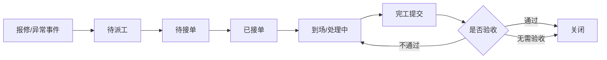

# 03. 异常事件与维修闭环

## 1. 模块目标

异常事件负责承接风险，维修工单负责完成故障处理。两者建议分开：

| 对象 | 作用 |
|------|------|
| 异常事件 | 记录风险来源、等级、责任人和处理要求 |
| 维修工单 | 承接需要维修的异常，形成派工、执行、验收闭环 |

## 2. 异常来源

| 来源 | 示例 |
|------|------|
| 扫码报修 | 一线人员发现故障 |
| 点巡检异常 | 检查项异常 |
| 保养异常 | 保养中发现问题 |
| 设备告警 | 安灯/PLC/数采告警 |
| 指标异常 | MTBF 下降、停机过高 |
| 人工创建 | 管理者主动创建 |

## 3. 维修主流程

## 4. 关键节点时间

| 节点 | 字段 |
|------|------|
| 报修 | 创建时间 |
| 派工 | 派工时间 |
| 接单 | 接单时间 |
| 到场 | 到场时间 |
| 开始维修 | 开始处理时间 |
| 完工 | 完工时间 |
| 关闭 | 关闭时间 |

这些字段用于拆分派工耗时、响应耗时、到场耗时、维修耗时和整体闭环耗时。

## 5. 工单结构化信息

| 分组 | 字段 |
|------|------|
| 故障信息 | 故障描述、故障等级、是否停机、停机开始/结束 |
| 分类归因 | 故障类型、故障原因、责任分类 |
| 处理措施 | 维修措施、是否更换备件、是否临时处理 |
| 验收结果 | 验收人、验收结论、返工原因 |
| 知识沉淀 | 是否沉淀知识、关联知识条目 |

## 6. 待确认事项

### 6.1 是否需要暂停/等待备件状态

| 方案 | 说明 | 优点 | 风险 |
|------|------|------|------|
| A. 不设暂停状态 | 工单一直处于处理中 | 状态简单 | MTTR 会被备件等待拉长，无法分析瓶颈 |
| B. 增加等待备件 | 缺料时进入等待备件，单独统计等待时长 | 能拆分维修慢的原因 | 状态多一层 |
| C. 增加通用暂停 | 可选择等待备件、等待外协、等待停机窗口等原因 | 扩展性好 | 需要严格控制暂停原因 |

推荐：C. 增加通用暂停。

推荐原因：维修停滞不只因为备件，也可能等外协、停机窗口、生产放行。通用暂停更适合标准产品。

### 6.2 验收是否按设备等级配置

| 方案 | 说明 | 优点 | 风险 |
|------|------|------|------|
| A. 所有维修都验收 | 完工后必须验收 | 质量可控 | 流程重 |
| B. 所有维修免验收 | 技术员完工即关闭 | 效率高 | 关键设备维修质量风险 |
| C. 按设备等级/故障等级配置 | 关键设备、重大故障必须验收 | 平衡效率和质量 | 需要规则维护 |

推荐：C. 按设备等级/故障等级配置。

推荐原因：维修验收应服务风险控制，不应一刀切。

### 6.3 误报、重复报修、合并工单

| 方案 | 说明 | 优点 | 风险 |
|------|------|------|------|
| A. 都作为普通关闭 | 误报、重复都关闭并备注 | 简单 | 后续统计口径不清 |
| B. 独立状态/原因 | 支持误报关闭、重复关闭、合并到已有工单 | 统计清晰 | 操作项更多 |
| C. 只支持合并，不支持误报 | 重复工单合并，误报靠备注 | 简化 | 误报率无法分析 |

推荐：B. 独立状态/原因。

推荐原因：MTTR、故障次数、MTBF 需要排除误报和重复工单。必须结构化记录关闭原因。

### 6.4 外协维修流程

| 方案 | 说明 | 优点 | 风险 |
|------|------|------|------|
| A. 首版不做 | 外协只作为备注记录 | 简单 | 外协场景无法闭环 |
| B. 轻量外协 | 工单可标记外协，记录供应商、送修/返回、费用 | 覆盖多数需求 | 不含采购合同细节 |
| C. 完整外协流程 | 报价、审批、合同、结算全流程 | 管理完整 | 超出设备管理首版范围 |

推荐：B. 轻量外协。

推荐原因：很多企业有外协维修，但完整采购结算属于 ERP/采购范畴。首版记录外协关键节点即可。
