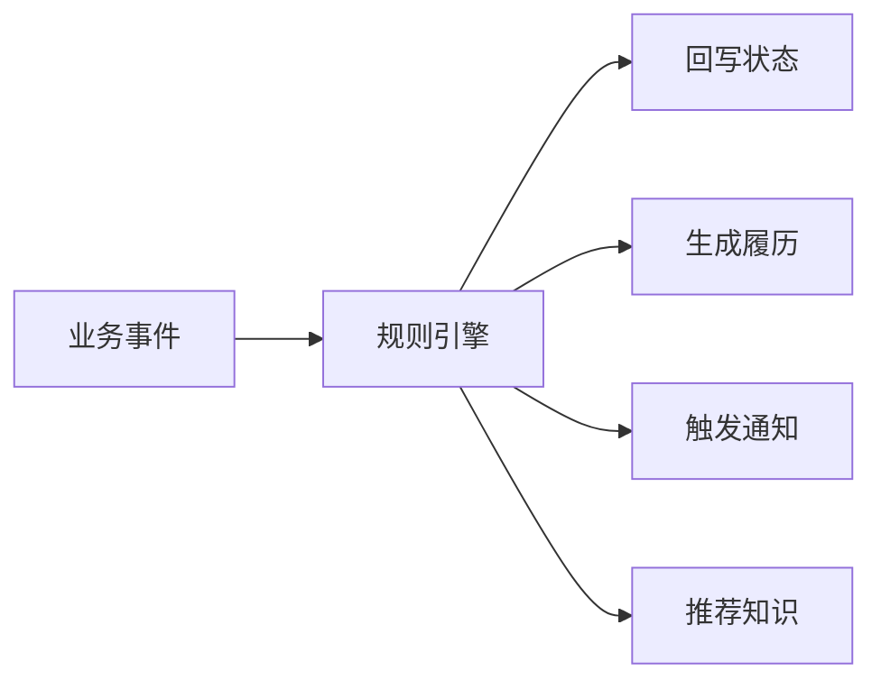

# 07. AI知识库与智能助手

## 1. 模块目标

AI 不作为基础闭环前置条件。新版系统建议先沉淀知识，再做推荐。

## 2. 能力分层

| 层级 | 能力 | 建议 |
|------|------|------|
| L1 规则助手 | 状态回写、日期回写、通知触发 | MVP |
| L2 知识库 | 故障案例、说明书、维修 SOP | MVP/增强 |
| L3 推荐 | 根据故障现象推荐原因和措施 | 增强 |
| L4 总结 | 自动生成维修总结和知识候选 | 增强 |
| L5 预测 | 故障风险预测 | 可选 |

## 3. 事件规则替代硬编码

## 4. 待确认事项

### 4.1 企业知识库/大模型平台现状

| 方案 | 说明 | 优点 | 风险 |
|------|------|------|------|
| A. 使用企业已有平台 | 对接已有知识库或模型服务 | 符合企业 IT 架构 | 接口和权限依赖外部平台 |
| B. 系统内置轻量知识库 | 设备系统自己管理知识条目和附件 | 快速落地 | AI 能力有限 |
| C. 内置知识库 + 可对接外部模型 | 知识沉淀在设备系统，模型服务可配置 | 兼顾落地和扩展 | 需要定义同步和调用规则 |

推荐：C. 内置知识库 + 可对接外部模型。

推荐原因：设备知识来自工单、说明书、SOP，应该沉淀在设备系统；模型平台可按客户条件接入。

### 4.2 AI 输出是否直接进入工单

| 方案 | 说明 | 优点 | 风险 |
|------|------|------|------|
| A. 直接写入工单正文 | AI 自动生成原因、措施、总结 | 省事 | 误写风险高，责任不清 |
| B. 必须人工确认后写入 | AI 生成建议，用户采纳后进入工单 | 安全可控 | 多一步确认 |
| C. 仅作为旁路参考 | AI 建议只展示，不进入业务数据 | 风险最低 | 沉淀价值弱 |

推荐：B. 必须人工确认后写入。

推荐原因：维修记录是正式履历和指标来源，不能由 AI 直接写入。人工确认可以保留效率，也能控制责任。

### 4.3 资料权限隔离

| 方案 | 说明 | 优点 | 风险 |
|------|------|------|------|
| A. 不隔离 | 所有人可看全部说明书和图纸 | 简单 | 涉密风险高 |
| B. 按设备/位置/角色隔离 | 用户只能看权限范围内资料 | 安全 | 权限配置复杂 |
| C. 普通资料开放，敏感资料隔离 | SOP、说明书开放，图纸、合同、供应商资料按权限 | 平衡效率和安全 | 需要资料密级字段 |

推荐：C. 普通资料开放，敏感资料隔离。

推荐原因：维修一线需要快速查资料，但图纸、合同、供应商文件可能涉及敏感信息。按资料密级控制更合理。
