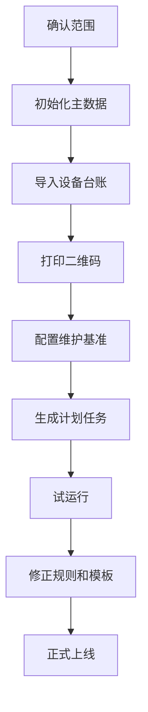

# 09. 实施落地与验收口径

## 1. 上线步骤

## 2. 初始化清单

| 数据 | 是否必需 |
|------|----------|
| 设备类型 | 必需 |
| 安装位置 | 必需 |
| 设备台账 | 必需 |
| 人员/班组 | 必需 |
| 点巡检基准 | 必需 |
| 保养基准 | 必需 |
| 备件台账 | 可选 |
| 故障分类 | 建议 |
| 停机分类 | OEE 场景必需 |

## 3. 统一验收口径

1. 任一设备编号必须唯一。
2. 任一任务必须能追溯来源计划和生成规则。
3. 任一状态流转必须记录操作人、时间、前后状态。
4. 任一异常关闭必须记录关闭原因。
5. 任一维修工单必须能记录关键节点时间。
6. 任一设备详情必须能查看点检、保养、维修履历。
7. 任一人工修正指标或状态必须留痕。

## 4. 待确认事项

### 4.1 首批试点范围

| 方案 | 说明 | 优点 | 风险 |
|------|------|------|------|
| A. 一个车间 | 覆盖该车间全部设备和人员 | 流程完整，容易看闭环 | 设备类型多时配置工作量大 |
| B. 一类关键设备 | 选择同类型关键设备试点 | 模板统一，风险价值高 | 跨区域协同可能不足 |
| C. 一个车间 + 少量关键设备优先 | 以车间为边界，先上线关键设备，再扩普通设备 | 范围清晰，价值明显 | 需要分批计划 |

推荐：C. 一个车间 + 少量关键设备优先。

推荐原因：车间边界便于组织和现场推进，关键设备能快速体现价值，分批扩展风险最低。

### 4.2 历史维修记录迁移

| 方案 | 说明 | 优点 | 风险 |
|------|------|------|------|
| A. 不迁移 | 新系统从上线日开始积累 | 快速上线 | 缺少历史分析 |
| B. 全量迁移 | 迁移所有历史维修记录 | 数据完整 | 清洗成本高 |
| C. 迁移近 1-2 年关键字段 | 只迁移设备、时间、故障、原因、措施、备件等关键字段 | 支撑分析，成本可控 | 早期历史不完整 |

推荐：C. 迁移近 1-2 年关键字段。

推荐原因：历史数据质量通常不稳定。迁移关键字段足够支撑 MTTR、MTBF、知识库和故障趋势。

### 4.3 二维码标签样式

| 方案 | 说明 | 优点 | 风险 |
|------|------|------|------|
| A. 产品标准样式 | 系统内置设备标识牌模板 | 快速打印 | 不符合企业 VI 或现场要求 |
| B. 企业统一样式 | 按客户要求设计标签 | 现场统一 | 每个项目要调整 |
| C. 标准模板 + 可配置字段/Logo | 内置模板，支持 Logo、字段、尺寸配置 | 通用且灵活 | 需要模板配置能力 |

推荐：C. 标准模板 + 可配置字段/Logo。

推荐原因：标签要快速落地，也要适配企业 VI、尺寸和现场耐用要求。模板可配置最适合标品。
