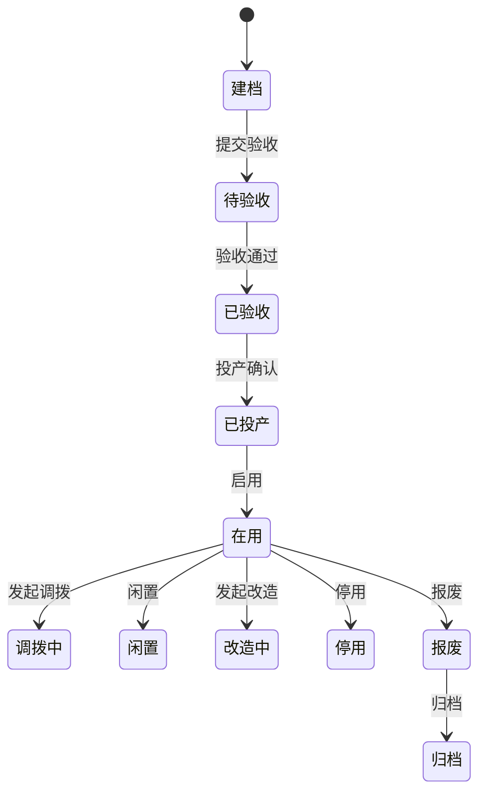
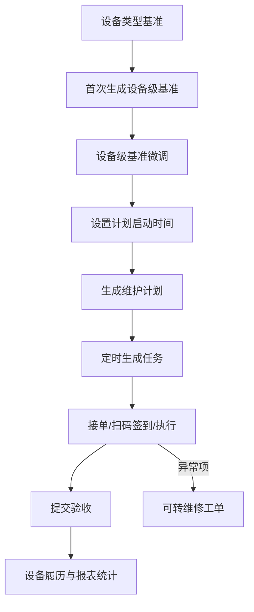
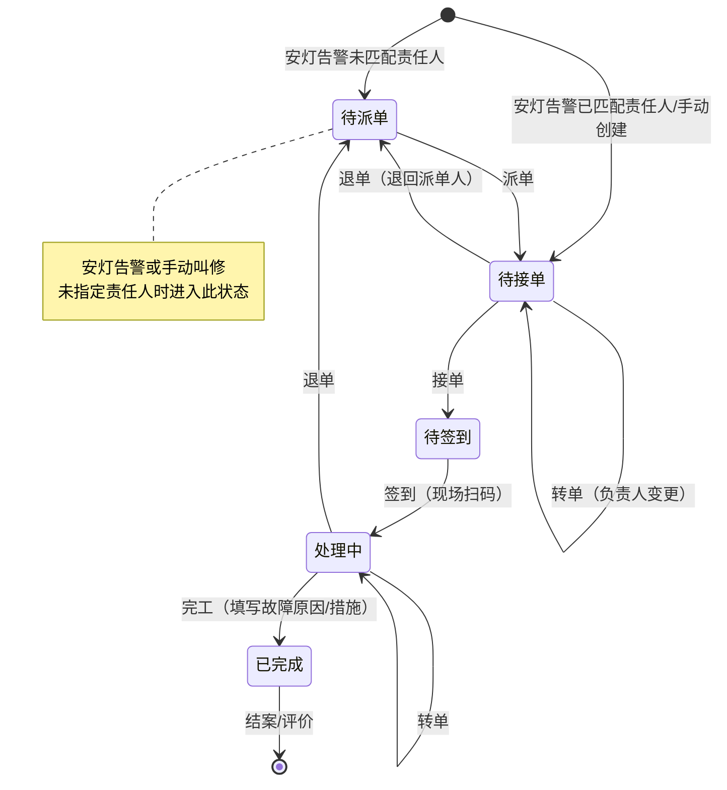
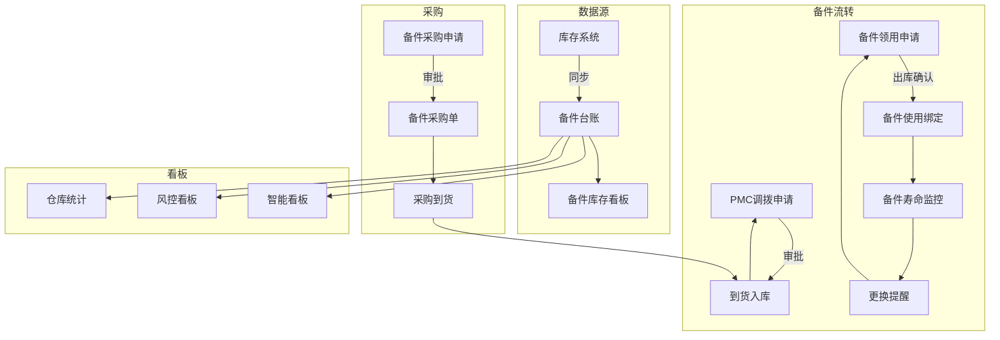

# 设备管理系统 — 产品需求文档

**版本**: V3.2  
**日期**: 2026-05-26  
**状态**: 工程化拆分版  
**文档来源**: 设备需求文档 + 详细设计文档 + EAM项目用户操作手册 + 墨刀原型分析  
**工程化目录**: [需求分析/README.md](需求分析/README.md)  
**产品定位**: 通用标准产品文档，参考项目特性需抽象为可配置项或可选扩展  

---

## 目录

- [1. 系统角色定义](#1-系统角色定义)
- [2. 首页仪表盘](#2-首页仪表盘)
  - [2.1 功能概述](#21-功能概述)
  - [2.2 页面布局](#22-页面布局)
  - [2.3 功能点](#23-功能点)
- [3. 模块1：设备主数据与生命周期管理](#3-模块1设备主数据与生命周期管理)
  - [3.1 设备分类与基础数据配置管理](#31-设备分类与基础数据配置管理)
  - [3.2 设备台账信息全生命周期管理](#32-设备台账信息全生命周期管理)
  - [3.3 设备全景履历详情](#33-设备全景履历详情)
- [4. 模块2：设备预防性维护](#4-模块2设备预防性维护)
  - [4.1 整体功能概述（共用规则全集）](#41-整体功能概述共用规则全集)
  - [4.2 设备点巡检](#42-设备点巡检)
  - [4.3 设备保养](#43-设备保养)
- [5. 模块3：设备故障维修（含设备叫修与异常工单处理）](#5-模块3设备故障维修含设备叫修与异常工单处理)
  - [5.1 整体功能概述](#51-整体功能概述)
  - [5.2 异常工单来源与触发机制](#52-异常工单来源与触发机制)
  - [5.3 工单全生命周期状态流转](#53-工单全生命周期状态流转)
  - [5.4 工单字段设计](#54-工单字段设计)
  - [5.5 核心操作流程（含API接口）](#55-核心操作流程含api接口)
  - [5.6 移动端支持](#56-移动端支持)
  - [5.7 AI 智能辅助](#57-ai-智能辅助)
- [6. 模块4：OEE 模块（含KPI看板）](#6-模块4-oee-模块含kpi看板)
  - [6.1 整体功能架构](#61-整体功能架构)
  - [6.2 OEE 配置管理](#62-oee-配置管理)
  - [6.3 OEE 数据填报](#63-oee-数据填报)
  - [6.4 OEE 数据报表](#64-oee-数据报表)
  - [6.5 设备 PPM 分析](#65-设备-ppm-分析)
  - [6.6 KPI 看板](#66-kpi-看板)
  - [6.7 核心数据表](#67-核心数据表)
- [7. 模块5：备件管理（含智能看板与风控看板）](#7-模块5备件管理含智能看板与风控看板)
  - [7.1 整体功能架构](#71-整体功能架构)
  - [7.2 备件台账](#72-备件台账)
  - [7.3 PMC 调拨申请](#73-pmc-调拨申请)
  - [7.4 备件领用申请](#74-备件领用申请)
  - [7.5 备件采购申请](#75-备件采购申请)
  - [7.6 备件采购单](#76-备件采购单)
  - [7.7 备件使用记录](#77-备件使用记录)
  - [7.8 智能看板](#78-智能看板)
  - [7.9 风控看板](#79-风控看板)
  - [7.10 仓库管理（辅助功能）](#710-仓库管理辅助功能)
  - [7.11 供应商管理](#711-供应商管理)
- [8. 模块6：AI 故障知识库管理](#8-模块6-ai-故障知识库管理)
  - [8.1 整体功能概述](#81-整体功能概述)
  - [8.2 设备知识库管理](#82-设备知识库管理)
  - [8.3 AI 维修知识问答数据对接支撑](#83-ai-维修知识问答数据对接支撑)
- [9. 模块7：设备预警事件与公共消息对接](#9-模块7设备预警事件与公共消息对接)
  - [9.1 功能描述](#91-功能描述)
  - [9.2 配置与逻辑](#92-配置与逻辑)
- [10. 报表统计](#10-报表统计)
  - [10.1 功能概述](#101-功能概述)
  - [10.2 报表类型](#102-报表类型)
  - [10.3 通用功能](#103-通用功能)
- [11. 系统管理](#11-系统管理)
  - [11.1 功能概述](#111-功能概述)
  - [11.2 用户管理](#112-用户管理)
  - [11.3 角色管理](#113-角色管理)
  - [11.4 菜单管理](#114-菜单管理)
  - [11.5 字典管理](#115-字典管理)
- [12. 超出范围](#12-超出范围)
- [13. 附录](#13-附录)
  - [13.1 术语表](#131-术语表)
  - [13.2 参考资料](#132-参考资料)
- [14. 工程化需求拆分与迭代规则](#14-工程化需求拆分与迭代规则)

---

## 1. 系统角色定义

| 角色 | 描述 | 核心职责 |
|------|------|----------|
| 设备管理员 | 设备基础数据的维护者 | 设备台账维护、设备类型配置、BOM管理、设备责任人维护 |
| 维修技术员 | 一线维修执行人员 | 故障报修、接单、签到、维修执行、备件领用、完工 |
| 维修主管/班组长 | 维修团队负责人 | 工单派发/转派、验收审核、KPI查看、团队管理 |
| 点巡检/保养人员 | 预防性维护执行者 | 执行点检/巡检/保养任务、记录检查结果 |
| 备件管理员 | 备件管理角色 | 备件台账查看、PMC调拨、出库确认、采购申请、寿命监控、盘库 |
| OEE数据填报员 | 生产现场数据录入 | 维护设备停机/损失记录、分段处理 |
| 知识库管理员 | AI 知识库维护者 | 知识条目管理、AI同步操作、文档上传 |
| 生产管理者/厂长 | 管理决策者 | 查看 KPI 看板/OEE 报表，下钻分析，制定改进措施 |

---

## 2. 首页仪表盘

### 2.1 功能概述

首页仪表盘是系统登录后的默认页面，面向设备管理员、生产管理者等角色，以卡片和图表形式集中展示关键 KPI 指标、待办任务、设备生命周期/E10 状态分布及快捷操作入口，帮助用户快速掌握设备运营状况。

### 2.2 页面布局

| 区域 | 展示内容 | 说明 |
|------|---------|------|
| **顶部 KPI 卡片** | OEE、DT率、MTTR、MTBF、故障次数 | 数字卡片展示当前周期汇总值，支持点击跳转到对应分析页面 |
| **设备状态分布** | 饼图/环形图 | 分别按生命周期/使用状态、E10 运行状态统计设备数量及占比 |
| **待办任务** | 列表 | 当前登录人待处理的点检/保养/维修工单数量，点击快速跳转 |
| **故障趋势** | 折线图 | 近 7 天/近 30 天故障次数趋势 |
| **OEE 趋势** | 折线图 | 近 7 天/近 30 天 OEE 变化趋势 |
| **快捷入口** | 图标按钮 | 扫码点检、扫码保养、叫修申请、备件领用等高频操作的快捷入口 |

### 2.3 功能点

1. **全局筛选**：首页顶部支持按设备安装位置层级筛选，筛选后所有卡片和图表数据联动刷新
2. **KPI 卡片交互**：点击任意 KPI 卡片，跳转至对应的详情页（如点击"OEE"跳转至 KPI 看板）
3. **待办任务聚合**：自动聚合当前登录人在各模块（点检、保养、维修）的待办任务，展示任务类型、数量、最紧急的任务信息
4. **设备状态统计**：基于设备主数据的生命周期/使用状态和 E10 当前运行状态统计分布，展示总设备数及各状态数量；两类状态分开展示，避免把资产生命周期和现场运行状态混用

---

## 3. 模块1：设备主数据与生命周期管理

### 3.1 功能概述

设备主数据与生命周期管理负责统一设备身份、设备安装位置、设备类型、责任关系、生命周期、BOM、二维码和设备履历。它是点巡检、保养、维修、备件、OEE/KPI 和报表分析的基础维度来源。

标准产品中，设备台账不承载生产参数。设计 PPM、实际 PPM、OEE 目标、DT 目标等归 OEE/KPI 模块的产能与目标配置。

### 3.2 核心能力

| 能力 | 说明 |
|------|------|
| 设备台账 | 维护设备编号、名称、型号、类型、安装位置、负责人、设备等级、是否生产设备、使用状态等轻量主数据 |
| 设备安装位置 | 关联工厂建模主数据节点，台账只维护一个“设备安装位置”字段，工厂/车间/产线/工序从路径反查 |
| 生命周期管理 | 管理建档、验收、投产、调拨、闲置、改造、停用、报废、归档等节点 |
| 状态业务联动 | 根据生命周期状态控制 OEE、点巡检、保养、维修、备件绑定等业务是否允许新建 |
| 设备类型与停机分类 | 维护设备类型、类型级停机分类、设备级停机分类和默认责任规则 |
| 设备 BOM | 维护设备部件结构、备件位置和理论寿命 |
| 设备详情 | 聚合基本信息、生命周期履历、BOM、点巡检履历、保养履历、维修履历、备件履历、运行状态履历和操作日志 |

### 3.3 台账字段原则

设备台账字段应围绕管理行为和统计分析设计，不堆砌技术参数。

| 分组 | 字段示例 |
|------|----------|
| 身份识别 | 设备编号、设备名称、设备型号、设备类型、二维码 |
| 位置与责任 | 设备安装位置、所属部门、负责人、维修责任班组、保养责任班组 |
| 管理属性 | 设备等级、是否生产设备、生命周期状态、使用状态、启用状态 |
| 近期维护 | 最近点检日期、最近巡检日期、最近保养日期、最近维修日期、下次点检日期、下次保养日期 |
| 附件资料 | 设备图片、说明书、技术资料、验收附件、其他附件 |
| 扩展属性 | 计量设备、特种设备等行业字段通过属性模板配置 |

近期维护日期由点巡检、保养、维修等业务模块自动回写或实时聚合，不允许在台账手工维护。

### 3.4 生命周期与履历

验收履历并入生命周期履历，不再作为独立 Tab。到货验收、试运行验收、投产验收等均作为生命周期节点展示。



状态联动规则以 [01-设备资产管理.md](需求分析/01-设备资产管理.md) 为准。


## 4. 模块2：设备预防性维护

### 4.1 整体功能概述（共用规则）

标准产品的预防性维护以“设备类型基准 → 设备级基准 → 计划 → 任务 → 执行/验收 → 履历统计”为主，覆盖点检、巡检、保养的标准维护、自动生成任务和现场闭环执行。



点巡检与保养共享基准、计划、任务和验收逻辑，但在项目字段与执行内容上有差异，分别在 4.2 和 4.3 描述。

#### 4.1.1 基准层级与继承规则

**基准层级**：
- **设备类型基准**：针对某一类设备创建统一检查/保养标准。同一设备类型同一业务类型默认保留一套启用基准。
- **设备基准**：继承自类型基准，允许针对单台设备微调项目内容，不影响原设备类型基准。

**设备类型基准页面**：
- 新增/编辑：
   - 基本信息：基准编号、基准名称、业务类型、设备类型、启用状态。
   - 项目列表：至少一条检查/保养项目。
   - 导入/导出：支持通过 Excel 模板批量创建或导出基准。
   - 修改记录：记录修改人、修改时间、修改内容。
- 列表：序号、基准编号、基准名称、业务类型、所属设备类型、启用状态、创建时间。

**设备基准页面**：
- 配置：设备基准编号、基准名称、设备名称、设备编号、设备类型、业务类型、启用状态、计划启动时间。
- 支持查看和编辑单设备项目内容、频次、派单班组、执行期限。
- 设置计划启动时间并校验通过后，系统生成维护计划。

#### 4.1.2 计划生成与任务状态

**计划生成规则**：
- 用户在设备级基准设置计划启动时间后生成维护计划。
- 同一设备、同一业务类型、相同启动时间、频次和派单班组的项目，可合并为一条计划。
- 新生成计划默认启用；暂停计划后不再生成新任务，已生成任务继续按当前状态处理。

**任务生成规则**：
- 系统定时扫描启用状态计划，达到下次任务时间时自动生成任务。
- 任务生成后进入“待接单”，并根据计划派单班组确定可见和可接单范围。
- 系统更新计划的上次任务时间和下次任务时间。

**任务状态**：
- **待接单**：任务已生成，等待执行人员接单。
- **待执行**：已接单，等待现场执行。
- **执行中**：已扫码签到或开始执行。
- **待验收**：执行人员提交，等待主管或授权角色验收。
- **已完成**：验收通过，结果进入设备履历和统计。
- **已逾期**：超过计划时间加执行期限仍未完成；可作为独立状态或状态标签实现。

**通用任务字段**：
- 任务编号、任务来源、业务类型、设备编号/名称、计划时间、执行期限、负责人、任务状态。
- 项目结果、异常说明、现场图片/附件、转单记录、验收记录、操作日志。
- 异常项可选择转维修工单，系统带出设备、异常项目、任务编号、说明和附件。

**移动端通用能力**：
- 扫码签到并定位设备。
- 按任务展示点巡检/保养项目。
- 支持正常/异常、文本说明、图片附件等轻量录入。
- 底部同步统计应检/应保项、已完成项、正常项、异常项和漏检漏保项数量。
- 支持提交验收，验收驳回后回到执行中。

### 4.2 设备点巡检

#### 4.2.1 业务范围

点检与巡检统称为"设备点巡检"，两者共享相同的基准结构和执行逻辑：
- **点检**：对设备关键部位进行日常检查，侧重状态判断（正常/异常）。
- **巡检**：按设备或区域记录巡查结果；路线地图、顺序指引等作为扩展能力。

共性：关注"检查部位"的状态，以"时机（开机/关机）"、"标准"、"方法"定义检查要求。当设备处于停机状态时，点巡检可跳过（勾选"设备停机无需点检"）。

#### 4.2.2 基准信息维护

基准层级与继承规则详见 **4.1.1**，此处仅列点巡检特有字段。

**点巡检项目字段**：

| 字段 | 必填 | 说明 |
|------|------|------|
| 检查部位 | 是 | 具体检查的部件或位置 |
| 标准 | 否 | 正常状态的标准描述 |
| 标准值 | 否 | 检查项的标准数值 |
| 上限 | 否 | 标准值允许的上限 |
| 下限 | 否 | 标准值允许的下限 |
| 单位 | 否 | 计量单位（如 mm、℃、MPa） |
| 检查方式 | 否 | 目视/测量/听觉/嗅觉/其他 |
| 方法 | 否 | 具体的检查方法 |
| 时机 | 否 | 开机/关机 |
| 结果类型 | 否 | 正常/异常 或 数值型记录 |
| 是否必检 | 是 | 必检项未填不可提交 |

#### 4.2.3 任务执行

点巡检任务执行遵循 **4.1.2**，此处仅列点巡检特有内容。

**点巡检特有记录内容**：
- 可勾选**"设备停机无需点检"**，勾选后记录原因，不要求逐项填写。
- 检查项显示：点巡检时机、点巡检方法、点巡检标准
- 检查结果：正常/异常选择，或按标准值/上下限进行数值型录入
- 备注：文本 + 现场照片（最多5张，可选）

#### 4.2.4 巡检路线管理（可选扩展）

**概述**：巡检路线管理适用于需要按固定路线逐点检查的场景，不作为标准产品基础必备能力。

**功能点**：

1. **路线维护**
   - 新增巡检路线：路线名称、路线编号、所属区域
   - 支持对路线进行启用/停用控制

2. **路线检查点配置**
   - 一条路线可配置多个检查点（设备），按顺序排列
   - 每个检查点：选择设备、指定检查项目（从设备基准中选择）
   - 支持调整检查点顺序

3. **路线记录**
   - 巡检人员按路线顺序逐点记录检查结果
   - 移动端可展示路线顺序指引
   - 完成所有检查点后提交巡检记录

### 4.3 设备保养

#### 4.3.1 业务范围

保养是定期对设备进行的维护作业，比点巡检涉及更多维度的管理信息：

**保养机制**：日常保养、周保养、月度保养、季度保养、年度保养等可作为字典分类，并作为计划生成和统计筛选维度。

**保养类型**：标准产品默认“设备保养”，实验室保养、自动线保养、特种设备保养等作为行业扩展字典。

每个保养项目有明确的标准工时、建议备件、指导书和执行期限，强调"保养内容"而非简单的状态检查。

#### 4.3.2 基准信息维护

基准层级与继承规则详见 **4.1.1**，此处仅列保养特有字段。

**保养项目字段**：

| 字段 | 必填 | 说明 |
|------|------|------|
| 保养部位 | 是 | 需要保养的部件或区域 |
| 保养项目（内容） | 是 | 具体保养操作描述 |
| 机制 | 否 | 日常保养/周保养/月度保养/季度保养/年度保养 |
| 保养类型 | 否 | 默认设备保养，其他类型可字典扩展 |
| 标准工时 | 否 | 预估工时 |
| 保养基准 | 否 | 保养后应达到的标准 |
| 方法 | 否 | 具体操作方法 |
| 时机 | 否 | 开机/关机 |
| 建议备件 | 否 | 保养中可能需要更换的备件 |
| 指导书 | 否 | 关联的操作指导文档 |
| 是否必做 | 是 | 必做项未填不可提交 |

#### 4.3.3 任务执行

保养任务执行遵循 **4.1.2**，此处仅列保养特有内容。

**保养特有记录内容**：
- 保养项显示：保养部位、保养时机、保养项目（内容）
- 检查结果：正常/异常选择
- 备注：文本 + 现场照片（最多5张，可选）

---

## 5. 模块3：设备故障维修（含设备叫修与异常工单处理）

### 5.1 整体功能概述

设备故障维修模块涵盖从叫修、派单、接单、签到、维修执行到完工的完整闭环。维修模块的工单来源有两个：

| 数据源 | 说明 |
|--------|------|
| **安灯告警推送** | 数采采集设备报警后，由安灯向设备模块推送报警代码和报警消息，系统自动生成设备叫修/异常工单 |
| **手动叫修** | 用户在异常处理页面手动创建叫修申请，填写设备、故障描述等信息 |

### 5.2 异常工单来源与触发机制

#### 5.2.1 由安灯告警推送生成

数采系统采集到设备报警后，由安灯统一推送到设备模块：

1. 数采采集设备报警代码、报警消息和报警时间
2. 安灯接收并识别设备报警
3. 安灯调用设备模块接口推送设备报警
4. 设备模块按设备标识匹配设备台账，生成设备叫修/异常工单
5. 工单处理过程中，设备模块按安灯接口回推待派单、待接单、待签到、待完工、待评价、待结案、已完成等处理状态

#### 5.2.2 手动叫修

用户在异常处理页面点击"新增"，填写：
- 设备名称/编号
- 异常描述
- 故障图片（可多张）
- 责任部门、责任人

### 5.3 工单全生命周期状态流转



### 5.4 工单字段设计

#### 5.4.1 工单基本信息

| 字段 | 说明 | 来源 |
|------|------|------|
| 工单编号 | 系统自动生成 | 系统 |
| 设备编码 | 关联设备台账 | 安灯告警匹配/手动选择 |
| 设备名称 | 自动反显 | 设备台账 |
| 设备类型 | 自动反显 | 设备台账 |
| 线体 | 自动反显 | 设备台账 |
| 工序 | 自动反显 | 设备台账 |
| 责任部门 | 由设备责任配置或手动指定 | 配置/手动 |
| 责任人 | 推送到具体人员 | 手动 |
| 保修人 | 创建工单的人员 | 系统 |
| 工单状态 | 待派单/待接单/待签到/处理中/已完成 | 系统 |
| 来源 | 安灯告警推送 / 手动叫修 | 系统 |

#### 5.4.2 叫修相关信息

| 字段 | 说明 |
|------|------|
| 叫修人 | 发起叫修的人员 |
| 叫修时间 | 工单创建时间 |
| 叫修说明/异常描述 | 文本描述 |
| 故障图片 | 可上传多张 |

#### 5.4.3 故障及维修记录

| 字段 | 说明 | 必填 |
|------|------|------|
| 停机详情 | 异常发生时的具体情况描述 | 推荐 |
| 报警详情 | 安灯推送的报警代码和报警消息 | 安灯告警自动 |
| 安灯原异常标识 | 安灯推送的原异常 id，用于状态回推 | 安灯告警必填 |
| 安灯原异常时间戳 | 安灯推送的原异常时间戳，用于状态回推 | 安灯告警必填 |
| 故障类型 | 一级/二级故障分类（如：电气故障→电机故障） | 是 |
| 故障编码 | 系统内故障编码 | 是 |
| 故障描述 | 具体的故障现象描述 | 是 |
| 故障图片/视频 | 现场拍摄的故障照片或视频 | 推荐 |
| 处理措施 | 实际采取的处理方式 | 是 |
| 停机开始时间 | 故障发生时间 | 是 |
| 停机结束时间 | 维修完成时间 | 是 |
| 停机时长 | 自动计算（秒） | 系统 |
| 是否计划内停机 | 计划内 / 计划外 | 是 |

#### 5.4.4 转单信息

| 字段 | 说明 |
|------|------|
| 转出人 | 原负责人 |
| 转入部门 | 新责任部门 |
| 转入责任人 | 新责任人 |
| 转单说明 | 转单原因 |
| 转单时间 | 系统自动记录 |

#### 5.4.5 协助人信息

| 字段 | 说明 |
|------|------|
| 协助人 | 被邀请协助的人员 |
| 责任部门 | 协助人所属部门 |
| 协助状态 | 待接受 / 已接受 / 已拒绝 |
| 通知方式 | 系统通知/企业消息渠道 |

### 5.5 核心操作流程（含API接口）

#### 5.5.1 叫修 → 派单

| 步骤 | 操作 | API | 说明 |
|------|------|-----|------|
| 1 | 叫修申请 | `repairRequest` | 创建工单，指定维修人/班组 |
| 2 | 派单 | `dispatch` | 开始派单，指定执行人 |
| 3 | 未派单接单 | `unassignedOrdersReceived` | 未指定派单时，人员可主动认领 |

#### 5.5.2 接单 → 签到 → 维修

| 步骤 | 操作 | API | 说明 |
|------|------|-----|------|
| 4 | 接单 | `receivingOrders` | 责任人确认接单，工单变为"待签到" |
| 5 | 签到 | `signIn` | 现场扫码签到，输入设备编号，工单变为"处理中" |
| 6 | 报工(完工) | `finishWork` | 填写完维修记录后提交 |
| 7 | 结案确认 | `closeCase` | 最终确认关闭工单 |
| 8 | 评价 | `evaluate` | 对维修结果进行打分评价（金额、评价、星级） |

#### 5.5.3 转单/退单操作

| 操作 | API | 说明 |
|------|-----|------|
| 派单转单（班组长操作） | `transferOrder` | 转给其他班组 |
| 接单前班组长转派 | `transferBeforeAccept` | 接单前班组长重新指派人 |
| 接单后转单 | `acceptTransferOrder` | 接单后转给他人 |
| 接单前班组长转单其他组 | `transferOrderBeforeAccept` | 接单前转其他班组 |
| 退单 | `chargeback` | 退回工单，返回待派单状态 |
| 驳回 | `reject` | 驳回工单 |

#### 5.5.4 协作操作

| 操作 | API | 说明 |
|------|-----|------|
| 请求支援 | `requestSupport` | 邀请他人协助 |
| 支援接单 | `supportAccept` | 被邀请人接受 |
| 支援签到 | `supportSignIn` | 被邀请人现场签到 |
| 支援退单 | `supportBack` | 被邀请人退出 |
| 新增协助人 | `insertAssist` | 手动添加协助人 |
| 协助人列表 | `listAssist` | 查看当前工单的协助人 |

### 5.6 移动端支持

- Tab 页展示：待派单、待接单、待签到、待完工、已完成
- 扫码签到：移动端扫描设备二维码完成签到
- 现场操作：填写故障原因、处理措施、拍摄照片/视频
- 备件领用：工单中直接发起备件领用申请，关联工单与设备信息
- 工单进度查看：实时查看工单流转状态、转单记录、协助记录

### 5.7 AI 智能辅助

在"处理中"状态，系统提供以下 AI 辅助能力：

1. **AI 方案推荐**：
   - 点击"AI 推荐"按钮，系统根据设备类型 + 故障描述 + 停机详情检索知识库
   - 推荐最多 3 条匹配的历史故障方案（含原因、措施、历史案例）
   - 可点击"采纳"自动填充到工单的故障原因和处理措施字段

2. **AI 故障类别自动分类**：
   - 工单完工时，AI 根据填写的故障原因自动归类（机械故障/电气故障等）

---

## 6. 模块4：OEE 模块（含KPI看板）

### 6.1 整体功能架构

**概述**：OEE 模块是设备综合效率管理的核心，提供从数据采集（人工填报/数采对接）、指标计算（OEE、KPI、PPM）到可视化分析（报表、看板）的完整能力。

```mermaid
graph TD
    subgraph "数据采集层"
        A1[数采系统/IoT] --> |自动推送| A[OEE数据存储]
        A2[人工填报] --> |手工录入| A
        A3[Excel导入] --> A
    end
    subgraph "计算引擎"
        B1[OEE指标计算]
        B2[KPI聚合]
        B3[PPM计算]
    end
    subgraph "可视化层"
        C1[OEE数据报表]
        C2[设备PPM分析]
        C3[KPI看板]
        C4[OEE数据填报汇总]
    end
    subgraph "AI层"
        D1[AI指标分析]
        D2[AI趋势建议]
    end
    A --> B1
    A --> B2
    A --> B3
    B1 --> C1
    B2 --> C3
    B3 --> C2
    A --> C4
    C3 --> D1
    C3 --> D2
```



### 6.2 OEE 配置管理

#### 6.2.1 功能描述

OEE 配置管理用于维护 OEE 计算所需的基准参数，包括班次定义、理论节拍、OEE 目标值等基础数据。

#### 6.2.2 班次定义

| 字段 | 说明 |
|------|------|
| 班次名称 | 白班/夜班/中班 |
| 开始时间 | 班次起始时间 |
| 结束时间 | 班次结束时间 |
| 计划运行时长 | 该班次的计划生产时间（分钟） |

支持按设备安装位置层级配置不同的班次方案，可落到工厂、车间、产线、工序/工段等工厂建模节点。

#### 6.2.3 理论节拍配置

在 OEE/产能配置中维护，不写入设备台账：
- **设计节拍**：设备设计的标准生产节拍（秒/件）
- **实际节拍**：当前实际达到的生产节拍（秒/件）
- 用于 OEE 计算中的性能稼动率计算

#### 6.2.4 OEE 目标配置

配置各工序/设备的 OEE 目标值：
| 字段 | 说明 |
|------|------|
| 设备/工序 | 关联设备台账或工序 |
| OEE 目标值 | 百分比（如 85%） |
| DT 目标值 | 按班次配置的目标停机时间（分钟） |
| 参数生效时间 | 目标值生效的起始时间 |

### 6.3 OEE 数据填报

#### 6.3.1 功能描述

生产现场人员基于实际生产情况，按设备/班次维度填报停机、损失数据。这是 OEE 计算和 OEE 协助触发异常工单的原始数据入口。该触发规则只在 OEE 模块内体现，维修模块的工单来源展示仍按“安灯告警推送/手动叫修”维护。

#### 6.3.2 填报主页面

**筛选条件**：时间维度、设备安装位置、设备

**汇总表字段**：

| 字段 | 说明 |
|------|------|
| 日期 | 生产日期 |
| 班次 | 白班/夜班/中班 |
| 设备编码 | 关联设备台账 |
| 设备名称 | 自动反显 |
| 停机时长 | 本班次累计停机时间 |
| 停机次数 | 本班次累计停机次数 |
| 一次不良数 | 首次不良品数量 |
| 一次合格数 | 首次合格品数量 |
| 更新时间 | 最后修改时间 |

#### 6.3.3 损失记录填报（核心功能）

在设备列表选择一台设备，点击"填报"进入详细录入界面。

**基本信息区域**（系统自动带出）：日期、班次、设备编码、设备名称

**损失记录列表**：支持多条记录、支持分段处理

每条损失记录包含以下字段：

| 字段分组 | 字段 | 说明 |
|---------|------|------|
| **时间信息** | 开始时间 | 停机发生的起始时间 |
| | 结束时间 | 恢复运行的时间 |
| | 损失时长 | 自动计算（结束-开始） |
| **E10 运行状态** | 设备运行状态 | NS/UD/SD/EN/SB/PT |
| **损失分类** | 一级损失分类 | 如：组织损失、技术损失、质量损失等 |
| | 二级损失分类 | 如：堵料、待料、设备故障等 |
| | 三级损失分类 | 如：后工序堵料、前工序堵料等 |
| **责任信息** | 责任部门 | 从配置中选择 |
| | 责任人 | 选择具体人员（系统推送给此人） |
| **协助信息** | 是否需要其他部门协助 | 是/否（若选"是"，触发异常工单） |
| **详情** | 停机详情 | 文本描述异常情况 |
| | 报警详情 | 数采推送的报警信息 |
| | 异常原因 | 分析得出的原因（可在工单中补充） |
| | 处理措施 | 实际采取的措施（可在工单中补充） |
| **停机类型** | 停机类型 | 计划内停机 / 计划外停机 |

**分段处理机制**：
- 一条停机记录可以由不同人员在不同时间段处理
- 例：前 5 分钟生产人员检查（组织损失）→ 后 30 分钟维修人员处理（技术损失）
- 每段独立填写损失分类、责任部门、责任人
- 上一段结束时间自动作为下一段开始时间

### 6.4 OEE 数据报表

#### 6.4.1 功能描述

按时间/组织维度展示 OEE 及其分解指标，支持逐级下钻到损失明细。

#### 6.4.2 前置条件（基础数据维护）

**A. 损失/停机分类维护**（OEE 模块内配置）

在 OEE 模块内以树形结构维护损失/停机分类，用于损失填报、责任归因和报表下钻。支持模板下载、导入、导出和错误报告；不放在 base 主数据或设备类型中维护。

**B. PPM/OEE 目标维护**

在 OEE/产能配置中选择设备：
- 设计 PPM（标准产能）
- 实际 PPM（实际产能）
- OEE 目标值
- DT 目标值（按班次配置）
- 参数生效时间

设备台账只提供设备编号、设备类型、设备安装位置、是否生产设备等基础维度，不维护 PPM/OEE 目标。

#### 6.4.3 报表主页面

**筛选条件**：时间范围、设备安装位置、设备

**展示内容**：

| 展示区域 | 展示方式 | 说明 |
|---------|---------|------|
| OEE 总览 | 折线图+目标线 | 各工序 OEE 实际值 vs 目标值 |
| 基础数据表格 | 表格 | 各工序 OEE、时间稼动率、性能稼动率、FTY |
| 损失分解图 | 柱状图+饼图 | 一级损失分布（组织/技术/质量等） |
| 二级损失 | 柱状图 | 点击一级损失下钻 |
| 三级损失 | 柱状图 | 点击二级损失继续下钻 |
| 损失明细 | 表格 | 具体到设备名称、损失时间、停机详情 |

**下钻路径**：
```
选择工序 → 查看一级损失分布 → 点击某损失项 → 查看二级损失 → 点击 → 查看三级损失 → 点击 → 查看详细数据列表（设备名、损失类型、时间、时长、详情）
```

### 6.5 设备 PPM 分析

#### 6.5.1 功能描述

按时间/组织维度分析各工序/设备的 PPM（每分钟产出）达成情况，识别产能瓶颈。

#### 6.5.2 筛选条件

| 条件 | 说明 |
|------|------|
| 时间范围 | 自定义日期 |
| 工厂 | 下拉选择 |
| 拉线 | 下拉选择 |
| 工序 | 多选 |
| 设备 | 可选 |
| 值情况 | 最大值 / TOP5平均 / TOP10平均 |
| 预警信息 | 是否显示预警 |

#### 6.5.3 展示内容

**图表区**：柱状图展示各工序设计 PPM vs 实际 PPM。红色标记未达标，蓝色标记达标。

**数据表格**：

| 字段 | 说明 |
|------|------|
| 工序名称 | 可点击下钻 |
| 设计 PPM | 标准产能 |
| 实际 PPM | 实际产出/时间 |
| 最大值 | 该时段内最高值 |
| TOP5 平均 | 前 5 高平均值 |
| TOP10 平均 | 前 10 高平均值 |
| 预警信息 | 达标/不达标标记 |

**下钻详情**（点击工序名称）：
- 各小时设计 PPM vs 实际 PPM 折线图
- 白班/夜班数据汇总对比

### 6.6 KPI 看板

#### 6.6.1 功能描述

设备管理水平的"仪表盘"。自动计算和聚合设备停机、维修等历史数据，以图表方式展示关键 KPI，支持多维度筛选下钻，集成 AI 分析能力。

#### 6.6.2 筛选条件

| 条件 | 说明 |
|------|------|
| 时间类型 | 日/周/月/季/年 |
| 日期范围 | 开始日期 ~ 结束日期 |
| 工厂 | 按组织主数据选择 |
| 拉线 | 按组织/产线主数据选择 |
| 工段 | 如：前段 |
| 工序 | 如：阴极搅拌 |
| 设备 | 可选到单台设备 |

默认：昨天 ~ 今天，工厂和拉线可按用户权限或系统默认配置自动带出

#### 6.6.3 核心 KPI 指标

| 指标 | 全称 | 说明 | 计算公式 |
|------|------|------|----------|
| DT | 停机时间 | 设备不可用总时长 | 故障结束时间 - 故障开始时间 |
| DT率 | 停机率 | 停机时间占比 | 停机时间 / 计划生产时间 |
| MTTR | 平均修复时间 | 维修效率 | 总故障修复时间 / 故障次数 |
| MTBF | 平均故障间隔 | 设备可靠性 | 总运行时间 / 故障次数 |
| MTTA | 平均响应时间 | 响应速度 | 总响应时间 / 故障次数 |
| 自主维护率 | TPM指标 | 自主维护水平 | 自主维护工时 / 总维护工时 |
| OEE | 设备综合效率 | 综合效率 | 时间稼动率 × 性能稼动率 × FTY |
| 时间稼动率 | 时间利用率 | 设备开动率 | 实际运行时间 / 计划运行时间 |
| 性能稼动率 | 速度效率 | 运行效率 | 实际产量 / (运行时间 × 设计节拍) |
| FTY | 一次合格率 | 品质水平 | 一次合格数 / 总产量 |

#### 6.6.4 可视化展示

**概览区**：数字卡片展示核心 KPI 汇总值（DT、DT率、MTTR、MTBF、MTTA、自主维护率、OEE、时间稼动率、性能稼动率、FTY）

**趋势分析区**：点击任意 KPI 卡片 → 下方展示该指标的趋势图（折线图，以时间为横轴），支持 BY 时间 / BY 工序等维度切换

**TOP 排名区**：
- 故障时长 TOP10：柱状图
- 故障频次 TOP10：柱状图
- 故障过滤配置：可配置过滤规则（如过滤掉 < 5 分钟停机）

**DT 率趋势图**：筛选设备安装位置、设备；目标 DT 率 vs 实际 DT 率对比；时间跨度：近 3 周 / 近 3 个月 / 近 1 季度 / 近 2 年

#### 6.6.5 DT 目标配置

在基础数据中，按设备配置 DT 目标值：

| 字段 | 说明 |
|------|------|
| 设备编号 | 关联设备台账，唯一 |
| DT 目标 | 按班次配置的目标值（分钟） |
| DT 率目标值 | 系统根据 DT 目标自动计算 |
| 参数生效时间 | 目标值生效的起始时间 |
| 参数备注 | 可选说明 |

支持导入（下载模板 → 填写 → 上传，系统自动识别设备编码）。

#### 6.6.6 AI 指标分析（KPI 看板内置）

| 功能 | 说明 |
|------|------|
| AI 分析入口 | KPI 看板内"AI"按钮 |
| 概览分析 | 基于当前筛选数据，分析趋势特征，提供改进建议 |
| 详细模式 | 深层分析：异常点识别、同环比分析、突变点概括（时间、关联因素） |
| 故障工单分析 | 如有故障工单，分析总结故障原因，推荐方案和措施 |

### 6.7 核心数据表

| 表名 | 说明 |
|------|------|
| oee_equipment_dt_target | 设备 DT 目标值配置（设备ID、DT目标、生效时间） |
| oee_equipment_ppm | 设备 PPM/OEE 目标配置（设计PPM、实际PPM、OEE目标、损失目标等） |
| oee_loss_record | 设备损失记录（主表，含停机时间、损失分类、责任部门、异常原因等） |
| oee_loss_type | 损失分类树（多级，含父级ID、叶子节点标识、责任部门/人） |
| oee_production_metrics_by_equipment | 设备级生产指标（FTY、一次合格数、一次不良数、实际产量） |
| oee_snapshot | OEE 快照数据（按设备/时间维度预计算的 OEE 指标 JSON） |

---

## 7. 模块5：备件管理（含智能看板与风控看板）

### 7.1 整体功能架构



### 7.2 备件台账

#### 7.2.1 功能描述

与库存系统对接，实时/定时同步备件主数据和库存信息，形成统一的、可视化的备件台账；无外部库存系统时支持导入或手动维护。

#### 7.2.2 数据同步（库存系统 → EAM）

同步内容包括：

| 分类 | 字段 |
|------|------|
| 基础信息 | 物料编码、物料名称、规格型号、品牌、分类、单位、价格 |
| 库存信息 | 仓库编号、仓库名称、库区、库位、实时库存数量、批号 |
| 附加信息 | 生产日期、过期日期、供应商 |

#### 7.2.3 台账列表页

| 字段 | 说明 |
|------|------|
| 物料编码 | 库存系统同步或系统维护的唯一编码 |
| 物料名称 | 备件名称 |
| 规格型号 | 规格参数 |
| 分类 | 备件分类 |
| 单位 | 个/套/箱等 |
| PMC 仓库库存 | 总仓库存数量 |
| 线边仓库存 | 现场仓库存数量 |
| PR 数量 | 采购在途数量 |
| PO 数量 | 订单已下数量 |
| **备件水位** | 根据年耗量、年产量、下月计划产量、采购周期自动计算 |
| 预警 | 低于安全库存 → 数据标红 |

**备件水位计算公式**：
```
备件水位 = 当前库存 + PR数量 + PO数量 - (月均消耗量 × 采购周期)
```
当备件水位 ≤ 安全库存时，标红预警。

#### 7.2.4 详情页

| 区域 | 内容 |
|------|------|
| 基本信息 | 物料编码、名称、规格、分类、单位、价格等 |
| 多仓库库存 | 各仓库/库位的实时库存数量 |
| **关联业务记录** | 领用记录、使用记录、采购申请记录、采购单记录（全链路追溯） |

#### 7.2.5 台账管理 API

| 操作 | API | 说明 |
|------|-----|------|
| 查询详情 | `GET /find` | 按 ID 查询单个备件详情 |
| 新增 | `POST /add` | 新建备件信息 |
| 上传附件 | `POST /uploadEnclosure` | 上传备件相关附件 |
| 修改 | `POST /update` | 修改备件信息 |
| 删除 | `POST /delete` | 批量删除（需校验是否已被使用） |
| 导出 | `GET /exportBySearch` | 根据查询条件导出备件 Excel |
| 获取 PR/PO 数量 | Feign 接口 | 展示物料的在途 PR/PO 数量 |

### 7.3 PMC 调拨申请

#### 7.3.1 功能描述

现场备件仓库管理人员通过 PMC 调拨功能，从 PMC 总仓调拨备件到线边仓。

#### 7.3.2 调拨单页面

**列表页**：显示历史 PMC 仓库调拨记录。

**新增调拨单**：

| 字段分组 | 字段 | 说明 |
|---------|------|------|
| **单头信息** | 调拨单编号 | 系统自动生成 |
| | 标题 | 调拨单标题 |
| | 申请人 | 发起人 |
| | 领用人 | 实际领用人（工号、姓名） |
| | 需求人 | 提出需求的人 |
| | 紧急程度 | 普通/紧急 |
| | 状态 | 新建/审批中/已完成/已驳回 |
| | 审批回传信息 | 审批完成后回传的单号等信息 |
| **明细信息** | 物料/备件编号 | 从备件台账选择 |
| | 物料名称 | 自动反显 |
| | PMC 仓库现存数量 | 显示当前库存，辅助填写 |
| | 调拨数量 | 实际需要调拨的数量 |
| | 申请备注 | 可选 |

#### 7.3.3 业务流程

```
新增调拨申请 → 提交审批 → 审批通过 → 库存系统下发物料或人工确认 → EAM 入库
                                                      ↓
                                                记录到货时间（用于呆滞品计算）
                                                      ↓
                                                备件领用时可用
```

#### 7.3.4 核心表

- `spare_parts_transfer_order` - 调拨订单表头
- `spare_parts_transfer_detail` - 调拨明细

### 7.4 备件领用申请

#### 7.4.1 功能描述

管理备件从"申请领用"到"出库确认"的流程。支持从维修/保养工单直接关联创建。

#### 7.4.2 领用申请页面

**列表页**：根据出库状态和出库类型展示历史领料记录，支持打印。

**新增领用单**：

| 字段分组 | 字段 | 说明 |
|---------|------|------|
| **基本信息** | 领用单编号 | 系统自动生成 |
| | 出库类型 | 领用/借用/调拨等 |
| | 仓库 | 从哪个仓库出库 |
| | 领用时间 | 实际领用时间 |
| | 领料原因 | 维修/保养/其他 |
| | 使用设备 | 可选（选择后领用完成自动绑定到该设备） |
| | 关联工单 | 如从维修/保养工单跳转，自动填充工单和设备信息 |
| **明细信息** | 物料编码 | 从备件台账选择 |
| | 物料名称 | 自动反显 |
| | 仓库库位 | 该物料所在库位 |
| | 库存数量 | 当前库存余量 |
| | 领用数量 | 实际领用数量 |

**状态流转**：
- **未出库**：可编辑、删除、作废
- **已出库**：库存扣减，单据不可修改

#### 7.4.3 移动端领用

移动端扫描备件二维码 → 显示库存数量 → 确认领用数量 → 领用完成。

### 7.5 备件采购申请

#### 7.5.1 功能描述

现场备件管理员通过采购申请功能，发起需采购备件的申请，进入审批流程；审批可对接外部系统或使用系统内轻量审批。

#### 7.5.2 采购申请页面

**列表页**：显示历史采购申请记录。

**新增采购申请单**（单头信息）：

| 字段 | 说明 |
|------|------|
| PR 编号 | 系统生成 |
| 申请人 | 发起人 |
| 需求人 | 实际需求人员 |
| 领用人 | 领用人员 |
| 紧急程度 | 普通/紧急 |
| 用途 | 维修/保养/库存补充 |
| 状态 | 新建/审批中/部分收货/已完成 |
| 审批回传信息 | 审批完成后回传的 PR 单号 |
| 收货状态 | 采购/ERP 系统或人工维护的收货状态 |
| 采购组 | 主数据中的采购组信息 |

**备件明细**（表身信息）：

| 字段 | 说明 |
|------|------|
| 物料编码 | 从备件台账选择 |
| 物料名称 | 自动反显 |
| 需求数量 | 申请采购数量 |
| 单位 | 个/套等 |
| 预计单价 | 参考价格 |
| 需求日期 | 期望到货日期 |
| 备注 | 补充说明 |

**智能采购推荐**：
- 系统根据备件水位 + 安全库存 + 采购周期，自动计算需采购备件
- 在物料需求联络单中标识为"采购推荐"
- 为避免重复采购，创建采购申请时检查现有 PR/PO 单，如有已存在则进行提醒

#### 7.5.3 业务流程

```
新增采购申请 → 提交审批 → 审批通过 → 采购/ERP 系统或本系统生成 PR 单号
                                              ↓
                                         采购单下达（PO）
                                              ↓
                                         采购到货 → 入库
```

### 7.6 备件采购单

#### 7.6.1 功能描述

采购单（PO）由采购申请（PR）经审批后生成，跟踪采购订单的执行状态。

#### 7.6.2 采购单页面

| 字段 | 说明 |
|------|------|
| PO 编号 | 采购订单号 |
| 关联 PR 编号 | 对应的采购申请单号 |
| 供应商 | 供货方 |
| 物料明细 | 含物料编码、名称、数量、单价、金额 |
| 下单日期 | 订单创建时间 |
| 预计到货日期 | 供应商承诺的交期 |
| 实际到货日期 | 实际到货时间（用于采购到货时间查询） |
| 状态 | 新建/已下达/部分到货/已完成/已关闭 |

### 7.7 备件使用记录

#### 7.7.1 功能描述

新领用备件出库后，需与设备 BOM 位置进行绑定操作。跟踪在用备件的使用状态和绑定关系。

#### 7.7.2 使用记录页面

| 分区 | 说明 |
|------|------|
| **待更换备件** | 新领用未绑定的备件，需与设备 BOM 位置绑定 |
| **在用备件** | 已绑定到设备的备件，显示绑定日期、关联设备编码 |

#### 7.7.3 绑定操作

1. 选择需要更换备件的**设备**
2. 系统显示该设备 BOM 中已存在的备件清单（树形结构）
3. 选择需要更换的备件位置
4. 选择新备件（从库存中选择序列号/批号）
5. 执行"更换"操作
6. 系统更新绑定关系，在设备台账中生成备件履历
7. 从绑定日期开始计算备件寿命

**换绑逻辑**：旧件下线（状态变为"已报废"或"已更换"）→ 新件绑定到该位置（状态变为"在用"）→ 记录更换历史（更换人、时间、原因）

### 7.8 智能看板

#### 7.8.1 功能描述

备件数据的综合展示看板，从多维度统计备件采购、消耗情况。

#### 7.8.2 展示内容

| 区域 | 展示方式 | 说明 |
|------|---------|------|
| 备件分类统计 | 图表 | 标准产品提供按分类/供应商/消耗频次等维度统计；九宫格分类作为可选扩展 |
| 本月采购量 | 数字+趋势 | 当月采购备件总数量 |
| 本月消耗量 | 数字+趋势 | 当月消耗备件总数量 |
| 采购趋势 | 折线图 | 当年按月统计的每月采购总数量 |
| 价格趋势 | 折线图 | 最近 12 个月按月统计的每月采购总价格 |
| 入库时间统计 | 图表 | 备件入库时间分布统计 |

**后端 API 支撑**：

| API | 返回数据 |
|-----|---------|
| 当月物料采购总价格 | 当月 PR 物料 数量×单价 汇总 |
| 当月物料采购总数量 | 当月 PR 物料总数量 |
| 当年按月统计每月采购总数量 | 12 个月数据 |
| 最近12个月按月统计每月采购总数量 | 最近 12 个月 |
| 最近12个月按月统计每月采购总价格 | 最近 12 个月 |

### 7.9 风控看板

#### 7.9.1 功能描述

监控备件库存风险，识别呆滞库存、超储/短缺情况。

#### 7.9.2 展示内容

| 监控项 | 说明 |
|--------|------|
| 呆滞库存分析 | 超期未使用的备件清单及金额 |
| 库存周转率 | 按备件分类统计的周转率 |
| 超储预警 | 库存超过最大储量的备件 |
| 短缺预警 | 库存低于安全库存的备件（复用备件台账的标红逻辑） |
| 库龄分析 | 备件在库时间分布 |

### 7.10 仓库管理（辅助功能）

| 功能 | 说明 |
|------|------|
| 仓库统计 | 统计对应仓库内所有物料数量，支持搜索 |
| 仓库库存 | 显示备件历史进出库单据及时间数据 |
| 入库 | 新增入库单（单号、仓库、库位、入库类型、物料明细） |
| 盘库 | 选择仓库/库位 → 显示当前系统数据 → 录入盘库结果 → 更新库存 |

### 7.11 供应商管理

**概述**：管理备件供应商信息，用于备件台账和采购流程中的供应商选择。

**功能点**：

1. **供应商信息维护**
   - 供应商增删改查：供应商编码、供应商名称、联系人、联系电话、邮箱、地址
   - 支持供应商分类管理
   - 支持供应商资质文件上传（如代理证书、质量认证）

2. **供应商与备件关联**
   - 在备件台账中关联首选供应商
   - 可查看某供应商供应的所有备件列表

---

## 8. 模块6：AI 故障知识库管理

### 8.1 整体功能概述

AI 故障知识库管理是设备维修经验的"知识中枢"，负责将分散的设备技术文档和历史维修工单中的有效解决方案进行结构化整理、集中存储，并通过与 AI 问答引擎的对接，为维修过程中的智能推荐和知识问答提供数据支持。

### 8.2 设备知识库管理

**概述**：将非结构化的设备文档（手册、SOP）和维修经验，通过人工录入和模板导入的方式，转化为结构化的、可供 AI 检索的知识条目。

**功能点**：

1. **故障类型维护**
   - 故障类型的增删改查，用于故障排除列表中故障类型的输入
   - 支持批量导入导出

2. **知识条目创建与管理**
   - 维护人员点击"新增"，填写知识条目基本信息：标题、适用设备类型、设备名称、版本号、AI 检索关键词标签
   - 支持添加多个子"模块"（如 SOP 和"故障排除列表"），内容支持富文本编辑，可插入图文、表格
   - **故障排除列表**：以表格形式逐条录入，包含适用 E10 状态、故障代码、原因、类型、描述、举措、关联部件、平均修复时间（MTTR）、预防性建议等结构化字段
   - 保存后知识条目在系统列表生成，状态为"未同步"

3. **知识列表与检索**
   - 列表字段：编号、标题、适用设备类型、设备名称、版本号、上传人员、更新日期、AI同步状态、标签、所涉模块
   - 支持多维度筛选查询

4. **AI 同步与集成**
   - 选择一条或多条"未同步"或需要更新的知识记录，执行"AI 同步"操作
   - 系统将该条目的结构化信息（标题、关键内容、标签、故障排除表等）通过接口推送至 AI 知识库服务
   - 同步成功后，系统列表中的"AI 同步状态"更新为"已同步"
   - 若失败则保持原状态并记录日志
   - 同步后，该知识内容即可被 AI 问答引擎在维修过程中根据故障现象智能检索并推荐

5. **版本与更新**
   - 当知识内容发生变更时，维护人员可编辑并更新版本号
   - 更新后，"AI 同步状态"自动重置为"未同步"，需重新手动触发同步以更新 AI 知识库内容

6. **知识库权限设置**
   - 支持设置知识条目的可见范围：公开 / 指定部门 / 指定人员
   - 公开：所有用户均可查看
   - 指定部门：仅该部门成员可查看
   - 指定人员：仅被授权的人员可查看

### 8.3 AI 维修知识问答数据对接支撑

**概述**：负责将 EAM 系统内的技术文档和已闭环的维修工单数据提供给外部 AI 知识库服务，对接 AI 服务前端"维修小助手"模块，实现设备维修问答、方案推荐的功能。

**功能点**：

1. **数据来源**
   - 设备相关现有技术文档（PDF、Word 等格式）
   - 异常维修工单的完整闭环数据（含故障现象、原因分析、处理措施、结果）
   - 来自"维修小助手"模块的实时问答查询请求

2. **处理过程**
   - **文档预处理**：提取设备文档中的文本、图表说明等关键内容，进行清洗和格式化
   - **工单知识结构化**：从已关闭的异常维修工单中抽取故障现象、根本原因、解决方案等核心信息，转化为结构化知识片段
   - **知识供给**：将预处理后的文档内容和结构化工单知识，按统一格式提供给 AI 知识库模块。知识库模块负责将这些文本内容进行向量化处理，存入其向量数据库

3. **问答接口支撑**
   - 当"维修小助手"模块发起问答请求时，本模块作为中介，将请求转发至已嵌入上述向量化知识的知识库模块，并接收其生成的答案，返回给"维修小助手"
   - AI 推荐场景：在异常处理工单"处理中"状态，点击"AI 推荐"，系统根据设备类型+故障描述检索知识库，返回匹配的历史方案

---

## 9. 模块7：设备预警事件与公共消息对接

### 9.1 功能描述

设备模块负责产生预警事件，例如任务逾期、备件短缺、备件寿命临期、KPI 异常和 E10 异常持续。公共消息模块负责消息发送、渠道分发、订阅配置、逐级上报、已读未读和发送日志。

设备侧不直接实现独立通知中心，只提供预警事件、接收人建议、业务链接和关闭条件。

### 9.2 配置与逻辑

**设备侧配置**：维护预警类型、触发条件、业务对象、建议接收角色和关闭条件。

**公共消息侧配置**：维护通知渠道、消息模板、订阅规则、重复提醒间隔和逐级上报层级。

**上报级别**：班组长 → +1 级 → +2 级 → +3 级，由公共消息模块根据组织、角色或自定义规则解析。

设备预警事件至少包含：
- 预警类型、触发时间、严重等级
- 关联业务单号、关联设备/备件、设备安装位置
- 建议接收角色、业务处理入口、关闭条件
- 幂等键，避免同一业务对象重复生成相同预警

**触发逻辑**：
- 设备业务达到触发条件 → 生成预警事件 → 推送公共消息模块
- 公共消息模块按渠道、模板和上报规则发送
- 业务对象完成、恢复正常或人工关闭 → 设备模块发送关闭事件
- 公共消息模块停止后续提醒，并保留发送与处理记录

---

## 10. 报表统计

### 10.1 功能概述

提供设备管理各业务模块的统计报表，支持多维度查询和导出，为管理决策提供数据支撑。

### 10.2 报表类型

| 报表名称 | 数据来源 | 展示内容 |
|---------|---------|---------|
| **设备报表** | 设备台账 | 设备数量按类型/状态/位置维度统计、设备变更记录 |
| **点检报表** | 点检任务 | 点检完成率、异常项统计、逾期统计 |
| **保养报表** | 保养任务 | 保养完成率、工时统计、备件消耗统计 |
| **维修报表** | 维修工单 | 故障次数/时长统计、MTTR/MTBF趋势、维修费用统计 |
| **备件报表** | 备件台账/领用 | 库存周转率、消耗量统计、采购趋势 |

### 10.3 通用功能

1. **筛选条件**：时间范围、设备安装位置、设备等多维度筛选
2. **图表展示**：支持柱状图、折线图、饼图等多种图表形式
3. **数据导出**：支持导出为 Excel/PDF 格式
4. **下钻**：点击图表可查看明细数据

---

## 11. 系统管理

### 11.1 功能概述

提供系统基础配置和权限管理功能，包括用户管理、角色管理、权限管理、菜单管理和字典管理。

### 11.2 用户管理

**概述**：管理系统用户账号，包括账号的新增、编辑、启用/停用、重置密码等。

**功能点**：
1. **用户列表**：展示所有系统用户，支持按用户名、工号、部门等筛选
2. **新增/编辑用户**：用户名、工号、姓名、手机号、邮箱、所属部门、角色分配
3. **账号状态控制**：启用/停用账号
4. **重置密码**：管理员可重置用户密码

### 11.3 角色管理

**概述**：定义系统角色，并为角色分配菜单权限和数据权限。

**功能点**：
1. **角色列表**：展示所有角色（如设备管理员、维修技术员、备件管理员等）
2. **新增/编辑角色**：角色名称、角色编码、角色描述
3. **权限分配**：为角色分配可访问的菜单/功能点，以及数据范围权限

### 11.4 菜单管理

**概述**：管理系统导航菜单结构，支持动态配置菜单层级和显示顺序。

**功能点**：
1. **菜单树**：以树形结构展示所有菜单项
2. **新增/编辑菜单**：菜单名称、路由地址、图标、排序号、父级菜单
3. **菜单可见性控制**：设置菜单的可见角色

### 11.5 字典管理

**概述**：管理系统内使用的数据字典（如停机分类、备件分类、设备生命周期状态、设备使用状态、E10 运行状态等），支持动态配置字典项。

**功能点**：
1. **字典类型管理**：新增/编辑字典类型（类型名称、类型编码）
2. **字典项管理**：每个字典类型下维护字典项（项标签、项值、排序号、是否默认）
3. **引用**：系统各模块引用字典数据时，读取此处配置的值

---

## 12. 超出范围

以下内容不在当前 PRD 覆盖范围内：

| 项目 | 说明 |
|------|------|
| 工装管理 | 工装工具的维修、保养、报废、出入库管理暂不包含 |
| 采购管理完整流程 | 备件采购流程（PO）仅展示关联记录，完整采购由采购/ERP/库存系统处理 |
| PMC 调拨完整流程 | 备件跨仓库调拨由库存系统或外部仓储流程处理，本系统同步结果数据 |
| 数采/IoT 平台 | 设备数据采集由独立数采系统负责，本系统通过 API 对接 |
| AI 模型训练 | AI 问答和推荐由外部 AI 知识库服务完成，本系统仅提供数据和接口对接 |
| 财务报表 | 设备折旧、资产财务核算不在本系统范围内 |
| 移动端框架 | 移动端的具体 UI 框架和离线能力需另行确定 |
| 多语言国际化 | 当前版本仅支持中文 |

---

## 13. 附录

### 13.1 术语表

| 术语 | 全称 | 说明 |
|------|------|------|
| EAM | Enterprise Asset Management | 企业资产管理 |
| OEE | Overall Equipment Effectiveness | 设备综合效率 |
| MTTR | Mean Time To Repair | 平均故障修复时间 |
| MTBF | Mean Time Between Failures | 平均故障间隔时间 |
| MTTA | Mean Time To Acknowledge | 平均故障响应时间 |
| PPM | Production Per Minute | 每分钟产出数 |
| FTY | First Time Yield | 一次合格率 |
| DT | Down Time | 停机时间 |
| BOM | Bill of Materials | 物料清单 |
| PR | Purchase Requisition | 采购申请 |
| PO | Purchase Order | 采购订单 |
| PMC | Production Material Control | 生产物料控制 |
| WMS | Warehouse Management System | 仓库管理系统 |
| PDA | Personal Digital Assistant | 手持数据采集终端 |
| SOP | Standard Operating Procedure | 标准作业程序 |

### 13.2 参考资料

| 文档 | 说明 |
|------|------|
| 设备需求文档.docx | 业务需求来源 |
| 01-详细设计文档1024.docx | 技术设计参考（模块设计、数据库表结构、API 接口定义） |
| EAM项目用户操作手册.docx | 用户体验和操作流程参考（含 KPI 看板、OEE 数据填报、备件全模块、异常工单处理的完整操作步骤） |

---

## 14. 工程化需求拆分与迭代规则

为支撑后续页面绘制、代码实现、测试验收和需求迭代，本 PRD 进一步拆分为可工程化维护的模块化需求目录，详见 [需求分析/README.md](需求分析/README.md)。

当前工程化目录按领域分层维护：base 主数据、warehouse 仓库、设备模块，以及独立服务设备业务的 AI 知识库、消息通知、工作流配置和系统管理。`base + 设备核心模块` 可独立部署；备件管理如启用，必须同时启用轻量 warehouse 或对接 WMS。总 PRD 保持业务全景，详细规则以后续模块文件为准。

### 14.1 拆分原则

1. **总 PRD 保持业务全景**：本文件作为产品总览、范围边界和跨模块索引，不再承载所有页面字段和流程细节。
2. **模块文件承载工程细节**：每个模块独立描述页面清单、核心流程、状态机、字段规则、异常分支、跨系统集成、验收口径。
3. **深层逻辑优先沉淀**：从原型、详细设计、操作手册、设备需求文档中提取触发条件、自动生成规则、状态流转、审批回写、数据回写、统计口径、边界条件，而不是只罗列功能菜单。
4. **可迭代可追踪**：新增需求先进入对应模块文件的“待澄清/迭代事项”，确认后再固化为页面、流程、字段或验收规则。
5. **标准产品优先**：参考文档若包含具体项目的复杂或冷门能力，优先抽象成配置项、可选扩展或推荐默认值；基础版本以简单好用、可快速落地为目标。

### 14.2 模块化文件索引

| 文件 | 覆盖范围 | 后续用途 |
|------|----------|----------|
| [00-总览与跨模块链路.md](需求分析/00-总览与跨模块链路.md) | 系统边界、角色、跨模块主流程、状态口径 | 产品评审、架构评审、迭代排期 |
| [01-设备资产管理.md](需求分析/01-设备资产管理.md) | 设备台账、安装位置、生命周期、设备类型、停机分类、BOM、履历 | 台账页面、详情页、主数据接口 |
| [02-预防性维护.md](需求分析/02-预防性维护.md) | 点检、巡检、保养的基准、计划、任务、验收 | 计划任务引擎、移动端执行页 |
| [03-故障维修与异常工单.md](需求分析/03-故障维修与异常工单.md) | OEE 触发工单、叫修、派单、接单、签到、完工、协助 | 工单状态机、公共消息事件、维修执行页 |
| [04-OEE与KPI分析.md](需求分析/04-OEE与KPI分析.md) | OEE 填报、损失记录、PPM、KPI 看板、下钻 | 报表计算、E10 状态采集对接、指标看板 |
| [05-备件管理.md](需求分析/05-备件管理.md) | 备件台账、调拨、领用、采购、绑定、仓储、盘库 | 库存/审批/采购系统集成、库存与寿命闭环 |
| [06-AI知识库与智能助手.md](需求分析/06-AI知识库与智能助手.md) | 知识库、AI 推荐、ChatAI 场景、工单知识沉淀 | AI 接口、问答入口、推荐反馈 |
| [07-预警通知与逐级上报.md](需求分析/07-预警通知与逐级上报.md) | 设备预警事件、触发条件、关闭条件、公共消息对接 | 公共消息模块对接、升级规则、提醒任务 |
| [08-报表与系统管理.md](需求分析/08-报表与系统管理.md) | 统计报表、用户、角色、菜单、字典、权限 | 后台配置、权限矩阵、运营报表 |
| [09-公众号方法论解读.md](需求分析/09-公众号方法论解读.md) | 台账字段、五模块闭环、关键指标动作闭环 | 产品评审、标品抽象、需求取舍参考 |

### 14.3 后续交付建议

1. 页面绘制前：先基于对应模块文件输出“页面清单 + 页面字段 + 操作按钮 + 状态可见性”。
2. 代码实现前：先基于对应模块文件输出“接口清单 + 数据表/DTO + 状态机 + 定时任务规则”。
3. 测试验收前：先基于对应模块文件提取“主流程用例 + 异常分支用例 + 集成回写用例 + 指标口径校验用例”。
