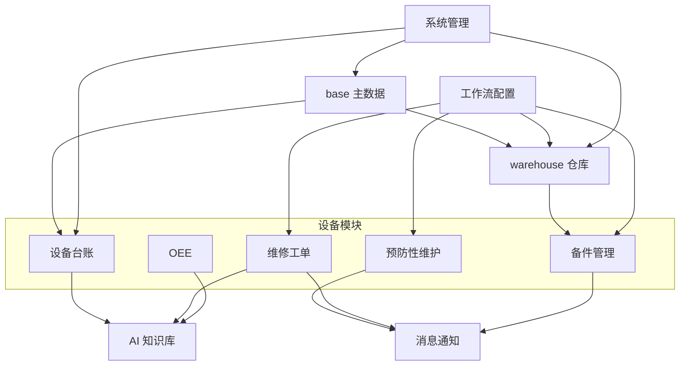
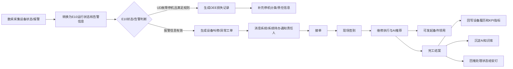
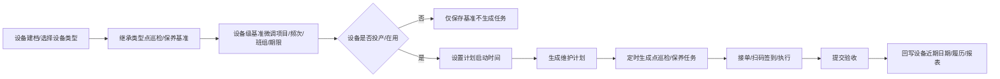

# 00. 总览与跨模块链路

## 模块目标与边界

设备管理系统覆盖设备全生命周期管理，核心模块包括设备主数据与生命周期、预防性维护、故障维修、OEE/KPI、备件、AI 知识库、设备预警事件、报表与系统管理。消息发送、订阅、已读未读和逐级上报由公共消息模块承接。

本文件不展开页面字段细节，重点沉淀跨模块链路和统一状态口径，供架构设计、迭代拆分和集成测试使用。

## 标准产品口径

1. 主链路优先覆盖多数制造企业通用场景，避免将单一项目的组织、系统、时间窗口、阈值写死。
2. 外部系统统一抽象为“主数据系统、WMS/库存系统、审批/OA 系统、采购/ERP 系统、消息系统、设备数据采集系统”，具体名称作为部署配置。
3. 高级规则提供推荐默认值和可配置参数，不作为所有客户的强制流程。
4. 可选扩展必须不影响基础闭环：无外部系统时，应支持人工导入、手动回写或状态维护。
5. 凡是列表型维护、配置型维护、主数据维护页面，都必须支持模板下载、导入、导出和错误报告。
6. 每个外部依赖必须提供轻量本地闭环或明确为可选扩展，例如本地 PR/PO 状态维护、本地入库确认、本地出库确认。

## 部署边界

| 部署包 | 包含模块 | 落地口径 |
|--------|----------|----------|
| 设备核心包 | base、设备台账、预防性维护、维修工单、OEE、系统管理 | 可独立部署，满足设备基础管理、维护、维修和 OEE 闭环 |
| 备件扩展包 | 备件管理 + 轻量 warehouse 或 WMS 对接 | 备件管理如启用，必须同时启用轻量 warehouse 或对接 WMS |
| 智能扩展包 | AI 知识库与智能助手 | 独立部署，服务设备模块，不阻塞设备核心包 |
| 流程消息包 | 工作流配置、消息通知 | 可独立启用；未启用时业务模块使用默认轻量流程和系统待办 |

## 核心角色

| 角色 | 关键职责 |
|------|----------|
| 设备管理员 | 维护设备台账、设备类型、设备安装位置关联、生命周期、BOM、停机分类、设备责任人 |
| 点巡检/保养人员 | 接单、扫码签到、执行检查/保养、提交验收 |
| 维修技术员 | 接收异常工单、签到维修、填写原因措施、发起备件领用 |
| 维修主管/班组长 | 派单、转单、验收、查看 KPI |
| 备件管理员 | 管理备件台账、调拨、领用、采购、盘库、寿命预警 |
| OEE 填报员 | 维护设备损失记录、损失/停机分类、协助需求、生产指标 |
| 知识库管理员 | 维护知识条目、同步 AI、管理版本 |
| 流程管理员 | 配置审批、确认、退回、作废和逐级流转规则 |
| 系统管理员 | 维护登录账号、角色、菜单、权限、数据权限和系统配置 |
| 管理者 | 查看 OEE/KPI、故障趋势、备件风险、报表 |

## 模块分层

## 跨模块主链路

### 链路一：E10/安灯告警到维修闭环

关键规则：

1. E10 运行状态是 OEE 损失和运行分析的标准口径；安灯告警是维修工单的重要来源。
2. UD 故障停机可生成 OEE 损失记录；是否自动生成维修工单由告警信息、去重规则和客户配置共同决定。
3. 安灯告警工单状态变化后，设备模块按接口回推待派单、待接单、待签到、待完工、待评价、待结案、已完成等处理状态。
4. 异常工单完工后，维修原因、措施、停机时间进入设备履历、KPI 计算和 AI 知识沉淀。
5. 工单中发起备件领用时，领用单自动带出工单与设备信息；备件绑定后回写设备备件履历。

### 链路一补充：OEE 协助触发闭环

关键规则：

1. OEE 模块保留“是否需要其他部门协助=是”触发异常工单的能力。
2. 该规则只在 OEE 模块内体现，不作为维修模块的工单来源分类展示。
3. OEE 触发的异常工单闭环后，结果回写 OEE 损失记录、KPI 统计和下钻分析。

### 链路二：设备生命周期到预防性维护闭环

关键规则：

1. 类型基准首次新增时，为该类型下所有设备生成独立设备级基准。
2. 设备级基准可调整检查/保养项目、频次、派单班组和执行期限。
3. 未投产设备可保存基准，但默认不生成维护计划和任务。
4. 设备级基准设置计划启动时间后生成维护计划，启用计划按频次自动生成点巡检/保养任务。
5. 闲置、停用、报废、归档设备默认停止生成新任务，已生成任务按配置继续、取消或转派。
6. 点巡检或保养发现异常时，可按规则转维修工单，维修闭环后回写设备履历和统计。

### 链路三：备件库存到设备绑定和寿命预警

关键规则：

1. 备件水位由 warehouse 库存、PR/PO 在途、消耗、采购周期综合计算。
2. 库存余额、入库、出库、盘点和库存流水以 warehouse/WMS 为准。
3. 无采购/ERP 时，系统提供本地 PR/PO 状态维护和本地到货确认。
4. 无 WMS 时，系统提供轻量 warehouse 完成本地入库确认、本地出库确认和库存流水。
5. 已领用备件绑定到设备 BOM 位置后，进入“在用”状态并开始计算寿命。
6. 绑定设备的备件只能用于对应设备，换绑时旧件下线、新件上线并记录更换历史。

## 统一状态口径

| 对象 | 状态 |
|------|------|
| 设备生命周期 | 建档、待验收、已验收、已投产、在用、调拨中、闲置、改造中、停用、报废、归档 |
| E10 运行状态 | NS 无生产计划、UD 故障停机、SD 计划停机、EN 工程试验、SB 设备待机、PT 正常生产 |
| 点巡检/保养任务 | 待接单、待执行、执行中、待验收、已完成、已逾期 |
| 维修工单 | 待派单、待接单、待签到/待执行、处理中、待结案/已完成 |
| 备件领用单 | 草稿、待出库、已出库、出库失败、作废 |
| 备件采购申请 | 草稿/待提交、审批中、已通过、已驳回、已生成 PR |
| PMC 调拨申请 | 草稿/待提交、审批中、已通过、待入库、已入库 |
| 知识条目 | 未同步、已同步、同步失败、变更后待同步 |
| 工作流实例 | 待处理、处理中、已完成、已驳回、已撤回、已作废 |
| 仓库出入库单 | 草稿、待入库/待出库、已入库/已出库、失败、作废 |

## 统一验收口径

1. 任一自动生成类流程必须可追溯来源记录、生成时间、生成规则和生成结果。
2. 任一状态流转必须记录操作人、操作时间、前后状态、备注或原因。
3. 任一跨系统集成必须明确主数据来源、回写字段、失败重试与人工补偿方式。
4. 任一指标看板必须明确数据范围、时间口径、过滤条件、是否排除作废/取消数据。
5. 任一设备相关业务必须引用设备编号和设备安装位置，不允许重复维护工厂、车间、产线、工序字段。
6. 任一人工修正 E10 状态、停机时间、损失分类或指标口径的动作必须保留原始值和修正原因。

## 待澄清与迭代事项

1. 维修工单是否需要独立“待结案”状态，需结合现有接口和用户操作手册确认。
2. 移动端离线能力未纳入当前范围，如现场网络不稳定需单独立项。
3. 预防性维护任务“已逾期”作为独立状态还是状态标签，需要实现时统一。
