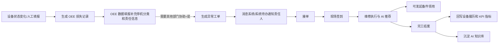

# 00. 总览与跨模块链路

## 模块目标与边界

设备管理系统覆盖设备全生命周期管理，核心模块包括设备资产、预防性维护、故障维修、OEE/KPI、备件、AI 知识库、预警通知、报表与系统管理。

本文件不展开页面字段细节，重点沉淀跨模块链路和统一状态口径，供架构设计、迭代拆分和集成测试使用。

## 标准产品口径

1. 主链路优先覆盖多数制造企业通用场景，避免将单一项目的组织、系统、时间窗口、阈值写死。
2. 外部系统统一抽象为“库存系统、审批系统、采购/ERP 系统、消息系统、设备数据采集系统”，具体名称作为部署配置。
3. 高级规则提供推荐默认值和可配置参数，不作为所有客户的强制流程。
4. 可选扩展必须不影响基础闭环：无外部系统时，应支持人工导入、手动回写或状态维护。

## 核心角色

| 角色 | 关键职责 |
|------|----------|
| 设备管理员 | 维护设备台账、设备类型、BOM、停机分类、设备责任人 |
| 点巡检/保养人员 | 接单、扫码签到、执行检查/保养、提交验收 |
| 维修技术员 | 接收异常工单、签到维修、填写原因措施、发起备件领用 |
| 维修主管/班组长 | 派单、转单、验收、查看 KPI |
| 备件管理员 | 管理备件台账、调拨、领用、采购、盘库、寿命预警 |
| OEE 填报员 | 维护设备损失记录、停机分类、协助需求、生产指标 |
| 知识库管理员 | 维护知识条目、同步 AI、管理版本 |
| 管理者 | 查看 OEE/KPI、故障趋势、备件风险、报表 |

## 跨模块主链路

### 链路一：设备状态/OEE 停机到维修闭环

关键规则：

1. OEE 损失记录是异常工单的重要来源，只有填报时选择“是否需要其他部门协助=是”才触发工单。
2. 异常工单完工后，维修原因、措施、停机时间进入设备履历、KPI 计算和 AI 知识沉淀。
3. 工单中发起备件领用时，领用单自动带出工单与设备信息；备件绑定后回写设备备件履历。

### 链路二：预防性维护标准到任务闭环

关键规则：

1. 类型基准首次新增时，为该类型下所有设备生成独立设备级基准。
2. 设备级基准可调整检查/保养项目、频次、派单班组和执行期限。
3. 设备级基准设置计划启动时间后生成维护计划，启用计划按频次自动生成点巡检/保养任务。
4. 暂停计划后停止生成新任务，已生成任务继续执行和验收。
5. 点巡检或保养发现异常时，可按规则转维修工单，维修闭环后回写设备履历和统计。

### 链路三：备件库存到设备绑定和寿命预警

关键规则：

1. 备件水位由库存、在途、消耗、采购周期综合计算。
2. 已领用备件必须绑定到设备 BOM 位置后，才进入“在用”状态并开始计算寿命。
3. 绑定设备的备件只能用于对应设备，换绑时旧件下线、新件上线并记录更换历史。

## 统一状态口径

| 对象 | 状态 |
|------|------|
| 点巡检/保养任务 | 待接单、待执行、执行中、待验收、已完成、已逾期 |
| 异常维修工单 | 待派单、待接单、待签到/待执行、处理中、待结案/已完成 |
| 备件领用单 | 未出库、已出库、作废 |
| 备件采购申请 | 草稿/待提交、审批中、已通过、已驳回、已生成 PR |
| PMC 调拨申请 | 草稿/待提交、审批中、已通过、待入库、已入库 |
| 知识条目 | 未同步、已同步、同步失败、变更后待同步 |

## 统一验收口径

1. 任一自动生成类流程必须可追溯来源记录、生成时间、生成规则和生成结果。
2. 任一状态流转必须记录操作人、操作时间、前后状态、备注或原因。
3. 任一跨系统集成必须明确主数据来源、回写字段、失败重试与人工补偿方式。
4. 任一指标看板必须明确数据范围、时间口径、过滤条件、是否排除作废/取消数据。

## 待澄清与迭代事项

1. 维修工单是否需要独立“待结案”状态，需结合现有接口和用户操作手册确认。
2. 移动端离线能力未纳入当前范围，如现场网络不稳定需单独立项。
3. 预防性维护任务“已逾期”作为独立状态还是状态标签，需要实现时统一。
