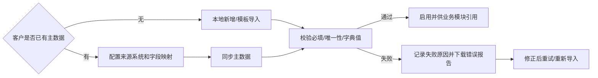
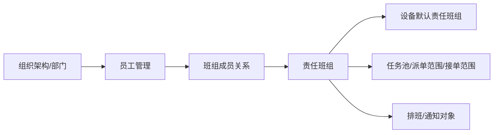

# 01. base 主数据

## 模块目标与边界

base 主数据模块按通用主数据平台思路建设，用于沉淀设备管理系统依赖的基础数据，并预留对接客户既有主数据平台、ERP、MES、SRM、HR 等系统的能力。

当前阶段优先维护设备模块有明确出口的基础数据，不追求一次性实现完整 MDM 平台。若客户已有主数据系统，base 提供同步、映射、查看和本地扩展能力；若客户没有主数据系统，base 提供本地新增、编辑、模板导入、导出和错误报告能力。

本模块不包含登录、用户、角色、菜单、权限、数据权限等系统管理能力；这些内容归 `系统管理` 模块。设备类型、设备组等设备专属配置归设备台账模块；OEE 损失/停机分类归 OEE 模块。

## 推荐层级结构

| 一级域 | 二级能力 | 当前口径 |
|--------|----------|----------|
| 工厂建模 | 工厂、车间、产线、工段、工位/位置 | 必做，供设备台账、OEE、维修、报表引用 |
| 生产关系 | 班组管理、班次管理、排班计划、制造日历 | 必做基础版，供 OEE、任务计划和统计口径引用 |
| 物料主数据 | 物料编码、物料名称、规格型号、单位、物料分类 | 设备备件启用时必做 |
| 物料管理 | 物料状态、物料类型、库存策略引用 | 先支撑备件和 warehouse，不做完整物料平台 |
| 设备管理基础数据 | 轻量设备清单、设备位置引用 | 仅用于无设备模块部署时的轻量引用；启用设备模块后以设备台账为准 |
| 工艺管理 | 工序列表、工序资源、工艺路线 | 先支撑 OEE 工序、设备、产线关系 |
| BOM 管理 | 物料 BOM、制造 BOM | 先保留结构和接口，设备 BOM 仍归设备台账 |
| 合作伙伴 | 客户管理、供应商管理 | 供应商优先，客户作为扩展 |
| 员工管理 | 员工基础信息、部门、岗位、班组关系 | 供责任人、班组、排班和通知对象引用；账号权限归系统管理 |
| 主数据接入 | 来源系统、字段映射、同步记录、失败重试 | 有客户主数据时必做 |

## 页面清单

| 页面 | 主要能力 | MVP 口径 |
|------|----------|----------|
| 工厂建模 | 工厂、车间、产线、工段、工位/位置维护 | 必做 |
| 生产关系 | 班组、班次、排班计划、制造日历维护 | 必做 |
| 物料主数据 | 物料、物料分类、单位、物料类型维护或同步 | 备件启用时必做 |
| 工艺管理 | 工序列表、工序资源、工艺路线维护 | OEE 启用时必做 |
| BOM 管理 | 物料 BOM、制造 BOM 查询/维护 | 增强，当前先建结构 |
| 合作伙伴 | 客户、供应商维护或同步 | 供应商必做，客户增强 |
| 员工管理 | 员工、部门、岗位、班组关系维护或同步 | 必做 |
| 轻量设备基础数据 | 设备编码、名称、位置、负责人 | 无设备模块时可用 |
| 主数据同步配置 | 来源系统、字段映射、同步策略、启用状态 | 有外部主数据时必做 |
| 主数据同步记录 | 外部同步结果、失败原因、重试记录 | 有外部主数据时必做 |

## 主业务流程

## 主数据接入模式

| 模式 | 适用场景 | 系统能力 |
|------|----------|----------|
| 客户主数据对接模式 | 客户已有 MDM/ERP/MES/SRM/HR | 字段映射、全量同步、增量同步、同步日志、失败重试、本地扩展字段 |
| 本系统维护模式 | 客户没有统一主数据 | 单条新增、编辑、删除校验、模板下载、批量导入、导出、错误报告 |
| 混合模式 | 部分主数据外部同步，部分本地维护 | 按主数据类型配置权威来源，避免同一字段多头维护 |

规则：

1. 主数据类型必须配置权威来源：客户系统、本系统或混合模式。
2. 外部主数据同步时，必须保留外部编码、外部名称、来源系统、同步批次和最近同步时间。
3. 外部同步字段不允许在 EAM 直接覆盖；EAM 只允许维护业务扩展字段，如默认责任人、启用范围、展示排序。
4. 无外部系统时，所有主数据维护页面必须支持模板下载、导入、导出和错误报告。
5. 同一主数据编码必须唯一；已被业务引用的数据不允许物理删除，只允许停用。
6. 停用后的主数据历史记录继续展示，新业务不可选择。
7. 同步失败必须记录来源系统、同步批次、失败字段、失败原因和处理状态，并支持人工重试。

### 责任班组规则

责任班组属于 base 主数据，来源于生产关系中的班组管理和员工管理中的部门、岗位、班组关系。设备台账、预防性维护、维修工单和 OEE 只引用责任班组，不在设备模块内维护班组成员。

规则：

1. 班组用于任务池、派单范围、接单范围、排班和通知对象，不直接等同于组织架构节点。
2. 设备台账可引用一个默认责任班组，作为维修、预防性维护和 OEE 异常的默认派单池。
3. 客户已有 HR、MES 或主数据系统时，班组、成员和班组负责人可通过主数据同步接入。
4. 无外部系统时，班组管理和员工班组关系支持本地维护，并支持模板下载、导入、导出和错误报告。
5. 班组停用后历史任务继续展示，新设备、新计划和新工单不可再选择该班组。

## 当前设备模块出口

| 主数据类型 | 设备模块出口 | 当前是否必须 |
|------------|--------------|--------------|
| 工厂/车间/产线/工段/位置 | 设备台账归属、OEE 筛选、维修筛选、报表统计 | 是 |
| 班组/班次/制造日历 | OEE 班次判断、预防性维护任务计划、默认责任班组、统计时间口径 | 是 |
| 员工/部门/岗位/班组关系 | 设备负责人、维修责任人、通知对象、排班 | 是 |
| 工序/工序资源/工艺路线 | OEE 工序分析、设备与产线关系 | OEE 启用时必做 |
| 物料/单位/物料分类 | 备件台账、warehouse 库存、采购建议 | 备件启用时必做 |
| 供应商 | 设备采购信息、备件采购、备件台账 | 备件/采购启用时必做 |
| 客户 | 暂无设备核心出口 | 增强 |
| 物料 BOM/制造 BOM | 后续与工艺、生产、物料联动 | 增强 |
| 轻量设备基础数据 | 无设备模块时供 OEE/维修轻量引用 | 可选 |

## 页面字段清单

| 页面 | 字段/控件 | 类型 | 必填 | 来源/规则 |
|------|-----------|------|------|-----------|
| 工厂建模 | 编码、名称、上级节点、层级类型、启用状态 | 表单/导入 | 是 | 层级类型包括工厂/车间/产线/工段/位置 |
| 班组管理 | 班组编码、班组名称、负责人、成员、启用状态 | 表单/导入 | 是 | 员工来自员工管理 |
| 班次管理 | 班次编码、名称、开始时间、结束时间、跨天标识 | 表单/导入 | 是 | 供 OEE 和任务计划引用 |
| 排班计划 | 日期、班组、班次、适用组织、状态 | 表单/导入 | 是 | 支持按周期生成 |
| 制造日历 | 日期、工作日/休息日、班次、适用组织 | 日历/导入 | 是 | 用于计划和统计 |
| 物料主数据 | 物料编码、名称、规格型号、单位、分类、物料类型、启用状态 | 表单/导入/同步 | 是 | 备件启用时必须可用 |
| 工序列表 | 工序编码、工序名称、所属组织、排序、启用状态 | 表单/导入 | 是 | OEE 启用时必须可用 |
| 工序资源 | 工序、资源类型、资源编码、资源名称、启用状态 | 表单/导入 | 否 | 可关联设备或产线 |
| 工艺路线 | 路线编码、路线名称、工序顺序、启用状态 | 表单/导入 | 否 | 增强能力 |
| 合作伙伴 | 编码、名称、类型、联系人、电话、启用状态 | 表单/导入/同步 | 否 | 类型包括客户/供应商 |
| 员工管理 | 员工编码、姓名、部门、岗位、班组、手机号、邮箱、启用状态 | 表单/导入/同步 | 是 | 账号登录归系统管理 |
| 主数据同步配置 | 主数据类型、来源系统、字段映射、同步方式、同步频率、启用状态 | 表单 | 外部模式必填 | 支持全量/增量 |
| 同步记录 | 来源系统、同步对象、批次号、同步时间、结果、失败原因 | 列表 | 外部模式必填 | 可重试 |

## 跨模块联动

1. 设备台账引用工厂建模、员工、合作伙伴和轻量主数据，不从 base 获取设备类型、设备组和停机/损失分类。
2. OEE 引用工厂建模、生产关系、工艺管理和设备台账；损失/停机分类在 OEE 模块内配置。
3. 预防性维护引用设备台账、员工/班组、制造日历和业务配置。
4. 维修工单引用设备台账、员工/部门/班组、消息通知和工作流。
5. 备件管理引用物料主数据、单位、供应商、员工和 warehouse 库存。
6. warehouse 引用物料主数据、单位、仓库相关配置和员工。
7. 系统管理的数据权限可引用组织、产线、设备、仓库等业务主数据，但权限配置本身不放在 base。

## 验收口径

1. 客户已有主数据系统时，base 能配置来源系统和字段映射，并同步主数据。
2. 客户无主数据系统时，base 能本地新增、编辑、导入和导出主数据。
3. 所有主数据导入失败时可下载错误报告，错误需包含行号、字段和原因。
4. 外部同步字段在 EAM 中不可直接覆盖，本地扩展字段可维护。
5. 被设备、工单、库存、备件或计划引用的主数据不能物理删除。
6. 停用主数据后，历史单据能正常展示，新建业务单据不可选择。
7. 设备模块启用所需的工厂建模、员工、班次/制造日历等基础数据可独立维护。

## 待澄清与迭代事项

1. 【待确认】客户主数据系统的接口方式是 API、数据库视图、文件导入还是消息订阅。
2. 【待确认】员工主数据与系统登录账号是否来自同一身份源；当前建议员工归 base，账号权限归系统管理。
3. 【待确认】物料 BOM、制造 BOM 当前是否只建结构，还是需要在第一版支撑生产/工艺完整闭环。
