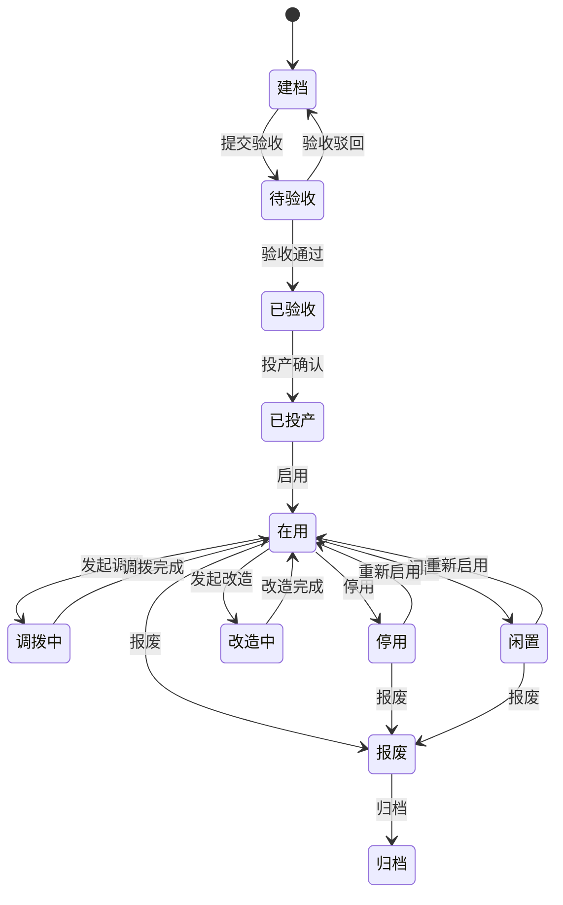

# 01. 设备主数据与生命周期管理

## 模块目标与边界

设备主数据与生命周期管理负责设备唯一身份、设备类型、设备安装位置、责任关系、设备 BOM、二维码、生命周期履历、运行状态履历和设备详情聚合。它是点巡检、保养、维修、备件、OEE/KPI、AI 知识沉淀和报表分析的基础维度来源。

本模块不维护生产参数、产能目标、OEE 目标、完整财务折旧、采购执行流程和数采平台建设。设计 PPM、实际 PPM、OEE 目标等生产/指标参数归入 OEE 与 KPI 模块的产能配置。

## 页面清单

| 页面 | 主要能力 |
|------|----------|
| 设备台账 | 新增、导入、导出、删除校验、二维码下载、层级位置筛选、条件查询、近期维护日期展示 |
| 设备详情 | 基本信息、生命周期履历、BOM、点巡检履历、保养履历、维修/故障履历、备件履历、运行状态履历、操作日志 |
| 设备类型 | 设备类型维护、类型级停机分类维护、类型级默认责任规则 |
| 设备 BOM | 维护设备部件结构、备件位置、理论寿命、图片和备注 |
| 设备生命周期履历 | 展示建档、验收、投产、调拨、闲置、改造、停用、报废、归档等节点 |
| 设备运行状态履历 | 展示 E10 状态变化、来源、持续时间和人工修正记录 |
| 设备责任配置 | 维护负责人、维修责任班组、保养责任班组、停机/异常默认责任人 |
| 设备停机分类 | 单设备停机分类维护，覆盖或细化类型默认分类 |

## 主业务流程

### 设备建档流程

1. 设备管理员新增设备或下载模板批量导入。
2. 系统校验设备编号唯一性、必填字段、引用主数据是否存在。
3. 保存设备身份、类型、安装位置、责任关系、管理属性、图片、附件和扩展属性。
4. 系统生成设备二维码，用于移动端扫码查看设备信息和现场签到；扫码设备类型不限定，可按项目选择 PDA、手机或扫码枪。
5. 新建设备默认进入“建档”生命周期状态。
6. 未投产设备可维护资料和 BOM，但默认不参与 OEE 统计，不自动生成点巡检/保养任务。

### 设备生命周期流程

标准产品采用轻量生命周期流程，默认不强制审批，但所有状态变更必须留痕。客户需要强管控时，可启用审批配置。



生命周期节点记录字段：

| 字段 | 说明 |
|------|------|
| 节点类型 | 建档、到货验收、试运行验收、投产验收、投产、调拨、闲置、改造、停用、报废、归档 |
| 变更前状态 | 生命周期变更前状态 |
| 变更后状态 | 生命周期变更后状态 |
| 操作人 | 发起或确认状态变更的用户 |
| 操作时间 | 状态变更时间 |
| 原因/说明 | 状态变更原因、验收结论或补充说明 |
| 附件 | 验收单、调拨单、报废单、改造资料等 |
| 审批单号 | 启用审批或外部流程时记录，可选 |

### 状态与业务联动流程

设备状态必须驱动业务动作，不能只作为静态展示字段。

| 状态/事件 | 联动规则 |
|-----------|----------|
| 建档 | 可维护基础信息、附件、BOM；默认不参与 OEE，不自动生成维护任务 |
| 已验收 | 可继续补充投产信息；验收记录进入生命周期履历 |
| 已投产/在用 | 可生成点巡检/保养计划，可创建维修工单，可参与 OEE 和 KPI 统计 |
| 调拨中 | 暂停新建自动维护计划；已生成任务按配置继续、转派或取消 |
| 闲置/停用 | 默认不生成新的点巡检/保养任务，不参与 OEE 统计；是否允许手动维修/保养作为配置项 |
| 改造中 | 暂停生产相关统计，可记录改造、专项维修和附件 |
| 报废/归档 | 禁止新建点巡检、保养、维修、备件绑定和 OEE 损失；历史履历只读可查 |
| 维修工单处理中 | 设备维护状态可自动标记为“维修中”；工单完成后恢复原使用状态，或按维修结果变更为停用/报废 |
| 点巡检/保养异常 | 可标记设备存在维护风险，并按配置转维修工单 |
| E10=UD 故障停机 | 可生成 OEE 损失记录，并按配置触发维修工单 |
| E10=SD 计划停机 | 可关联保养、计划检修、换线等计划原因，不自动视为故障 |
| E10=NS 无生产计划 | 不等于设备停用，不计入计划生产损失 |
| E10=PT 正常生产 | 可作为 OEE 有效运行时间来源 |

### 设备安装位置选择流程

1. 设备台账表单只维护“设备安装位置”一个字段。
2. 设备安装位置关联工厂建模主数据节点，即工厂实例中的工厂、车间、产线、工序/工段、区域等层级节点。
3. 用户通过同一个层级选择组件选择位置。
4. 标准产品允许绑定到任意层级，推荐生产设备绑定到最小可管理节点。
5. OEE、点巡检、保养、维修和报表中的工厂/车间/产线/工序筛选，均从设备安装位置路径反查，不在设备台账重复维护。

示例：

```text
设备安装位置 *
[ 选择位置 ]

已选：一厂 / SMT车间 / SMT-01线 / 印刷工序

层级选择：
一厂
├─ SMT车间
│  ├─ SMT-01线
│  │  ├─ 印刷工序
│  │  ├─ 贴片工序
│  │  └─ 回流焊工序
│  └─ SMT-02线
└─ 组装车间
   └─ 组装-01线
```

### 停机分类维护流程

1. 在设备类型上维护默认多级停机分类。
2. 可一键同步到该设备类型下所有设备。
3. 单台设备可维护设备级停机分类，用于覆盖或细化类型级默认值。
4. OEE 填报和维修工单引用设备级分类；设备级无配置时引用设备类型级分类。
5. 停机分类是损失原因和维修归因口径，不参与预防性维护的计划生成、任务生成、接单、执行或验收。

## 状态口径

设备模块同时存在生命周期状态、使用状态、维护状态和 E10 运行状态，不允许混为一个“设备状态”字段。

| 状态类型 | 示例 | 维护来源 | 用途 |
|----------|------|----------|------|
| 生命周期状态 | 建档、待验收、已投产、调拨中、报废 | 设备生命周期流程 | 管理设备从建档到归档 |
| 使用状态 | 启用、停用、闲置、报废 | 生命周期或人工维护 | 控制是否允许被新业务引用 |
| 维护状态 | 正常、维修中、维护风险 | 维修、点巡检、保养联动 | 快速识别当前维护风险 |
| E10 运行状态 | NS、UD、SD、EN、SB、PT | 自动采集优先，人工修正兜底 | 服务 OEE、停机分析和维修触发 |

E10 运行状态字典：

| E10 | 英文 | 中文 | 标品用途 |
|-----|------|------|----------|
| NS | Non Scheduled Time | 无生产计划 | 不纳入计划生产损失 |
| UD | Unscheduled Downtime | 故障停机 | 计划外停机，可触发 OEE 损失和维修 |
| SD | Scheduled Downtime | 计划停机 | 关联保养、计划检修、换线等计划原因 |
| EN | Engineering Time | 工程试验 | 记录调试、验证、工程测试 |
| SB | Standby Time | 设备待机 | 分析等待、待料、资源利用 |
| PT | Productive Time | 正常生产 | 作为有效生产时间来源 |

E10 来源规则：

1. 自动采集优先，来源包括数采、安灯、MES/OEE 接口。
2. 无数采客户允许人工新增运行状态记录。
3. 人工可修正自动采集状态，但必须记录原始状态、修正后状态、修正原因、修正人和修正时间。
4. 自动记录与人工修正冲突时，保留原始采集记录，统计采用经确认后的有效记录。

## 字段与数据规则

1. 设备编号全局唯一，是设备二维码、点巡检、保养、维修、备件绑定、OEE 和报表统计的核心关联键。
2. 设备台账主表只放高频维护、高频查询、高价值统计维度字段。
3. 设备安装位置来自工厂建模主数据，不在台账重复维护工厂、车间、产线、工序/工段字段。
4. 标准产品保留“是否生产设备”为核心字段；是否参与 OEE、计划达成率和生产损失统计由该字段和 OEE 配置共同决定。
5. 计量设备、特种设备等行业特性通过扩展属性模板启用，不做固定主字段。
6. 最近点检日期、最近巡检日期、最近保养日期、最近维修日期、下次点检日期、下次保养日期来自业务模块自动回写或实时聚合，不允许在台账手工编辑。
7. 设计 PPM、实际 PPM、OEE 目标、产能目标等生产参数不进入设备台账，统一归 OEE/产能配置。
8. 删除设备前必须检查关联业务数据；存在点巡检计划、保养任务、维修工单、备件绑定等记录时阻止删除，建议通过停用、报废或归档处理。

## 履历 Tab 规则

| Tab | 数据来源 | 规则 |
|-----|----------|------|
| 基本信息 | 设备台账 | 展示设备建档字段、附件、扩展属性 |
| 生命周期履历 | 生命周期流程、验收记录、外部审批记录 | 建档、验收、投产、调拨、闲置、改造、停用、报废、归档统一展示 |
| 设备 BOM | 设备详情维护 | 部件可为普通部件或备件；备件需关联备件台账 |
| 点巡检履历 | 点检/巡检任务 | 展示任务、计划时间、完成时间、异常项、漏检项 |
| 保养履历 | 保养任务 | 展示任务、计划时间、完成时间、异常项、使用备件 |
| 维修/故障履历 | 维修工单 | 展示工单闭环记录、故障原因、处理措施、停机时长 |
| 备件履历 | 备件使用绑定 | 记录领用、绑定、解绑、换绑、寿命起算 |
| 运行状态履历 | E10 状态采集、人工修正 | 展示状态、来源、开始时间、结束时间、持续时间、修正记录 |
| 操作日志 | 系统日志 | 记录新增、修改、删除、同步等操作，关键字段支持前后值 |

验收履历不再作为独立 Tab；到货验收、试运行验收、投产验收等统一进入生命周期履历。

## 页面字段清单

### 新增/编辑设备

| 分组 | 字段 | 类型 | 必填 | 来源/规则 |
|------|------|------|------|-----------|
| 身份识别 | 设备编号 | 文本 | 是 | 全局唯一，保存和导入时校验 |
| 身份识别 | 设备名称 | 文本 | 是 | 页面主展示名称 |
| 身份识别 | 设备型号 | 文本 | 否 | 技术属性，不可作为唯一编号 |
| 身份识别 | 设备类型 | 选择 | 是 | 来自设备类型主数据 |
| 身份识别 | 设备类型编码 | 选择反显 | 是 | 选择设备类型后反显 |
| 身份识别 | 设备二维码 | 系统生成 | 否 | 保存后生成 |
| 位置与责任 | 设备安装位置 | 层级选择 | 是 | 关联工厂建模主数据节点，建议绑定到最小可管理节点 |
| 位置与责任 | 所属部门 | 部门选择 | 否 | 资产或管理归属部门 |
| 位置与责任 | 负责人 | 用户选择 | 否 | 默认设备管理责任人 |
| 位置与责任 | 维修责任班组 | 组织选择 | 否 | 默认维修派单或通知对象 |
| 位置与责任 | 保养责任班组 | 组织选择 | 否 | 默认保养任务派单对象 |
| 管理属性 | 设备等级 | 下拉 | 否 | 关键/重要/一般，用于差异化管理 |
| 管理属性 | 是否生产设备 | 开关 | 是 | 用于判断是否参与 OEE/产能相关业务 |
| 管理属性 | 生命周期状态 | 状态 | 是 | 系统维护，默认建档 |
| 管理属性 | 使用状态 | 下拉/状态 | 是 | 启用、停用、闲置、报废等 |
| 管理属性 | 启用状态 | 开关 | 是 | 控制是否允许被新业务引用 |
| 管理属性 | 数采编号 | 文本/选择 | 否 | 对接设备状态采集系统时使用 |
| 采购与来源 | 资产编号 | 文本 | 否 | 外部资产系统编号，非财务核算口径 |
| 采购与来源 | 制造商 | 文本/供应商选择 | 否 | 可关联供应商主数据 |
| 采购与来源 | 供应商 | 选择 | 否 | 供应商主数据 |
| 采购与来源 | 供应商电话 | 文本 | 否 | 选择供应商后可反显 |
| 采购与来源 | 生产日期 | 日期 | 否 | 设备出厂生产日期 |
| 采购与来源 | 出厂编号 | 文本 | 否 | 制造商出厂编号 |
| 采购与来源 | 购置时间 | 日期 | 否 | 用于资产生命周期分析 |
| 采购与来源 | 投产时间 | 日期 | 否 | 投产确认后记录 |
| 附件资料 | 设备图片 | 图片上传 | 否 | 支持预览，限制格式和大小 |
| 附件资料 | 附件列表 | 文件上传表格 | 否 | 说明书、技术资料、验收附件等 |
| 扩展属性 | 扩展属性 | 子表 | 否 | 字段：属性名称、属性值；按设备类型或标签配置 |
| 备注 | 备注 | 多行文本 | 否 | 通用备注 |

### 设备台账列表

| 字段/控件 | 类型 | 必填 | 来源/规则 |
|-----------|------|------|-----------|
| 左侧设备安装位置树 | 树形筛选 | 否 | 来自工厂建模主数据，用于按位置路径过滤设备 |
| 设备编号 | 查询条件/列表字段 | 否 | 支持精确或模糊查询 |
| 设备名称 | 查询条件/列表字段 | 否 | 支持模糊查询 |
| 设备型号 | 查询条件/列表字段 | 否 | 来自设备基础信息 |
| 设备类型 | 查询条件/列表字段 | 否 | 来自设备类型主数据 |
| 设备安装位置 | 查询条件/列表字段 | 否 | 展示完整路径，如“一厂 / SMT车间 / SMT-01线 / 印刷工序” |
| 设备等级 | 查询条件/列表字段 | 否 | 关键/重要/一般 |
| 当前运行状态 | 列表字段 | 否 | E10 当前有效状态 |
| 生命周期状态 | 查询条件/列表字段 | 否 | 建档、在用、闲置、报废等 |
| 使用状态 | 查询条件/列表字段 | 否 | 启用、停用、闲置、报废等 |
| 最近点检日期 | 列表字段 | 否 | 最近一次已完成点检任务完成时间 |
| 最近巡检日期 | 列表字段 | 否 | 最近一次已完成巡检任务完成时间 |
| 最近保养日期 | 列表字段 | 否 | 最近一次已完成保养任务完成时间 |
| 最近维修日期 | 列表字段 | 否 | 最近一次已完成维修工单完工时间 |
| 下次点检日期 | 列表字段 | 否 | 启用点检计划中的最近下次任务时间 |
| 下次保养日期 | 列表字段 | 否 | 启用保养计划中的最近下次任务时间 |
| 负责人 | 查询条件/列表字段 | 否 | 用户主数据 |
| 操作 | 按钮组 | 否 | 详情、编辑、删除校验、生命周期、停机分类、下载二维码 |

列表展示示例：

| 设备编号 | 设备名称 | 设备类型 | 设备安装位置 | 设备等级 | 当前运行状态 | 最近点检 | 最近保养 | 最近维修 | 负责人 |
|----------|----------|----------|--------------|----------|--------------|----------|----------|----------|--------|
| EQ-SMT-001 | 印刷机1号 | 印刷机 | 一厂 / SMT车间 / SMT-01线 / 印刷工序 | 关键 | PT 正常生产 | 2026-06-03 | 2026-05-28 | 2026-05-20 | 张三 |

### 设备类型与停机分类

| 页面 | 字段/控件 | 类型 | 必填 | 来源/规则 |
|------|-----------|------|------|-----------|
| 设备组 | 代码 | 文本 | 是 | 唯一 |
| 设备组 | 名称 | 文本 | 是 | 展示名称 |
| 设备组 | 简称 | 文本 | 否 | 可选 |
| 设备类型 | 设备类型编码 | 文本 | 是 | 唯一 |
| 设备类型 | 设备类型名称 | 文本 | 是 | 展示名称 |
| 设备类型 | 默认扩展属性模板 | 配置 | 否 | 用于计量、特种等行业字段扩展 |
| 停机分类 | 一级分类 | 树节点 | 是 | 可新增/编辑/删除 |
| 停机分类 | 二级分类 | 树节点 | 否 | 依赖一级分类 |
| 停机分类 | 三级分类 | 树节点 | 否 | 依赖二级分类 |
| 停机分类 | 是否启用 | 开关 | 是 | 停用后历史保留，新业务不可选 |
| 停机分类 | 默认责任部门/责任人 | 选择 | 否 | 可作为 OEE 填报或维修派单默认值，允许人工调整 |
| 停机分类 | 一键同步 | 操作 | 否 | 将类型级分类同步到同类型设备 |

### 设备 BOM

| 字段 | 类型 | 必填 | 来源/规则 |
|------|------|------|-----------|
| 父级部件 | 树节点 | 否 | 支持树形层级 |
| 部件类型 | 下拉 | 是 | 部件/备件；选择备件时关联备件台账 |
| 部件编码 | 文本/选择 | 是 | 备件类型时从备件台账选择并反显 |
| 部件名称 | 文本/反显 | 是 | 备件类型时由备件台账带出 |
| 部件型号 | 文本/反显 | 否 | 备件类型时由备件台账带出 |
| 制造商 | 文本/反显 | 否 | 备件类型时可由备件台账带出 |
| 数量 | 数值 | 是 | 支持小数或整数按物料单位配置 |
| 单位 | 下拉/反显 | 是 | 备件类型时由备件台账带出 |
| 理论寿命-时间 | 数值+单位 | 否 | 如天、月、年，用于寿命预警 |
| 理论寿命-产量/次数 | 数值+单位 | 否 | 如 EA、次，用于寿命预警 |
| 部件图片 | 图片上传 | 否 | 用于安装识别 |
| 备注 | 文本 | 否 | 可选 |

## 跨模块联动

1. 设备台账向 OEE 提供设备编号、设备名称、设备类型、设备安装位置、是否生产设备、负责人和停机分类，不提供 PPM/OEE 目标。
2. 设备安装位置向 OEE、点巡检、保养、维修和报表提供工厂、车间、产线、工序等反查维度。
3. 设备 BOM 向备件绑定和寿命计算提供安装位置和理论寿命。
4. 设备二维码向移动端点检、保养、维修签到提供现场定位依据。
5. 设备生命周期状态控制点巡检、保养、维修、备件绑定和 OEE 业务是否可新建。
6. 点巡检、巡检、保养、维修完成后，回写或聚合台账近期维护日期。
7. E10 运行状态向 OEE 损失、维修触发和运行状态履历提供基础口径。
8. 停机分类由 OEE 损失填报、维修工单和 KPI 下钻引用；预防性维护仅引用设备、基准、二维码和履历数据。

## 验收口径

1. 设备导入失败时可下载错误报告，错误需包含行号、字段、原因。
2. 新建设备默认进入建档状态，未投产前不自动生成点巡检/保养任务，不参与 OEE 统计。
3. 设备安装位置可通过层级组件选择，台账列表可展示完整路径。
4. 验收记录进入生命周期履历，不再作为独立履历页签。
5. 设备投产后，可生成点巡检/保养计划，并可被维修和 OEE 引用。
6. 闲置、停用、报废、归档设备的新业务引用按状态联动规则限制。
7. 点检、巡检、保养、维修完成后，设备台账近期维护日期可正确展示。
8. E10 状态人工修正后，可追溯原始状态、修正后状态、修正原因和修正人。
9. 设备类型停机分类一键同步后，抽查同类型设备均可引用同步后的分类。
10. 从维修工单进入设备详情时，可看到该设备历史故障/维修记录。
11. 设备 BOM 中维护理论寿命后，备件绑定模块可读取寿命规则。

## 待澄清与迭代事项

1. 生命周期变更是否需要对接外部审批系统，标准产品默认轻量留痕。
2. 调拨中、闲置、停用状态下，已生成但未完成的点巡检/保养任务是否继续执行，需作为项目配置。
3. 维修履历最终采用“维修工单自动同步”还是“手动上传为主、工单同步为辅”；标准产品推荐工单自动同步。
