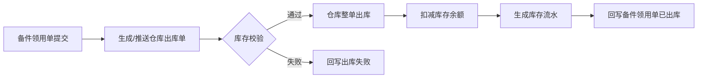

# 02. warehouse 仓库

## 模块目标与边界

warehouse 仓库模块负责仓库、库位、库存余额、入库、出库、盘点、库存流水和 WMS 对接，是库存数量和库存事务的权威来源。

备件管理只发起领用、采购建议和业务追踪，不直接扣减库存；库存实物操作、库存余额变化和盘点差异处理归 warehouse 或外部 WMS。

备件管理如启用，必须同时启用轻量 warehouse 或对接外部 WMS。无外部 WMS 时，轻量 warehouse 需支持本地入库确认、本地出库确认、库存余额和库存流水，保证备件闭环可落地。

## 页面清单

| 页面 | 主要能力 | MVP 口径 |
|------|----------|----------|
| 仓库维护 | 仓库编码、名称、类型、负责人、启用状态 | 必做 |
| 库位维护 | 库位编码、所属仓库、库位类型、启用状态 | 必做 |
| 库存余额 | 按备件、仓库、库位展示当前库存和可用库存 | 必做 |
| 入库单 | 采购到货、调拨入库、其他入库 | 无 WMS 时必做本地确认 |
| 出库单 | 备件领用出库、调拨出库、其他出库 | 无 WMS 时必做本地确认 |
| 盘点单 | 盘点任务、盘点结果、差异处理 | 可选增强 |
| 库存流水 | 入库、出库、调整、盘点差异流水 | 必做 |
| WMS 对接记录 | 出入库推送、状态同步、失败重试 | 有外部 WMS 时必做 |

## 主业务流程

### 备件领用出库流程

### 采购到货入库流程

## 状态与规则

| 对象 | 状态 | 规则 |
|------|------|------|
| 入库单 | 草稿、待入库、已入库、入库失败、作废 | 外部 WMS 模式下以 WMS 回写为准 |
| 出库单 | 草稿、待出库、已出库、出库失败、作废 | MVP 不支持部分出库 |
| 盘点单 | 草稿、盘点中、待确认、已完成、作废 | 盘点差异需确认后生成调整流水 |
| 库存流水 | 入库、出库、调拨、盘点调整、其他调整 | 所有库存变化必须有流水 |

规则：

1. 库存余额以 warehouse/WMS 为准，业务模块不直接改库存。
2. MVP 出库按整单成功或整单失败处理，不支持部分出库。
3. 不允许负库存出库；库存不足时返回失败原因。
4. 出入库失败时不生成有效库存流水，不改变库存余额。
5. 系统允许人工重试推送和同步状态，但不允许绕过 warehouse/WMS 手工改为已出库或已入库。
6. 仓库、库位停用后历史库存和流水保留，新业务不可选择。
7. 无外部 WMS 时，入库单由仓库人员本地确认后增加库存，出库单由仓库人员本地确认后扣减库存。
8. 所有仓库维护页面、入库单、出库单、盘点单和库存初始余额维护均需支持模板下载、导入、导出和错误报告。

## 页面字段清单

| 页面 | 字段/控件 | 类型 | 必填 | 来源/规则 |
|------|-----------|------|------|-----------|
| 仓库维护 | 仓库编码、仓库名称、仓库类型、负责人、启用状态 | 表单 | 是 | 编码唯一 |
| 库位维护 | 库位编码、库位名称、所属仓库、库位类型、启用状态 | 表单 | 是 | 同仓库内库位编码唯一 |
| 库存余额 | 备件编号、名称、规格、仓库、库位、当前库存、可用库存、锁定库存、更新时间 | 列表 | 是 | 库存数量来自 warehouse/WMS |
| 入库单 | 入库单号、来源单号、入库类型、仓库、入库人、入库时间、状态 | 单头 | 是 | 来源可为采购、调拨、其他 |
| 入库明细 | 备件编号、名称、规格、单位、入库数量、批号/序列号、库位 | 子表 | 是 | 数量必须大于 0 |
| 出库单 | 出库单号、来源单号、出库类型、仓库、出库人、出库时间、状态、失败原因 | 单头 | 是 | 来源可为备件领用、调拨、其他 |
| 出库明细 | 备件编号、名称、规格、单位、出库数量、批号/序列号、库位 | 子表 | 是 | 数量必须大于 0 |
| 盘点单 | 盘点单号、仓库、盘点范围、盘点人、盘点时间、状态 | 表单 | 否 | 增强能力 |
| 库存流水 | 流水号、事务类型、业务单号、仓库、库位、备件、数量、操作时间 | 列表 | 是 | 用于追溯库存变化 |

## 跨模块联动

1. 备件管理发起领用后，warehouse 创建或接收出库单，并回写出库结果。
2. 采购/ERP 回写 PR/PO 到货后，warehouse 执行入库并更新库存余额。
3. 备件台账读取 warehouse 的当前库存、可用库存、仓库库存、库位库存和库存流水。
4. 消息通知接收出库失败、入库失败、库存短缺、盘点差异等事件。
5. 工作流模块可为入库确认、出库确认、盘点差异确认、调拨申请提供审批或确认流程。

## 验收口径

1. 备件领用单提交后，warehouse 能生成或接收 1 张对应出库单。
2. 出库成功后库存余额减少，并生成出库流水。
3. 出库失败后必须回写失败原因，备件领用单不能进入已出库。
4. 入库成功后库存余额增加，并生成入库流水。
5. 库存余额、库存流水、出入库单据之间的数量能相互追溯。
6. WMS 接口失败时，系统支持重试推送和同步状态。
7. 无 WMS 时，本地入库确认、本地出库确认能驱动库存余额和库存流水变化。

## 待澄清与迭代事项

1. 【待确认】是否支持部分出库、部分入库；当前 MVP 建议整单成功或整单失败。
2. 【待确认】盘点差异是否需要审批后才允许调整库存，建议由工作流模块配置。
