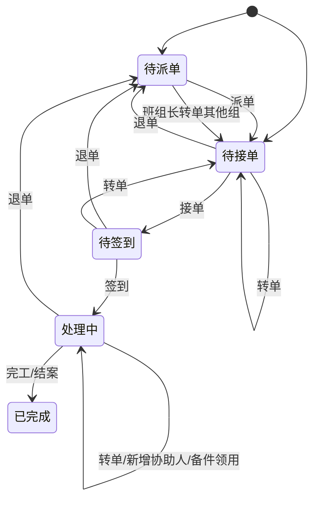

# 03. 故障维修与异常工单

## 模块目标与边界

故障维修模块处理设备异常从发现、报修、派单、接单、签到、维修、协助、备件领用到完工结案的闭环。工单来源包括 OEE 数据填报触发、手动叫修和外部告警。

## 页面清单

| 页面 | 主要能力 |
|------|----------|
| 异常处理列表 | 工单统计、状态筛选、时间/组织/设备/责任人筛选、导出 |
| 工单详情 | 基本信息、工单进度、故障原因、图片、措施、备件领用、协助记录 |
| 维修执行 WEB | AI 推荐、原因措施填写、完工、转单、退单、协助 |
| 维修执行移动端 | 待接单、待签到、扫码签到、备件领用、协助 |
| 消息通知卡片 | 待接工单通知、协助邀请、接受/拒绝；具体渠道可配置为系统消息、企业 IM、短信或邮件 |

## 工单来源与触发条件

| 来源 | 触发条件 | 初始状态 |
|------|----------|----------|
| OEE 数据填报 | 损失记录提交时选择“需要其他部门协助=是” | 待接单或待派单，取决于是否已指定责任人 |
| 手动叫修 | 用户选择设备、填写故障描述、上传图片后提交 | 待接单 |
| 外部告警/API | 数采或告警系统推送设备异常 | 待接单 |

OEE 触发时需带出设备、班次、停机开始/结束时间、停机详情、停机分类、责任部门、责任人等上下文。

停机分类在维修工单中用于故障停机归因、责任定位和后续 KPI/OEE 下钻统计；它不是维修工单的任务模板，也不驱动维修工单自动生成。工单是否生成仍由 OEE 协助标记、手动叫修或外部告警决定。

## 状态机与操作规则

操作规则：

1. 派单：由派单人或班组长指定责任人，状态进入待接单。
2. 接单：责任人确认处理，状态进入待签到/待执行。
3. 签到：责任人到现场后通过 PC 或移动端扫码签到，状态进入处理中。
4. 转单：责任人可转给其他人，工单状态不变，负责人变更并通知新负责人。
5. 退单：责任人无法处理时退回，状态回到待派单，由创建人或派单人重新派单。
6. 协助：处理中可新增协助人，协助人通过消息渠道或系统待办接受/拒绝；协助不改变主负责人。
7. 完工：填写故障原因、故障编码、处理措施、维修结果、停机结束时间、图片等信息后提交。

## 维修执行深层规则

1. 打开执行中工单时，可点击 AI 推荐。
2. AI 根据设备类型、设备名称、停机详情、故障描述、历史工单和知识库检索候选原因及措施。
3. 推荐内容按固定模板输出“故障原因 + 解决方案”，用户可采纳并写入“异常诊断故障原因”和“处理措施”字段。
4. 事件描述变更后再次点击 AI，应重新生成方案；描述未变化时点击可仅展示/隐藏推荐结果。
5. 用户采纳后仍可人工编辑，最终以用户提交内容为准。
6. 完工后，系统可根据故障原因自动分类为机械故障、电气故障等，并沉淀到知识库候选案例。

## 备件领用联动

1. 处理中工单可发起备件领用申请。
2. 备件领用单自动带入关联工单、关联设备、使用设备、领料原因。
3. 出库后备件进入待绑定状态。
4. 维修人员在备件使用记录中将备件绑定到设备 BOM 位置。
5. 绑定完成后生成设备备件履历，并开始寿命计算。

## 指标回写规则

1. MTTA：接单时间 - 工单创建时间。
2. MTTR：维修完成时间 - 接单或签到时间，企业最终口径需配置确认。
3. MTBF：设备两次故障之间的运行时间，依赖设备故障闭环和运行时间数据。
4. DT：停机结束时间 - 停机开始时间，优先取 OEE 损失记录时间。
5. 已完成且未作废工单进入 KPI 统计；退单、取消、作废不进入最终维修效率统计。

## 页面字段清单

### 工单基本信息

| 字段 | 类型 | 必填 | 来源/规则 |
|------|------|------|-----------|
| 工单编号 | 文本 | 是 | 系统自动生成，不可编辑 |
| 工单来源 | 枚举 | 是 | OEE 触发/手动叫修/外部告警 |
| 关联损失记录 | 链接 | 条件必填 | OEE 触发时必填 |
| 设备编码 | 选择/反显 | 是 | 手动创建时选择；OEE 触发时带入 |
| 设备名称 | 反显 | 是 | 设备台账 |
| 设备类型 | 反显 | 否 | 设备台账 |
| 工厂/拉线/工段/工序 | 反显 | 否 | 设备台账或 OEE 上下文 |
| 责任部门 | 选择 | 是 | 可由 OEE 填报带入或派单时指定 |
| 责任人 | 选择 | 条件必填 | 待接单可为空，派单后必填 |
| 报修/叫修人 | 反显 | 是 | 创建人 |
| 叫修时间 | 日期时间 | 是 | 工单创建时间 |
| 工单状态 | 状态 | 是 | 系统维护 |
| 紧急程度 | 下拉 | 否 | 标准产品可选字段 |
| 备注 | 多行文本 | 否 | 可选 |

### 叫修与故障信息

| 字段 | 类型 | 必填 | 来源/规则 |
|------|------|------|-----------|
| 故障描述 | 多行文本 | 是 | 手动叫修必填；OEE 触发可由停机详情带入 |
| 停机详情 | 多行文本 | 推荐 | OEE 填报带入，手动叫修可填 |
| 报警详情 | 多行文本 | 否 | 设备采集或外部告警带入 |
| 故障图片/视频 | 上传 | 否 | 支持多文件 |
| 停机开始时间 | 日期时间 | 条件必填 | OEE 触发时带入 |
| 停机结束时间 | 日期时间 | 条件必填 | 完工时可补充 |
| 停机时长 | 数值 | 否 | 根据开始/结束时间计算 |
| 停机分类一级/二级/三级 | 级联选择 | 否 | 来自设备级或类型级停机分类，用于归因和统计 |
| 是否需要其他部门协助 | 开关 | 条件必填 | OEE 触发入口使用 |

### 维修执行记录

| 字段 | 类型 | 必填 | 来源/规则 |
|------|------|------|-----------|
| 签到时间 | 日期时间 | 条件必填 | 签到后系统记录 |
| 签到方式 | 枚举 | 否 | PC 确认/移动端扫码 |
| 故障类型 | 级联选择 | 是 | 故障分类，支持 AI 辅助归类 |
| 故障编码 | 选择/文本 | 否 | 有编码体系时维护 |
| 异常诊断故障原因 | 多行文本 | 是 | 可由 AI 推荐填充，用户可编辑 |
| 处理措施 | 多行文本 | 是 | 可由 AI 推荐填充，用户可编辑 |
| 维修结果 | 枚举/文本 | 是 | 已修复/临时处理/待备件/其他 |
| 维修图片/视频 | 上传 | 否 | 维修现场证据 |
| 使用备件 | 关联表 | 否 | 关联备件领用单和使用记录 |
| 完工时间 | 日期时间 | 是 | 点击完工时系统记录或人工确认 |
| 维修耗时 | 数值 | 否 | 按 MTTR 口径计算 |

### 流转与协助记录

| 子表 | 字段 |
|------|------|
| 工单进度 | 节点名称、节点状态、操作人、操作时间、处理意见 |
| 转单记录 | 原负责人、新负责人、转单时间、转单原因、操作人 |
| 退单记录 | 退单人、退单时间、退单原因、退回对象 |
| 协助记录 | 协助人、协助部门、邀请时间、接受/拒绝状态、反馈内容 |
| 评价/结案记录 | 评价人、评价时间、评分、评价内容、结案备注 |

### AI 推荐面板

| 字段/控件 | 类型 | 必填 | 来源/规则 |
|-----------|------|------|-----------|
| 推荐触发按钮 | 按钮 | 否 | 执行中状态可用 |
| 输入上下文 | 系统组装 | 是 | 设备类型、设备名称、故障描述、停机详情、历史工单 |
| 推荐方案 | 卡片列表 | 否 | 每条包含故障原因、解决方案、参考案例 |
| 采纳 | 操作 | 否 | 将方案写入原因和措施字段 |
| 有效/无效反馈 | 操作 | 否 | 用于优化推荐质量 |
| 重新生成 | 操作 | 否 | 故障描述变化后重新生成 |

### 异常处理列表

| 字段/控件 | 类型 | 必填 | 来源/规则 |
|-----------|------|------|-----------|
| 工单总数 | 统计卡片 | 否 | 当前筛选条件下全部工单数量 |
| 待派单数量 | 统计卡片 | 否 | 工单状态=待派单 |
| 待接单数量 | 统计卡片 | 否 | 工单状态=待接单 |
| 待签到/待执行数量 | 统计卡片 | 否 | 依据产品状态口径展示 |
| 处理中数量 | 统计卡片 | 否 | 工单状态=处理中 |
| 已完成数量 | 统计卡片 | 否 | 工单状态=已完成/已结案 |
| 时间范围 | 查询条件 | 否 | 默认近 7 天或按系统配置 |
| 工厂/拉线/工段/工序 | 查询条件 | 否 | 组织和生产主数据，受数据权限控制 |
| 设备 | 查询条件 | 否 | 支持设备编号/名称 |
| 工单状态 | 查询条件 | 否 | 状态字典 |
| 故障类别一级/二级 | 查询条件 | 否 | 来自故障分类或停机分类 |
| 责任部门 | 查询条件 | 否 | 部门主数据 |
| 责任人 | 查询条件 | 否 | 用户主数据，按部门过滤 |
| 工单编号 | 列表字段 | 是 | 系统生成 |
| 设备编号/名称 | 列表字段 | 是 | 设备台账 |
| 故障描述/停机详情 | 列表字段 | 否 | OEE 或手动叫修带入 |
| 创建时间/叫修时间 | 列表字段 | 是 | 工单创建时间 |
| 责任人 | 列表字段 | 否 | 当前主负责人 |
| 工单状态 | 列表字段 | 是 | 当前状态 |
| 操作 | 按钮组 | 否 | 详情、派单、接单、转单、退单、导出 |

## 跨模块联动

1. OEE 提供停机损失上下文并触发工单。
2. 设备台账提供设备信息、责任人、停机分类和设备二维码；停机分类只作为归因和统计口径。
3. 备件模块处理维修领用、出库、绑定。
4. AI 知识库提供推荐，并接收闭环工单知识。
5. 消息系统/通知中心发送待办、协助和升级消息，具体渠道作为部署配置。

## 验收口径

1. OEE 填报选择“需要其他部门协助=是”后，责任人可收到工单通知。
2. 退单后工单回到待派单，原退单原因可追溯。
3. 转单不改变业务状态，但负责人和通知对象变更。
4. 签到必须能校验设备二维码或设备编号。
5. AI 推荐采纳后字段可编辑，完工提交后推荐采纳结果可追溯。
6. 维修工单可保存停机分类并用于列表筛选和 KPI/OEE 下钻，但停机分类本身不生成工单。

## 待澄清与迭代事项

1. 工单最终状态统一为“已完成”还是“待结案/已结案”。
2. MTTR 起点采用接单时间还是签到时间，需要作为系统配置项确认。
3. 外部告警自动创建工单的接口来源和字段范围需确认。

