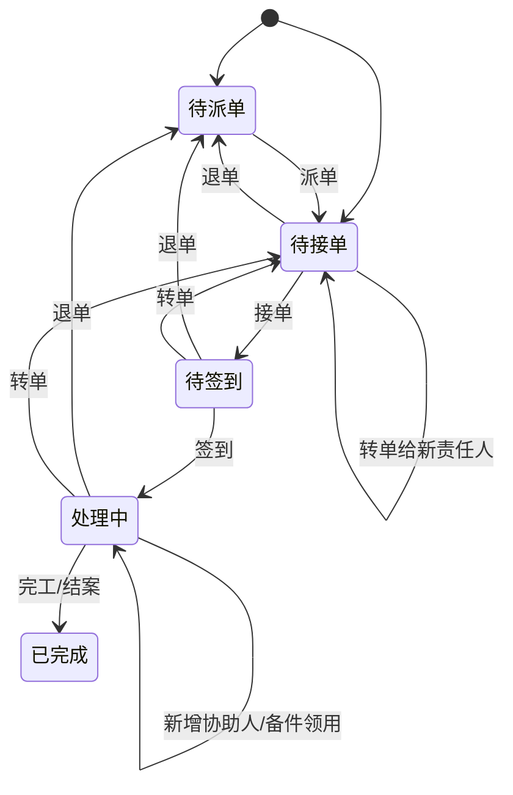

# 03. 故障维修与异常工单

## 模块目标与边界

故障维修模块处理设备异常从发现、叫修申请、派单、接单、签到、维修、协助、备件领用到完工结案的闭环。维修模块的工单来源包括安灯告警推送和手动叫修。

维修模块依赖设备主数据提供设备编号、设备安装位置、生命周期状态、使用状态、责任班组和停机分类。报废、归档设备默认禁止新建维修工单；闲置、停用设备是否允许手动叫修作为配置项。

## 页面清单

| 页面 | 主要能力 |
|------|----------|
| 异常处理列表 | 工单统计、状态筛选、时间/组织/设备/责任人筛选、导出 |
| 工单详情-信息展示 | 基本信息、工单进度、故障原因、图片、措施、备件领用、协助记录 |
| 工单详情-维修执行 | AI 推荐、原因措施填写、接单、签到、转单、派单、退单、备件领用、协助、完工 |
| 消息通知卡片 | 待接工单通知、协助邀请、接受/拒绝；具体渠道可配置为系统消息、企业 IM、短信或邮件 |

## 工单来源与触发条件

| 来源 | 触发条件 | 初始状态 |
|------|----------|----------|
| 安灯告警推送 | 数采采集设备报警后，由安灯向设备模块推送报警代码和报警消息 | 待派单 |
| 手动叫修 | 用户选择设备、填写故障描述、上传图片后提交 | 待接单 |

安灯告警推送链路为：数采采集设备报警 -> 安灯告警推送 -> 设备模块生成设备叫修/异常工单。设备模块接收安灯推送时，应保存设备标识、报警代码、报警消息、报警时间和原异常标识，用于工单详情展示、去重判断和状态回推。

### 安灯推送建单判断规则

安灯推送设备原始运行状态、报警编码和报警信息。标准产品推荐将安灯原始状态映射到 E10 运行状态后再进入 OEE/维修联动；报警编码和报警信息作为维修建单依据。

安灯状态与 E10 映射推荐：

| 安灯状态 | 推荐 E10 | 说明 |
|----------|----------|------|
| run | PT 正常生产 | 不生成新维修工单，可关闭未结束停机 |
| idle | SB 设备待机 | 不生成维修工单，仅用于等待/待机分析 |
| alarm | UD 故障停机 | 报警信息有效时可生成维修工单 |
| stop | UD 或 SD | 有报警编码/信息时按 UD 处理；无报警时按 SD/人工停机记录，不自动建维修工单 |

| 安灯原始状态 | 报警编码/报警信息 | 处理规则 |
|----------|------------------|----------|
| run | 任意 | 不生成工单；如设备存在未完成维修工单，可回填停机结束时间 |
| idle | 任意 | 不生成工单，仅记录接口日志 |
| alarm | 报警编码和报警信息均存在 | 生成待派单维修工单 |
| alarm | 报警编码或报警信息缺失 | 不生成工单，仅记录接口日志 |
| stop | 报警编码和报警信息均存在 | 生成待派单维修工单 |
| stop | 无报警编码或报警信息 | 不生成工单，仅记录接口日志，避免计划停机或人工停机误生成维修工单 |

建单和忽略规则：

1. 设备模块根据安灯推送的设备编码或设备台账数采 ID 匹配设备；匹配失败时记录日志并返回失败。
2. 匹配到的设备必须处于允许维修的生命周期状态；报废、归档设备不生成新工单，仅记录接口日志。
3. 安灯异常类型作为维修工单故障类型，分为异常大类和异常小类，不允许在维修工单中人工修改。
4. 同一设备存在未完成维修工单时，新收到的 alarm/stop 推送不再生成新工单，仅记录忽略日志，不通知、不展示。
5. 安灯生成的工单默认进入待派单，派单前需人工补充责任部门、责任人和说明等新增工单所需字段。
6. 停机开始时间、停机结束时间非必填；停机开始时间可取首次触发建单的 alarm/stop 推送时间，后续收到 run/PT 状态时可回填停机结束时间。

停机分类在维修工单中用于故障停机归因、责任定位和后续 KPI/OEE 下钻统计；它不是维修工单的任务模板，也不驱动维修工单自动生成。维修模块内工单是否生成由安灯告警推送或手动叫修决定。

## 状态机与操作规则

操作规则：

1. 派单：由派单人（退单后重新派单）或当前用户指定责任部门、责任人并填写说明，状态进入待接单。
2. 接单：责任人确认处理，状态进入待签到/待执行。
3. 签到：责任人到现场后通过 PC 或移动端扫码签到，状态进入处理中。
4. 转单：责任人可转给其他人，责任人变更后状态回到待接单，并通知新责任人重新接单。
5. 退单：责任人无法处理时退回，状态回到待派单，由创建人或派单人重新派单。
6. 协助：处理中可新增协助人，协助人通过消息渠道或系统待办接受/拒绝；协助不改变主负责人。
7. 完工：填写故障原因、故障编码、处理措施、维修结果、停机结束时间、图片等信息后提交。
8. 安灯状态回推：安灯告警工单在派单、接单、签到、完工等状态变化后，按安灯接口回推处理状态；回推失败应记录失败原因并支持重试，不阻断系统内工单流转。

设备状态联动：

1. 工单进入处理中后，设备维护状态可标记为维修中，设备详情和台账列表可展示该状态。
2. 工单完工后，系统更新设备最近维修日期。
3. 维修结果为已修复时，设备维护状态恢复正常；维修结果为临时处理、待备件或无法修复时，设备可保留维护风险标签。
4. 维修结果建议停用或报废时，不直接修改生命周期状态，应发起设备生命周期变更或由有权限人员确认。

发起人与退单处理规则：

1. 手动叫修工单的发起人为创建工单的用户；责任人退单后，工单回到待派单，待处理人回到原发起人，由原发起人重新指定责任部门和责任人。
2. 安灯告警工单由系统自动创建，发起人显示为“安灯系统”或“系统自动”，不绑定具体人员；工单默认进入待派单池，由有派单权限的维修主管、班组长或派单人补充责任部门、责任人和说明。
3. 安灯告警工单首次派单后，若责任人退单，工单回到待派单，待处理人回到上一次派单人，由上一次派单人重新派单。
4. 转单由当前责任人发起，转单后责任人变更，状态回到待接单，由新责任人重新接单。

## 维修执行深层规则

1. 打开执行中工单时，可点击 AI 推荐。
2. AI 根据设备类型、设备名称、停机详情、故障描述、历史工单和知识库检索候选原因及措施。
3. 推荐内容按固定模板输出“故障原因 + 解决方案”，用户可采纳并写入“异常诊断故障原因”和“处理措施”字段。
4. 事件描述变更后再次点击 AI，应重新生成方案；描述未变化时点击可仅展示/隐藏推荐结果。
5. 用户采纳后仍可人工编辑，最终以用户提交内容为准。
6. 完工后，系统可根据故障原因自动分类为机械故障、电气故障等，并沉淀到知识库候选案例。

## 备件领用联动

1. 处理中工单可发起备件领用申请。
2. 备件领用单自动带入关联工单、关联设备、使用设备、领料原因。
3. 出库后备件进入待绑定状态。
4. 维修人员在备件使用记录中将备件绑定到设备 BOM 位置。
5. 绑定完成后生成设备备件履历，并开始寿命计算。

## 指标回写规则

1. MTTA：接单时间 - 工单创建时间。
2. MTTR：维修完成时间 - 接单或签到时间，企业最终口径需配置确认。
3. MTBF：设备两次故障之间的运行时间，依赖设备故障闭环和运行时间数据。
4. DT：停机结束时间 - 停机开始时间，优先取 OEE 损失记录时间。
5. 已完成且未作废工单进入 KPI 统计；退单、取消、作废不进入最终维修效率统计。

## 页面字段清单

### 工单基本信息

| 字段 | 类型 | 必填 | 来源/规则 |
|------|------|------|-----------|
| 工单编号 | 文本 | 是 | 系统自动生成，不可编辑 |
| 工单来源 | 枚举 | 是 | 安灯告警推送/手动叫修 |
| 关联损失记录 | 链接 | 否 | OEE 模块触发协助工单时可关联，用于统计回写 |
| 设备编码 | 选择/反显 | 是 | 手动创建时选择；安灯告警推送时按设备标识匹配 |
| 设备名称 | 反显 | 是 | 设备台账 |
| 设备类型 | 反显 | 否 | 设备台账 |
| 设备安装位置 | 反显 | 否 | 设备主数据完整位置路径 |
| 生命周期状态 | 反显 | 否 | 报废/归档时默认禁止新建 |
| 责任部门 | 选择 | 是 | 可由设备责任配置带入或派单时指定 |
| 责任人 | 选择 | 条件必填 | 待接单可为空，派单后必填 |
| 报修/叫修人 | 反显 | 是 | 手动叫修为创建人；安灯告警为“安灯系统”或“系统自动” |
| 派单人 | 反显 | 条件必填 | 派单操作人；安灯告警首次派单后记录，用于退单回退 |
| 叫修时间 | 日期时间 | 是 | 工单创建时间 |
| 工单状态 | 状态 | 是 | 系统维护 |
| 紧急程度 | 下拉 | 否 | 标准产品可选字段 |
| 备注 | 多行文本 | 否 | 可选 |

### 叫修与故障信息

| 字段 | 类型 | 必填 | 来源/规则 |
|------|------|------|-----------|
| 故障描述 | 多行文本 | 是 | 手动叫修必填；安灯告警由报警信息带入 |
| 停机详情 | 多行文本 | 推荐 | 手动叫修可填；OEE 关联工单时可带入 |
| 报警详情 | 多行文本 | 否 | 安灯告警推送带入，包含报警代码和报警消息 |
| 安灯原异常标识 | 文本 | 条件必填 | 安灯告警推送时保存，用于状态回推 |
| 安灯原异常时间戳 | 数值/日期时间 | 条件必填 | 安灯告警推送时保存，用于状态回推 |
| 故障图片/视频 | 上传 | 否 | 支持多文件 |
| 停机开始时间 | 日期时间 | 否 | 可取首次触发建单的 alarm/stop 推送时间，允许人工补充 |
| 停机结束时间 | 日期时间 | 否 | 后续收到 run/PT 状态时可回填，完工时也可人工补充 |
| 停机时长 | 数值 | 否 | 根据开始/结束时间计算 |
| 停机分类一级/二级/三级 | 级联选择 | 否 | 来自设备级或类型级停机分类，用于归因和统计 |

### 维修执行记录

| 字段 | 类型 | 必填 | 来源/规则 |
|------|------|------|-----------|
| 签到时间 | 日期时间 | 条件必填 | 签到后系统记录 |
| 签到方式 | 枚举 | 否 | PC 确认/移动端扫码 |
| 故障类型 | 级联选择 | 是 | 故障分类，支持 AI 辅助归类 |
| 故障编码 | 选择/文本 | 否 | 有编码体系时维护 |
| 异常诊断故障原因 | 多行文本 | 是 | 可由 AI 推荐填充，用户可编辑 |
| 处理措施 | 多行文本 | 是 | 可由 AI 推荐填充，用户可编辑 |
| 维修结果 | 枚举/文本 | 是 | 已修复/临时处理/待备件/其他 |
| 维修图片/视频 | 上传 | 否 | 维修现场证据 |
| 使用备件 | 关联表 | 否 | 关联备件领用单和使用记录 |
| 完工时间 | 日期时间 | 是 | 点击完工时系统记录或人工确认 |
| 维修耗时 | 数值 | 否 | 按 MTTR 口径计算 |

### 流转与协助记录

| 子表 | 字段 |
|------|------|
| 工单进度 | 节点名称、节点状态、操作人、操作时间、处理意见 |
| 转单记录 | 原负责人、新负责人、转单时间、转单原因、操作人 |
| 退单记录 | 退单人、退单时间、退单原因、退回对象 |
| 协助记录 | 协助人、协助部门、邀请时间、接受/拒绝状态、反馈内容 |
| 评价/结案记录 | 评价人、评价时间、评分、评价内容、结案备注 |

### AI 推荐面板

| 字段/控件 | 类型 | 必填 | 来源/规则 |
|-----------|------|------|-----------|
| 推荐触发按钮 | 按钮 | 否 | 执行中状态可用 |
| 输入上下文 | 系统组装 | 是 | 设备类型、设备名称、故障描述、停机详情、历史工单 |
| 推荐方案 | 卡片列表 | 否 | 每条包含故障原因、解决方案、参考案例 |
| 采纳 | 操作 | 否 | 将方案写入原因和措施字段 |
| 有效/无效反馈 | 操作 | 否 | 用于优化推荐质量 |
| 重新生成 | 操作 | 否 | 故障描述变化后重新生成 |

### 异常处理列表

| 字段/控件 | 类型 | 必填 | 来源/规则 |
|-----------|------|------|-----------|
| 工单总数 | 统计卡片 | 否 | 当前筛选条件下全部工单数量 |
| 待派单数量 | 统计卡片 | 否 | 工单状态=待派单 |
| 待接单数量 | 统计卡片 | 否 | 工单状态=待接单 |
| 待签到/待执行数量 | 统计卡片 | 否 | 依据产品状态口径展示 |
| 处理中数量 | 统计卡片 | 否 | 工单状态=处理中 |
| 已完成数量 | 统计卡片 | 否 | 工单状态=已完成/已结案 |
| 时间范围 | 查询条件 | 否 | 默认近 7 天或按系统配置 |
| 设备安装位置 | 查询条件 | 否 | 来自设备主数据，支持按位置路径筛选 |
| 设备 | 查询条件 | 否 | 支持设备编号/名称 |
| 工单状态 | 查询条件 | 否 | 状态字典 |
| 故障类别一级/二级 | 查询条件 | 否 | 来自故障分类或停机分类 |
| 责任部门 | 查询条件 | 否 | 部门主数据 |
| 责任人 | 查询条件 | 否 | 用户主数据，按部门过滤 |
| 工单编号 | 列表字段 | 是 | 系统生成 |
| 设备编号/名称 | 列表字段 | 是 | 设备台账 |
| 故障描述/停机详情 | 列表字段 | 否 | 安灯告警或手动叫修带入 |
| 创建时间/叫修时间 | 列表字段 | 是 | 工单创建时间 |
| 责任人 | 列表字段 | 否 | 当前主负责人 |
| 工单状态 | 列表字段 | 是 | 当前状态 |
| 操作 | 按钮组 | 否 | 详情、派单、接单、转单、退单、导出 |

## 跨模块联动

1. 安灯向设备模块推送设备报警，设备模块生成设备叫修/异常工单，并在工单状态变化后回推处理状态给安灯。
2. OEE 模块可通过关联工单获取异常原因、处理措施和停机归因结果，但 OEE 触发规则在 OEE 模块内描述。
3. 设备主数据提供设备信息、设备安装位置、生命周期状态、责任人、停机分类和设备二维码；停机分类只作为归因和统计口径。
4. 备件模块处理维修领用、出库、绑定。
5. AI 知识库提供推荐，并接收闭环工单知识。
6. 维修模块生成待办、协助和升级类业务事件，公共消息模块负责发送消息、渠道分发和逐级上报。
7. 维修完工后回写或聚合设备台账最近维修日期，并进入设备维修履历。

## 验收口径

1. 安灯推送设备报警后，系统可生成设备叫修/异常工单，并带入报警代码、报警消息和报警时间。
2. 报废、归档设备默认不能新建维修工单。
3. 退单后工单回到待派单，原退单原因可追溯。
4. 转单不改变业务状态，但负责人和通知对象变更。
5. 签到必须能校验设备二维码或设备编号。
6. 工单处理中时设备可展示维修中状态；完工后最近维修日期可更新。
7. AI 推荐采纳后字段可编辑，完工提交后推荐采纳结果可追溯。
8. 维修工单可保存停机分类并用于列表筛选和 KPI/OEE 下钻，但停机分类本身不生成工单。
9. 安灯告警工单状态变化后，系统可向安灯回推对应处理状态；失败记录可查询并支持重试。

## 待澄清与迭代事项

1. 工单最终状态统一为“已完成”还是“待结案/已结案”。
2. MTTR 起点采用接单时间还是签到时间，需要作为系统配置项确认。
3. 安灯告警与设备台账的匹配规则、重复报警合并规则和责任人默认分派规则需确认。
