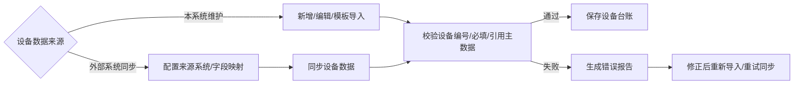
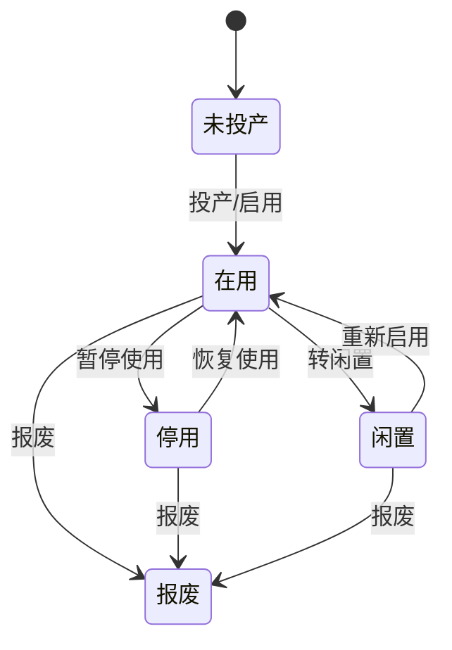
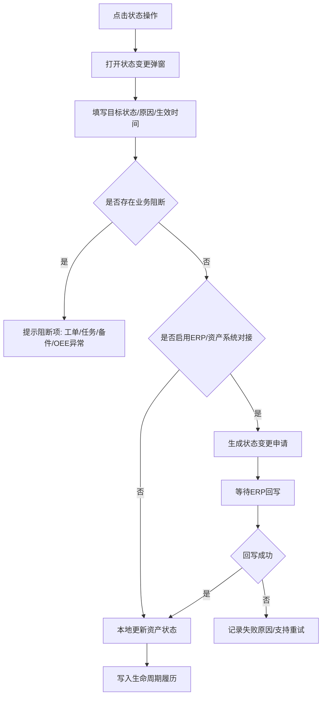
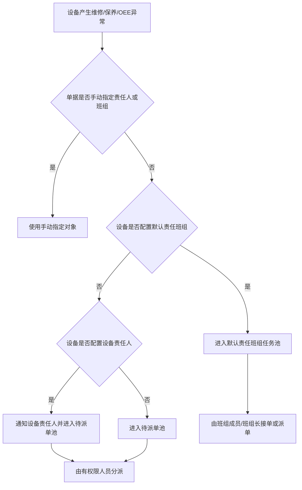

# 03-01. 设备台账

## 模块目标与边界

设备台账负责设备建档、设备 BOM、设备二维码和设备履历。它是 OEE、维修、点巡检、保养、备件绑定和 KPI 统计的基础数据源。

设备类型、设备组属于设备模块内的基础配置，由设备台账模块维护。停机/损失分类不作为通用主数据沉淀，由 OEE 模块按损失填报和统计需要配置。

PPM、OEE 目标、损失目标等指标配置归 OEE 模块维护，设备台账只提供设备、组织、工序、是否生产设备等基础关联信息。

不包含财务折旧、完整资产财务核算、数采平台建设和 OEE 指标目标维护。

## 页面清单

| 页面 | 主要能力 |
|------|----------|
| 设备台账 | 新增、导入、导出、删除、下载二维码、树形筛选、条件查询、生命周期状态操作 |
| 设备详情 | 基本信息、BOM、生命周期履历、验收履历、保养履历、点巡检履历、维修/故障履历、备件履历、操作日志 |
| 设备类型 | 设备类型维护、设备组维护、导入导出 |
| 设备责任配置 | 维护设备默认责任班组和设备责任人 |
| 设备导入/同步记录 | 查看导入结果、同步来源、失败原因和重试记录 |

## 主业务流程

### 设备建档流程

1. 设备管理员新增设备或下载模板批量导入。
2. 系统校验设备编号唯一性、必填字段、引用主数据是否存在。
3. 保存设备基础信息、采购信息、图片、附件、属性扩展信息。
4. 系统生成设备二维码，用于移动端扫码查看设备信息和现场签到；扫码设备类型不限定，可按项目选择 PDA、手机或扫码枪。
5. 若设备类型已存在点巡检/保养基准，设备级基准生成规则按预防性维护模块执行。

### 设备导入与同步流程

设备台账支持本地维护、批量导入和外部系统同步三种来源。客户已有设备主数据、资产系统或 MES 设备清单时，可通过接口或文件同步；无外部系统时，设备台账必须支持本地闭环维护。

规则：

1. 系统内部 ID 是设备台账的技术主键，设备编号是业务编码；外部设备编码、资产编码和数采编号可作为关联字段保存。
2. 外部同步字段不允许在设备台账直接覆盖；本系统只维护设备责任配置、扩展属性、备注等本地扩展字段。
3. 无外部系统时，设备台账、设备类型、设备组、设备 BOM 均支持模板下载、导入、导出和错误报告。
4. 导入或同步失败时，错误报告必须包含行号、设备编号、字段、失败原因和处理建议。
5. 同一批次导入或同步需记录来源、操作人、开始时间、结束时间、成功数、失败数和错误报告。

### 设备生命周期状态流程

设备台账中的资产状态用于描述设备管理生命周期，不等同于数采运行状态。运行、停机、待料、堵料等动态状态归 OEE/数采状态处理。

标准产品采用混合模式：有 ERP/资产系统时，资产生命周期状态以外部系统为权威来源，EAM 提供查看、状态变更申请、等待回写、本地业务扩展和人工补偿；无 ERP/资产系统时，EAM 本地完成状态变更闭环。

| 状态类型 | 含义 | 来源 |
|----------|------|------|
| 资产生命周期状态 | 未投产、在用、停用、闲置、报废 | ERP/资产系统或 EAM 本地 |
| 设备运行状态 | 运行、停机、待料、堵料、报警等 | OEE/数采/人工填报 |

状态变更交互流程：

规则：

1. 标准资产状态建议为未投产、在用、停用、闲置、报废。
2. 只有在用设备默认参与预防性维护、维修叫修和 OEE 统计；未投产、停用、闲置、报废是否参与业务可按模块配置。
3. 报废设备不可再新建维修工单、点巡检/保养计划或备件绑定，历史履历继续可查。
4. 设备状态变更必须记录变更前状态、变更后状态、原因、操作人和操作时间。
5. 存在未完成维修工单、未完成点巡检/保养任务或在用备件绑定时，报废前必须提示并按业务规则处理。
6. ERP/资产系统启用时，外部权威字段在 EAM 不允许直接编辑；EAM 只能发起状态变更申请或维护本地扩展字段。
7. 无 ERP/资产系统时，状态变更在 EAM 本地立即生效，并写入生命周期履历。
8. ERP/资产系统回写失败时，系统记录来源系统、失败原因和处理状态，并支持重试或人工标记处理结果。
9. 报废为 MVP 终态，不支持从报废恢复；如客户需要恢复报废设备，作为高风险增强能力单独确认。

页面交互规则：

1. 设备列表中资产状态用状态标签展示；数据来源用标签展示本地维护、导入、ERP 同步或 MES 同步。
2. 设备列表展示同步状态：正常、待同步、同步失败、外部已变更。
3. 设备列表操作按钮按当前状态展示：投产、停用、恢复、转闲置、报废、查看状态履历。
4. 设备详情基本信息展示当前资产状态、外部资产编码、来源系统和最近同步时间。
5. 设备详情增加生命周期履历区域，展示状态变更、外部回写、同步失败和人工处理记录。
6. ERP/资产系统已启用且外部状态与本地业务状态不一致时，设备详情展示差异提示，例如“ERP 已报废，本地仍有未完工单”。

### 设备责任默认分派流程

设备责任配置按 MVP 口径只维护一个默认责任班组和一个设备责任人。默认责任班组用于任务池和派单范围，设备责任人用于默认通知、责任候选和升级联络，不直接替代维修、保养或 OEE 单据上的实际责任人。

规则：

1. 默认责任班组来自 base 班组主数据，设备台账只引用，不维护班组成员。
2. 默认责任班组建议 MVP 必填，用于维修、预防性维护和 OEE 异常的默认派单池。
3. 设备责任人来自员工/用户引用，可为空，用于默认通知对象、OEE 异常责任候选和设备生命周期跟进。
4. 实际执行人以维修工单、点巡检/保养任务、OEE 损失记录上的责任人或班组为准。
5. 复杂客户需要按维修、保养、OEE 拆分多套责任配置时，作为后续增强项处理。

### 设备详情履历流程

1. 用户从台账、维修工单、OEE 明细或备件记录进入设备详情。
2. 详情页按 Tab 聚合设备静态信息和动态履历。
3. 各履历数据来自对应业务模块，不在详情页重复维护，除非明确为“手动上传”类履历。

### 设备二维码流程

1. 设备保存成功后系统生成唯一二维码，二维码内容使用系统内部 ID 或可解析到系统内部 ID 的设备详情地址。
2. 用户可在设备列表单台下载二维码，也可批量下载二维码图片包。
3. 移动端扫码后可进入设备详情、维修叫修、点巡检/保养签到或备件绑定页面，具体入口按用户权限展示。
4. 设备编号允许高权限修改；因二维码使用系统内部 ID，设备编号变更后二维码可继续使用。
5. 二维码被扫描时，系统需校验设备是否存在、是否停用/报废、用户是否具备对应业务权限。

### 设备 BOM 维护流程

1. 用户在设备详情维护设备 BOM，支持树形层级维护部件和备件。
2. 部件类型为普通部件时，可手工维护部件编码、名称、型号和数量。
3. 部件类型为备件时，必须关联备件台账，并自动带出备件名称、型号、制造商、单位等信息。
4. 已被备件绑定、维修领用或寿命预警引用的 BOM 节点不允许物理删除，只允许停用或标记失效。
5. 设备 BOM 调整需记录操作日志，并保留历史绑定关系用于设备履历追溯。

## 字段与数据规则

1. 系统内部 ID 是设备台账、二维码和跨模块关联的技术主键；设备编号是可展示、可查询、可导入的业务编码，需保持全局唯一。
2. 设备名称、设备类型、所属组织/线体、资产状态为关键基础字段。
3. 标准产品保留“是否生产设备”为核心字段；计量设备、特种设备等行业特性可作为扩展属性启用。
4. 资产状态是设备生命周期状态，设备运行状态来自 OEE/数采或人工填报，不在设备台账中直接维护动态运行状态。
5. PPM 生效时间、设计 PPM、实际 PPM 等指标配置不在设备台账维护，归 OEE 模块。
6. 删除设备前必须检查关联业务数据；存在点巡检计划、保养任务、维修工单、备件绑定等记录时阻止删除。
7. 默认责任班组和设备责任人只作为默认分派、通知和责任候选来源，不强制覆盖业务单据上的责任配置。
8. 被业务引用的设备原则上不允许物理删除，标准产品优先通过停用、闲置或报废完成生命周期闭环。
9. 设备编号允许高权限修改，修改时需记录旧编号、新编号、变更原因、操作人和操作时间；历史单据继续通过系统内部 ID 关联设备。

### 生命周期状态业务影响

| 资产状态 | 设备台账 | 预防性维护 | 维修工单 | OEE/数采 | 备件绑定 |
|----------|----------|------------|----------|----------|----------|
| 未投产 | 可维护基础信息、BOM、二维码 | 默认不生成新计划和任务 | 默认不可叫修 | 默认不参与 OEE 统计 | 可维护 BOM，默认不允许绑定在用备件 |
| 在用 | 可编辑授权字段 | 可生成计划和任务 | 可叫修、可派单 | 可参与 OEE 统计和状态采集 | 可绑定、换绑 |
| 停用 | 可编辑授权字段，历史可查 | 暂停新计划和任务 | 默认不可新建叫修，历史工单可查 | 暂停 OEE 统计 | 默认不可新增绑定 |
| 闲置 | 可编辑授权字段，历史可查 | 默认不生成新计划和任务 | 默认不可新建叫修 | 不参与生产和 OEE | 默认不可新增绑定 |
| 报废 | 只读展示，历史可查 | 不可新建计划和任务 | 不可新建工单 | 不参与 OEE | 不可新增绑定 |

## 履历 Tab 规则

| Tab | 数据来源 | 规则 |
|-----|----------|------|
| 基本信息 | 设备台账 | 展示设备建档字段和附件 |
| 设备 BOM | 设备详情维护 | 部件可为普通部件或备件；备件需关联备件台账 |
| 验收履历 | 手动维护或外部导入 | 原型备注存在“无需系统内验收履历”的意见，需确认是否保留 |
| 保养履历 | 保养任务 | 同步保养任务状态、执行人、异常项、漏检项 |
| 点巡检履历 | 点检/巡检任务 | 展示计划/任务列表、完成率、异常项、漏检项 |
| 维修/故障履历 | 维修工单或手动上传 | PRD 原为“暂无”，需补齐为工单闭环记录；原型备注“维修履历为手动上传”需业务确认 |
| 备件履历 | 备件使用绑定 | 记录领用、绑定、解绑、换绑、寿命起算 |
| 操作日志 | 系统日志 | 记录新增、修改、删除、同步等操作，关键字段支持前后值 |

## 页面字段清单

### 新增/编辑设备

| 分组 | 字段 | 类型 | 必填 | 来源/规则 |
|------|------|------|------|-----------|
| 系统字段 | 系统内部 ID | 反显/隐藏 | 是 | 系统生成，作为二维码和跨模块关联主键，不允许人工修改 |
| 基础信息 | 设备编号 | 文本 | 是 | 全局唯一，保存和导入时校验 |
| 基础信息 | 设备名称 | 文本 | 是 | 页面主展示名称 |
| 基础信息 | 资产状态 | 状态标签/选择 | 是 | 未投产、在用、停用、闲置、报废；外部权威模式下不可直接编辑 |
| 基础信息 | 设备类型 | 选择 | 是 | 来自设备类型配置 |
| 基础信息 | 设备型号/规格 | 文本 | 否 | 标品保留一个通用规格字段 |
| 基础信息 | 重要级别 | 下拉 | 否 | 如关键、重要、一般，可配置 |
| 归属位置 | 使用组织 | 组织选择 | 是 | 影响数据权限、统计和任务派发 |
| 归属位置 | 所属工段/工序 | 选择 | 否 | 供 OEE、维修筛选和报表使用 |
| 归属位置 | 设备位置 | 文本/位置选择 | 否 | 车间、区域、工位等位置描述 |
| 责任配置 | 默认责任班组 | 班组选择 | 是 | 来自 base 班组主数据，用于默认任务池 |
| 责任配置 | 设备责任人 | 用户选择 | 否 | 用于默认通知和责任候选，不作为唯一执行人 |
| 生产属性 | 是否生产设备 | 开关 | 否 | 是时可参与 OEE、点巡检/保养和设备统计 |
| 生产属性 | 投产时间 | 日期 | 否 | 用于生命周期和报表分析 |
| 采购来源 | 资产编号 | 文本 | 否 | 外部资产系统编号或本地资产编号 |
| 采购来源 | 制造商 | 文本/供应商选择 | 否 | 常见设备来源信息 |
| 采购来源 | 供应商 | 选择 | 否 | 供应商主数据，可选 |
| 采购来源 | 购置时间 | 日期 | 否 | 用于资产生命周期分析 |
| 图片附件 | 设备图片 | 图片上传 | 否 | 支持预览 |
| 图片附件 | 附件列表 | 文件上传表格 | 否 | 上传说明书、验收资料、图片等 |
| 来源信息 | 数据来源 | 枚举 | 是 | 本地维护、导入、外部同步 |
| 来源信息 | 外部设备编码 | 文本 | 否 | 外部设备主数据编码 |
| 来源信息 | 来源系统 | 文本/选择 | 否 | ERP、MES、资产系统等 |
| 来源信息 | 同步状态 | 状态 | 否 | 正常、待同步、同步失败、外部已变更 |
| 来源信息 | 最近同步时间 | 日期时间 | 否 | 外部同步时记录 |
| 扩展信息 | 扩展属性 | 子表 | 否 | 客户、行业、设备类型专属字段通过扩展属性维护 |
| 扩展信息 | 备注 | 多行文本 | 否 | 通用备注 |

### 扩展属性能力

| 能力 | 规则 |
|------|------|
| 适用范围 | 可按设备类型、设备组或全局配置扩展字段 |
| 字段类型 | 支持文本、数值、日期、下拉、开关、附件引用等常见类型 |
| 导入导出 | 已启用扩展字段需进入设备导入模板、导出结果和错误报告 |
| 列表展示 | 扩展字段默认不进列表，可配置少量字段在列表展示 |
| 权限与校验 | 可配置是否必填、是否只读、可见角色和枚举值 |
| 推荐承载内容 | 尺寸、重量、功率、技术参数、使用寿命、产地、供应商电话、特种设备属性、计量设备属性等低频字段 |

### 设备类型与设备组

| 页面 | 字段/控件 | 类型 | 必填 | 来源/规则 |
|------|-----------|------|------|-----------|
| 设备组 | 代码 | 文本 | 是 | 唯一 |
| 设备组 | 名称 | 文本 | 是 | 展示名称 |
| 设备组 | 简称 | 文本 | 否 | 可选 |
| 设备类型 | 设备类型编码 | 文本 | 是 | 唯一 |
| 设备类型 | 设备类型名称 | 文本 | 是 | 展示名称 |
| 设备类型 | 所属设备组 | 选择 | 否 | 设备组 |
| 设备类型 | 启用状态 | 开关 | 是 | 停用后历史保留，新设备不可选 |
| 设备类型 | 导入/导出 | 操作 | 否 | 支持模板下载、导入、导出和错误报告 |

### 设备 BOM

| 字段 | 类型 | 必填 | 来源/规则 |
|------|------|------|-----------|
| 上级节点 | 树节点 | 否 | 支持树形层级 |
| 节点类型 | 下拉 | 是 | 部件/备件 |
| 编码 | 文本/选择 | 是 | 备件类型时从备件台账选择 |
| 名称 | 文本/反显 | 是 | 备件类型时由备件台账带出 |
| 型号/规格 | 文本/反显 | 否 | 备件类型时可由备件台账带出 |
| 数量 | 数值 | 是 | 支持整数或小数 |
| 单位 | 下拉/反显 | 是 | 备件类型时由备件台账带出 |
| 安装位置 | 文本 | 否 | 用于绑定、换绑和现场识别 |
| 理论寿命 | 数值+单位 | 否 | 可按时间、产量或次数配置 |
| 启用状态 | 开关 | 是 | 停用后历史保留，新绑定不可选择 |
| 备注 | 文本 | 否 | 可选 |

### 设备详情履历

| Tab | 字段 |
|-----|------|
| 验收履历 | 验收单名称、验收单编号、验收完成时间、验收人、验收单类型、附件、验收备注 |
| 生命周期履历 | 原状态、新状态、变更原因、生效时间、来源系统、同步结果、操作人 |
| 保养履历 | 保养任务编号、责任人、保养计划编号、责任部门、保养机制、计划保养时间、任务状态、开始执行时间、结束执行时间、应检项目数、漏检项目数、异常项目数 |
| 点巡检履历 | 任务编号、计划编号、责任人、计划时间、任务状态、应检项目数、正常项数、异常项数、漏检项数、未达成项数、完成率 |
| 维修/故障履历 | 工单编号、故障发生时间、接单时间、签到时间、完工时间、故障类型、故障描述、异常原因、处理措施、责任人、工单状态 |
| 备件履历 | 备件编码、备件名称、领用单号、领用日期、备件序列号、绑定状态、绑定日期、解绑日期、绑定位置 |
| 操作日志 | 操作人、操作时间、操作类型、操作内容、变更前值、变更后值 |

### 设备台账列表

| 字段/控件 | 类型 | 必填 | 来源/规则 |
|-----------|------|------|-----------|
| 左侧组织/区域/产线树 | 树形筛选 | 否 | 来自组织或产线主数据，用于快速过滤设备 |
| 设备编号 | 查询条件/列表字段 | 否 | 支持精确或模糊查询；列表主键展示 |
| 设备名称 | 查询条件/列表字段 | 否 | 支持模糊查询 |
| 设备型号/规格 | 查询条件/列表字段 | 否 | 来自设备基础信息 |
| 设备类型 | 查询条件/列表字段 | 否 | 来自设备类型主数据 |
| 重要级别 | 查询条件/列表字段 | 否 | 字典项，如关键/重要/一般 |
| 资产状态 | 查询条件/列表字段 | 否 | 状态标签：未投产、在用、停用、闲置、报废 |
| 数据来源 | 查询条件/列表字段 | 否 | 本地维护、导入、ERP同步、MES同步 |
| 同步状态 | 查询条件/列表字段 | 否 | 正常、待同步、同步失败、外部已变更 |
| 所属组织/使用组织 | 列表字段 | 否 | 组织主数据 |
| 所属工段/工序/位置 | 列表字段 | 否 | 生产组织或位置主数据 |
| 默认责任班组 | 列表字段 | 否 | base 班组主数据 |
| 设备责任人 | 列表字段 | 否 | 用户/员工主数据 |
| 操作 | 按钮组 | 否 | 详情、编辑、删除、下载二维码、投产、停用、恢复、转闲置、报废、查看状态履历 |

### 状态变更弹窗

| 字段/控件 | 类型 | 必填 | 来源/规则 |
|-----------|------|------|-----------|
| 当前状态 | 反显 | 是 | 设备当前资产生命周期状态 |
| 目标状态 | 下拉 | 是 | 按状态流转规则过滤可选项 |
| 变更原因 | 多行文本 | 是 | 必须填写，写入生命周期履历 |
| 生效时间 | 日期时间 | 是 | 默认当前时间，可按权限调整 |
| 附件 | 文件上传 | 否 | 报废、停用等可上传审批或现场材料 |
| 备注 | 多行文本 | 否 | 可选 |
| 阻断项检查 | 系统检查 | 是 | 未完成维修工单、点巡检/保养任务、在用备件绑定、未关闭 OEE 异常 |
| 外部对接提示 | 提示 | 否 | 启用 ERP/资产系统时显示“提交后等待外部回写” |
| 确认提交 | 操作 | 否 | 校验通过后提交状态变更或生成状态变更申请 |

### 生命周期履历

| 字段/控件 | 类型 | 必填 | 来源/规则 |
|-----------|------|------|-----------|
| 履历编号 | 文本 | 是 | 系统生成 |
| 原状态 | 状态 | 是 | 变更前资产生命周期状态 |
| 新状态 | 状态 | 是 | 目标资产生命周期状态 |
| 变更原因 | 文本 | 是 | 来源状态变更弹窗或外部回写 |
| 生效时间 | 日期时间 | 是 | 状态生效时间 |
| 操作人 | 反显 | 是 | 本地操作人；外部回写可显示系统任务 |
| 来源系统 | 文本 | 否 | 本地/EAM/ERP/MES/资产系统 |
| 同步结果 | 状态 | 否 | 成功、待同步、同步失败、人工处理 |
| 失败原因 | 文本 | 否 | 同步失败时记录 |
| 附件 | 下载 | 否 | 状态变更附件 |
| 处理备注 | 文本 | 否 | 重试或人工处理说明 |

### 设备导入/同步记录

| 字段/控件 | 类型 | 必填 | 来源/规则 |
|-----------|------|------|-----------|
| 记录编号 | 文本 | 是 | 系统生成 |
| 来源类型 | 枚举 | 是 | 导入/外部同步 |
| 来源系统 | 文本/选择 | 否 | 外部同步时必填 |
| 文件名称 | 文本 | 否 | 导入时记录 |
| 操作人 | 反显 | 是 | 当前用户或系统任务 |
| 开始时间 | 日期时间 | 是 | 系统记录 |
| 结束时间 | 日期时间 | 否 | 完成后记录 |
| 成功数 | 数值 | 是 | 成功写入数量 |
| 失败数 | 数值 | 是 | 校验失败数量 |
| 执行状态 | 状态 | 是 | 处理中、成功、部分成功、失败 |
| 错误报告 | 下载 | 否 | 失败数大于 0 时可下载 |

## 跨模块联动

1. base 主数据向本模块提供工厂建模、员工、供应商等基础数据。
2. 设备类型、设备组和设备台账由设备模块维护，并向预防性维护、维修、OEE 和备件提供设备基础数据。
3. 设备 BOM 向备件绑定和寿命计算提供安装位置和理论寿命。
4. 设备二维码向移动端点检、保养、维修签到提供现场定位依据。
5. 设备履历汇总维修、点巡检、保养、备件和 OEE 记录。
6. OEE 损失/停机分类由 OEE 模块配置；预防性维护仅引用设备、基准、二维码和履历数据。
7. OEE 模块维护 PPM、OEE 目标和损失目标，设备台账只提供设备与组织、工序、是否生产设备等关联字段。

## 验收口径

1. 设备导入失败时可下载错误报告，错误需包含行号、字段、原因。
2. 设备类型、设备组支持模板下载、导入、导出；导入失败可下载错误报告。
3. 从维修工单进入设备详情时，可看到该设备历史故障/维修记录。
4. 设备 BOM 中维护理论寿命后，备件绑定模块可读取寿命规则。
5. 设备保存成功后可生成二维码，扫码能进入设备详情或授权业务入口。
6. 设备状态从在用变为报废时，若存在未完成工单、任务或在用备件绑定，系统必须提示并阻止直接报废。
7. 外部同步设备时，系统能记录来源系统、外部编码、同步批次、同步时间和失败原因。
8. 设备台账不提供 PPM 维护入口，PPM 维护和分析在 OEE 模块完成。
9. 无 ERP/资产系统时，状态变更能在 EAM 本地完成，并生成生命周期履历。
10. 有 ERP/资产系统时，EAM 不直接覆盖外部权威状态，只生成状态变更申请并等待外部回写。
11. 资产生命周期状态和 OEE/数采运行状态在列表、详情和字段说明中分开展示，不混用。
12. 同步失败时，用户能看到来源系统、失败原因，并可重试或人工标记处理结果。
13. 报废状态为 MVP 终态，报废设备不可新建维修、保养、OEE 或备件绑定业务。
14. 设备编号变更后，原二维码仍可扫码进入同一设备详情。
15. 设备编号变更后，历史维修、保养、OEE 和备件履历仍能通过系统内部 ID 关联到同一设备。

## 待澄清与迭代事项

| 事项 | 可选方案 | 推荐口径 | 推荐理由 |
|------|----------|----------|----------|
| 验收履历维护方式 | A. 系统内维护验收单；B. 仅上传验收附件；C. 外部验收单同步 + 本地附件补充 | 推荐 C，MVP 无外部系统时按 B 落地 | 验收流程客户差异大，标准产品不宜强做完整验收单；保留外部同步和附件能力更通用 |
| 维修履历来源 | A. 仅维修工单自动同步；B. 手动上传为主；C. 维修工单自动同步 + 手动补录/附件 | 推荐 C | 标准闭环应以维修工单为主，同时允许导入历史维修记录或补充线下维修附件 |

推荐落地规则：

1. 验收履历 MVP 先作为附件型履历，字段保留验收名称、编号、时间、验收人、附件和备注；若客户已有验收/资产系统，可通过外部同步补充。
2. 维修履历默认从维修工单自动汇总；历史维修记录可通过导入或手动补录进入履历，并标记来源。

已确认规则：

1. 设备编号允许高权限修改，普通用户不可修改。
2. 二维码使用系统内部 ID，不使用设备编号作为解析主键。
3. 设备编号修改后不需要重新生成二维码，但必须记录旧编号、新编号、变更原因、操作人和操作时间。

