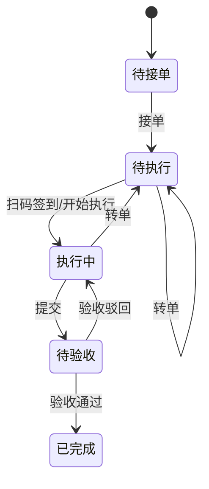

# 03-02. 预防性维护

## 模块目标与边界

预防性维护覆盖设备点检、巡检、保养的标准维护、计划生成、任务执行、验收闭环和履历统计。标准产品采用“设备类型基准 → 设备级基准 → 计划 → 任务 → 执行/验收 → 履历”的主链路，让企业先沉淀统一维护标准，再按设备自动形成可执行任务。

点检/巡检侧重设备状态检查，保养侧重维护作业。两者共用基准、计划、任务和执行闭环，但项目字段、执行内容和统计维度不同。

预防性维护依赖设备主数据与生命周期状态。设备未投产时可配置设备级基准，但默认不生成维护计划和任务；设备在用后才进入自动维护闭环。设备安装位置来自设备主数据，不在本模块重复维护工厂、车间、产线、工序字段。

停机分类不属于预防性维护基准，不参与计划生成、任务生成、接单、执行或验收；点巡检/保养执行中发现异常时，可转维修工单，由维修和 OEE 模块按停机分类完成归因和统计。

巡检路线地图、多设备连续路线、复杂审批流、保养评价等属于增强能力，不阻塞基础版本落地。

## 页面清单

| 页面 | 主要能力 |
|------|----------|
| 点检/巡检/保养类型基准 | 创建设备类型维护标准，维护检查/保养项目，支持导入导出 |
| 设备基准管理 | 查看设备继承的基准，按单设备微调项目，设置计划启动时间 |
| 点检/巡检/保养计划 | 查看系统生成的计划，启用/暂停计划，查看上次/下次任务时间 |
| 点检/巡检/保养任务 | 查看待接单、待执行、执行中、待验收、已完成、已逾期任务 |
| 移动端执行页 | 扫码签到、逐项填写结果、上传现场图片、提交验收 |
| 预防性维护看板 | 任务完成率、逾期率、异常项、漏检漏保、设备维度趋势 |

## 主业务流程

### 1. 基准生成流程

1. 设备管理员按设备类型创建点检、巡检或保养类型基准。
2. 类型基准至少包含基准名称、业务类型、设备类型和项目列表。
3. 类型基准首次新增成功后，系统为该设备类型下的设备自动生成设备级基准副本。
4. 设备级基准拥有独立编号，可针对单台设备调整检查/保养项目、频次、派单班组和执行期限。
5. 设备级基准调整不反向影响类型基准，也不影响同类型其他设备。
6. 未投产设备可生成设备级基准副本，但不自动生成维护计划。

### 2. 计划生成流程

1. 用户在设备级基准上设置计划启动时间，并确认基准项目、频次、派单班组、执行期限。
2. 系统根据设备级基准生成维护计划。
3. 同一设备、同一业务类型、相同启动时间、频次和派单班组的项目，可合并生成一条计划，计划下保留多个执行项目。
4. 新生成计划默认启用；用户可暂停计划。
5. 暂停计划后不再生成新任务，已生成任务继续按当前状态处理。
6. 生成计划前必须校验设备生命周期状态；未投产、报废、归档设备不可生成计划，闲置/停用设备按配置决定是否允许生成。

### 3. 任务自动生成流程

1. 系统按固定周期扫描启用状态的维护计划。
2. 当前时间达到计划的下次任务时间时，系统生成点巡检/保养任务。
3. 任务生成后进入“待接单”，并根据计划派单班组确定可见和可接单范围。
4. 系统更新计划的上次任务时间和下次任务时间。
5. 任务生成时再次校验设备状态；设备已报废/归档时不生成新任务，并记录跳过原因。

### 4. 执行与验收流程

1. 执行人员在任务列表接单，任务由“待接单”进入“待执行”。
2. 执行人员到现场后扫码签到，任务进入“执行中”。
3. 执行人员逐项填写检查/保养结果、异常说明、现场图片或附件。
4. 任务提交后进入“待验收”。
5. 验收通过后任务进入“已完成”，结果写入设备点巡检/保养履历、台账近期维护日期和报表统计。
6. 验收驳回后任务退回“执行中”，执行人员补充处理后再次提交。
7. 待执行或执行中任务可转单，转单需记录原执行人、新执行人、原因和时间。

### 5. 异常处理流程

1. 点巡检或保养结果存在异常项时，任务标记异常。
2. 异常项可选择“仅记录”或“转维修工单”。
3. 转维修工单时，系统带出设备、异常项目、异常说明、任务编号和附件。
4. 是否必须转工单由企业管理规则决定，标准产品默认不强制。

## 状态与规则

| 对象 | 状态 | 说明 |
|------|------|------|
| 类型基准/设备基准 | 启用、停用 | 停用后不再用于新计划，历史计划和任务保留 |
| 维护计划 | 启用、暂停 | 启用计划可自动生成任务；暂停后停止生成新任务 |
| 点巡检/保养任务 | 待接单、待执行、执行中、待验收、已完成、已逾期 | 已逾期可作为独立状态或状态标签，需实现时统一 |
| 异常项 | 未处理、已转工单、已忽略 | 已转工单时关联维修工单 |

设备生命周期联动：

| 生命周期/使用状态 | 计划/任务规则 |
|----------|----------------|
| 建档/待验收/已验收 | 可维护基准；默认不生成维护计划和任务 |
| 已投产/在用 | 可生成计划和任务 |
| 调拨中 | 暂停新任务生成；已生成任务按配置继续、取消或转派 |
| 闲置/停用 | 默认不生成新任务；是否允许手动保养作为配置项 |
| 改造中 | 默认暂停周期性任务，可允许专项保养或改造检查 |
| 报废/归档 | 禁止生成新任务；历史记录只读 |

任务状态流转：

逾期规则：

1. 当前时间超过任务计划时间加执行期限，且任务未完成时，任务标记为逾期。
2. 逾期任务仍允许继续执行、提交和验收。
3. 逾期天数进入任务列表、看板和人员绩效统计。

权限与可见性规则：

1. 执行人员只能看到自己所属班组或被转派给自己的任务。
2. 主管/班组长可查看本组织或授权范围内任务，并可派单、转单、验收。
3. 基准和计划配置由设备管理员或具备维护权限的角色操作。
4. 所有计划生成、任务生成和状态流转必须记录操作日志。
5. 设备责任人可作为通知对象或任务跟进人，不自动成为点巡检/保养任务执行人。

## 点巡检特有规则

1. 点检与巡检均关注检查部位、时机、方法、标准和结果。
2. 点巡检项目可配置必检；必检项未填写不可提交。
3. 设备处于 E10=NS/SD/EN/SB 或业务配置的非生产状态时，可勾选“设备停机无需点巡检”，勾选后记录原因，不要求逐项填写检查结果。
4. 底部需同步统计应检项、已检项、正常项、异常项和漏检项数量。
5. 巡检路线如需地图、路线顺序和多设备连续巡查，可作为后续扩展。

## 保养特有规则

1. 保养项目需维护保养部位、保养内容、保养基准、标准工时、建议备件和指导书。
2. 保养机制可按日常、周、月度、季度、年度等字典维护，并作为生成计划和统计筛选维度。
3. 保养类型标准产品默认保留“设备保养”，实验室保养、自动线保养、特种设备保养等作为字典扩展。
4. 保养过程中如使用备件，可关联备件领用记录。
5. 保养评价标记为二期能力时，不进入基础版本强制流程。

## 页面字段清单

### 类型基准新增/编辑表单

| 字段/控件 | 类型 | 必填 | 来源/规则 |
|-----------|------|------|-----------|
| 基准编号 | 文本 | 是 | 系统自动生成 |
| 基准名称 | 文本 | 是 | 用户填写 |
| 业务类型 | 下拉 | 是 | 点检、巡检、保养 |
| 设备类型 | 选择 | 是 | 来自设备类型主数据；同业务类型下默认唯一 |
| 启用状态 | 开关 | 是 | 启用/停用 |
| 项目列表 | 子表 | 是 | 至少一条检查/保养项目 |
| 导入/导出 | 操作 | 否 | 用于批量维护基准 |
| 修改记录 | 子表 | 否 | 修改人、修改时间、修改内容 |

### 点巡检项目字段

| 字段 | 类型 | 必填 | 来源/规则 |
|------|------|------|-----------|
| 检查部位 | 文本 | 是 | 移动端展示 |
| 点巡检时机 | 下拉 | 否 | 如开机、关机、运行中；字典配置 |
| 点巡检方法 | 文本 | 否 | 如目视、听音、测量 |
| 点巡检标准 | 多行文本 | 否 | 正常状态描述 |
| 标准值 | 数值/文本 | 否 | 数值型检查项使用 |
| 上限/下限 | 数值 | 否 | 用于自动判断是否异常 |
| 单位 | 文本 | 否 | 如 mm、摄氏度、MPa |
| 结果类型 | 下拉 | 是 | 正常/异常、数值、文本等 |
| 频次 | 下拉/数值 | 是 | 用于生成计划和下次任务时间 |
| 派单班组 | 班组选择 | 是 | 默认可带出设备默认责任班组，决定任务可见与接单范围 |
| 执行期限 | 数值 + 单位 | 是 | 用于逾期判断 |
| 是否必检 | 开关 | 是 | 必检项未填不可提交 |
| 是否支持拍照 | 开关 | 否 | 控制执行页上传项 |
| 备注 | 多行文本 | 否 | 可选 |

### 保养项目字段

| 字段 | 类型 | 必填 | 来源/规则 |
|------|------|------|-----------|
| 保养部位 | 文本 | 是 | 移动端展示 |
| 保养时机 | 下拉/文本 | 否 | 如停机、开机前、运行后 |
| 保养项目/内容 | 多行文本 | 是 | 具体保养操作 |
| 保养基准 | 多行文本 | 否 | 完成后应达到的标准 |
| 保养机制 | 下拉 | 是 | 日常、周、月度、季度、年度等 |
| 保养类型 | 下拉 | 否 | 标准默认设备保养；其他类型作为字典扩展 |
| 标准工时 | 数值 | 否 | 用于工时统计 |
| 建议备件 | 备件选择 | 否 | 可多选，关联备件台账 |
| 指导书/附件 | 文件上传 | 否 | SOP、图片、视频 |
| 频次 | 下拉/数值 | 是 | 用于生成计划和下次任务时间 |
| 派单班组 | 班组选择 | 是 | 默认可带出设备默认责任班组，决定任务可见与接单范围 |
| 执行期限 | 数值 + 单位 | 是 | 用于逾期判断 |
| 是否必做 | 开关 | 是 | 必做项未填不可提交 |

### 设备基准配置页

| 字段/控件 | 类型 | 必填 | 来源/规则 |
|-----------|------|------|-----------|
| 设备基准编号 | 文本 | 是 | 系统生成，独立于类型基准 |
| 基准名称 | 文本 | 是 | 默认继承类型基准名称 |
| 设备编号/名称 | 反显 | 是 | 设备台账 |
| 设备类型 | 反显 | 是 | 设备台账 |
| 设备安装位置 | 反显 | 是 | 设备主数据，展示完整位置路径 |
| 生命周期状态 | 反显 | 是 | 未投产、报废、归档时限制生成计划 |
| 业务类型 | 反显 | 是 | 点检、巡检、保养 |
| 启用状态 | 开关 | 是 | 启用/停用 |
| 计划启动时间 | 日期时间 | 是 | 用户设置后生成维护计划 |
| 项目列表 | 子表 | 是 | 可在设备级微调项目、频次、派单班组、执行期限；派单班组为空时默认带出设备默认责任班组 |
| 生成计划 | 操作 | 否 | 校验通过后生成计划 |

### 维护计划列表与详情

| 字段/控件 | 类型 | 必填 | 来源/规则 |
|-----------|------|------|-----------|
| 计划编号 | 文本 | 是 | 系统生成 |
| 关联设备 | 反显 | 是 | 设备编号、设备名称 |
| 设备安装位置 | 反显 | 是 | 设备主数据完整位置路径 |
| 基准名称 | 反显 | 是 | 来源设备级基准 |
| 业务类型 | 反显/筛选 | 是 | 点检、巡检、保养 |
| 频次 | 反显 | 是 | 来源基准项目或合并规则 |
| 派单班组 | 反显 | 是 | 来源基准项目 |
| 计划状态 | 状态/操作 | 是 | 启用、暂停 |
| 计划启动时间 | 反显 | 是 | 来源设备基准配置 |
| 上次任务时间 | 日期时间 | 否 | 最近一次生成任务时间 |
| 下次任务时间 | 日期时间 | 是 | 系统按频次计算 |
| 计划项目 | 子表 | 是 | 该计划包含的检查/保养项目 |
| 操作 | 按钮组 | 否 | 查看、暂停/启用 |

### 任务执行页

| 字段/控件 | 类型 | 必填 | 来源/规则 |
|-----------|------|------|-----------|
| 任务编号 | 文本 | 是 | 系统生成 |
| 任务来源 | 反显 | 是 | 计划自动生成 |
| 设备编号/名称 | 反显 | 是 | 来源计划 |
| 设备安装位置 | 反显 | 是 | 来源设备主数据 |
| 计划时间 | 日期时间 | 是 | 来源计划 |
| 执行期限 | 反显 | 是 | 来源基准/计划 |
| 接单人 | 反显 | 条件必填 | 接单后记录 |
| 扫码签到 | 操作 | 否 | 现场定位设备，进入执行中 |
| 是否设备停机无需点巡检 | 开关 | 点巡检可选 | E10 非 PT 或业务配置允许时勾选，需填写原因 |
| 是否延长执行时间 | 开关 | 否 | 如启用需填写延长原因和新期限 |
| 项目结果 | 子表 | 是 | 按任务项目逐项填写 |
| 异常说明 | 多行文本 | 条件必填 | 任一结果异常时填写 |
| 现场图片/附件 | 上传 | 否 | 按项目配置控制 |
| 建议/使用备件 | 备件选择 | 否 | 保养或异常处理可选 |
| 提交验收 | 操作 | 否 | 校验必填项后进入待验收 |

### 任务列表与详情

| 字段/控件 | 类型 | 必填 | 来源/规则 |
|-----------|------|------|-----------|
| 状态 Tab | 查询条件 | 否 | 待接单、待执行、执行中、待验收、已完成、已逾期 |
| 时间范围 | 查询条件 | 否 | 按计划时间或完成时间筛选 |
| 设备编号/名称 | 查询条件 | 否 | 支持模糊查询 |
| 设备安装位置 | 查询条件/列表字段 | 否 | 来自设备主数据，支持按位置路径筛选 |
| 业务类型 | 查询条件 | 否 | 点检、巡检、保养 |
| 任务编号 | 列表字段 | 是 | 系统生成 |
| 负责人 | 列表字段 | 否 | 接单人或被转派人 |
| 计划时间 | 列表字段 | 是 | 来源计划 |
| 任务状态 | 列表字段 | 是 | 当前状态 |
| 延误天数 | 列表字段 | 否 | 逾期后展示 |
| 应检/应保项目数 | 数值 | 是 | 任务项目总数 |
| 已检/已保项目数 | 数值 | 否 | 已填写结果数 |
| 漏检/漏保项目数 | 数值 | 否 | 必填未填数量 |
| 异常项目数 | 数值 | 否 | 异常结果数量 |
| 转单记录 | 子表 | 否 | 原执行人、新执行人、原因、时间 |
| 验收记录 | 子表 | 否 | 验收人、结果、意见、时间 |
| 操作日志 | 子表 | 否 | 状态流转全记录 |

## 跨模块联动

1. 设备主数据提供设备编号、设备类型、设备安装位置、二维码、生命周期状态和 E10 运行状态。
2. 备件模块提供建议备件、领用和使用记录。
3. 已完成任务回写设备详情的点巡检/保养履历，并更新设备台账最近点检、最近巡检、最近保养日期。
4. 异常任务可转维修工单，并带出设备、异常项目、任务编号、说明和附件。
5. 逾期任务进入预警通知与逐级上报模块，通知规则由系统配置决定。
6. 设备台账提供默认责任班组作为派单班组默认值，设备责任人作为通知或升级对象。

## 验收口径

1. 类型基准首次创建后，对应设备基准自动生成且编号独立。
2. 用户在设备级基准设置计划启动时间后，系统可生成维护计划。
3. 未投产、报废、归档设备不可生成维护计划和任务。
4. 启用计划到达下次任务时间后，系统自动生成点巡检/保养任务。
5. 暂停计划后不再生成新任务，已生成任务不受影响。
6. 非派单班组或非授权人员不能查看和接单任务。
7. 任务可完成接单、扫码签到、执行、提交验收、验收通过闭环。
8. 验收驳回后任务退回执行中，并保留驳回意见。
9. 设备停机无需点巡检可完成任务，但必须记录停机原因。
10. 异常任务可转维修工单，维修工单能带出异常项目和附件。
11. 点检、巡检、保养完成后，设备台账近期维护日期可正确更新或聚合展示。

## 待澄清与迭代事项

1. “已逾期”作为独立状态还是状态标签，需要实现时统一。
2. 延长执行时间是否需要审批，当前按可配置规则处理。
3. 巡检路线、地图顺序、多设备连续巡查是否作为二期扩展。
4. 保养评价是否二期实现，原型备注显示“二阶段”。
