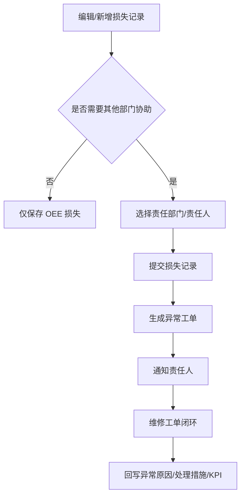

# 04. OEE 与 KPI 分析

## 模块目标与边界

OEE 与 KPI 模块负责设备损失记录、OEE 数据填报、OEE 报表、设备 PPM 分析、KPI 看板和 AI 指标分析。它连接设备状态采集数据、人工填报、维修工单和设备主数据，是异常工单触发和管理决策分析的核心入口。

## 页面清单

| 页面 | 主要能力 |
|------|----------|
| OEE 数据填报汇总表 | 按日期、班次、设备汇总停机时长、停机次数、良品/不良数 |
| OEE 损失详情/时间明细 | 编辑停机分类、责任部门、协助需求、原因措施 |
| 批量填报 | 批量维护损失分类和责任信息 |
| OEE 数据报表 | 设备/工序 OEE、目标值、损失下钻 |
| 设备 PPM 分析 | 工序级、设备级、小时级 PPM 对比和预警 |
| KPI 看板 | DT、DT率、MTTR、MTBF、MTTA、自主维护率、OEE、稼动率、FTY |
| DT 目标配置 | 新增、编辑、删除、导入、导出 DT 目标 |

## 设备状态损失记录生成规则

以下为标准产品推荐默认值，项目实施时应允许配置阈值和状态映射；没有设备状态采集能力的客户可使用人工新增损失记录。

1. 设备状态代码：运行=1，停机=2，待料=3，堵料=4。
2. 当设备状态从运行变为停机/待料/堵料，且状态变化持续超过配置阈值时，生成一条损失记录；推荐默认阈值为 15 秒。
3. 损失开始时间取状态变化的时间点。
4. 当状态从停机变为运行/待料/堵料，且在配置防抖时间内没有再次变回停机，则认为停机结束；推荐默认防抖时间为 2 分钟。
5. 停机结束时间取状态变为 1 的时间点；状态从 3 或 4 变为 1 时无需等待，直接确认结束。
6. 设备状态采集离线但现场仍在生产时，如果发生停机无法自动生成记录，允许人工新增损失。

## OEE 填报规则

1. 基本信息由系统带出：日期、班次、设备编码、设备名称、设备状态。
2. 班次根据开始时间自动判断。
3. 停机分类来自损失分类表或设备/设备类型停机分类，用于统一损失原因、责任归因和报表下钻口径。
4. 是否需要其他部门协助默认为否；选择是时，按责任部门过滤责任人，默认责任部门可按项目配置。
5. 异常责任人默认当前登录人或设备责任人，最终以用户选择为准。
6. 异常原因和处理措施可由维修工单回写，也可在填报时人工维护。
7. 作废或取消的数据不参与 OEE 损失统计。
8. 损失明细按停机结束时间倒序排列。
9. 停机分类不触发预防性维护计划或任务；是否生成异常工单仅由“是否需要其他部门协助”、责任信息和触发规则决定。

## 手工新增与编辑边界

1. 手工新增损失的时间段不能与设备状态采集已生成记录冲突。
2. 手工新增用于补偿采集离线、突发降速、人为增加损失等场景。
3. 超过配置的编辑时间窗后不能再编辑；推荐默认值为班次结束后 24-25 小时。
4. 批量填报不展示公共信息，只处理批量可变字段。
5. 停机时长格式保留 3 位小数，计算为结束时间 - 开始时间。

## 异常工单触发规则

## OEE 与 KPI 计算口径

| 指标 | 口径 |
|------|------|
| DT | 设备不可用总时长，来自损失记录或维修工单停机时间 |
| DT率 | DT / 计划运行时间 |
| MTTA | 接单时间 - 工单创建时间 |
| MTTR | 维修完成时间 - 接单/签到时间 |
| MTBF | 总运行时间 / 故障次数 |
| OEE | 时间稼动率 × 性能稼动率 × FTY |
| 时间稼动率 | 实际运行时间 / 计划运行时间 |
| 性能稼动率 | 实际产出节拍与理论节拍对比 |
| FTY | 一次合格数 / 总投入或总产出 |
| PPM | 每分钟产出，支持设计值、实际值、最大值、TOP5 平均、TOP10 平均 |

## 下钻分析规则

1. OEE 报表支持从拉线/工序下钻到设备，再到损失明细。
2. 损失分类支持一级、二级、三级下钻，最终展示设备名、损失类型、时间、时长、详情。
3. 设备 PPM 支持工序级和设备级分析；可查看小时、日、月、季度、年等粒度。
4. 工序支持多选，设备支持多选；最小颗粒度以业务配置为准，原型备注为“工序和拉线是时间上的叠加，最多到拉线，不用到工厂”。

## AI 指标分析

1. KPI 看板支持详细模式。
2. AI 分析异常点、同比/环比、突变点、突变发生时间和关联因素。
3. 如果存在故障工单，AI 总结故障原因并给出推荐方案和措施。
4. AI 输出仅作为辅助分析，不直接修改指标数据。

## 页面字段清单

### 损失记录填报

| 分组 | 字段 | 类型 | 必填 | 来源/规则 |
|------|------|------|------|-----------|
| 基本信息 | 日期 | 日期 | 是 | 系统带出 |
| 基本信息 | 班次 | 下拉/反显 | 是 | 根据开始时间自动判断，可按权限调整 |
| 基本信息 | 设备编码 | 反显 | 是 | 设备台账 |
| 基本信息 | 设备名称 | 反显 | 是 | 设备台账 |
| 时间信息 | 开始时间 | 日期时间 | 是 | 采集生成或人工新增 |
| 时间信息 | 结束时间 | 日期时间 | 条件必填 | 停机结束后填写或采集生成 |
| 时间信息 | 停机时长 | 数值 | 否 | 结束时间 - 开始时间 |
| 状态与分类 | 设备运行状态 | 下拉 | 是 | 运行/停机/待料/堵料等，字典配置 |
| 状态与分类 | 停机类型 | 下拉 | 否 | 计划内/计划外 |
| 状态与分类 | 一级损失分类 | 级联选择 | 是 | 损失分类主数据 |
| 状态与分类 | 二级损失分类 | 级联选择 | 否 | 依赖一级 |
| 状态与分类 | 三级损失分类 | 级联选择 | 否 | 依赖二级 |
| 责任信息 | 责任部门 | 部门选择 | 条件必填 | 需要协助或分类要求时必填 |
| 责任信息 | 责任人 | 用户选择 | 条件必填 | 按责任部门过滤 |
| 责任信息 | 是否需要其他部门协助 | 开关 | 是 | 默认否；为是时触发异常工单 |
| 描述信息 | 停机详情 | 多行文本 | 推荐 | 描述现场异常 |
| 描述信息 | 报警详情 | 多行文本 | 否 | 采集或告警系统带入 |
| 描述信息 | 异常原因 | 多行文本 | 否 | 可由维修工单回写 |
| 描述信息 | 处理措施 | 多行文本 | 否 | 可由维修工单回写 |
| 系统字段 | 记录来源 | 枚举 | 是 | 采集生成/人工新增/导入 |
| 系统字段 | 是否作废 | 开关 | 否 | 作废后不进入统计 |

### PPM 维护与分析

| 页面 | 字段 | 类型 | 必填 | 来源/规则 |
|------|------|------|------|-----------|
| PPM 维护 | 设备编号 | 选择/反显 | 是 | 设备台账 |
| PPM 维护 | 设计 PPM | 数值 | 是 | 标准产能 |
| PPM 维护 | 实际 PPM | 数值 | 否 | 可由生产数据计算或人工维护 |
| PPM 维护 | 生效时间 | 日期时间 | 是 | 可配置修改窗口 |
| PPM 分析筛选 | 时间范围 | 查询条件 | 是 | 支持日/月/季度/年 |
| PPM 分析筛选 | 工厂/拉线/工序/设备 | 查询条件 | 否 | 支持多选 |
| PPM 分析筛选 | 值类型 | 下拉 | 否 | 最大值、TOP5 平均、TOP10 平均等可配置 |
| PPM 分析筛选 | 预警信息 | 下拉 | 否 | 全部/达标/不达标 |
| PPM 分析结果 | 设计 PPM | 数值 | 是 | PPM 维护 |
| PPM 分析结果 | 实际 PPM | 数值 | 是 | 生产数据或填报数据 |
| PPM 分析结果 | 最大值/TOP 平均 | 数值 | 否 | 按筛选口径计算 |
| PPM 分析结果 | 预警信息 | 状态 | 否 | 实际值低于目标时预警 |

### OEE 报表与 KPI 看板

| 区域 | 字段/指标 | 类型 | 来源/规则 |
|------|-----------|------|-----------|
| 筛选区 | 时间范围、工厂、拉线、工段、工序、设备 | 查询条件 | 受数据权限控制 |
| KPI 卡片 | DT、DT率、MTTR、MTBF、MTTA、自主维护率、OEE、时间稼动率、性能稼动率、FTY | 指标 | 统一指标口径 |
| 趋势图 | 目标值、实际值、时间粒度 | 图表字段 | 支持近 3 周、近 3 月、季度、年等配置 |
| 损失下钻 | 一级损失、二级损失、三级损失、设备、时间、时长、详情 | 下钻字段 | 从汇总到明细逐级查看 |
| AI 分析 | 异常点、同环比、突变点、关联工单、建议措施 | 文本结果 | 仅辅助决策，不改写指标 |
| DT 目标配置 | 设备编号、DT 目标、生效时间、备注 | 配置字段 | 支持导入导出 |

### OEE 数据填报汇总表

| 字段/控件 | 类型 | 必填 | 来源/规则 |
|-----------|------|------|-----------|
| 时间维度/日期范围 | 查询条件 | 是 | 默认按系统配置，如昨天到今天 |
| 工厂/拉线/工段/工序 | 查询条件 | 否 | 组织与生产主数据，受权限控制 |
| 设备 | 查询条件 | 否 | 支持设备编号/名称 |
| 日期 | 列表字段 | 是 | 汇总维度 |
| 班次 | 列表字段 | 是 | 根据时间自动判断或人工选择 |
| 设备编码 | 列表字段 | 是 | 设备台账 |
| 设备名称 | 列表字段 | 是 | 设备台账 |
| 停机时长 | 数值 | 否 | 损失记录汇总，保留配置小数位 |
| 停机次数 | 数值 | 否 | 损失记录条数 |
| 一次合格数 | 数值 | 否 | 生产指标填报或接口导入 |
| 一次不良数 | 数值 | 否 | 生产指标填报或接口导入 |
| 更新时间 | 日期时间 | 否 | 最近一次填报或同步时间 |
| 操作 | 按钮组 | 否 | 填报、批量填报、查看明细 |

## 验收口径

1. 状态持续时间小于配置阈值时不生成损失记录。
2. 停机结束需满足配置的防抖规则。
3. 超过配置编辑时间窗后不可编辑。
4. 选择协助后生成异常工单并通知责任人。
5. 作废数据不参与 OEE 和损失统计。
6. 损失明细可按停机分类筛选、汇总和下钻，但分类维护变更不应影响历史损失记录的已选分类名称和统计追溯。

## 待澄清与迭代事项

1. 理论产量字段已被客户提出，需确认计算公式和数据来源。
2. 未知损失允许为负数属于项目特定口径，标准产品默认不允许；如客户需要，应作为高级配置并明确业务含义。
3. PPM 生效时间修改窗口和权限需确认。

