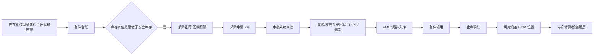

# 05. 备件管理

## 模块目标与边界

备件管理覆盖备件台账、库存水位、PMC 调拨、备件领用、采购申请、采购单、使用绑定、寿命监控、仓储、入库、出库、盘库、智能看板和风控看板。

完整库存系统、采购/ERP 系统、审批系统流程不在本系统内实现，EAM 负责发起、展示、接收回写和业务闭环。具体对接系统名称作为项目配置。

## 页面清单

| 页面 | 主要能力 |
|------|----------|
| 备件台账 | 库存系统同步、库存展示、水位计算、PR/PO 数量、详情 |
| 备件详情 | 仓库库位库存、领用记录、使用记录、采购申请、采购单 |
| PMC 调拨申请 | 新增调拨、审批、待入库、入库回写 |
| 备件领用申请 | 独立领用、工单关联领用、出库确认、打印 |
| 备件采购申请 PR | 新增申请、采购推荐、重复 PR/PO 提醒、审批 |
| 备件采购单 PO | PR 关联、PO 状态、到货日期、采购记录 |
| 备件使用记录 | 待更换备件、在用备件、绑定、换绑 |
| 仓储/入库/出库/盘库 | 仓库库位、入库确认、出库明细、扫码盘库 |
| 智能化看板 | 采购量、消耗量、价格趋势、分类统计；九宫格分类作为可选扩展 |
| 风控看板 | 呆滞库存、周转率、超储、短缺、库龄 |

## 核心闭环流程

## 库存水位规则

备件水位 = 当前库存 + PR 数量 + PO 数量 - (月均消耗量 × 采购周期)

规则：

1. 当备件水位小于等于安全库存时，列表标红并进入短缺预警。
2. 每月采购期间，系统基于水位、安全库存和采购周期生成采购推荐。
3. 创建采购申请时，需检查已存在 PR/PO，存在未闭环在途单据时提醒，避免重复采购。

## PMC 调拨流程

1. 现场备件仓管理员创建 PMC 调拨申请。
2. 选择申请人、领用人、紧急程度、备件明细和需求数量。
3. 提交后进入审批流程；无外部审批系统时，可使用系统内审批或直接确认。
4. 审批通过后，库存系统将所需物料信息发送给 EAM；无集成时允许人工维护入库结果。
5. EAM 生成待入库记录，到货时间用于后续呆滞品计算。
6. 入库后备件可被领用。

## 备件领用流程

1. 领用可独立创建，也可从维修/保养工单跳转创建。
2. 从工单创建时，自动带出关联工单、设备、领料原因。
3. 用户选择仓库、出库类型、领用时间、领料原因和备件明细。
4. 出库确认后扣减库存，单据状态为已出库，不可再修改。
5. 移动端可扫码备件二维码，展示库存数量，确认后完成领用；扫码终端不限定。

## 使用绑定与寿命规则

1. 新领用且未安装的备件进入“待更换备件”。
2. 维修人员选择设备后，系统展示该设备 BOM 中可绑定的备件位置。
3. 选择备件序列号/批号并绑定到指定 BOM 位置。
4. 绑定后备件状态变为“在用”，记录绑定日期和关联设备编码。
5. 带有关联设备编码的备件只能用于该设备。
6. 换绑时旧件下线，新件上线，记录更换人、时间、原因和历史。
7. 理论寿命来自设备 BOM，寿命可按时间或产量/次数计算。
8. 达到预警阈值时进入备件更换提醒。

## 仓储与盘库规则

1. 仓库和库位支持层级配置。
2. 入库单由系统生成单号，选择仓库、库位、入库类型和物料明细。
3. 出库记录展示历史出库单据和时间数据。
4. 盘库选择仓库或库位后，显示当前位置系统库存。
5. 扫码后，若库位已有该物料，跳转库存数量修改；若没有，跳转新增物料库存页面。
6. 提交盘点结果后更新当前库存数据。

## 页面字段清单

### PMC 调拨申请

| 分组 | 字段 | 类型 | 必填 | 来源/规则 |
|------|------|------|------|-----------|
| 单头 | 调拨单编号 | 文本 | 是 | 系统自动生成 |
| 单头 | 标题 | 文本 | 是 | 用户填写 |
| 单头 | 申请人 | 用户选择/反显 | 是 | 默认当前用户 |
| 单头 | 领用人 | 用户选择 | 是 | 可与申请人一致 |
| 单头 | 申请部门 | 部门选择 | 否 | 根据申请人反显 |
| 单头 | 紧急程度 | 下拉 | 否 | 字典配置 |
| 单头 | 单据状态 | 状态 | 是 | 草稿/审批中/已通过/待入库/已入库 |
| 单头 | 审批回传信息 | 文本 | 否 | 外部审批集成时回写 |
| 明细 | 备件编号 | 选择 | 是 | 备件台账 |
| 明细 | 备件名称 | 反显 | 是 | 备件台账 |
| 明细 | 规格型号 | 反显 | 否 | 备件台账 |
| 明细 | 库存数量 | 数值 | 否 | 选择仓库后反显 |
| 明细 | 需求数量/调拨数量 | 数值 | 是 | 大于 0 |
| 明细 | 仓库/库位 | 选择 | 条件必填 | 有仓储模块时必填 |

### 备件领用申请

| 分组 | 字段 | 类型 | 必填 | 来源/规则 |
|------|------|------|------|-----------|
| 单头 | 领用单号 | 文本 | 是 | 系统自动生成 |
| 单头 | 出库类型 | 下拉 | 是 | 领用/借用/调拨等，字典配置 |
| 单头 | 仓库 | 选择 | 是 | 仓库主数据 |
| 单头 | 领用时间 | 日期时间 | 是 | 默认当前时间 |
| 单头 | 领料原因 | 下拉/文本 | 是 | 维修/保养/库存补充/其他 |
| 单头 | 使用设备 | 设备选择 | 否 | 从工单发起时自动带入 |
| 单头 | 关联工单 | 工单选择/反显 | 否 | 维修/保养工单发起时带入 |
| 单头 | 出库状态 | 状态 | 是 | 未出库/已出库/作废 |
| 明细 | 备件编号 | 选择 | 是 | 备件台账 |
| 明细 | 备件名称 | 反显 | 是 | 备件台账 |
| 明细 | 规格型号 | 反显 | 否 | 备件台账 |
| 明细 | 库存数量 | 数值 | 否 | 按仓库/库位反显 |
| 明细 | 领用数量 | 数值 | 是 | 不得超过可用库存，除非允许负库存配置 |
| 明细 | 备件序列号/批号 | 文本/选择 | 否 | 启用序列号管理时必填 |

### 备件采购申请与采购单

| 页面 | 字段 | 类型 | 必填 | 来源/规则 |
|------|------|------|------|-----------|
| 采购申请 | PR 单编号 | 文本 | 是 | 系统生成或外部回写 |
| 采购申请 | 申请人/需求人 | 用户选择 | 是 | 默认当前用户 |
| 采购申请 | 申请部门/需求部门 | 部门选择 | 否 | 按用户反显 |
| 采购申请 | 用途 | 下拉 | 否 | 维修/保养/库存补充 |
| 采购申请 | 紧急程度 | 下拉 | 否 | 字典配置 |
| 采购申请 | 采购组 | 选择/文本 | 否 | 主数据或外部系统 |
| 采购申请明细 | 备件编号、名称、规格型号、单位、申请数量、预计交货日期、供应商 | 子表 | 是 | 备件编号和申请数量必填 |
| 采购单 | PO 编号 | 文本 | 是 | 外部回写或系统生成 |
| 采购单 | 关联 PR 编号 | 文本 | 是 | 采购申请 |
| 采购单 | 采购数量 | 数值 | 是 | 来源采购申请或外部回写 |
| 采购单 | 预计到货日期 | 日期 | 否 | 采购计划 |
| 采购单 | 实际到货日期 | 日期 | 否 | 到货回写 |
| 采购单 | 收货状态 | 状态 | 否 | 未收货/部分收货/已收货 |

### 备件使用绑定、仓储与盘库

| 页面 | 字段 | 类型 | 必填 | 来源/规则 |
|------|------|------|------|-----------|
| 待更换备件 | 备件编号、名称、序列号、领用单号、关联设备、领用日期 | 列表 | 是 | 已出库未绑定备件 |
| 在用备件 | 备件编号、名称、序列号、设备编码、绑定位置、绑定日期、剩余寿命 | 列表 | 是 | 已绑定备件 |
| 绑定弹窗 | 设备、设备 BOM 位置、新备件序列号、旧备件处理方式、绑定原因 | 表单 | 是 | 设备和新备件必填 |
| 仓库配置 | 仓库编码、仓库名称、仓库类型、所属组织、是否启用 | 表单 | 是 | 仓库编码/名称必填 |
| 库位配置 | 库位编码、库位名称、上级库位、库位类型、是否启用 | 表单 | 是 | 支持层级 |
| 入库单 | 入库单号、仓库、库位、入库类型、入库时间、物料明细 | 表单 | 是 | 单号系统生成 |
| 盘库单 | 盘点单号、仓库、库位、盘点人、盘点时间、系统数量、实盘数量、差异数量 | 表单 | 是 | 提交后更新库存或生成差异记录 |

### 备件详情

| Tab/区域 | 字段 |
|----------|------|
| 基础信息 | 备件编号、备件名称、规格型号、分类、单位、品牌、供应商、长描述、附件 |
| 库存信息 | 仓库、库位、库存数量、在途数量、安全库存、更新时间 |
| 领用记录 | 领用单号、领用人、领用部门、领用原因、关联设备、关联工单、领用日期、出库状态 |
| 使用记录 | 使用单号、备件序列号、关联设备编码、绑定位置、绑定日期、解绑日期、绑定状态 |
| 采购申请记录 | PR 单编号、申请人、需求人、申请数量、紧急程度、申请时间、审批状态 |
| 采购单记录 | PO 编号、关联 PR、采购数量、到货数量、预计到货日期、实际到货日期、收货状态 |

### 备件台账列表

| 字段/控件 | 类型 | 必填 | 来源/规则 |
|-----------|------|------|-----------|
| 备件编号/物料编码 | 查询/列表 | 是 | 库存系统同步或系统维护，唯一 |
| 备件名称/物料名称 | 查询/列表 | 是 | 支持模糊查询 |
| 规格型号 | 列表字段 | 否 | 备件主数据 |
| 备件分类 | 查询/列表 | 否 | 字典或物料分类 |
| 单位 | 列表字段 | 否 | 主数据 |
| 品牌/厂家/供应商 | 列表字段 | 否 | 供应商主数据，可选 |
| 仓库库存数量 | 数值 | 否 | 按仓库汇总 |
| 线边仓数量 | 数值 | 否 | 标准产品可配置仓库类型 |
| PMC/中心仓数量 | 数值 | 否 | 标准产品可配置仓库类型 |
| PR 数量 | 数值 | 否 | 采购申请在途数量 |
| PO 数量 | 数值 | 否 | 采购订单在途数量 |
| 安全库存 | 数值 | 否 | 备件主数据或库存策略 |
| 月均消耗量 | 数值 | 否 | 历史领用/使用统计 |
| 采购周期 | 数值 | 否 | 供应商或备件配置 |
| 备件水位 | 数值 | 否 | 当前库存 + PR + PO - 月均消耗量 × 采购周期 |
| 预警状态 | 状态 | 否 | 水位低于安全库存时标红 |
| 操作 | 按钮组 | 否 | 详情、编辑、导出、发起采购/领用 |

### 备件主数据权威来源规则

1. 有外部库存/ERP/WMS 时，备件编号、备件名称、规格型号、单位、分类、供应商等主数据只从外部系统同步；EAM 不提供正式主数据的新增、导入和覆盖入口。
2. 有外部库存/ERP/WMS 时，EAM 只维护安全库存、寿命策略、是否关键备件、绑定规则等业务字段；新增主数据或同步异常通过申请单处理，由外部系统建档或修正后同步回 EAM。
3. 无外部库存/ERP/WMS 时，EAM 作为备件主数据来源，支持单条新增和批量导入。
4. 批量导入用于初始化、历史台账迁移和批量维护，需校验必填、唯一性、字段格式和字典值，并输出成功/失败结果。

## 跨模块联动

1. 设备 BOM 提供备件绑定位置和理论寿命。
2. 维修/保养工单可发起备件领用。
3. 库存系统同步库存并接收入库/出库相关数据。
4. 审批系统处理采购申请和 PMC 调拨审批；也可使用系统内轻量审批。
5. 采购/ERP 系统回写 PR、PO、到货信息。
6. AI 可作为可选扩展，根据备件领用需求查询库存并生成出库单草稿；基础版本不依赖 AI。

## 验收口径

1. 备件台账能展示线边仓、PMC 仓、PR、PO 和水位。
2. 水位低于安全库存时标红，并可进入采购推荐。
3. 工单发起领用时，领用单自动带入工单和设备信息。
4. 已出库单不可修改。
5. 备件绑定后，设备详情生成备件履历并开始寿命计算。
6. 盘库扫码能区分已有物料和新增物料。
7. 无外部库存/ERP/WMS 时，可通过单条新增和批量导入创建备件主数据。
8. 有外部库存/ERP/WMS 时，EAM 不能通过新增或导入覆盖外部同步的主数据字段。
9. EAM 补充字段可批量维护，并保留修改记录。

## 待澄清与迭代事项

1. 九宫格分类属于项目特定展示方式，标准产品默认提供普通分类统计；如启用需确认两个维度。
2. 备件寿命按时间、产量还是设备运行时长计算，需要按备件类型配置。
3. AI 自动生成出库单作为可选扩展，标准产品建议只生成草稿并由人工确认。

