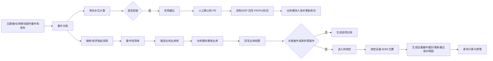

# 05. 备件管理

## 模块目标与边界

备件管理用于支撑设备维修、保养和关键备件寿命追踪，核心闭环为：备件台账与库存水位 → 采购建议/PR → 备件领用 → 仓库出库回写 → 关键备件或寿命管理件绑定设备 BOM 位置 → 设备履历与寿命预警。

标准产品按“简单好用、可独立扩展、可对接外部系统”的原则设计：

1. 备件模块负责业务闭环，不作为库存余额权威来源。
2. 库存余额、仓库、库位、入库、出库、盘点由仓库管理模块或外部 WMS 负责。
3. 主数据支持两种模式：有外部主数据/ERP/WMS 时同步主数据；无外部系统时由 EAM 自主管理。
4. 完整采购、完整 WMS、完整审批流程不在备件模块内实现，备件模块只负责发起、展示、接收回写和业务追踪。
5. 设备相关维度统一来自设备主数据；备件模块不重复维护工厂、车间、产线、工序字段。

## 范围定义与物料边界

| 类型 | 定义 | 示例 | 备件模块处理口径 |
|------|------|------|------------------|
| 设备备件 | 用于设备维修、保养、更换，能够恢复或保障设备运行的零部件 | 传感器、马达、气缸、皮带、轴承、吸嘴、过滤器 | 纳入备件台账，可领用；关键件或寿命件需绑定设备 |
| 维修耗材 | 维修/保养过程中消耗掉的低值材料 | 通用螺丝、胶带、扎带、清洁布、润滑油、酒精 | 可纳入库存和领用统计，不进入设备绑定和寿命管理 |
| 工装治具 | 生产、装夹、测试、定位、搬运等辅助工具或治具 | 钢网、载具、夹具、测试治具、定位治具 | 不作为备件模块主流程，建议由工装模块或外部系统管理 |
| 生产辅料 | 生产过程消耗的辅助物料 | 标签、包装胶带、防静电袋 | 不建议纳入设备备件管理 |

SMT 行业备件的通用定义：用于 SMT 设备维修、保养和更换，能够恢复、维持或提升设备运行状态的零部件、组件或专用耗损件。

## 页面清单

| 页面 | 主要能力 | MVP 口径 |
|------|----------|----------|
| 备件台账 | 主数据展示、库存水位、安全库存、采购建议、管理策略 | 必做 |
| 备件详情 | 基础信息、库存信息、库存/管理策略 | 必做；不展示领用、采购、使用绑定流水 |
| 备件领用申请 | 独立领用、工单关联领用、推送仓库出库、出库回写 | 必做 |
| 备件采购建议 | 定时/手动生成采购建议，查看短缺原因 | 必做 |
| 备件采购申请 PR | 建议转 PR、审批/外部回写、重复 PR/PO 提醒 | 必做 |
| 备件采购单 PO | PR 关联、PO 状态、预计/实际到货日期 | 必做展示 |
| 备件使用绑定 | 待绑定备件、在用备件、绑定、换绑、旧件下线 | 必做 |
| 寿命预警 | 按时间/产量计算寿命，展示预警和到期 | 必做 |
| 仓库模块对接 | 库存查询、出库单创建/状态同步、库存流水查询 | 必做对接 |
| 仓储/入库/出库/盘库 | 仓库、库位、入库、出库、盘点 | 由仓库模块或外部 WMS 支撑 |
| 智能化看板 | 采购量、消耗量、价格趋势、分类统计 | 增强 |
| 风控看板 | 呆滞库存、周转率、超储、短缺、库龄 | 增强；MVP 只做短缺 |

## 核心闭环流程

## 备件台账与主数据规则

### 主数据权威来源

| 场景 | 备件基础主数据来源 | EAM 可维护内容 |
|------|--------------------|----------------|
| 有外部主数据/ERP/WMS | 外部系统同步 | 安全库存、最大库存、采购周期、是否关键备件、是否启用寿命管理、寿命策略、绑定规则 |
| 无外部系统 | EAM 本系统 | 备件基础信息、库存策略、管理策略；支持单条新增和批量导入 |

规则：

1. 有外部主数据/ERP/WMS 时，备件编号、备件名称、规格型号、单位、分类、供应商等主数据只从外部系统同步，EAM 不提供正式主数据的新增、导入和覆盖入口。
2. 有外部系统时，新增主数据或同步异常通过申请单处理，由外部系统建档或修正后同步回 EAM。
3. 无外部系统时，EAM 作为备件主数据来源，支持单条新增和批量导入。
4. 批量导入需校验必填、唯一性、字段格式和字典值，并输出成功/失败结果。

### 备件台账列表字段

| 字段/控件 | 类型 | 必填 | 来源/规则 |
|-----------|------|------|-----------|
| 备件编号/物料编码 | 查询/列表 | 是 | 唯一；外部同步或 EAM 维护 |
| 备件名称/物料名称 | 查询/列表 | 是 | 支持模糊查询 |
| 规格型号 | 列表字段 | 否 | 备件主数据 |
| 备件分类 | 查询/列表 | 否 | 字典或物料分类 |
| 物料类型 | 下拉 | 是 | 设备备件/维修耗材；工装治具不建议纳入主流程 |
| 单位 | 列表字段 | 否 | 主数据 |
| 品牌/厂家/供应商 | 列表字段 | 否 | 供应商主数据，可选 |
| 当前库存 | 数值 | 否 | 仓库模块/WMS 汇总 |
| 可用库存 | 数值 | 否 | 仓库模块/WMS 提供；MVP 可等于当前库存 |
| 安全库存 | 数值 | 否 | EAM 维护，用于短缺判断 |
| 最大库存 | 数值 | 否 | EAM 维护；MVP 只保留字段，不触发超储预警 |
| PR 在途数量 | 数值 | 否 | 未闭环采购申请数量 |
| PO 在途数量 | 数值 | 否 | 未闭环采购订单数量 |
| 系统日均消耗量 | 数值 | 否 | 最近 90 天有效出库/领用数量 ÷ 90 |
| 修正日均消耗量 | 数值 | 否 | 人工维护，用于修正历史数据不足或异常 |
| 最终日均消耗量 | 数值 | 否 | 有修正值取修正值，否则取系统日均消耗量 |
| 采购周期/天 | 数值 | 否 | 按天维护，如 7 天、15 天、30 天 |
| 预计消耗量 | 数值 | 否 | 最终日均消耗量 × 采购周期天数 |
| 备件水位 | 数值 | 否 | 可用库存 + PR 在途数量 + PO 在途数量 - 预计消耗量 |
| 建议采购数量 | 数值 | 否 | 安全库存 + 预计消耗量 - 可用库存 - PR 在途数量 - PO 在途数量 |
| 预警状态 | 状态 | 否 | 正常/短缺；备件水位小于等于安全库存时短缺 |
| 是否关键备件 | 布尔 | 否 | EAM 管理策略字段 |
| 是否启用寿命管理 | 布尔 | 否 | EAM 管理策略字段 |
| 操作 | 按钮组 | 否 | 详情、编辑、导出、发起采购/领用 |

### 备件详情

备件详情只展示主数据和策略信息，不展示领用、采购、使用绑定流水；相关业务流水在独立菜单查看。

| Tab/区域 | 字段 |
|----------|------|
| 基础信息 | 备件编号、备件名称、规格型号、分类、物料类型、单位、品牌、供应商、长描述、附件 |
| 库存信息 | 仓库、库位、当前库存、可用库存、安全库存、最大库存、库存更新时间 |
| 管理策略 | 是否关键备件、是否启用寿命管理、寿命类型、寿命值、预警提前量、采购周期、修正日均消耗量 |

## 备件水位与采购建议规则

### 水位计算

1. 采购周期单位按“天”维护。
2. 系统日均消耗量默认按最近 90 天有效出库/领用记录计算。
3. 用户可维护修正日均消耗量；有修正值时，水位计算使用修正值；无修正值时，使用系统计算值。
4. 预计消耗量 = 最终日均消耗量 × 采购周期天数。
5. 备件水位 = 可用库存 + PR 在途数量 + PO 在途数量 - 预计消耗量。
6. 建议采购数量 = 安全库存 + 预计消耗量 - 可用库存 - PR 在途数量 - PO 在途数量。
7. 建议采购数量小于等于 0 时，不生成采购建议。

### 短缺与超储

1. 当备件水位小于等于安全库存时，触发短缺预警，并在备件台账中标红。
2. 最大库存字段 MVP 先保留，不触发超储预警、不做超储采购拦截。
3. 风控看板后续可基于最大库存扩展超储分析。

### 采购建议与 PR

1. 采购建议支持每天定时生成，也支持用户在台账或采购建议页面手动刷新。
2. 采购建议不自动生成 PR，必须由人工确认后转为采购申请。
3. 人工确认转 PR 时，允许用户调整申请数量、需求日期和用途。
4. 创建 PR 前需检查未闭环 PR/PO；存在在途单据时允许继续创建，但必须强提醒，避免重复采购。
5. PR/PO 的审批、下单、到货由采购/ERP 或审批系统处理；EAM 展示状态并接收回写。

## 备件领用与仓库出库规则

### 领用流程

1. 领用可独立创建，也可从维修/保养工单跳转创建。
2. 从工单创建时，自动带出关联工单、设备、领料原因和申请人。
3. MVP 领用单不审批，提交后直接进入待出库。
4. 领用单提交后推送仓库模块/WMS 生成仓库出库单。
5. 库存扣减由仓库模块/WMS 完成，备件模块不直接扣减库存。
6. 仓库模块/WMS 回写整单出库成功后，备件模块生成领用记录，并判断是否进入待绑定。
7. MVP 暂不支持退料/退库；出库后发现错误先线下处理，后续迭代退库流程。

### 单据关系与限制

| 规则 | 说明 |
|------|------|
| 领用单与出库单 | 1 张备件领用单生成 1 张仓库出库单 |
| 仓库限制 | 1 张领用单只能选择 1 个出库仓库 |
| 多备件 | 同一仓库下可包含多个备件明细 |
| 多仓库 | 需分别创建多张领用单 |
| 部分出库 | MVP 不支持，仓库回写必须整单成功或整单失败 |
| 提交后修改 | 提交后不允许修改单头和明细，只能作废后重建 |
| 负库存 | MVP 不允许负库存出库；库存不足由仓库模块返回失败 |

### 领用单状态

| 状态 | 含义 | 可操作 |
|------|------|--------|
| 草稿 | 未提交，可编辑 | 编辑、删除、提交 |
| 待出库 | 已提交，已推送或等待推送仓库模块 | 查看、作废、重试推送、同步出库状态 |
| 已出库 | 仓库模块/WMS 已整单出库成功 | 查看、打印、后续绑定 |
| 出库失败 | 仓库模块/WMS 返回失败 | 查看失败原因、作废、重试 |
| 作废 | 用户取消，不再执行 | 查看 |

### 仓库对接补偿

1. 仓库接口临时失败时，领用单保持待出库，允许人工点击“重试推送仓库”。
2. 仓库已出库但 EAM 未收到回写时，允许人工点击“同步出库状态”。
3. EAM 不允许人工直接将领用单改为已出库，避免绕过库存权威来源。
4. 出库失败时不生成领用记录、不计入消耗量、不进入待绑定。

## 使用绑定与寿命规则

### 关键备件与寿命管理配置

关键备件和寿命管理在备件台账的管理策略中配置，设备 BOM 位置可补充或覆盖位置级寿命规则。

| 配置位置 | 字段 | 规则 |
|----------|------|------|
| 备件台账 | 物料类型 | 设备备件/维修耗材 |
| 备件台账 | 是否关键备件 | 关键备件出库后需进入待绑定 |
| 备件台账 | 是否启用寿命管理 | 启用后需配置寿命类型、寿命值、预警提前量 |
| 备件台账 | 寿命类型 | 按时间/按产量 |
| 备件台账 | 寿命值 | 时间单位为天；产量单位按业务计数口径配置 |
| 备件台账 | 预警提前量 | 按寿命类型配置提前天数或提前产量 |
| 设备 BOM 位置 | 位置编码、位置名称 | 表示设备上可安装/更换备件的具体位置 |
| 设备 BOM 位置 | 适用备件分类/备件 | 限定该位置可绑定的备件范围 |
| 设备 BOM 位置 | 位置寿命规则 | 配置后优先于备件台账默认寿命规则 |

BOM 位置是设备结构中的可维护、更换安装位置，例如贴片机“贴装头 1 - 吸嘴位 3”、回流焊“加热区 3 - 温度传感器位”、印刷机“刮刀机构 - 左刮刀”。

### 待绑定与绑定规则

1. 出库后，只有“关键备件”或“启用寿命管理”的物料进入待绑定。
2. 维修耗材出库后只生成领用记录，不进入待绑定。
3. 关键备件或寿命管理件绑定时，必须选择设备和设备 BOM 位置。
4. 绑定前校验设备生命周期状态；报废、归档设备禁止绑定新备件，闲置、停用设备是否允许绑定作为配置项。
5. 普通设备备件如需要记录使用，可只绑定设备，不强制选择 BOM 位置。
6. 绑定后备件状态变为在用，记录绑定日期、关联设备编码、设备安装位置路径和 BOM 位置。
7. 换绑时旧件直接标记为“已更换”，MVP 不细分报废、返修、退库。
8. 绑定成功后，系统生成设备备件履历。

### 寿命计算与预警

1. 寿命类型支持按时间和按产量。
2. 按时间寿命从绑定日期开始计算。
3. 按产量寿命支持对接 MES/设备采集/产量系统自动获取；无集成、接口失败或数据缺失时允许人工补录。
4. 产量补录必须记录补录人、补录时间、补录数量和补录原因。
5. 系统每天定时计算一次在用寿命管理件的寿命状态。
6. 寿命状态包括正常、预警、已到期、已更换。
7. 达到预警阈值或已到期时只生成提醒，不自动生成维修工单或保养任务。
8. 已更换/已下线备件不再继续计算寿命。
9. 设备 BOM 位置配置了寿命规则时，优先使用 BOM 位置规则；否则使用备件台账默认寿命规则。

## PMC 调拨流程

1. 标准产品可保留 PMC 调拨入口，但 MVP 优先依赖仓库模块/WMS 支撑调拨和入库。
2. 现场备件仓管理员创建 PMC 调拨申请时，选择申请人、领用人、紧急程度、备件明细和需求数量。
3. 提交后进入审批或确认流程；无外部审批系统时，可使用轻量确认。
4. 审批通过后，由仓库模块/WMS 执行调拨和入库，并回写入库结果。
5. EAM 展示待入库、已入库和到货时间，用于库存水位与后续分析。

## 仓储与盘库规则

1. 仓储能力由仓库模块或外部 WMS 支撑；备件模块只读取库存余额、库存流水和盘点结果。
2. 标准产品可附带轻量仓库模块用于闭环，但当前 MVP 优先对接现有仓库模块/WMS。
3. 仓库模块负责仓库、库位、入库、出库、盘点、库存流水和库存余额。
4. 备件模块需要仓库模块提供当前库存、可用库存、仓库库存、库位库存、出库状态、出库时间、出库人、批号/序列号和库存流水。
5. 盘点差异由仓库模块处理，备件模块可用于展示和风险分析。

## 页面字段清单

### 备件领用申请

| 分组 | 字段 | 类型 | 必填 | 来源/规则 |
|------|------|------|------|-----------|
| 单头 | 领用单号 | 文本 | 是 | 系统自动生成 |
| 单头 | 关联仓库出库单号 | 文本 | 否 | 仓库模块/WMS 回写 |
| 单头 | 申请人 | 用户选择/反显 | 是 | 默认当前用户 |
| 单头 | 领用人 | 用户选择 | 是 | 可与申请人一致 |
| 单头 | 出库仓库 | 选择 | 是 | 一个领用单只能选择一个仓库 |
| 单头 | 领用时间 | 日期时间 | 是 | 默认当前时间 |
| 单头 | 领料原因 | 下拉/文本 | 是 | 维修/保养/其他 |
| 单头 | 使用设备 | 设备选择 | 否 | 从工单发起时自动带入 |
| 单头 | 关联工单 | 工单选择/反显 | 否 | 维修/保养工单发起时带入 |
| 单头 | 单据状态 | 状态 | 是 | 草稿/待出库/已出库/出库失败/作废 |
| 单头 | 失败原因 | 文本 | 否 | 仓库回写失败时记录 |
| 明细 | 备件编号 | 选择 | 是 | 备件台账 |
| 明细 | 备件名称 | 反显 | 是 | 备件台账 |
| 明细 | 规格型号 | 反显 | 否 | 备件台账 |
| 明细 | 单位 | 反显 | 是 | 备件台账 |
| 明细 | 可用库存 | 数值 | 否 | 仓库模块/WMS 返回 |
| 明细 | 领用数量 | 数值 | 是 | 大于 0，不允许负库存出库 |
| 明细 | 备件序列号/批号 | 文本/选择 | 条件必填 | 启用序列号/批号管理时必填 |

### 备件采购申请与采购单

| 页面 | 字段 | 类型 | 必填 | 来源/规则 |
|------|------|------|------|-----------|
| 采购建议 | 建议编号 | 文本 | 是 | 系统生成 |
| 采购建议 | 备件编号、名称、规格型号、单位 | 列表 | 是 | 备件台账 |
| 采购建议 | 短缺原因 | 文本 | 否 | 展示库存、水位、在途、消耗计算结果 |
| 采购建议 | 建议采购数量 | 数值 | 是 | 系统计算，人工转 PR 时可调整 |
| 采购申请 | PR 单编号 | 文本 | 是 | 系统生成或外部回写 |
| 采购申请 | 申请人/需求人 | 用户选择 | 是 | 默认当前用户 |
| 采购申请 | 申请部门/需求部门 | 部门选择 | 否 | 按用户反显 |
| 采购申请 | 用途 | 下拉 | 否 | 维修/保养/库存补充 |
| 采购申请 | 紧急程度 | 下拉 | 否 | 字典配置 |
| 采购申请明细 | 备件编号、名称、规格型号、单位、申请数量、预计交货日期、供应商 | 子表 | 是 | 备件编号和申请数量必填 |
| 采购单 | PO 编号 | 文本 | 是 | 外部回写或系统生成 |
| 采购单 | 关联 PR 编号 | 文本 | 是 | 采购申请 |
| 采购单 | 采购数量 | 数值 | 是 | 来源采购申请或外部回写 |
| 采购单 | 预计到货日期 | 日期 | 否 | 采购计划 |
| 采购单 | 实际到货日期 | 日期 | 否 | 到货回写 |
| 采购单 | 收货状态 | 状态 | 否 | 未收货/部分收货/已收货 |

### 备件使用绑定与寿命

| 页面 | 字段 | 类型 | 必填 | 来源/规则 |
|------|------|------|------|-----------|
| 待绑定备件 | 备件编号、名称、序列号/批号、领用单号、关联设备、领用日期 | 列表 | 是 | 已出库且为关键备件或寿命管理件 |
| 在用备件 | 备件编号、名称、序列号/批号、设备编码、设备安装位置、BOM 位置、绑定日期、寿命状态、剩余寿命 | 列表 | 是 | 已绑定备件 |
| 绑定弹窗 | 设备、设备 BOM 位置、新备件序列号/批号、绑定原因 | 表单 | 是 | 关键备件/寿命件必须选择设备和 BOM 位置 |
| 产量补录 | 补录日期、补录产量、补录原因、补录人、备注/附件 | 表单 | 是 | 按产量寿命且需人工补录时使用 |

## 跨模块联动

1. 主数据模块或外部系统提供备件、分类、单位、供应商等主数据。
2. 仓库模块/WMS 提供库存余额、仓库库位、出库确认、入库确认、盘点和库存流水。
3. 设备主数据模块提供设备台账、设备安装位置、生命周期状态、设备 BOM 位置和设备备件履历。
4. 维修/保养工单可发起备件领用，领用单自动带入工单和设备信息。
5. 采购/ERP 系统回写 PR、PO、到货信息。
6. MES、设备采集或产量系统可提供按产量寿命所需的产量数据；无集成时允许人工补录。
7. 设备预警事件推送短缺预警和寿命预警到公共消息模块，不自动生成维修、保养任务，也不直接修改设备生命周期或 E10 运行状态。
8. AI 可作为可选扩展，根据备件领用需求查询库存并生成出库单草稿，基础版本不依赖 AI。

## 验收口径

1. 备件台账能按编号、名称、分类查询，并展示当前库存、可用库存、安全库存、最大库存、PR 在途、PO 在途和备件水位。
2. 库存余额以仓库模块/WMS 为准，备件模块不直接扣减库存。
3. 系统按“天”维护采购周期，并按最近 90 天有效出库/领用记录计算系统日均消耗量。
4. 用户可维护修正日均消耗量；有修正值时使用修正值计算，无修正值时使用系统计算值。
5. 系统能计算预计消耗量、备件水位和建议采购数量；建议采购数量小于等于 0 时不生成采购建议。
6. 当备件水位小于等于安全库存时，系统触发短缺预警，并在备件台账中标红。
7. 采购建议支持定时生成和手动刷新，不自动生成 PR，需人工确认后转 PR。
8. 存在未闭环 PR/PO 时，允许继续创建 PR，但系统必须强提醒。
9. 工单发起领用时，领用单自动带入工单和设备信息。
10. 1 张备件领用单只能选择 1 个出库仓库，并生成 1 张仓库出库单。
11. MVP 不支持部分出库，仓库模块/WMS 必须回写整单成功或整单失败。
12. 领用单提交后不允许修改；提交后发现错误，只能作废后重建。
13. 仓库回写成功后，领用单状态变为已出库，并生成领用记录。
14. 仓库回写失败后，领用单状态变为出库失败，记录失败原因，且不计入消耗、不进入待绑定。
15. 系统支持人工触发“重试推送仓库”和“同步出库状态”，但不允许人工直接改为已出库。
16. 出库后只有关键备件或寿命管理件进入待绑定；维修耗材只生成领用记录。
17. 关键备件或寿命管理件绑定时，必须选择设备和 BOM 位置；绑定成功后生成设备备件履历。
18. 报废、归档设备禁止绑定新备件。
19. 换绑时旧件直接标记为“已更换”，MVP 不细分报废、返修、退库。
20. 寿命管理支持按时间和按产量；按产量支持自动获取和人工补录。
21. 系统每天定时计算寿命状态；达到预警阈值或到期时只提醒，不自动生成维修工单或保养任务。
22. 备件详情不展示领用记录、采购记录、使用绑定记录；这些内容通过独立菜单查看。

## 待澄清与迭代事项

1. 九宫格分类属于项目特定展示方式，标准产品默认提供普通分类统计；如启用需确认两个维度。
2. 退料/退库、出库冲销、旧件报废/返修、旧件回收入库作为后续迭代。
3. 超储预警、呆滞库存、库龄分析和周转率作为风控看板增强能力。
4. 内置轻量仓库模块作为标准产品可选能力，当前 MVP 优先对接现有仓库模块/WMS。
5. AI 自动生成出库单作为可选扩展，标准产品建议只生成草稿并由人工确认。
