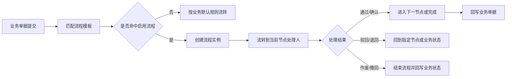

# 06. 工作流配置

## 模块目标与边界

工作流配置模块用于配置业务单据的审批、确认、退回、作废、转交和节点流转规则，支撑设备、备件、仓库、消息等模块的流程控制。

本模块只负责流程模板、节点、条件、动作和流转记录，不替代业务模块本身的状态机；业务模块负责定义业务状态，工作流负责决定谁处理、按什么条件流转、流转后触发什么动作。

## 页面清单

| 页面 | 主要能力 | MVP 口径 |
|------|----------|----------|
| 流程模板 | 新增、编辑、启停流程模板 | 必做 |
| 流程节点配置 | 审批人、确认人、节点动作、超时规则 | 必做 |
| 流程条件配置 | 按金额、数量、紧急程度、仓库、组织、单据类型分流 | 必做 |
| 流程实例监控 | 查看当前节点、处理人、流转历史、异常状态 | 必做 |
| 流程委托/转办 | 处理人转交、代理处理 | 增强 |
| 流程版本管理 | 模板版本、生效时间、历史实例保留 | 增强 |

## 适用业务范围

| 业务对象 | 可配置流程 | 默认建议 |
|----------|------------|----------|
| 备件采购申请 PR | 提交、审批、驳回、撤回、生成 PR/PO 前确认 | MVP 可配置审批 |
| PMC 调拨申请 | 提交、审批、确认入库 | MVP 可配置确认 |
| 备件领用单 | 提交、作废、出库前确认 | MVP 默认不审批，可选启用 |
| 仓库入库单 | 入库确认、异常退回 | 轻量仓库时可配置 |
| 仓库出库单 | 出库确认、出库失败处理 | 轻量仓库时可配置 |
| 盘点差异 | 差异确认、调整审批 | 增强能力 |
| 维修工单 | 派单、转派、协助、结案验收 | 业务状态为主，流程可配置处理人 |
| 预防性维护任务 | 验收、退回重做、逾期升级 | 业务状态为主，流程可配置验收人 |

## 主业务流程

## 规则

1. 流程模板按业务对象、组织范围、单据类型和启用状态匹配。
2. 一个业务对象同一组织范围同一时间只能命中一个启用流程模板。
3. 流程实例创建后使用当时的流程版本；后续模板修改不影响已创建实例。
4. 节点处理人可按角色、用户、部门负责人、设备负责人、仓库负责人、发起人上级配置。
5. 流程条件可使用业务单据字段，但不得修改业务字段。
6. 流程完成、驳回、退回、撤回、作废后，必须回写业务单据状态和流转记录。
7. 流程超时可触发消息通知和逐级上报，但是否自动跳转下一节点需配置。
8. 流程模板、节点配置和条件配置均需支持模板下载、导入、导出和错误报告。

## 页面字段清单

| 页面 | 字段/控件 | 类型 | 必填 | 来源/规则 |
|------|-----------|------|------|-----------|
| 流程模板 | 模板编码、模板名称、业务对象、适用组织、启用状态、生效时间 | 表单 | 是 | 编码唯一 |
| 流程节点 | 节点编码、节点名称、节点类型、处理人规则、允许动作、超时时长 | 子表 | 是 | 节点类型包括审批、确认、抄送、结束 |
| 流程条件 | 条件字段、运算符、条件值、目标节点 | 子表 | 否 | 支持按业务字段分流 |
| 流程动作 | 通过、驳回、退回、撤回、作废、转交 | 配置项 | 是 | 不同节点可配置不同动作 |
| 流程实例 | 实例编号、业务对象、业务单号、当前节点、当前处理人、状态 | 列表 | 是 | 用于监控 |
| 流转记录 | 节点、处理人、处理动作、处理意见、处理时间、前后状态 | 列表 | 是 | 全流程可追溯 |

## 跨模块联动

1. 备件采购、调拨、领用可引用工作流决定是否审批、谁审批、驳回到哪里。
2. warehouse 可引用工作流处理入库确认、出库确认和盘点差异确认。
3. 维修工单和预防性维护任务可引用工作流配置验收人、转派规则和逾期升级。
4. 消息通知模块接收流程待办、超时、驳回、完成等事件。
5. 系统管理提供用户、角色、部门、岗位和数据权限，工作流只引用这些对象。

## 验收口径

1. 启用流程的业务单据提交后，能生成流程实例并流转到正确处理人。
2. 未启用流程的业务单据按业务模块默认规则流转。
3. 流程通过、驳回、退回、撤回、作废后，业务单据状态同步变化。
4. 流程模板修改后，不影响已经创建的流程实例。
5. 任一流程节点处理均记录处理人、处理时间、处理动作和处理意见。
6. 流程模板导入失败时可下载错误报告，错误需包含行号、字段和原因。

## 待澄清与迭代事项

1. 【待确认】工作流是否需要对接外部 OA/审批系统；当前建议标准产品内置轻量流程，对接外部审批作为扩展。
2. 【待确认】维修工单是否强制走工作流审批，当前建议维修以业务状态机为主，工作流只做验收、转派和升级配置。
3. 【待确认】流程设计器是否需要可视化拖拽，MVP 可先用表单化节点配置。
