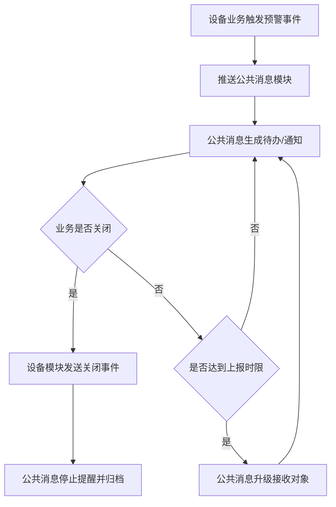

# 07. 设备预警事件与公共消息对接

## 模块目标与边界

设备模块不单独建设通知中心。设备侧只负责识别业务风险并生成“预警事件”，公共消息模块负责系统待办、企业 IM、短信、邮件、看板消息、订阅、已读未读、发送日志和逐级上报。

设备预警事件只表达“发生了什么、谁应该处理、从哪里处理、何时关闭”。它不直接修改设备生命周期、E10 运行状态、工单状态、库存余额或指标结果。设备相关预警应引用设备编号和设备安装位置路径，便于定位现场。

| 边界项 | 设备模块负责 | 公共消息模块负责 |
|--------|--------------|------------------|
| 触发条件 | 判断任务逾期、库存短缺、寿命临期、KPI 异常、E10 异常持续等业务事件 | 不判断设备业务口径 |
| 事件内容 | 生成预警事件、业务链接、建议接收角色、关闭条件、幂等键 | 按事件生成消息、待办、通知记录 |
| 接收对象 | 提供建议对象，如执行人、设备负责人、备件管理员、责任班组 | 结合订阅、角色、组织负责人和上报规则解析最终接收人 |
| 渠道模板 | 提供业务变量，如设备、位置、逾期时长、指标值 | 维护模板、渠道、发送策略、失败重试 |
| 逐级上报 | 提供事件严重等级和业务是否已关闭 | 按规则升级提醒并记录发送过程 |
| 关闭动作 | 业务完成、恢复正常或人工关闭时发送关闭事件 | 停止后续提醒，标记消息/待办关闭 |

## 预警类型

| 类型 | 触发来源 | 建议接收对象 | 关闭条件 |
|------|----------|----------------|----------|
| 点巡检/保养任务逾期 | 任务截止时间超期 | 执行人、班组长、设备负责人 | 任务完成、任务取消或人工关闭 |
| 维修工单待处理 | OEE 触发、安灯告警或手动叫修 | 责任人、派单人、维修班组 | 工单进入处理中/已完成/已关闭 |
| 协助邀请 | 维修工单新增协助人 | 协助人 | 协助人接受/拒绝或工单关闭 |
| 备件短缺 | 库存低于安全库存 | 备件管理员、采购相关人员 | 库存恢复、采购流程创建或人工关闭 |
| 备件寿命临期/超期 | 在用备件寿命计算 | 设备负责人、备件管理员 | 备件更换、寿命重置或人工关闭 |
| 呆滞/超储库存 | 风控看板计算 | 备件管理员、管理者 | 库存风险解除或人工关闭 |
| KPI 异常 | 指标未达目标或突变 | 管理者、责任部门 | 指标恢复、改进任务创建或人工关闭 |
| E10 异常状态持续 | UD/SB/SD 等状态持续超过阈值 | 设备负责人、维修班组、生产管理者 | E10 恢复 PT/SB、已生成维修工单或人工关闭 |
| 设备生命周期异常 | 已投产未启用、调拨超期、改造超期等 | 设备管理员、责任部门 | 生命周期节点推进或人工关闭 |

## 逐级上报流程

规则：

1. 设备模块可配置是否生成某类预警事件。
2. 逐级上报是否启用、上报层级、通知渠道、模板和发送频率由公共消息模块配置。
3. 业务完成、恢复正常或人工关闭后，设备模块向公共消息模块发送关闭事件。
4. 公共消息模块保留发送记录、已读未读、失败重试和上报轨迹。

## 消息通知规则

1. 维修工单生成、协助邀请、任务逾期等动作只在设备侧生成事件，不直接调用短信、邮件或企业 IM。
2. 公共消息模块根据事件类型生成系统待办、站内信、企业 IM、短信、邮件或看板消息。
3. 审批类单据由外部审批系统或系统内轻量审批处理，EAM 展示审批状态和回传结果；审批消息仍由公共消息模块承接。
4. 通知失败日志、重试策略和兜底待办归公共消息模块负责。

## 看板预警规则

1. 备件台账低于安全库存时标红。
2. PPM 分析中实际值低于目标/设计值时标红，超过目标/设计值时可用正常色展示；目标来源为 OEE/产能配置，不来自设备台账。
3. KPI 看板中 DT、DT率、MTTR、MTBF、OEE 等指标应与目标值对比并标识异常。
4. 风控看板展示呆滞库存、超储、短缺和库龄风险。
5. E10=UD 持续超阈值时，可触发故障停机预警；是否自动建单由 OEE/维修规则决定。
6. 报废、归档设备不应触发新的点巡检/保养逾期预警，只保留历史预警记录。

## 页面字段清单

### 设备预警事件规则

| 字段 | 类型 | 必填 | 来源/规则 |
|------|------|------|-----------|
| 规则编号 | 文本 | 是 | 系统生成 |
| 规则名称 | 文本 | 是 | 用户填写 |
| 预警类型 | 下拉 | 是 | 任务逾期、库存短缺、寿命临期、KPI 异常等 |
| 适用模块 | 多选 | 是 | 点检、保养、维修、备件、OEE |
| 启用状态 | 开关 | 是 | 停用后不再触发 |
| 触发条件 | 条件配置 | 是 | 如超期时长、水位阈值、寿命阈值、指标阈值 |
| 建议接收角色 | 用户/角色/组织 | 是 | 如执行人、负责人、主管、备件管理员 |
| 业务处理入口 | 链接模板 | 是 | 跳转到任务、工单、备件或指标明细 |
| 关闭条件 | 条件配置 | 是 | 如任务完成、库存恢复、E10 恢复、人工关闭 |
| 幂等规则 | 文本/规则 | 是 | 同一业务对象同一预警类型避免重复生成 |
| 消息配置引用 | 选择 | 否 | 关联公共消息模块的消息模板/订阅规则，不在设备侧维护渠道细节 |

### 预警记录

| 字段 | 类型 | 必填 | 来源/规则 |
|------|------|------|-----------|
| 预警编号 | 文本 | 是 | 系统生成 |
| 预警类型 | 枚举 | 是 | 来自规则 |
| 关联业务单号 | 链接 | 是 | 任务、工单、备件、指标记录 |
| 关联设备/备件 | 链接 | 否 | 按业务对象展示 |
| 设备安装位置 | 文本 | 否 | 设备相关预警展示完整位置路径 |
| 触发时间 | 日期时间 | 是 | 系统记录 |
| 建议接收对象 | 用户/角色 | 是 | 设备侧计算出的建议对象 |
| 公共消息事件ID | 文本 | 否 | 推送公共消息模块成功后回写 |
| 消息处理状态 | 状态 | 否 | 公共消息模块回传，如待通知/已通知/通知失败/已关闭 |
| 处理状态 | 状态 | 是 | 待处理/已处理/已关闭 |
| 关闭时间 | 日期时间 | 否 | 业务完成或人工关闭 |

## 验收口径

1. 逾期任务、库存短缺、寿命临期、KPI 异常、E10 异常持续等事件能按设备侧规则生成预警事件。
2. 预警事件能推送到公共消息模块，并携带业务链接、建议接收对象、设备安装位置和幂等键。
3. 任务完成、库存恢复、E10 恢复或人工关闭后，设备模块能发送关闭事件，公共消息模块停止后续提醒。
4. 备件低水位、寿命临期、KPI 不达标均可在对应页面看到预警标识。
5. 设备相关预警记录可展示设备安装位置。
6. 预警触发不应直接修改设备生命周期、E10 状态、库存余额或指标结果。
7. 通知渠道、模板、已读未读、失败重试、逐级上报记录均不在设备模块重复建设，由公共消息模块实现。

## 待澄清与迭代事项

### 1. 公共消息事件协议

| 方案 | 说明 | 优点 | 风险 |
|------|------|------|------|
| A. 设备模块直接发送消息 | 设备模块维护渠道、模板、接收人、重试 | 短期实现快 | 和公共消息重复建设，后期难统一 |
| B. 只发送简单文本事件 | 设备模块只传标题、内容、接收人 | 接口简单 | 幂等、关闭、升级、业务跳转能力不足 |
| C. 标准事件协议 | 设备模块发送事件类型、业务对象、幂等键、接收建议、跳转链接、关闭事件 | 通用、可追踪、可关闭 | 需要先定义协议字段 |

推荐：C. 标准事件协议。

推荐原因：预警不是一次性通知，后续还有提醒、升级、关闭、已读和发送日志。标准事件协议能避免重复推送和消息悬挂。

建议字段：

| 字段 | 说明 |
|------|------|
| eventType | 预警类型，如任务逾期、库存短缺、KPI 异常 |
| businessType | 业务对象类型，如点检任务、维修工单、备件 |
| businessId | 业务对象 ID |
| idempotentKey | 幂等键，同一对象同一类型避免重复生成 |
| title/content | 消息标题和摘要 |
| receiverCandidates | 建议接收人、角色或组织 |
| actionUrl | 业务处理入口 |
| closeCondition/closeEvent | 关闭条件或关闭事件 |

### 2. 上报层级和人员关系来源

| 方案 | 说明 | 优点 | 风险 |
|------|------|------|------|
| A. 组织架构 | 按部门负责人逐级上报 | 数据来源统一 | 设备责任不一定等同组织上下级 |
| B. 角色配置 | 按设备负责人、班组长、主管等角色上报 | 贴合设备业务 | 角色关系要维护 |
| C. 自定义规则 | 按设备类型、位置、等级、预警类型配置上报链 | 灵活 | 配置复杂 |
| D. 角色默认 + 自定义覆盖 | 默认按设备责任角色上报，特殊场景用规则覆盖 | 平衡通用和灵活 | 需要规则优先级 |

推荐：D. 角色默认 + 自定义覆盖。

推荐原因：设备管理的责任链通常是设备负责人、班组长、设备主管，不完全等于行政组织。默认角色链好用，特殊场景再配置。

### 3. KPI 异常是否主动通知

| 方案 | 说明 | 优点 | 风险 |
|------|------|------|------|
| A. 默认全部通知 | KPI 不达标立即通知责任人 | 管理强提醒 | 消息噪音大，容易疲劳 |
| B. 默认只看板展示 | KPI 异常只在看板标识 | 不打扰用户 | 重要异常可能没人处理 |
| C. 分级通知 | 轻微异常看板展示，严重或持续异常主动通知 | 平衡提醒和噪音 | 需要阈值和持续时间规则 |

推荐：C. 分级通知。

推荐原因：KPI 是趋势指标，不适合一次波动就通知。持续异常、关键设备异常、超过红线的指标才主动推送更合理。

