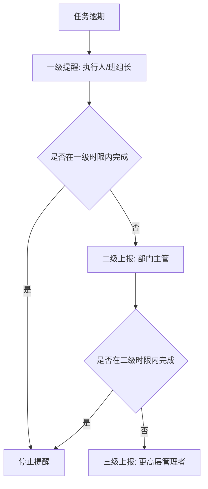

# 07. 预警通知与逐级上报

## 模块目标与边界

预警通知模块统一处理任务逾期、维修协助、备件短缺、备件寿命、采购推荐、库存风险和逐级上报。通知渠道包括系统待办、企业 IM、短信、邮件和看板预警，具体渠道按项目配置。

## 预警类型

| 类型 | 触发来源 | 通知对象 |
|------|----------|----------|
| 点巡检/保养任务逾期 | 任务截止时间超期 | 执行人、班组长、上级 |
| 维修工单待处理 | OEE 触发或叫修 | 责任人、派单人 |
| 协助邀请 | 维修工单新增协助人 | 协助人 |
| 备件短缺 | 备件水位低于安全库存 | 备件管理员、采购相关人员 |
| 备件寿命临期/超期 | 在用备件寿命计算 | 设备负责人、备件管理员 |
| 呆滞/超储库存 | 风控看板计算 | 备件管理员、管理者 |
| KPI 异常 | 指标未达目标或突变 | 管理者、责任部门 |

## 逐级上报流程

规则：

1. 全局开关控制逐级上报是否启用。
2. 不同业务类型可配置不同上报时限、层级和通知模板。
3. 任务完成后，停止后续提醒。
4. 上报记录需可追溯，包括触发时间、通知对象、通知渠道、发送结果。

## 消息通知规则

1. 维修工单生成后向责任人发送待接单消息。
2. 协助邀请向协助人发送接受/拒绝消息。
3. 审批类单据由外部审批系统或系统内轻量审批处理，EAM 展示审批状态和回传结果。
4. 通知失败需记录日志，并允许系统内待办兜底。

## 看板预警规则

1. 备件台账低于安全库存时标红。
2. PPM 分析中实际值低于设计值时标红，超过设计值时可用正常色展示。
3. KPI 看板中 DT、DT率、MTTR、MTBF、OEE 等指标应与目标值对比并标识异常。
4. 风控看板展示呆滞库存、超储、短缺和库龄风险。

## 页面字段清单

### 预警规则配置

| 字段 | 类型 | 必填 | 来源/规则 |
|------|------|------|-----------|
| 规则编号 | 文本 | 是 | 系统生成 |
| 规则名称 | 文本 | 是 | 用户填写 |
| 预警类型 | 下拉 | 是 | 任务逾期、库存短缺、寿命临期、KPI 异常等 |
| 适用模块 | 多选 | 是 | 点检、保养、维修、备件、OEE |
| 启用状态 | 开关 | 是 | 停用后不再触发 |
| 触发条件 | 条件配置 | 是 | 如超期时长、水位阈值、寿命阈值、指标阈值 |
| 通知对象 | 用户/角色/组织 | 是 | 可配置执行人、负责人、主管、角色 |
| 通知渠道 | 多选 | 是 | 系统待办、企业 IM、短信、邮件等 |
| 通知模板 | 文本模板 | 是 | 支持变量，如单号、设备、逾期时长 |
| 上报层级 | 数值/子表 | 否 | 开启逐级上报时配置 |
| 重复提醒间隔 | 数值+单位 | 否 | 防止高频打扰 |

### 上报层级配置

| 字段 | 类型 | 必填 | 来源/规则 |
|------|------|------|-----------|
| 层级 | 数值 | 是 | 1、2、3... |
| 触发时限 | 数值+单位 | 是 | 距首次逾期或上一层提醒的时间 |
| 上报对象 | 用户/角色/组织 | 是 | 支持组织负责人、指定角色或固定人员 |
| 通知模板 | 文本模板 | 否 | 默认继承规则模板 |

### 预警记录

| 字段 | 类型 | 必填 | 来源/规则 |
|------|------|------|-----------|
| 预警编号 | 文本 | 是 | 系统生成 |
| 预警类型 | 枚举 | 是 | 来自规则 |
| 关联业务单号 | 链接 | 是 | 任务、工单、备件、指标记录 |
| 关联设备/备件 | 链接 | 否 | 按业务对象展示 |
| 触发时间 | 日期时间 | 是 | 系统记录 |
| 当前层级 | 数值 | 否 | 逐级上报时展示 |
| 通知对象 | 用户/角色 | 是 | 实际发送对象 |
| 通知渠道 | 枚举 | 是 | 实际发送渠道 |
| 发送状态 | 状态 | 是 | 成功/失败/待重试 |
| 处理状态 | 状态 | 是 | 待处理/已处理/已关闭 |
| 关闭时间 | 日期时间 | 否 | 业务完成或人工关闭 |

## 验收口径

1. 逾期任务能按配置触发一级、二级、三级提醒。
2. 任务完成后不再继续上报。
3. 外部通知失败不影响系统内待办。
4. 备件低水位、寿命临期、KPI 不达标均可在对应页面看到预警标识。

## 待澄清与迭代事项

1. 上报层级和人员关系来源需确认，是组织架构、角色配置还是自定义规则。
2. 外部消息模板字段和交互按钮需结合企业规范确认。
3. KPI 异常是否触发主动通知，当前更明确的是看板展示。

