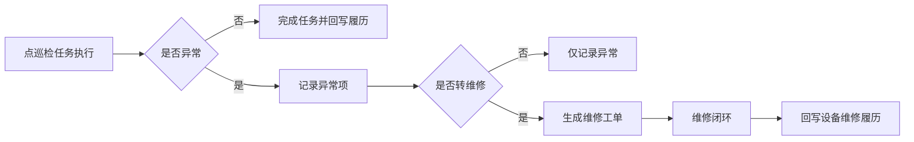
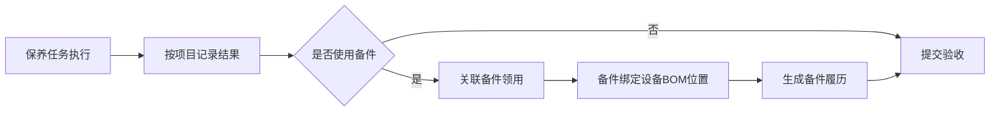
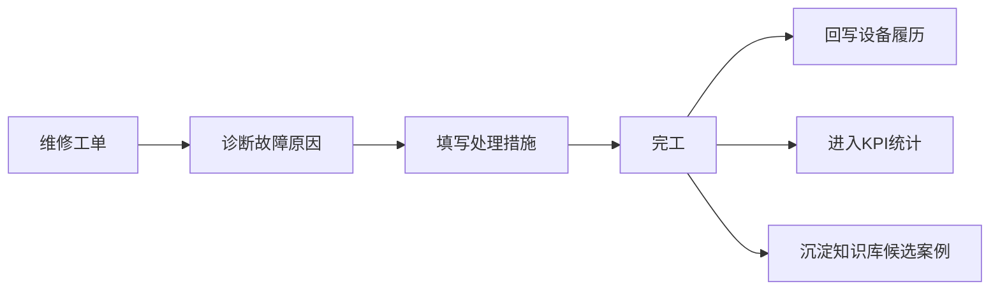
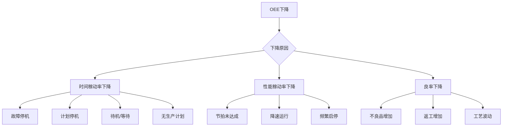
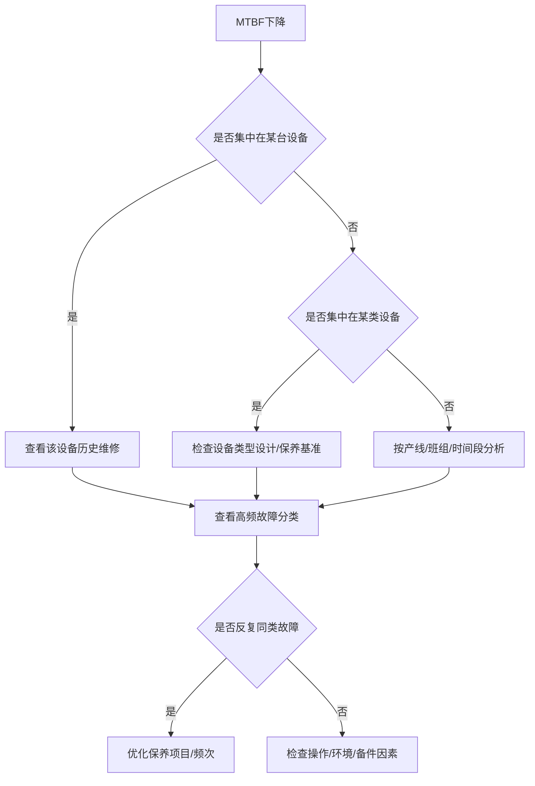
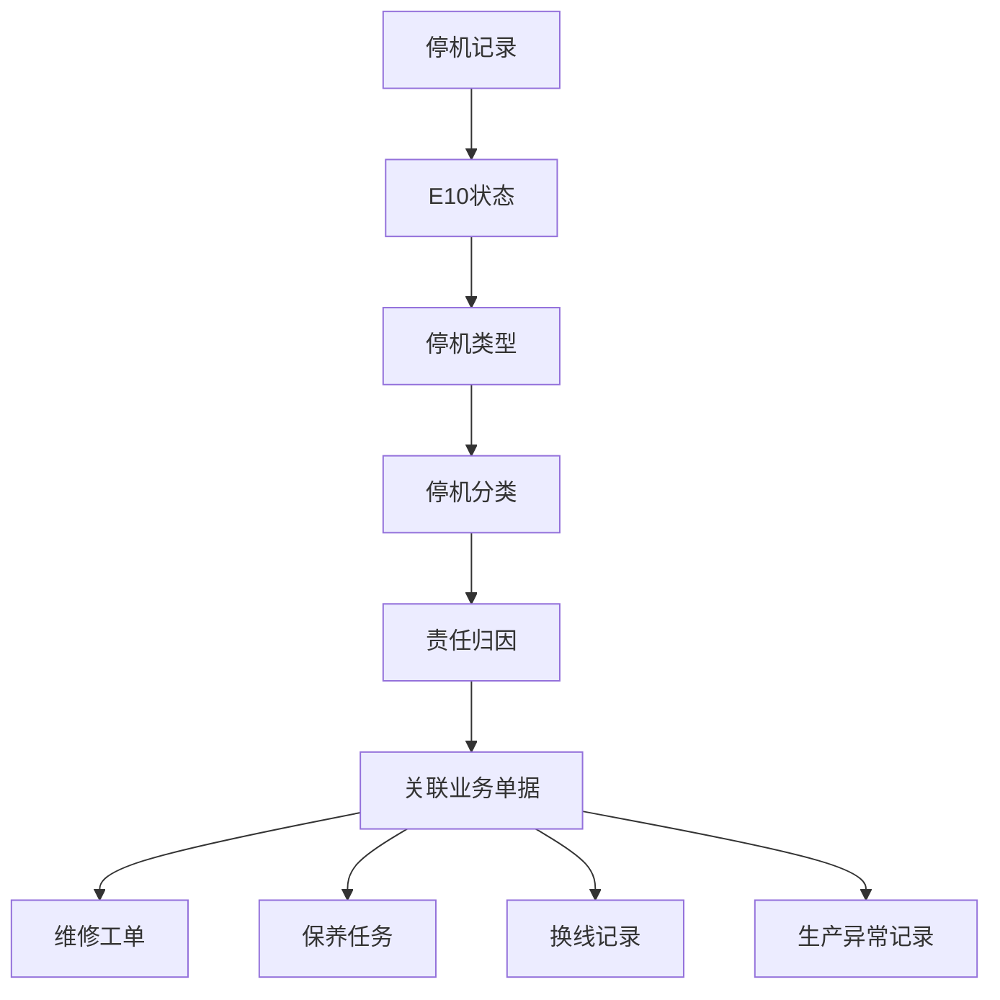
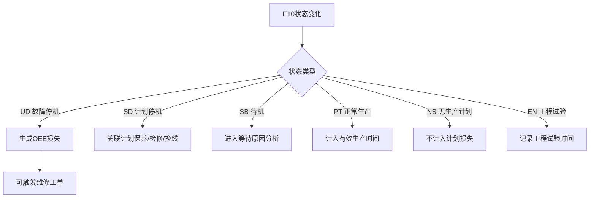
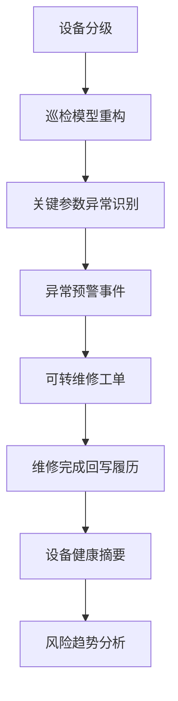
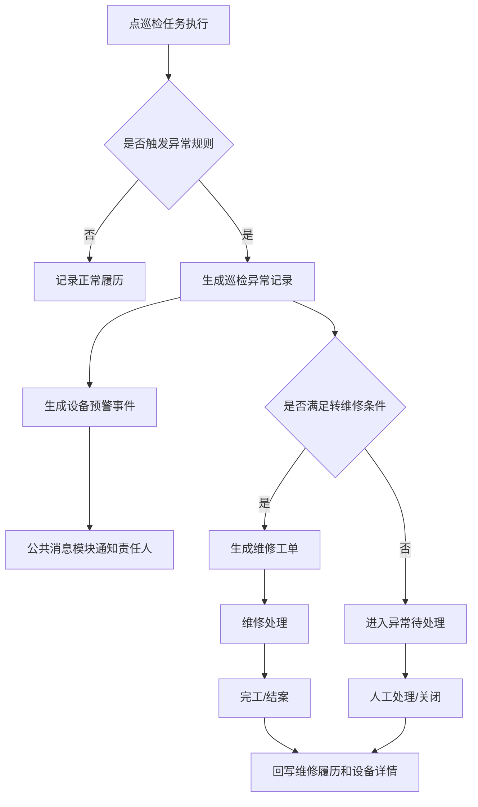

# 09. 公众号方法论解读

本文沉淀三篇公众号文章对设备管理标准产品设计的启发。文章观点不直接等同于已确认需求；已采纳内容需在对应模块文档中转成可验证的字段、流程、状态或验收口径。

参考文章：

1. 设备管理系统搭建——设备台账到底该怎么做？
2. 一文讲清：设备管理的5大核心模块（点检、保养、维修、备件、台账）
3. 设备管理的5个关键指标：OEE、MTBF、MTTR...怎么用？
4. 2小时，我上线了一套AI设备巡检系统！

## 1. 设备台账到底该怎么做？

### 核心观点

设备台账不是登记表，而是设备管理数据库。台账字段不是越多越好，而是要围绕管理动作和后续统计设计。

文章强调三条原则：

1. 一机一档，设备编号必须唯一。
2. 字段围绕管理行为设计，不把说明书和大量技术参数塞进主表。
3. 字段必须服务未来统计，不会用于查询、分析或联动的字段不要加。

### 推荐字段结构

| 模块 | 推荐字段 | 标品解释 |
|------|----------|----------|
| 身份识别 | 设备编号、设备名称、设备型号、设备类型 | 解决“设备是谁”，设备编号是全局唯一主键 |
| 位置与责任 | 设备安装位置、所属部门、负责人、维修责任班组、保养责任班组 | 解决“设备在哪里、归谁管、谁负责处理” |
| 管理属性 | 设备等级、是否生产设备、资产/使用状态、启用状态 | 支撑差异化点检、保养、维修和统计 |
| 运行与维护近况 | 当前运行状态、最近点检日期、最近巡检日期、最近保养日期、最近维修日期、下次点检日期、下次保养日期 | 用于台账列表快速判断设备近况 |
| 附件资料 | 设备图片、说明书、技术资料、验收附件 | 技术资料以附件方式管理，不占用主表字段 |

### 设备安装位置字段口径

台账字段名推荐使用“设备安装位置”，用户容易理解。后台说明为“关联工厂实例/工厂建模节点”。

| 字段 | 类型 | 必填 | 来源/规则 |
|------|------|------|-----------|
| 设备安装位置 | 层级选择 | 是 | 关联工厂建模主数据节点，可选择工厂、车间、产线、工序/工段等层级，建议生产设备绑定到最小可管理节点 |

不建议在设备台账里拆成“工厂、车间、产线、工序/工段”多个独立字段。它们属于工厂建模主数据，由设备安装位置路径反查。

示例：

```text
设备安装位置：一厂 / SMT车间 / SMT-01线 / 印刷工序
```

### 不建议进入台账主表的内容

| 内容 | 原因 | 推荐归属 |
|------|------|----------|
| 设计 PPM | 属于产能配置 | OEE/产能配置 |
| 实际 PPM | 属于生产统计结果 | OEE/PPM 分析 |
| OEE 目标 | 属于指标目标配置 | OEE/KPI 配置 |
| 大量技术参数 | 维护成本高，现场不愿填 | 扩展属性、附件、知识库 |
| 说明书全文 | 不适合结构化维护 | 附件、知识库 |
| 备用字段 | 含义不清，后期失控 | 不设计 |
| 重复名称字段 | 容易造成口径混乱 | 保留一个标准字段 |

### 标品落地规则

1. 设备编号必须全局唯一，维修、点检、保养、备件、OEE 都引用该编号。
2. 设备安装位置关联工厂建模节点，不重复维护工厂、车间、产线、工序字段。
3. 最近点检、最近巡检、最近保养、最近维修、下次点检、下次保养等日期来自业务模块自动回写或实时聚合，不允许在台账手工维护。
4. 生产参数不进入设备台账。
5. 技术资料放附件、扩展属性或知识库，不塞入主表。
6. 状态必须与业务联动，维修中、报废、投产、停用等状态不能只是静态展示。

### 台账列表示例

| 设备编号 | 设备名称 | 设备类型 | 设备安装位置 | 设备等级 | 当前状态 | 最近点检 | 最近保养 | 最近维修 | 负责人 |
|----------|----------|----------|--------------|----------|----------|----------|----------|----------|--------|
| EQ-SMT-001 | 印刷机1号 | 印刷机 | 一厂 / SMT车间 / SMT-01线 / 印刷工序 | 关键 | PT 正常生产 | 2026-06-03 | 2026-05-28 | 2026-05-20 | 张三 |

## 2. 设备管理的五大核心模块

### 核心观点

设备管理不是点检、保养、维修、备件、台账五张独立表，而是一条闭环。模块之间如果没有联动，数据很多也无法形成管理价值。


### 模块职责拆解

| 模块 | 标品职责 | 关键产出 |
|------|----------|----------|
| 台账 | 统一设备身份、位置、责任、状态和生命周期 | 设备主数据、生命周期履历、设备详情 |
| 点巡检 | 发现异常，形成检查履历，可转维修工单 | 点巡检任务、异常项、点巡检履历 |
| 保养 | 预防故障，沉淀保养结果和备件使用 | 保养任务、保养履历、备件使用记录 |
| 维修 | 处理故障，记录原因、措施、耗时和结果 | 维修工单、故障履历、KPI 节点时间 |
| 备件 | 支撑维修/保养，记录领用、绑定、更换和寿命 | 备件领用、绑定履历、寿命预警 |

### 典型闭环

#### 点巡检异常到维修



#### 保养到备件



#### 维修到知识沉淀



### 标品落地规则

1. 点巡检异常可转维修工单，标准产品默认不强制，客户可配置。
2. 保养使用备件后，应关联备件领用和设备 BOM 位置。
3. 维修使用备件后，应回写设备备件履历。
4. 点检、巡检、保养、维修完成后，应回写或聚合设备台账近期日期。
5. 所有业务记录最终都应能在设备详情页按设备聚合查看。
6. 台账不是所有数据的维护入口，而是所有业务围绕设备沉淀的视图入口。

### 对本项目的设计启发

本项目设备模块应从“台账字段管理”升级为“设备主数据与生命周期管理”。台账负责统一设备对象，业务模块负责产生记录，详情页负责聚合履历，报表负责分析指标。

## 3. 设备管理的 5 个关键指标：OEE、MTBF、MTTR...怎么用？

### 3.1 文章核心解读

这篇文章的核心不是介绍指标定义，而是强调一个产品设计原则：

> 设备管理指标不能停留在“看板展示”，必须能反向推动现场动作。

很多系统的问题是：管理层看 OEE、MTTR、MTBF，现场人员却还在找人、找备件、等派单。指标和现场动作没有打通，最后就变成“报表很好看，现场没变化”。

因此，标品设计不能只做指标展示，而要做成：


也就是：

1. 设备状态、维修、点检、保养、备件、生产数据先进入系统。
2. 系统计算 OEE、MTBF、MTTR、停机时长、计划达成率等指标。
3. 指标异常后，能下钻到设备、工序、班组、原因、工单。
4. 用户能进一步发起维修、保养、专项改善、备件补充等动作。
5. 动作完成后，结果继续回写指标。

### 3.2 指标一：OEE

#### 指标含义

OEE 是设备综合效率指标，用于衡量设备在计划生产时间内的综合产出效率。

常见公式：

```text
OEE = 时间稼动率 × 性能稼动率 × 良率
```

| 分项 | 含义 |
|------|------|
| 时间稼动率 | 设备计划生产时间中，实际可运行时间占比 |
| 性能稼动率 | 实际生产速度与标准速度的对比 |
| 良率 | 合格品数量占总产出数量的比例 |

#### 文章重点

OEE 是结果指标，不是动作指标。如果只看到 OEE 降低，用户并不知道应该做什么，必须继续拆解。



#### 标品设计要求

| 设计项 | 要求 |
|--------|------|
| 指标展示 | 展示 OEE 总值、趋势、目标值、同比/环比 |
| 分项拆解 | 支持时间稼动率、性能稼动率、良率拆解 |
| 损失下钻 | 支持按停机分类、E10 状态、设备、工序、班组下钻 |
| 明细追溯 | 可追溯到 OEE 损失记录、维修工单、生产数据 |
| 动作闭环 | 对故障停机可转维修，对计划停机可关联保养/检修 |

#### 数据来源

| 数据 | 来源 |
|------|------|
| 计划生产时间 | 生产计划/MES/人工配置 |
| 实际运行时间 | E10 状态、数采、OEE 损失记录 |
| 停机时间 | OEE 损失记录、维修工单 |
| 标准节拍/设计产能 | OEE/产能配置 |
| 实际产出 | MES、生产填报、导入 |
| 良品/不良数 | 质量系统、MES、人工填报 |

#### 与设备台账的关系

设备台账只提供分析维度，不保存 OEE 指标本身。

| 台账字段 | 对 OEE 的作用 |
|----------|---------------|
| 设备编号 | 指标关联主键 |
| 设备类型 | 同类设备对比 |
| 设备安装位置 | 工厂、车间、产线、工序下钻 |
| 是否生产设备 | 判断是否参与 OEE |
| 设备等级 | 关键设备重点监控 |
| 负责人/班组 | 责任归属与通知 |

### 3.3 指标二：MTBF

#### 指标含义

MTBF 是平均故障间隔时间，用于判断设备可靠性。

```text
MTBF = 总运行时间 / 故障次数
```

也可以理解为：设备平均运行多久会发生一次故障。

#### 文章重点

MTBF 不是单纯算一个平均值，而是用来发现“哪些设备越来越不稳定”。

如果 MTBF 下降，应该反查：

1. 是否保养不到位。
2. 是否某类故障反复发生。
3. 是否备件质量或寿命异常。
4. 是否设备老化。
5. 是否操作方式不当。

#### 标品设计要求

| 设计项 | 要求 |
|--------|------|
| 统计维度 | 支持设备、设备类型、产线、工序、时间范围 |
| 故障口径 | 只统计有效故障工单，排除作废、误报、重复工单 |
| 趋势分析 | 支持近 7 天、近 30 天、月度、季度趋势 |
| 同类对比 | 支持同设备类型横向对比 |
| 下钻明细 | 可下钻到故障工单、故障分类、维修措施 |
| 动作建议 | MTBF 下降时提示调整点检/保养策略 |

#### 数据来源

| 数据 | 来源 |
|------|------|
| 故障次数 | 已完成且有效的维修工单 |
| 故障时间 | 工单创建时间、停机开始时间 |
| 运行时间 | E10=PT 时间、OEE 运行时间、数采运行时间 |
| 故障分类 | 维修工单故障类型/停机分类 |
| 设备维度 | 设备台账 |

#### 异常分析路径



#### 与业务动作联动

| MTBF 异常 | 建议动作 |
|-----------|----------|
| 单台设备 MTBF 下降 | 发起专项检修或设备评估 |
| 同类型设备 MTBF 普遍低 | 调整设备类型保养基准 |
| 某产线 MTBF 低 | 检查使用环境、工艺负荷、操作规范 |
| 某故障分类高频 | 建立知识库条目或专项改善 |
| 更换备件后仍频繁故障 | 检查备件质量或安装位置 |

### 3.4 指标三：MTTR

#### 指标含义

MTTR 是平均故障修复时间，用于衡量维修效率。

```text
MTTR = 故障修复总时长 / 故障次数
```

系统设计中，MTTR 不能只算总时长，而要拆维修过程。


#### 文章重点

维修慢不一定是维修人员能力问题，可能慢在派单、通知、到场、诊断、备件等待或验证。

#### 标品设计要求

| 节点 | 系统字段 |
|------|----------|
| 报修 | 工单创建时间 |
| 派单 | 派单时间 |
| 接单 | 接单时间 |
| 到场 | 签到时间 |
| 维修开始 | 开始处理时间 |
| 完工 | 完工时间 |
| 结案 | 结案时间，可选 |

可拆分指标：

| 指标 | 公式 | 用途 |
|------|------|------|
| 派单耗时 | 派单时间 - 创建时间 | 判断调度效率 |
| 响应耗时 | 接单时间 - 派单时间 | 判断责任人响应 |
| 到场耗时 | 签到时间 - 接单时间 | 判断到场效率 |
| 维修耗时 | 完工时间 - 签到时间 | 判断处理效率 |
| 整体修复耗时 | 完工时间 - 创建时间 | 判断完整闭环效率 |

#### MTTR 起点配置

标准产品应支持配置 MTTR 起点，因为不同企业口径不同。

| 起点 | 适用场景 |
|------|----------|
| 工单创建时间 | 强调整体故障恢复效率 |
| 派单时间 | 强调维修组织处理效率 |
| 接单时间 | 强调维修人员响应后的效率 |
| 签到时间 | 强调现场实际维修效率 |

推荐默认：

```text
MTTR = 完工时间 - 接单时间
```

同时保留“签到后维修耗时”作为辅助分析。

#### 数据来源

| 数据 | 来源 |
|------|------|
| 工单创建时间 | 维修工单 |
| 派单时间 | 工单流转记录 |
| 接单时间 | 工单状态记录 |
| 签到时间 | PC 确认或移动端扫码 |
| 完工时间 | 维修完工提交 |
| 等备件时间 | 备件领用/缺料记录，可选 |
| 协助时间 | 协助记录，可选 |

#### 与业务动作联动

| MTTR 异常表现 | 可能原因 | 建议动作 |
|---------------|----------|----------|
| 派单耗时长 | 无人调度、责任不清 | 优化派单规则、默认责任班组 |
| 接单耗时长 | 通知不到位、人员忙 | 增加通知升级、逐级上报 |
| 到场耗时长 | 人员距离远、班组配置不合理 | 调整维修资源布局 |
| 维修耗时长 | 技能不足、故障复杂 | 建立知识库、培训、AI 推荐 |
| 等备件时间长 | 库存不足 | 调整关键备件安全库存 |
| 多次返修 | 根因未解决 | 发起专项改善或升级处理 |

### 3.5 指标四：设备计划达成率

#### 指标含义

设备计划达成率用于衡量设备是否按计划完成生产任务。

```text
设备计划达成率 = 实际完成数量 / 计划应完成数量
```

也可按节拍口径：

```text
设备计划达成率 = 实际产出 / 标准节拍下应产出
```

#### 文章重点

计划达成率把“计划”和“执行”放到同一个坐标系里。它不是单纯设备故障指标，而是综合反映设备稳定、节拍、物料、换线和生产组织。

#### 标品设计要求

| 设计项 | 要求 |
|--------|------|
| 数据来源 | 生产计划、实际产出、标准节拍 |
| 统计维度 | 设备、产线、工序、班次、日期 |
| 下钻能力 | 能看到未达成的时间段和原因 |
| 关联分析 | 可关联 E10 状态、停机记录、产出记录 |
| 异常动作 | 触发生产组织、设备维修、保养策略分析 |

#### 数据来源

| 数据 | 来源 |
|------|------|
| 计划数量 | MES/APS/人工导入 |
| 实际数量 | MES/生产填报 |
| 标准节拍 | OEE/产能配置 |
| 设备运行状态 | E10 状态 |
| 停机损失 | OEE 损失记录 |
| 设备基础维度 | 设备台账 |

#### 与业务动作联动

| 异常表现 | 可能原因 | 建议动作 |
|----------|----------|----------|
| 达成率低且 UD 高 | 故障停机多 | 维修专项、提升保养频率 |
| 达成率低且 SB 高 | 等待/待机多 | 分析物料、人员、排产 |
| 达成率低且 SD 高 | 计划停机多 | 优化换线、检修、保养安排 |
| 达成率低但设备状态正常 | 节拍或产出异常 | 检查标准节拍、工艺、数据采集 |
| 单台设备长期低 | 设备能力不足 | 评估改造或替换 |

#### 与设备台账的关系

设备台账不保存计划达成率，只提供维度：

| 台账字段 | 作用 |
|----------|------|
| 设备编号 | 关联生产计划和产出 |
| 设备安装位置 | 关联产线、工序 |
| 设备类型 | 同类型设备对比 |
| 是否生产设备 | 判断是否参与计划达成率统计 |

### 3.6 指标五：设备故障导致的停机

#### 指标含义

设备故障停机用于衡量设备故障对生产造成的时间损失。它不只是“停了多久”，还要回答为什么停、是否计划内、谁负责、有没有工单、修复后有没有复发。

#### 文章重点

如果不做结构拆解，所有停机分析都是猜测。标准产品必须把停机拆成结构化数据。

#### E10 状态作为运行状态基础

| E10 | 中文 | 用途 |
|-----|------|------|
| NS | 无生产计划 | 不纳入计划生产损失 |
| UD | 故障停机 | 计划外停机，重点分析和维修联动 |
| SD | 计划停机 | 保养、检修、换线等计划内停机 |
| EN | 工程试验 | 调试、验证、试验 |
| SB | 设备待机 | 等待物料、人员、指令等 |
| PT | 正常生产 | 有效生产时间 |

#### 停机分析结构



#### 标品设计要求

| 设计项 | 要求 |
|--------|------|
| 停机状态 | 使用 E10 状态作为基础口径 |
| 停机分类 | 支持一级、二级、三级损失分类 |
| 责任归因 | 支持责任部门、责任人 |
| 业务关联 | 可关联维修工单、保养任务、OEE 损失 |
| 人工修正 | 支持人工修正状态和原因，必须留痕 |
| 防抖规则 | 短时间抖动不生成损失记录，可配置阈值 |

#### 与业务动作联动

| 停机类型 | 业务动作 |
|----------|----------|
| UD 故障停机 | 生成 OEE 损失，可触发维修工单 |
| SD 计划停机 | 关联保养、计划检修、换线 |
| SB 待机 | 分析物料、人员、排产等待 |
| EN 工程试验 | 记录工程测试，不按故障处理 |
| NS 无生产计划 | 不参与计划生产损失 |
| PT 正常生产 | 关闭未结束停机，恢复有效运行 |

### 3.7 指标与设备详情页的关系

第三篇文章不是要求把 OEE、MTBF、MTTR 放进设备台账主表，而是提醒：用户需要从指标回到具体设备。

标准产品可以在设备详情页展示“健康摘要”，但它必须是计算型展示。

| 摘要项 | 来源 | 说明 |
|--------|------|------|
| 近 30 天故障次数 | 维修工单 | 判断故障频率 |
| 近 30 天故障停机时长 | OEE 损失/维修工单 | 判断影响程度 |
| MTTR | 维修工单节点时间 | 判断维修效率 |
| MTBF | 运行时间 + 故障次数 | 判断可靠性 |
| 最近点检日期 | 点检任务 | 判断检查是否及时 |
| 最近保养日期 | 保养任务 | 判断保养是否及时 |
| 最近维修日期 | 维修工单 | 判断近期故障情况 |
| 下次保养日期 | 保养计划 | 判断后续维护安排 |

设计边界：

| 内容 | 是否进入台账主表 | 原因 |
|------|------------------|------|
| 最近点检日期 | 可作为列表展示，不手工维护 | 高频查询，来自任务回写 |
| 最近保养日期 | 可作为列表展示，不手工维护 | 高频查询，来自任务回写 |
| 最近维修日期 | 可作为列表展示，不手工维护 | 近期维修对现场判断有价值 |
| MTTR | 不进入主表 | 计算型指标 |
| MTBF | 不进入主表 | 计算型指标 |
| OEE | 不进入主表 | OEE/KPI 指标 |
| 健康评分 | 不进入主表 | 算法型结果，口径易变 |

### 3.8 指标与台账字段的关系

设备台账是指标分析的基础维度，不是指标存储表。

| 台账字段 | 支撑的指标分析 |
|----------|----------------|
| 设备编号 | 所有指标关联 |
| 设备名称 | 展示和搜索 |
| 设备类型 | 同类设备 OEE、MTBF、MTTR 对比 |
| 设备安装位置 | 工厂、车间、产线、工序下钻 |
| 设备等级 | 关键设备重点监控 |
| 是否生产设备 | 是否参与 OEE/计划达成率 |
| 负责人 | 异常通知和责任归属 |
| 维修责任班组 | 维修响应分析 |
| 保养责任班组 | 保养达成分析 |
| 当前运行状态 | OEE 和停机分析入口 |
| 最近维修日期 | 快速识别近期故障设备 |
| 最近点检/保养日期 | 快速识别维护是否及时 |

### 3.9 标品模块归属

| 内容 | 归属模块 | 说明 |
|------|----------|------|
| 设备基础维度 | 设备主数据 | 编号、类型、安装位置、等级、责任人 |
| E10 运行状态 | OEE/设备状态采集 | 支撑停机和运行分析 |
| OEE | OEE/KPI | 指标计算和报表 |
| MTBF | OEE/KPI + 维修 | 依赖运行时间和故障工单 |
| MTTR | 维修/KPI | 依赖维修节点时间 |
| 计划达成率 | OEE/生产绩效 | 依赖计划和产出 |
| 停机分类 | OEE/维修 | 用于损失归因和下钻 |
| 健康摘要 | 设备详情页 | 计算型展示，不入主表 |

### 3.10 标品落地规则

1. 指标必须能下钻，不能只展示总数。
2. 指标必须能关联设备、设备类型、设备安装位置、班组、责任人。
3. 指标异常后，应能定位到业务记录，如维修工单、OEE 损失、保养任务。
4. OEE、MTBF、MTTR、计划达成率不进入设备台账主表。
5. 设备台账只提供稳定维度和近期维护展示字段。
6. E10 状态作为设备运行状态标准口径。
7. UD 故障停机应能联动 OEE 损失和维修工单。
8. SD 计划停机应能关联保养、检修、换线等计划原因。
9. 指标分析结果不直接改写业务数据，只作为决策依据。
10. 所有人工修正状态、时间、分类的行为必须留痕。

### 3.11 对本项目的设计启发

#### 台账要服务指标，但不承载指标

设备台账需要提供编号、类型、安装位置、等级、责任人、是否生产设备等稳定维度。OEE、MTBF、MTTR、PPM、计划达成率等应归 OEE/KPI 或维修统计模块。

#### 设备详情页要能看出设备近况

设备详情页可以保留健康摘要，用于快速判断设备是否稳定。健康摘要是计算结果，不是人工维护字段。

#### 状态必须驱动动作

E10 状态不能只是展示字段，应和业务联动：



最终结论：

> 指标模块负责分析，设备台账负责提供维度，设备详情负责承接洞察，业务流程负责闭环动作。

---

## 4. 公众号文章四：2小时，我上线了一套AI设备巡检系统！

原文链接：https://mp.weixin.qq.com/s/tBwxVxRKIKtKAvBOPuRqEQ

### 4.1 文章核心观点

这篇文章的重点不是“AI”本身，而是把设备巡检从“完成任务、填写记录”升级为“识别风险、触发闭环、沉淀数据”。

文章认为传统巡检系统常见问题有四个：

| 问题 | 表现 | 对设备管理的影响 |
|------|------|------------------|
| 巡检模板一刀切 | 关键设备、普通设备、辅助设备使用同一套巡检表 | 关键风险点被稀释，低价值字段占用执行注意力 |
| 数据只记录不判断 | 温度、震动、电流等数据只是保存 | 异常仍依赖老师傅经验，系统没有提前预警能力 |
| 巡检、报修、维修割裂 | 异常发现后还要人工电话、人工报修、人工查记录 | 异常不能形成闭环，处理时效不可控 |
| 历史数据不沉淀 | 大量巡检数据只做归档 | 无法回答哪台设备风险最高、故障频率异常、未来可能出问题 |

文章给出的升级路径是：



一句话总结：

> 巡检的价值不在“有没有做”，而在“有没有提前发现风险，并推动问题被处理完”。

### 4.2 对标品需求的直接启发

#### 巡检不是单独模块，而是风险入口

标准产品中，点巡检/保养不能只做任务生成和结果记录。它应该成为设备风险识别的入口。

推荐口径：

| 设计点 | 推荐做法 | 原因 |
|--------|----------|------|
| 巡检对象 | 基于设备类型、设备等级、是否关键设备生成不同基准 | 避免所有设备一张表 |
| 巡检项目 | 区分普通检查项、关键风险参数、趋势监测项 | 让现场知道重点在哪里 |
| 巡检结果 | 支持正常/异常、数值、文本、图片附件 | 覆盖不同检查方式 |
| 异常识别 | 支持阈值、连续异常、趋势波动、同类对比 | 从单点判断升级为风险判断 |
| 异常闭环 | 异常项可生成预警事件，可配置是否转维修工单 | 发现问题后必须有人处理 |
| 数据沉淀 | 点巡检履历进入设备详情和指标分析 | 让历史数据服务后续判断 |

### 4.3 AI 巡检在标品中的合理边界

这篇文章里“AI”容易被误解为必须上复杂模型。对标准产品来说，推荐分三层做，先规则后模型。

| 层级 | 能力 | 标品建议 |
|------|------|----------|
| L1 规则识别 | 阈值超限、必检项缺失、连续异常次数 | MVP 必备 |
| L2 趋势识别 | 连续多日波动、环比异常、同设备历史对比 | 标准增强 |
| L3 AI 分析 | 基于历史巡检、维修、停机数据给出风险解释和建议 | 可选增强 |

不建议一开始就把“AI 判断”写成强依赖。更合理的产品表达是：

> 系统支持基于规则、趋势和 AI 模型的异常识别；MVP 默认使用规则和趋势，AI 作为增强能力接入。

这样既能落地，也给后续扩展留空间。

### 4.4 设备分级与巡检模板设计

文章提出 A/B/C 设备分级，这一点可以直接纳入设备主数据和预防性维护模块。

推荐设计：

| 设备等级 | 典型对象 | 巡检策略 |
|----------|----------|----------|
| A 类关键设备 | 停机损失大、单机价值高、影响主产线 | 高频巡检，更多关键参数，异常自动预警，允许转维修 |
| B 类重要设备 | 影响局部工序或辅助生产 | 常规频率，保留关键检查项，异常进入待处理 |
| C 类一般设备 | 低价值、低影响、可替代 | 低频巡检，轻量记录，异常人工判断 |

与当前文档的关系：

| 当前字段/模块 | 应用方式 |
|---------------|----------|
| 设备等级 | 决定基准模板、巡检频率、异常升级策略 |
| 设备类型 | 决定默认巡检项目和风险参数 |
| 是否生产设备 | 决定是否参与 OEE、停机、风险分析 |
| 设备安装位置 | 支持按工厂、车间、产线、工序下钻风险 |
| 责任班组/负责人 | 异常事件建议接收对象 |

### 4.5 异常识别规则设计

巡检异常不能只靠“是否异常”一个字段，建议拆成四类规则。

| 规则类型 | 示例 | 适用场景 |
|----------|------|----------|
| 阈值规则 | 温度高于 80℃、电流超过额定值 110% | 明确上下限的参数 |
| 趋势规则 | 连续 3 天温度波动超过 15% | 单点未超限但趋势变坏 |
| 频次规则 | 同一检查项 7 天内异常 3 次 | 反复出现的小异常 |
| 对比规则 | 同类型设备中某设备震动值显著偏高 | 同类设备横向对比 |

规则字段建议：

| 字段 | 说明 |
|------|------|
| 规则编号 | 系统生成 |
| 规则名称 | 用户维护 |
| 适用设备类型 | 可多选 |
| 适用设备等级 | A/B/C 或自定义等级 |
| 适用检查项 | 关联点巡检基准项目 |
| 判断方式 | 阈值/趋势/频次/对比/AI |
| 阈值配置 | 上限、下限、单位、持续次数 |
| 时间窗口 | 如 3 天、7 天、30 天 |
| 严重等级 | 一般、重要、紧急 |
| 触发动作 | 标红、生成预警事件、转维修工单 |
| 是否启用 | 停用后不再触发 |

### 4.6 巡检异常到维修工单的闭环

文章强调“预警不是终点，处理闭环才是重点”。这与当前标品的维修、预警、设备履历设计一致。

推荐流程：



关键边界：

1. 点巡检异常可以生成预警事件，但不直接改变设备生命周期状态。
2. 是否自动生成维修工单必须可配置，不应所有异常都自动转维修。
3. 公共消息模块负责通知、升级、已读未读和发送日志。
4. 维修完成后回写维修履历，不回写台账主表字段。
5. 异常关闭必须记录关闭原因、关闭人、关闭时间。

### 4.7 健康评分/健康摘要的必要性

文章提到设备健康评分，用巡检异常次数、故障次数、维修频率、停机时长等生成健康指数。

结合前面对“健康摘要”的讨论，结论如下：

| 问题 | 结论 |
|------|------|
| 是否需要健康摘要 | 建议需要，但放在设备详情页，不放台账主表 |
| 是否作为人工维护字段 | 不建议，应该计算生成 |
| 是否作为强流程依据 | MVP 不建议，只作为风险提示和排序 |
| 是否可以预警 | 可以，健康分连续下降或低于阈值时生成预警事件 |

健康摘要推荐组成：

| 指标 | 来源 | 说明 |
|------|------|------|
| 近 30 天巡检异常次数 | 点巡检任务 | 判断日常风险 |
| 近 30 天维修次数 | 维修工单 | 判断故障频率 |
| 近 30 天停机时长 | OEE/E10 损失记录 | 判断生产影响 |
| 近 30 天保养逾期次数 | 保养任务 | 判断预防性维护执行质量 |
| MTTR/MTBF 趋势 | 维修/KPI | 判断维修效率和可靠性 |
| E10 异常持续时长 | OEE/状态采集 | 判断当前运行风险 |

健康摘要展示建议：

| 分值/等级 | 展示含义 | 建议动作 |
|-----------|----------|----------|
| 稳定 | 异常少，趋势正常 | 正常巡检 |
| 需关注 | 有异常或指标变差 | 提醒负责人关注 |
| 高风险 | 异常频繁、停机高、健康分下降 | 生成预警事件，可触发专项检查或维修 |

### 4.8 对现有模块的落地映射

| 模块 | 应补充/强化的点 |
|------|------------------|
| 01 设备主数据 | 设备等级用于巡检策略；健康摘要展示在设备详情页，不进入台账主表 |
| 02 预防性维护 | 点巡检基准支持按设备类型、设备等级配置；异常识别支持阈值、趋势、频次规则 |
| 03 故障维修 | 巡检异常可配置转维修工单；工单结案回写维修履历 |
| 04 OEE/KPI | 停机时长、MTBF、MTTR、异常趋势参与健康摘要计算 |
| 07 设备预警事件 | 巡检异常、健康下降生成预警事件；通知和升级仍交给公共消息模块 |
| 08 报表与系统管理 | 报表支持按设备等级、设备类型、设备安装位置分析巡检异常和健康趋势 |

### 4.9 标品需求建议

#### MVP 必须做

1. 点巡检基准支持按设备类型配置。
2. 设备台账维护设备等级，作为巡检策略和风险分析维度。
3. 点巡检项目支持数值型结果、上下限、单位。
4. 异常项可生成预警事件。
5. 异常项可人工转维修工单。
6. 巡检结果进入设备详情履历。

#### 标准增强

1. 巡检异常规则配置，支持阈值、趋势、频次。
2. A/B/C 设备等级对应不同巡检频率和异常升级策略。
3. 健康摘要展示近 30 天风险概览。
4. 健康摘要异常可生成预警事件。
5. 巡检异常看板支持按设备类型、设备安装位置、责任班组下钻。

#### 可选扩展

1. AI 根据历史巡检和维修记录推荐可能原因。
2. AI 自动总结设备风险趋势。
3. AI 推荐巡检项目优化建议。
4. AI 预测未来一段时间的故障风险。

### 4.10 待澄清与迭代事项

#### 1. 设备等级字典

| 方案 | 说明 | 优点 | 风险 |
|------|------|------|------|
| A. A/B/C | 按 A 类关键、B 类重要、C 类一般定义设备等级 | 标准、简洁、适合规则配置 | 一线用户需要理解字母含义 |
| B. 关键/重要/一般 | 使用中文等级 | 易懂 | 不同企业叫法不同 |
| C. 底层 A/B/C，显示名可配置 | 系统编码固定，前台显示可改为关键/重要/一般 | 兼顾标准化和客户习惯 | 需要字典映射 |

推荐：C. 底层 A/B/C，显示名可配置。

推荐原因：设备等级会驱动巡检频率、保养验收、预警升级、健康评分权重，底层编码要稳定；前台名称可按企业习惯展示。

#### 2. 健康摘要统计周期

| 方案 | 说明 | 优点 | 风险 |
|------|------|------|------|
| A. 近 30 天滚动 | 每天按最近 30 天统计 | 能及时反映近期风险 | 与自然月报表不完全一致 |
| B. 自然月 | 按月统计 | 管理复盘方便 | 月初样本少，风险感知慢 |
| C. 班次周期 | 按班次统计 | 适合高频生产现场 | 对非连续生产企业偏复杂 |
| D. 默认近 30 天，支持切换 | 详情页默认近 30 天，报表可切自然月/班次 | 通用 | 需要多周期计算 |

推荐：D. 默认近 30 天，支持切换。

推荐原因：健康摘要服务风险判断，近 30 天最实用；管理报表和班组复盘可以切换自然月或班次周期。

#### 3. 巡检异常转维修策略

| 方案 | 说明 | 优点 | 风险 |
|------|------|------|------|
| A. 全部自动转维修 | 任一巡检异常生成维修工单 | 不漏处理 | 工单数量失控 |
| B. 全部人工确认 | 异常先进入事件池，人工判断是否转单 | 准确 | 依赖人工及时处理 |
| C. 按规则自动转 | 关键设备、关键项、严重异常自动转，普通异常人工确认 | 平衡效率和准确 | 需要规则配置 |

推荐：C. 按规则自动转。

推荐原因：关键风险不能等待人工筛选，普通异常也不应全部冲进维修队列。按设备等级、异常等级和检查项关键性配置最合理。

#### 4. AI 异常识别一期范围

| 方案 | 说明 | 优点 | 风险 |
|------|------|------|------|
| A. 规则和趋势先行 | 阈值、频次、趋势、逾期规则先落地 | 可解释、易验收 | AI 亮点弱 |
| B. 一期接入模型辅助判断 | AI 对文本、图片、历史趋势给建议 | 智能化更明显 | 数据和模型质量不稳定 |
| C. AI 自动判定异常并转单 | AI 直接生成异常和维修工单 | 自动化强 | 误判责任风险高 |

推荐：A. 规则和趋势先行。

推荐原因：巡检异常识别必须可验证。首版先用规则和趋势保证稳定，AI 后续作为建议，不直接替代规则。

#### 5. 健康评分公式展示

| 方案 | 说明 | 优点 | 风险 |
|------|------|------|------|
| A. 公开完整分数公式 | 展示每项权重和计算方法 | 透明 | 公式争议大，客户容易纠结权重 |
| B. 只展示等级、原因和趋势 | 不展示具体分值公式 | 易懂、低争议 | 不便于精细排名 |
| C. 后台可配置公式，前台展示等级和原因 | 管理员可看公式，普通用户看结论 | 平衡透明和可用 | 需要权限和配置页面 |

推荐：C. 后台可配置公式，前台展示等级和原因。

推荐原因：健康评分本质是辅助排序，不应成为一线理解负担。管理者可配置和审查规则，一线只需要知道风险等级、原因和建议动作。

### 4.11 对本项目的设计启发

#### 巡检要从“任务完成率”升级为“风险发现率”

任务完成率只能说明人有没有做，不能说明设备风险有没有被发现。标品报表中应逐步加入：

| 指标 | 含义 |
|------|------|
| 巡检异常发现率 | 异常项数 / 已检项数 |
| 异常闭环率 | 已关闭异常数 / 异常总数 |
| 异常转维修率 | 转维修工单数 / 异常总数 |
| 重复异常率 | 同设备同检查项重复异常次数 |
| 关键设备异常数 | A 类设备异常数量 |

#### AI 不是入口，闭环才是入口

如果没有设备分级、巡检基准、异常规则、维修闭环和履历沉淀，AI 只能变成展示概念。标准产品应先把闭环设计稳，再增强 AI。

#### 健康摘要是详情页能力，不是台账字段

健康摘要有价值，但口径会随算法、周期、权重调整变化。它应该作为设备详情页的计算型摘要和风险排序入口，不应写入设备台账主表。

最终结论：

> AI 巡检的标品价值，不是“自动判断一切”，而是让巡检数据变成风险信号，让风险信号进入公共消息和维修闭环，再让闭环结果沉淀回设备详情和指标分析。
