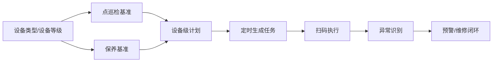
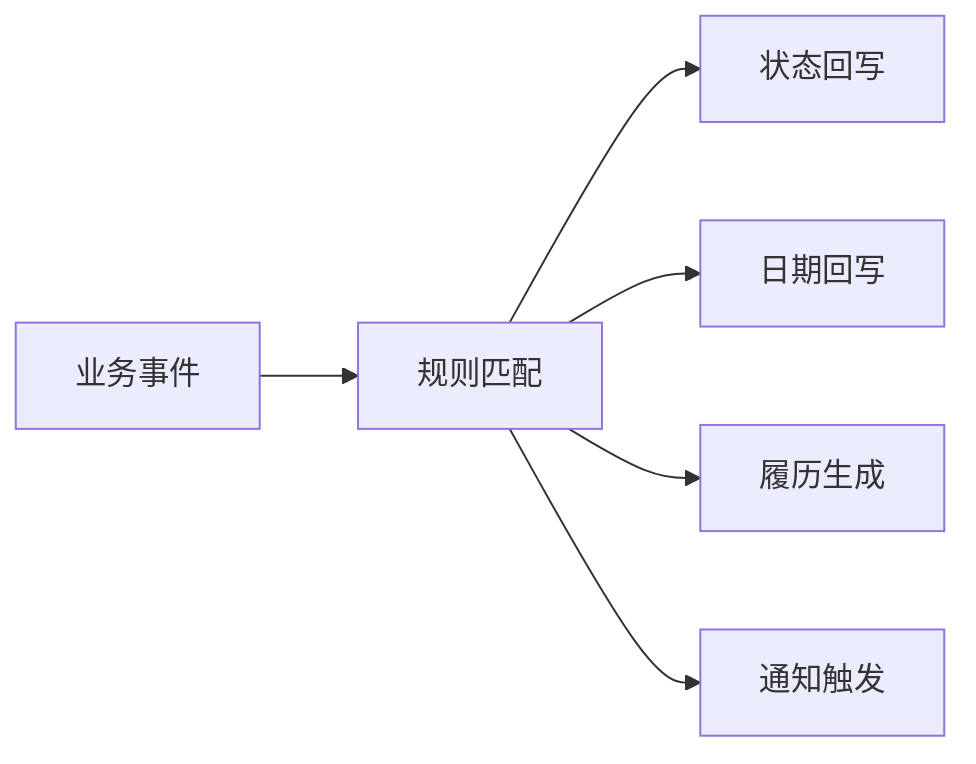
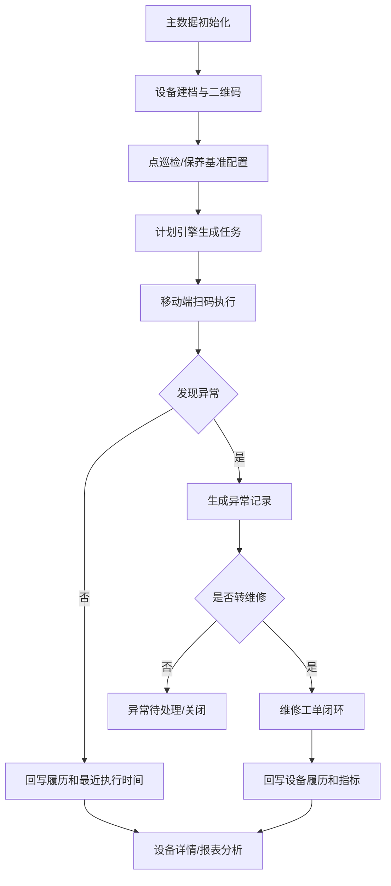

# 10. 简道云设备管理与巡检文章解读

参考文章：https://hc.jiandaoyun.com/solution/18359

本文用于提炼文章中的设计思路、交互方式和可落地方案。文章内容不直接等同于本项目确认需求；可采纳内容需要继续转成新版设备管理系统的业务架构、字段、流程、状态和验收口径。

## 1. 文章定位

这篇文章不是一套完整 EAM/设备管理平台 PRD，而是一套低代码设备管理模板的使用说明。它的价值在于把设备管理拆成可快速上线的表单、流程、数据工厂和扫码入口。

一句话概括：

> 先用设备档案统一设备对象，再用扫码和流程承接点巡检、维修、保养、备件，最后用数据工厂和智能助手做任务下发、状态回写和数据分析。

## 2. 设计思路提炼

### 2.1 从基础资料开始，而不是直接做业务单

文章先要求初始化基础资料，包括设备类型、设备名称、车间、安装地点、供应商、仓库、备件单位、备件信息、点检标准、巡检方案、保养等级与频次。

设计启发：

| 设计点 | 文章做法 | 对工业设备系统的启发 |
|--------|----------|----------------------|
| 主数据前置 | 先建基础信息表 | 业务单据不能自由填写设备、位置、供应商、备件，应引用主数据 |
| 支持导入 | Excel 导入设备档案和基础资料 | 标准产品必须支持批量初始化，否则上线成本高 |
| 一表一维护 | 车间、安装地点、备件单位等独立维护 | 基础资料要可复用、可治理，不能散落在各流程里 |
| 数据引用 | 档案、点检、巡检、维修、保养都引用基础资料 | 统一编码和口径是后续统计、联动、回写的基础 |

### 2.2 设备档案是业务入口，不只是台账列表

文章把设备档案设计成设备基础信息、点检、巡检、维修、保养、备件更换、设备变动记录的聚合入口，并支持设备标识牌和二维码。

设计启发：

| 设计点 | 推荐吸收 |
|--------|----------|
| 一机一档 | 设备编号必须唯一，所有业务单据引用设备编号 |
| 设备详情聚合 | 点检、巡检、维修、保养、备件、生命周期履历都应在设备详情查看 |
| 二维码入口 | 二维码应支持扫码查看设备、扫码点检、扫码报修、扫码保养 |
| 批量打印 | 设备标识牌应支持批量打印，降低现场贴码成本 |
| 状态色块 | 列表状态用颜色识别，如正常运行、维修中、备用、报废、带病运行 |

不建议照搬：

| 文章做法 | 不建议原因 | 新版建议 |
|----------|------------|----------|
| 车间、安装地点分开做基础表 | 对复杂工厂层级不够通用 | 使用“设备安装位置”关联工厂建模节点 |
| 设备名称作为基础表 | 设备名称容易和设备实例混淆 | 保留设备类型、设备型号、设备实例三层 |
| 档案里承载过多业务按钮 | 页面会变重 | 设备详情做聚合，动作入口按角色和状态显示 |

### 2.3 点检、巡检、保养使用“基准/方案/计划/任务”思路

文章把点检标准、巡检方案、保养等级与频次作为基础配置，再通过设备档案、数据工厂和流程生成业务单。

设计启发：

推荐落地规则：

1. 点检、巡检、保养都应有基准模板，不应每次从空白单填写。
2. 基准默认按设备类型配置，设备等级决定频率、项目数量和异常升级策略。
3. 设备级计划允许微调，避免类型模板过度复杂。
4. 任务应由计划自动生成，手动新建只作为补充。
5. 执行结果进入设备履历，异常结果可进入预警事件或转维修工单。

### 2.4 数据工厂承担“自动任务”和“辅助计算”

文章中两个关键数据工厂：

| 数据工厂 | 作用 |
|----------|------|
| 应巡检日期同步 | 自动计算应巡检日期，同步到辅助表 |
| 保养任务下发同步 | 根据保养计划自动发起设备保养单流程 |

设计启发：

| 能力 | 工业系统中的对应设计 |
|------|----------------------|
| 定时同步 | 计划任务调度器 |
| 辅助表 | 任务生成队列/日历表 |
| 自动发起流程 | 自动创建点巡检/保养任务 |
| 日期计算 | 基于频次、上次执行时间、跳过规则、节假日计算 |

新版系统不应依赖“数据工厂”这个低代码概念，而应抽象为“计划引擎 + 任务调度 + 生成日志”。

### 2.5 智能助手主要做自动回写，不是复杂 AI

文章中的智能助手用于：

1. 点检完成后，更新设备档案的设备状态和最近点检时间。
2. 巡检完成后，更新设备状态和最近巡检日期。
3. 维修派工后，更新设备状态为维修中。
4. 维修完成后，更新设备状态和最近维修日期。
5. 报废审批通过后，更新设备状态为已报废。
6. 保养完成后，更新最近保养日期和设备状态。

设计启发：

> 智能助手的本质是业务事件订阅和规则回写。

新版建议把它设计成“事件中心/规则引擎”，不要把状态回写直接写死在表单动作里。

### 2.6 维修流程简单但闭环完整

文章维修链路是：报修 → 派工 → 维修执行 → 负责人验收；验收不通过则重新派工。

可吸收点：

| 环节 | 新版建议 |
|------|----------|
| 报修 | 支持扫码报修、点巡检异常转单、告警转单、手工创建 |
| 派工 | 支持责任班组默认派单，也支持主管改派 |
| 执行 | 记录到场、诊断、原因、措施、备件、停机时间 |
| 验收 | 默认可配置是否验收；关键设备建议验收 |
| 返工 | 验收不通过回到处理中或重新派工，并保留原因 |

文章不足：

1. 没有明确 MTTR 节点时间拆分。
2. 没有明确故障分类、原因分类和措施结构化。
3. 没有说明重复报修、误报、作废、合并工单规则。
4. 备件领用与维修单只是记录关系，未形成寿命、BOM 位置和库存风险闭环。

## 3. 动图与页面交互提炼

### 3.1 基础资料录入 GIF

观察到的交互：

1. 左侧导航按模块分组：设备档案、点检、巡检、报修维修、维护保养、备件管理、基础信息。
2. 基础信息表单只维护一个简单对象，例如车间。
3. 提交后进入数据管理列表，可查看提交人、提交时间、更新时间。
4. 支持添加、导入、导出、删除、批量操作、操作记录、回收站。

对新版产品的启发：

| 可采纳交互 | 新版落地 |
|------------|----------|
| 基础资料独立维护 | 建立主数据中心 |
| 列表支持导入导出 | 所有主数据支持模板导入、校验、失败明细下载 |
| 操作记录 | 主数据变更必须留痕 |
| 左侧模块分组 | 导航按工作场景分组，不按数据库表分组 |

### 3.2 设备档案导入 GIF

观察到的交互：

1. 设备档案支持 Excel 导入。
2. 导入完成后弹出成功提示。
3. 列表展示设备类型、设备名称、设备编号、设备状态、规格型号、使用车间、安装地点、负责人等。
4. 设备状态使用彩色标签展示。

对新版产品的启发：

| 可采纳交互 | 新版落地 |
|------------|----------|
| 设备批量导入 | 提供设备台账导入模板、字段校验、重复编号拦截 |
| 状态彩色标签 | 生命周期状态、运行状态分开展示，避免混用 |
| 导入结果提示 | 展示成功数、失败数、失败原因 |
| 列表横向字段多 | 默认展示高频字段，低频字段放详情或列配置 |

### 3.3 批量打印二维码页面

观察到的交互：

1. 设备档案列表勾选多条设备。
2. 工具栏支持打印二维码和批量打印。
3. 可选择“设备标识牌”模板。

对新版产品的启发：

1. 标识牌是上线关键动作，应放在设备档案列表的批量操作里。
2. 设备二维码不应只是一张码，应绑定可配置动作：查看详情、报修、点检、保养、备件更换。
3. 批量打印应支持按设备类型、位置、状态筛选后打印。

### 3.4 保养单页面

观察到的交互：

1. 页面提示保养单无需手动添加，由保养计划和数据工厂自动发起。
2. 保养单展示设备信息、保养计划、保养任务确认、保养明细。
3. 设备名称、设备编号、安装地点等由计划带出。

对新版产品的启发：

1. 保养任务应默认自动生成，手动补单只作为例外。
2. 任务单应清楚展示来源计划、生成规则和执行期限。
3. 任务执行页面应优先展示“本次要做什么”，而不是完整档案字段。

## 4. 可落地方案抽象

### 4.1 MVP 落地路径

### 4.2 业务对象建议

| 对象 | 说明 |
|------|------|
| 设备 | 一机一档，所有业务引用的核心对象 |
| 设备类型 | 默认基准、保养策略、字段模板、故障分类的载体 |
| 设备安装位置 | 工厂建模节点，支持工厂/车间/产线/工序下钻 |
| 点巡检基准 | 检查项目、结果类型、阈值、频次、责任规则 |
| 保养基准 | 保养项目、保养周期、备件要求、验收要求 |
| 维护计划 | 针对设备生成任务的计划对象 |
| 维护任务 | 点检、巡检、保养的执行单 |
| 异常事件 | 点巡检、保养、告警、指标异常生成的待处理风险 |
| 维修工单 | 故障处理闭环对象 |
| 备件 | 库存、领用、更换、绑定和寿命管理对象 |
| 指标 | OEE、MTBF、MTTR、停机、计划达成率等计算结果 |

### 4.3 文章方案适合保留的能力

1. 基础资料和设备档案支持批量导入。
2. 设备标识牌支持设计和批量打印。
3. 设备详情页聚合各类履历。
4. 点巡检、保养从设备扫码或详情按钮进入。
5. 保养任务由计划自动下发。
6. 业务完成后自动回写最近时间、设备状态和履历。
7. 维修有派工、执行、验收、返工闭环。
8. 备件有入库和领用记录，能关联维修/保养。

### 4.4 文章方案需要增强的地方

| 方向 | 增强建议 |
|------|----------|
| 主数据 | 引入工厂建模、设备类型、设备等级、责任班组、设备 BOM |
| 状态 | 区分生命周期状态、运行状态、维修状态、任务状态 |
| 预防维护 | 从“点检标准/巡检方案”升级为类型基准、设备级计划和异常规则 |
| 维修 | 增加节点时间、故障分类、误报/作废/合并、备件等待、返修 |
| 备件 | 增加库存水位、安全库存、设备 BOM 位置绑定、寿命预警 |
| 指标 | 指标能下钻到设备、位置、工单、异常项和停机记录 |
| AI | 先做规则和事件，再做 AI 推荐；不要让 AI 成为 MVP 强依赖 |
| 扩展 | 用规则引擎、事件中心、配置项承接差异化需求 |

## 5. 对新版设备管理系统的结论

新版系统不应照搬简道云的“表单集合”，而应吸收它的轻量落地路径：

1. 用主数据降低上线门槛。
2. 用设备二维码降低现场操作成本。
3. 用计划任务降低漏检漏保。
4. 用异常事件把点巡检和维修打通。
5. 用事件规则替代散落的状态回写。
6. 用设备详情承接所有履历。
7. 用指标下钻推动业务动作。

最终产品设计口径：

> 台账是设备对象入口，点巡检/保养是风险发现入口，维修是问题闭环入口，备件是保障资源入口，指标是管理改进入口，AI 是效率增强入口。

## 6. 待确认事项

### 6.1 导入模板策略

| 方案 | 说明 | 优点 | 风险 |
|------|------|------|------|
| A. 标准内置模板 | 产品内置设备、备件、位置、人员、基准等标准导入模板 | 上线快，通用性强，便于培训和验收 | 个别客户字段差异需要二次处理 |
| B. 项目自定义模板 | 每个实施项目单独配置模板 | 贴合客户现状 | 实施成本高，模板难标准化 |
| C. 标准模板 + 字段映射 | 内置模板为主，支持客户 Excel 字段映射到标准字段 | 兼顾通用和灵活 | 需要做字段映射和校验能力 |

推荐：C. 标准模板 + 字段映射。

推荐原因：工业客户历史台账格式差异大，但产品不能每个项目重新设计模板。用标准模板保证产品口径，用字段映射降低迁移成本。

### 6.2 二维码扫码默认动作

| 方案 | 说明 | 优点 | 风险 |
|------|------|------|------|
| A. 直接进入报修 | 扫码后默认打开报修单 | 报修最快 | 点检、保养、查看详情不方便 |
| B. 进入设备移动端详情 | 先展示设备摘要，再按权限显示点检、保养、报修、备件更换等动作 | 通用、清晰、扩展性好 | 比直接报修多一步 |
| C. 根据二维码类型进入不同动作 | 设备码、点检码、保养码分别跳转不同页面 | 操作路径最短 | 现场贴码复杂，维护成本高 |

推荐：B. 进入设备移动端详情。

推荐原因：设备二维码是统一现场入口，不应只服务报修。详情页承接身份确认和状态判断，再展示可执行动作，更适合通用产品。

### 6.3 点检和巡检是否合并

| 方案 | 说明 | 优点 | 风险 |
|------|------|------|------|
| A. 完全分开 | 点检、巡检使用独立菜单、计划、任务 | 业务概念清晰 | 规则重复，页面和配置变多 |
| B. 底层合并，前台区分 | 底层统一为检查任务，业务类型区分点检/巡检 | 复用计划、任务、异常规则，扩展性好 | 需要在页面文案上解释清楚 |
| C. 完全合并展示 | 菜单只叫检查任务 | 最简单 | 现场用户可能不适应点检/巡检概念消失 |

推荐：B. 底层合并，前台区分。

推荐原因：产品底层统一更简单，前台保留点检、巡检两个入口，既符合现场习惯，也避免重复建设。

### 6.4 保养任务验收策略

| 方案 | 说明 | 优点 | 风险 |
|------|------|------|------|
| A. 全部必须验收 | 每个保养任务完工后都进入验收 | 质量可控 | 低风险保养流程变重 |
| B. 全部不验收 | 执行人提交即完成 | 操作轻 | 关键设备保养质量不可控 |
| C. 按设备等级/保养等级配置 | 关键设备、重要保养必须验收，普通保养可直接完成 | 平衡效率和质量 | 需要维护验收规则 |

推荐：C. 按设备等级/保养等级配置。

推荐原因：通用产品不能让所有保养都变重，也不能放弃关键设备质量控制。按等级配置最合理。

### 6.5 AI 一期能力边界

| 方案 | 说明 | 优点 | 风险 |
|------|------|------|------|
| A. 只做知识推荐和工单总结 | 根据设备、故障现象推荐知识，辅助生成维修总结 | 容易落地，风险低 | 智能化感知有限 |
| B. 做自动诊断建议 | AI 给出可能原因、处理措施和风险等级 | 价值更明显 | 需要高质量历史数据，误判风险高 |
| C. 做自动闭环决策 | AI 自动判定异常、生成工单、修改状态 | 自动化强 | 责任风险高，不适合首版 |

推荐：A. 只做知识推荐和工单总结。

推荐原因：首版先把数据闭环跑通，AI 做辅助不做决策。等故障、巡检、保养数据积累后，再增强诊断能力。
